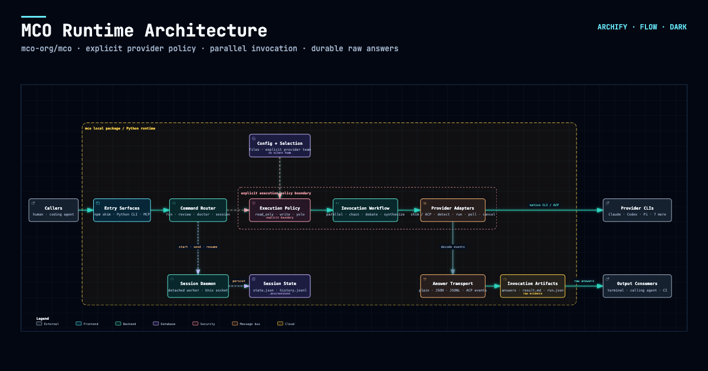
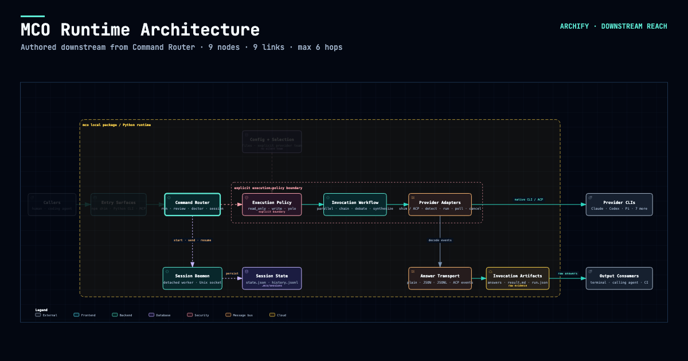
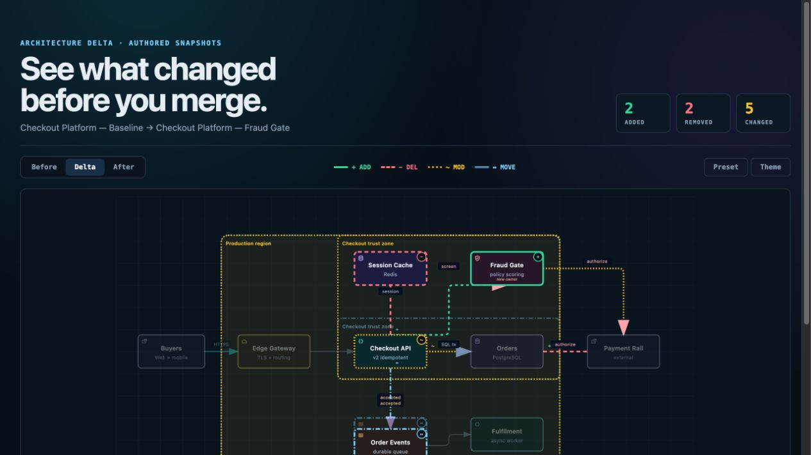

<p align="center">
  <strong>English</strong> · <a href="./README_ZH.md">简体中文</a>
</p>

<p align="center">
  <a href="https://trendshift.io/repositories/31352?utm_source=repository-badge&amp;utm_medium=badge&amp;utm_campaign=badge-repository-31352" target="_blank" rel="noopener noreferrer"></a>
</p>


# Archify

**Turn a codebase or system description into a polished, interactive system map — directly in chat.**

Archify is an agent skill for Cursor, Claude Code, Codex CLI, and OpenCode. Give it a system description or repository; get an interactive, shareable technical map.

- **Open it and present** — five technical diagram types, four visual presets, dark/light themes, and optional finite motion
- **Review architecture changes before merge** — compare two validated snapshots as Before / Delta / After, with exact added, removed, changed, moved, and rerouted facts
- **Every interaction stays grounded** — search nodes, optionally open revision-verified source, trace upstream/downstream authored reach and exact routes, compare roles, and play guided stories without inventing topology
- **One file, ready to trust and share** — typed JSON IR and deterministic checks produce self-contained HTML plus PNG, SVG, WebM, and 1200×630 share cards


**[Project page](https://tt-a1i.github.io/archify/)** · **[Scenario guide](https://tt-a1i.github.io/archify/guide.html)** · **[Proof Lab](https://tt-a1i.github.io/archify/gallery.html)**

```bash
npx skills add tt-a1i/archify -g
```

Using Cursor? Open the [agent-aware quick start](https://tt-a1i.github.io/archify/start.html?agent=cursor&type=architecture) for exact global and project commands.

Then ask your agent: `Use archify to map this repository's runtime architecture.`

## See Archify in action

These are generated Archify artifacts, not product mockups. Click a frame to open its live, shareable state.

<p align="center">
  <a href="https://tt-a1i.github.io/archify/gallery.html"></a>
  <br/>
  <sub><strong>Three real generated artifacts.</strong> Signal Flow · Blueprint · Classic · <a href="https://tt-a1i.github.io/archify/gallery.html">open the interactive Proof Lab ↗</a></sub>
</p>

| Guided story | Route probe | Semantic lens |
|---|---|---|
| [](https://tt-a1i.github.io/archify/gallery/artifacts/agent-tool-call.workflow.html?theme=dark&present=1&play=1#view=happy-path) | [](https://tt-a1i.github.io/archify/gallery/artifacts/cache-miss.sequence.html?theme=dark&present=1#route=web~db) | [](https://tt-a1i.github.io/archify/gallery/artifacts/production-deployment.architecture.html?theme=dark&present=1#lens=backend~database) |
| Play one finite named chapter. | Inspect the shortest authored directed path. | Compare real traffic between semantic roles. |

The [Proof Lab](https://tt-a1i.github.io/archify/gallery.html) contains all 11 checked-in scenarios, their JSON sources, named views, and validation receipts.

### A real repository, mapped from source

[](https://tt-a1i.github.io/archify/cases/mco-runtime.architecture.html?theme=dark&present=1#view=dispatch-path)

Archify traced [`mco-org/mco`](https://github.com/mco-org/mco) at `9f1a1cf` and produced this checked map. **[Open it ↗](https://tt-a1i.github.io/archify/cases/mco-runtime.architecture.html?theme=dark&present=1#view=dispatch-path)** · [trace reach ↗](https://tt-a1i.github.io/archify/cases/mco-runtime.architecture.html?theme=dark#focus=router&reach=downstream) · [typed source](docs/cases/mco-runtime.architecture.json)

## Preview

Same diagram, two themes, one click to switch:

| Dark | Light |
|---|---|
|  |  |

The Export menu copies PNG to the clipboard and downloads static or motion formats:


Use **Copy Share Card** when you want a canonical 1200×630 image for a README, release, or social post.

After tracing a route, **Export → Route Share Card** downloads that authored path as a 1200×630 PNG with the full diagram retained for context.


After tracing authored `Upstream` or `Downstream` reach, **Export → Reach Share Card** captures that exact reading without claiming runtime impact.



Open [`examples/web-app.html`](examples/web-app.html) locally to try the complete viewer.

## Quick start

### 1. Install

```bash
npx skills add tt-a1i/archify -g
```

For an explicit, non-interactive Cursor install:

```bash
npx -y skills add tt-a1i/archify --skill archify --agent cursor --global --copy --yes
```

To try it without a permanent install:

```bash
npx skills use tt-a1i/archify@archify --agent codex
```

The same Skill works with `cursor`, `codex`, `claude-code`, and `opencode`; the [quick-start agent switcher](https://tt-a1i.github.io/archify/start.html?agent=cursor&type=architecture) generates the exact command without maintaining vendor-specific forks. The packaged [`archify.zip`](archify.zip) also works without `npm install`.

### 2. Ask for one bounded view

```text
Analyze this repository, then use archify to create a high-level runtime architecture diagram.
Show 8–12 core components, one primary path, external dependencies, and trust boundaries.
Put supporting detail in cards instead of adding more edges.
```

For a focused flow:

```text
Use archify to draw this login flow: Browser -> Web App -> API -> JWT validation ->
Redis session lookup -> PostgreSQL fallback. Keep the cache-miss path secondary.
```

### 3. Refine in chat

Continue with focused requests such as `add Redis`, `move auth to the left`, or `highlight the rollback path`. Archify keeps the typed source available for targeted iteration.

## Choose the right diagram

| Type | Best for | Include in your prompt |
|---|---|---|
| **Architecture** | Components, services, storage, boundaries | Scope, core components, primary path |
| **Workflow** | CI/CD, approvals, tool calls, runbooks | Participants, order, branches, exceptions |
| **Sequence** | API calls, cache fallback, auth, async traces | Callers, callees, returns, timing |
| **Data Flow** | Pipelines, lineage, PII, consumers | Sources, transforms, stores, boundaries |
| **Lifecycle** | States, retries, waits, terminal outcomes | States, events, retry and cancellation paths |

For a production deployment review, Architecture can optionally enable the
`deployment-ownership` engineering profile. It fails closed when owners,
single-region placement, private database scope, or named boundary crossings
are missing. It is never enabled silently and validates authored facts—not live
infrastructure. See the [checked deployment proof](https://tt-a1i.github.io/archify/gallery.html#proof-deployment-ownership).

For design or PR review, Architecture Delta compares validated Before / Delta / After snapshots with a machine receipt. Select an exact authored change or play one finite Review—viewer-only, with no impact, risk, or merge-safety inference.

`node archify/bin/archify.mjs compare architecture base.json head.json architecture-delta.html --json`

[](examples/checkout-platform-delta.html)

Not sure which one fits? Use the [interactive scenario guide](https://tt-a1i.github.io/archify/guide.html), or ask the zero-dependency CLI:

```bash
node archify/bin/archify.mjs guide "Show an API request with Redis cache miss"
node archify/bin/archify.mjs guide "Map Kafka topics, consumer groups, replay, and DLQ" --json
```

Workflow keeps the happy path clear across lanes:


Sequence explains one interaction over time:


Data Flow makes movement and sensitivity boundaries explicit:


Lifecycle separates progress, waits, retries, and terminal outcomes:


Architecture examples: [`web-app`](examples/web-app.html) · [`Archify pipeline`](examples/archify-repo.html) · [`grid placement`](examples/archify-repo-grid.html) · [`desktop agent`](examples/maka-architecture.html)

## Why Archify

- **Layout judgment over generic auto-layout** — the agent chooses hierarchy, spacing, routes, and emphasis; shared automatic endpoints spread deterministically instead of piling arrows on one midpoint.
- **Typed JSON IR** — every renderer-backed mode has a schema and reproducible source.
- **Atomic validation before delivery** — schema, layout, HTML/SVG, route, and label-to-route clearance checks must all pass before a showcase artifact replaces the last known good output.
- **Failures come with a repair receipt** — `validate --json` and `deliver --json` return stable rule codes, the exact subject, measured evidence, and only supported repair controls instead of a Node stack or an unstructured retry guess.
- **Last-good live preview** — an optional desktop loop watches one JSON file, refreshes only after the latest candidate passes every gate, and keeps the previous verified diagram visible when a save is incomplete or invalid.
- **Truthful interaction** — focus, upstream/downstream reach, exact routes, role comparison, and stories reuse authored nodes and relationships instead of inventing topology or claiming runtime impact.
- **Source evidence, only when requested** — Evidence-backed Architecture nodes mark themselves `SRC n` and open Git-verified files and line ranges pinned to one public commit; ordinary artifacts stay source-free.
- **Portable by default** — the result is one HTML file; exports remain full-diagram and free of temporary viewer state.

Archify is not a general-purpose drawing editor or a Mermaid theme. It turns technical intent into a communication artifact.

## How it works

| Step | What happens |
|---|---|
| **Generate** | The agent creates typed JSON IR from your description. |
| **Validate** | Bundled validators and layout rules check the source; failures identify the exact local repair in machine-readable JSON. |
| **Preview (optional)** | A loopback-only desktop session watches one source and reloads only verified revisions; failures keep the last-good artifact. |
| **Deliver** | A same-directory candidate is rendered and checked; only a passing artifact atomically replaces the target, then optional `--open` launches that exact file. |
| **Iterate** | The agent updates the source while unrelated structure stays stable. |

Useful repository commands:

```bash
cd archify
node bin/archify.mjs doctor
node bin/archify.mjs demo /tmp/archify-demo
node bin/archify.mjs guide "Show CI/CD checks, approval, deploy, and rollback"
node bin/archify.mjs validate workflow examples/agent-tool-call.workflow.json --quality showcase --json
node bin/archify.mjs preview workflow examples/agent-tool-call.workflow.json /tmp/workflow.html --quality showcase
node bin/archify.mjs deliver workflow examples/agent-tool-call.workflow.json /tmp/workflow.html --quality showcase --open --json
```

`preview` is an explicit desktop authoring mode, not a default background service: it binds only to `127.0.0.1` on a random port, watches the one named JSON file, preserves the last verified output through failures, and stops with Ctrl-C. Add `--no-open` for tests or when you will open the printed local URL yourself. It adds no runtime to the generated HTML.

Use `deliver --open` for a one-shot interactive local handoff. It is off by default, runs only after the verified artifact is committed, and never turns a successful delivery into a failure when the OS opener is unavailable; JSON stays on stdout and the absolute manual-open path goes to stderr.

On failure, `validate --json` and `deliver --json` still emit exactly one JSON object. Read `diagnostics[]` and change only the named subject using its `supportedFixes`; do not rewrite the whole diagram or exceed the Skill's two focused correction rounds. Deterministic diagnostics remain separate from visual review.

Optional motion and presentation styling are explicit:

```json
{
  "meta": {
    "animation": "trace",
    "visual_preset": "signal-flow"
  }
}
```

Omit `animation` for a truly static diagram. `classic` remains default; `editorial` adds a warm publication look.

## Explore and share the output

| Action | Control |
|---|---|
| Open the factual Diagram Guide | <kbd>?</kbd> |
| Find and focus a semantic node | <kbd>/</kbd> |
| Trace upstream/downstream authored reach | Focus a node → `Upstream` / `Downstream` |
| Probe a directed route and inspect its journey | <kbd>R</kbd> or `PATH` |
| Compare one or two semantic roles | <kbd>L</kbd> or `LENS` |
| Open the live overview radar | <kbd>M</kbd> or `MAP` |
| Play a guided story / change chapter | <kbd>P</kbd> / <kbd>[</kbd> <kbd>]</kbd> |
| Enter Presentation Stage | <kbd>F</kbd> |
| Cycle visual style / toggle theme / open Export | <kbd>S</kbd> / <kbd>T</kbd> / <kbd>E</kbd> |
| Zoom or reset | <kbd>+</kbd> / <kbd>-</kbd> / <kbd>0</kbd> |

Stable links can restore `#focus=<id>`, `#focus=<id>&reach=upstream|downstream`, `#relation=<id>`, `#route=<source>~<target>`, `#lens=<kind>~<kind>`, and `#view=<view-id>`. Reader-driven motion is finite, respects `prefers-reduced-motion`, and never enters canonical exports.

The complete generation and viewer contract lives in [`archify/SKILL.md`](archify/SKILL.md).

## Installation options

| Surface | Install location or method | Capability |
|---|---|---|
| **Claude Code** | `~/.claude/skills/` or `.claude/skills/` | Full renderer + validation workflow |
| **Codex CLI** | `~/.agents/skills/` or `.agents/skills/` | Full renderer + validation workflow |
| **opencode** | `~/.config/opencode/skills/`, `.opencode/skills/`, or `.agents/skills/` | Full renderer + validation workflow |
| **Claude.ai** | Upload `archify.zip` under Settings → Capabilities → Skills | Depends on Node.js access in the sandbox |
| **Project Knowledge** | Upload `archify.zip` to the project | Prompt-driven architecture fallback |

## Reference and scope

- [Schema reference](archify/schemas/README.md)
- [Skill and renderer contract](archify/SKILL.md)
- [Examples](archify/examples/)
- [Changelog](CHANGELOG.md)
- [Roadmap](ROADMAP.md)
- [Generated Proof Lab](https://tt-a1i.github.io/archify/gallery.html)

Archify 2.12 includes typed IR across all five modes, real-repository proof, deterministic exact-ID Architecture Delta review, verified live preview, authored reachability, optional finite motion, guided views, semantic search and relationship exploration, shareable deep links, 1200×630 diagram and route cards, browser-native WebM recording, explicit `standard` / `showcase` quality profiles, and an opt-in deployment ownership contract.

Automatic Mermaid parsing, general-purpose auto-layout, hosted sharing, and WYSIWYG editing are intentionally outside the current scope.

## Attribution

Archify is a fork and rewrite of [Cocoon-AI/architecture-diagram-generator](https://github.com/Cocoon-AI/architecture-diagram-generator) v1.0. The original visual language remains credited to Cocoon AI; Archify 2.x adds themes, exports, typed renderers, validation, accessibility, interaction, and a unified CLI. Both projects use the MIT License.

## License

[MIT](LICENSE) — free to use, modify, and distribute.

## Contributing

Issues, pull requests, and shared diagrams are welcome. For generated-output problems, include the prompt, diagram type, and Archify version. Run `node scripts/build-gallery.mjs` after changing bundled examples or the standalone viewer.
