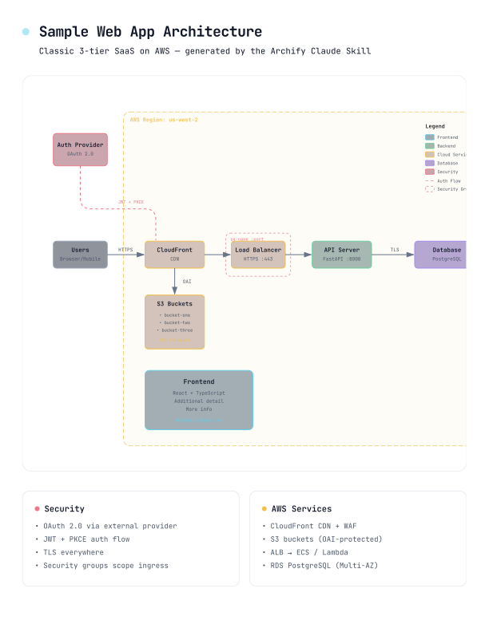

# Archify

**Generate beautiful architecture diagrams in chat. Switch dark / light. Copy to clipboard or export crisp 4× PNG / JPEG / WebP / SVG.**

Archify is a [Claude Skill](https://support.claude.com/en/articles/12512180-using-skills-in-claude) that turns a plain-English description of your system into a polished, self-contained architecture diagram — a single HTML file you can open, toggle themes on, copy to the clipboard, and export at maximum resolution.

- **No design skills needed** — describe your architecture in English, get a diagram
- **Built-in theme toggle** — one click between dark and light, persists across sessions
- **Copy PNG to clipboard** — one click, paste straight into Slack / Notion / GitHub
- **Ultra-crisp image export** — PNG / JPEG / WebP rendered natively at 4× source resolution (no upsampling blur), or SVG for true vector
- **Self-contained HTML** — zero dependencies, share by sending the file
- **Iterate by chat** — "add Redis", "move auth to the left", "use emerald for the API"


## Preview

Same diagram, two themes, one click to switch:

| Dark | Light |
|---|---|
|  |  |

The Export menu — Copy PNG to clipboard plus 4 download formats (all raster exports at 4× source resolution):


Print-ready out of the box — <kbd>Cmd</kbd>+<kbd>P</kbd> drops the toolbar, the dark background, and the grid automatically:



Live example: [`examples/web-app.html`](examples/web-app.html) — open in a browser, press <kbd>T</kbd> to toggle theme, <kbd>E</kbd> to open Export. Append `?theme=light` or `?openExport=1` to the URL for deterministic screenshots.

## What's new

Archify is based on [Cocoon-AI/architecture-diagram-generator](https://github.com/Cocoon-AI/architecture-diagram-generator) v1.0 (dark-only, HTML output). 2.0 rewrote the template around a themeable CSS-variable system and added a client-side export pipeline; 2.1 extends that with copy-to-clipboard and selectable export scale:

| Feature | v1.0 | 2.0 | 2.1 | 2.3 |
|---|---|---|---|---|
| Dark theme | Yes | Yes | Yes | Yes |
| Light theme | — | Toggle | Toggle | Toggle + <kbd>T</kbd> shortcut |
| PNG / JPEG / WebP download | manual screenshot | 2× upsampled | 1× / 2× / 4× selector | **4× natively rendered, no blur** |
| SVG download | — | Vector, styles inlined | Same | Same |
| Copy PNG to clipboard | — | — | Yes | Yes (always 4×) |
| Keyboard shortcuts | — | — | <kbd>T</kbd> / <kbd>E</kbd> + menu nav | Same |
| Accessibility | — | — | ARIA + focus-visible | Same |
| Print stylesheet | — | — | — | Yes (from 2.2) |
| Styling model | Inline `fill` / `stroke` | CSS custom properties + semantic classes | Same | Same |

## Quick start

### 1. Install the skill

> Requires Claude Pro, Max, Team, or Enterprise plan (or Claude Code).

**Claude.ai:**
1. Download [`archify.zip`](archify.zip)
2. Go to **Settings** -> **Capabilities** -> **Skills**
3. Click **+ Add** and upload the zip file
4. Toggle the skill on

**Claude Code CLI:**
```bash
# Global (all projects)
unzip archify.zip -d ~/.claude/skills/

# Or project-local
unzip archify.zip -d ./.claude/skills/
```

**Claude.ai Projects (alternative):**
Upload [`archify.zip`](archify.zip) to your Project Knowledge.

### 2. Describe your system

Any of these work:

**Have AI analyze your codebase:**
```
Analyze this codebase and describe the architecture. Include all major
components, how they connect, what technologies they use, and any cloud
services or integrations. Format as a list for an architecture diagram.
```

**Write it yourself:**
```
- React frontend talking to a Node.js API
- PostgreSQL database
- Redis for caching
- Hosted on AWS with CloudFront CDN
```

**Or ask for a typical architecture:**
```
What's a typical architecture for a SaaS application?
```

### 3. Ask Claude to use the skill

```
Use your archify skill to create an architecture diagram from this description:

[PASTE YOUR ARCHITECTURE DESCRIPTION HERE]
```

That's it. Claude generates an HTML file you can open in any browser. Iterate by chat: "add Redis", "swap Postgres for MySQL", "highlight the auth path".

## Using the output

Open the generated HTML in any browser. Top-right you'll see two buttons:

- **Theme button** (Dark / Light) — one click flip, persisted across sessions. Shortcut: <kbd>T</kbd>.
- **Export menu** — opens a dropdown with a scale selector and five actions. Shortcut: <kbd>E</kbd>.

### Export menu

| Action | What it does |
|---|---|
| **Copy PNG** | Puts a PNG of the current diagram straight on your clipboard. Paste into Slack, Notion, GitHub, Figma. |
| **Download PNG / JPEG / WebP** | Saves a raster image. JPEG/WebP are painted over the current theme's background (no alpha); PNG keeps transparency. |
| **Download SVG** | Vector export with all styles inlined. Edit in Figma / Illustrator. Scales losslessly. |

Every raster export (Copy PNG, Download PNG/JPEG/WebP) is rendered natively by the browser at **4× the diagram's intrinsic resolution** — the serialized SVG is given a `width`/`height` of `4 × viewBox`, rasterized by the browser at that resolution, and drawn to the canvas at natural size (no upsampling). This produces genuinely crisp output for retina displays, slides, and print. There is no scale dial — maximum sharpness is the default and the only option.

### Keyboard

- <kbd>T</kbd> anywhere — toggle theme
- <kbd>E</kbd> anywhere — open the Export menu
- <kbd>↑</kbd> <kbd>↓</kbd> inside the menu — navigate actions
- <kbd>Home</kbd> / <kbd>End</kbd> — jump to first / last action
- <kbd>Enter</kbd> / <kbd>Space</kbd> — activate
- <kbd>Esc</kbd> — close menu

### URL parameters

- `?theme=light` or `?theme=dark` — force a starting theme (deterministic screenshots, share links, embeds)
- `?openExport=1` — auto-open the Export menu on load (demo / docs screenshots)

### Notes

- **WebP support** depends on your browser's canvas encoder. If unavailable (older Safari), the menu item is dimmed and disabled. PNG and JPEG are universal.
- **Clipboard support** for images requires `ClipboardItem` + `navigator.clipboard.write` (Chromium, Firefox 127+, Safari 16+). If unavailable, Copy PNG is dimmed.
- **Fonts in exports**: raster images use the system monospace fallback (`ui-monospace` / Menlo / Consolas) because the sandboxed image-rendering context can't fetch Google Fonts. Install JetBrains Mono locally for pixel-perfect rendering.

## Example prompts

**Web app:**
```
Create an architecture diagram for a web application with:
- React frontend
- Node.js/Express API
- PostgreSQL database
- Redis cache
- JWT authentication
```

**AWS serverless:**
```
Create an architecture diagram showing:
- CloudFront CDN
- API Gateway
- Lambda functions (Node.js)
- DynamoDB
- S3 for static assets
- Cognito for auth
```

**Microservices:**
```
Create an architecture diagram for a microservices system with:
- React web app and mobile clients
- Kong API Gateway
- User Service (Go), Order Service (Java), Product Service (Python)
- PostgreSQL, MongoDB, and Elasticsearch databases
- Kafka for event streaming
- Kubernetes orchestration
```

## Color palette

| Component Type | Color   | Use for                           |
| -------------- | ------- | --------------------------------- |
| Frontend       | Cyan    | Client apps, UI, edge devices     |
| Backend        | Emerald | Servers, APIs, services           |
| Database       | Violet  | Databases, storage, AI/ML         |
| Cloud / AWS    | Amber   | Cloud services, infrastructure    |
| Security       | Rose    | Auth, security groups, encryption |
| Message Bus    | Orange  | Kafka, RabbitMQ, SNS, event buses |
| External       | Slate   | Generic, external systems         |

Each color has coordinated dark-mode and light-mode variants that switch together via the theme toggle.

## Technical details

- **Styling:** CSS custom properties on `:root` + `[data-theme="light"]`; SVG elements reference semantic classes (`c-frontend`, `t-muted`, `a-emphasis`, etc.). Toggling `data-theme` on `<html>` re-themes the entire diagram including gradient, grid, arrows, and mask rects.
- **Export pipeline:** The SVG is cloned, host `<style>` is inlined, current theme variables are resolved and written into a `:root` rule on the clone, then serialized via `XMLSerializer`. For raster formats it's rasterized via an `Image` + 2x `<canvas>` + `toBlob(mime)`. JPEG gets an explicit background fill since it doesn't support transparency.
- **Self-contained output:** Single HTML file, Google Fonts link + inline SVG + ~3 KB of embedded JS. No build step, no JS framework, no server.
- **Browser support:** Any modern browser (Chrome, Safari, Firefox, Edge). Needs `Image` + `canvas.toBlob` with `image/webp` support for WebP export.

## Attribution

Archify is a fork / rewrite of [**Cocoon-AI/architecture-diagram-generator**](https://github.com/Cocoon-AI/architecture-diagram-generator) (MIT, v1.0) by [Cocoon AI](mailto:hello@cocoon-ai.com). The original's clean visual design — color palette, grid background, summary-card layout, JetBrains Mono typography — is preserved. All credit for the original aesthetic belongs to them.

Archify 2.0 contributes:
- Refactor of the template to a CSS-variable theme system (dark + light)
- Theme toggle + `localStorage` persistence + `prefers-color-scheme` default
- Built-in PNG / JPEG / WebP / SVG export menu
- Updated `SKILL.md` to guide Claude toward class-based (themeable) diagrams

Both projects are MIT-licensed.

## License

[MIT](LICENSE) — free to use, modify, and distribute.

## Contributing

Issues, PRs, and shared diagrams welcome.
