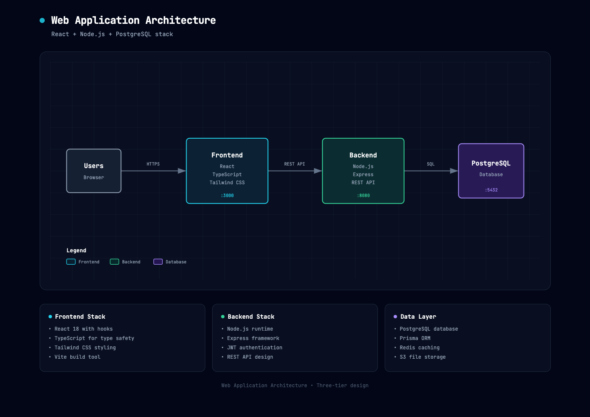

# Archify

**Generate beautiful architecture diagrams in chat. Switch dark / light. Export PNG / JPEG / WebP / SVG.**

Archify is a [Claude Skill](https://support.claude.com/en/articles/12512180-using-skills-in-claude) that turns a plain-English description of your system into a polished, self-contained architecture diagram — a single HTML file you can open, toggle themes on, and export to any common image format.

- **No design skills needed** — describe your architecture in English, get a diagram
- **Built-in theme toggle** — one click between dark and light, persists across sessions
- **One-click image export** — PNG, JPEG, WebP (2x retina), or SVG (vector)
- **Self-contained HTML** — zero dependencies, share by sending the file
- **Iterate by chat** — "add Redis", "move auth to the left", "use emerald for the API"


## Preview




## What's new in 2.0

Archify is based on [Cocoon-AI/architecture-diagram-generator](https://github.com/Cocoon-AI/architecture-diagram-generator) v1.0 (dark-only, HTML output). 2.0 rewrites the template around a themeable CSS-variable system and adds a client-side export pipeline:

| Feature | v1.0 | Archify 2.0 |
|---|---|---|
| Dark theme | Yes | Yes |
| Light theme | — | Yes, one-click toggle |
| Theme persistence | — | `localStorage` + `prefers-color-scheme` |
| PNG export | manual screenshot | Built-in, 2x retina |
| JPEG / WebP export | — | Built-in, 2x retina |
| SVG export | — | Built-in, vector, styles inlined |
| Styling model | Inline `fill` / `stroke` | CSS custom properties + semantic classes |

## Quick start

### 1. Install the skill

> Requires Claude Pro, Max, Team, or Enterprise plan (or Claude Code).

**Claude.ai:**
1. Download [`archify.zip`](archify.zip)
2. Go to **Settings** -> **Capabilities** -> **Skills**
3. Click **+ Add** and upload the zip file
4. Toggle the skill on

**Claude Code CLI:**
```bash
# Global (all projects)
unzip archify.zip -d ~/.claude/skills/

# Or project-local
unzip archify.zip -d ./.claude/skills/
```

**Claude.ai Projects (alternative):**
Upload [`archify.zip`](archify.zip) to your Project Knowledge.

### 2. Describe your system

Any of these work:

**Have AI analyze your codebase:**
```
Analyze this codebase and describe the architecture. Include all major
components, how they connect, what technologies they use, and any cloud
services or integrations. Format as a list for an architecture diagram.
```

**Write it yourself:**
```
- React frontend talking to a Node.js API
- PostgreSQL database
- Redis for caching
- Hosted on AWS with CloudFront CDN
```

**Or ask for a typical architecture:**
```
What's a typical architecture for a SaaS application?
```

### 3. Ask Claude to use the skill

```
Use your archify skill to create an architecture diagram from this description:

[PASTE YOUR ARCHITECTURE DESCRIPTION HERE]
```

That's it. Claude generates an HTML file you can open in any browser. Iterate by chat: "add Redis", "swap Postgres for MySQL", "highlight the auth path".

## Using the output

Open the generated HTML in any browser. Top-right you'll see:

- **Theme button** — toggles Dark / Light. Remembered across sessions.
- **Export menu** — drops down with PNG / JPEG / WebP / SVG options.

The export respects the **current** theme — flip to light mode first if you want a light-mode PNG. PNG/JPEG/WebP are rendered at 2x retina; SVG is true vector with all styles inlined, so it scales cleanly and can be further edited in Figma or Illustrator.

## Example prompts

**Web app:**
```
Create an architecture diagram for a web application with:
- React frontend
- Node.js/Express API
- PostgreSQL database
- Redis cache
- JWT authentication
```

**AWS serverless:**
```
Create an architecture diagram showing:
- CloudFront CDN
- API Gateway
- Lambda functions (Node.js)
- DynamoDB
- S3 for static assets
- Cognito for auth
```

**Microservices:**
```
Create an architecture diagram for a microservices system with:
- React web app and mobile clients
- Kong API Gateway
- User Service (Go), Order Service (Java), Product Service (Python)
- PostgreSQL, MongoDB, and Elasticsearch databases
- Kafka for event streaming
- Kubernetes orchestration
```

## Color palette

| Component Type | Color   | Use for                           |
| -------------- | ------- | --------------------------------- |
| Frontend       | Cyan    | Client apps, UI, edge devices     |
| Backend        | Emerald | Servers, APIs, services           |
| Database       | Violet  | Databases, storage, AI/ML         |
| Cloud / AWS    | Amber   | Cloud services, infrastructure    |
| Security       | Rose    | Auth, security groups, encryption |
| Message Bus    | Orange  | Kafka, RabbitMQ, SNS, event buses |
| External       | Slate   | Generic, external systems         |

Each color has coordinated dark-mode and light-mode variants that switch together via the theme toggle.

## Technical details

- **Styling:** CSS custom properties on `:root` + `[data-theme="light"]`; SVG elements reference semantic classes (`c-frontend`, `t-muted`, `a-emphasis`, etc.). Toggling `data-theme` on `<html>` re-themes the entire diagram including gradient, grid, arrows, and mask rects.
- **Export pipeline:** The SVG is cloned, host `<style>` is inlined, current theme variables are resolved and written into a `:root` rule on the clone, then serialized via `XMLSerializer`. For raster formats it's rasterized via an `Image` + 2x `<canvas>` + `toBlob(mime)`. JPEG gets an explicit background fill since it doesn't support transparency.
- **Self-contained output:** Single HTML file, Google Fonts link + inline SVG + ~3 KB of embedded JS. No build step, no JS framework, no server.
- **Browser support:** Any modern browser (Chrome, Safari, Firefox, Edge). Needs `Image` + `canvas.toBlob` with `image/webp` support for WebP export.

## Attribution

Archify is a fork / rewrite of [**Cocoon-AI/architecture-diagram-generator**](https://github.com/Cocoon-AI/architecture-diagram-generator) (MIT, v1.0) by [Cocoon AI](mailto:hello@cocoon-ai.com). The original's clean visual design — color palette, grid background, summary-card layout, JetBrains Mono typography — is preserved. All credit for the original aesthetic belongs to them.

Archify 2.0 contributes:
- Refactor of the template to a CSS-variable theme system (dark + light)
- Theme toggle + `localStorage` persistence + `prefers-color-scheme` default
- Built-in PNG / JPEG / WebP / SVG export menu
- Updated `SKILL.md` to guide Claude toward class-based (themeable) diagrams

Both projects are MIT-licensed.

## License

[MIT](LICENSE) — free to use, modify, and distribute.

## Contributing

Issues, PRs, and shared diagrams welcome.
