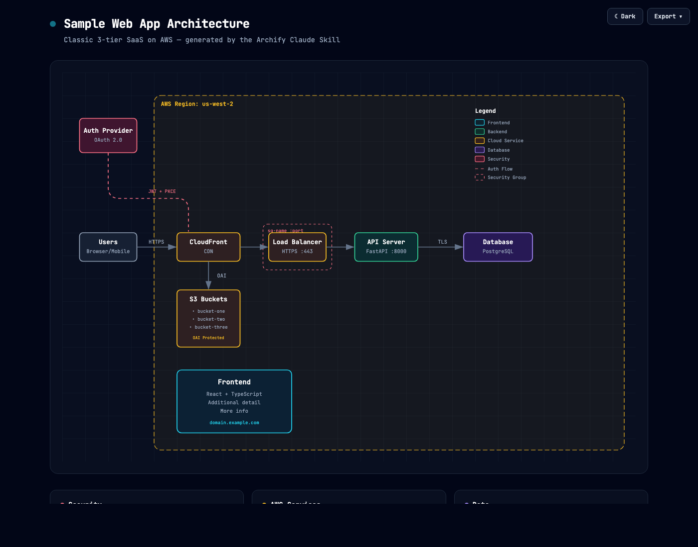
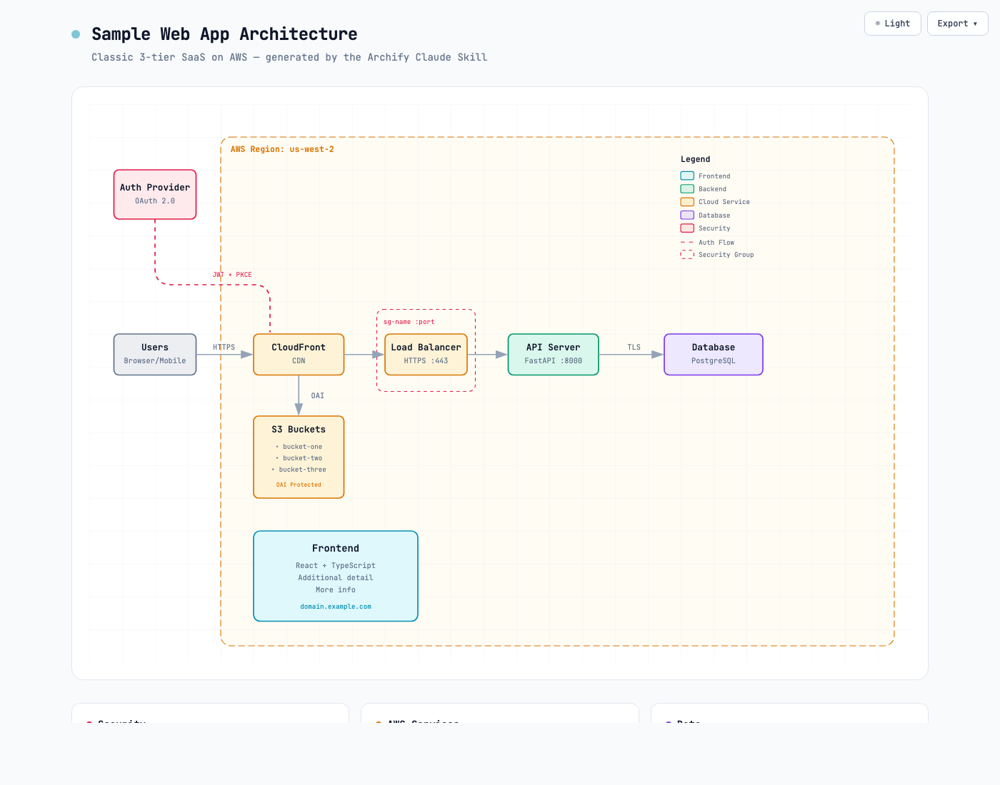
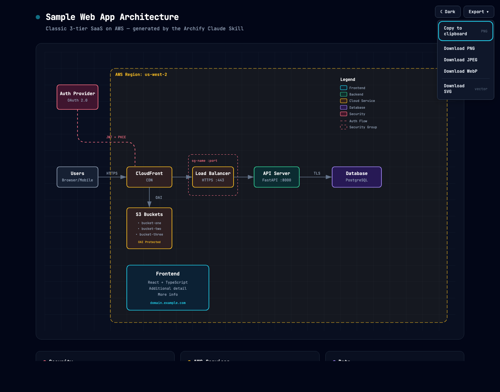
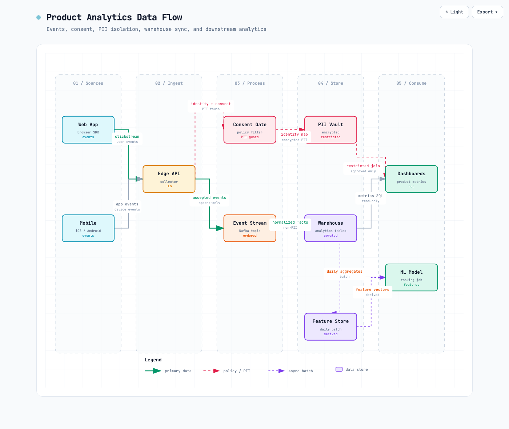

# Archify

**聊两句就画出好看的架构图、技术流程图、调用时序图和数据流图。深色 / 浅色一键切。导出 4× 清晰 PNG / JPEG / WebP / SVG，或直接复制到剪贴板。**

Archify 是一个 [Claude Skill](https://support.claude.com/en/articles/12512180-using-skills-in-claude)：你用大白话描述自己的系统或流程，它就把你的描述变成一张做工精细的技术图 —— 一个单文件 HTML，在浏览器里打开就能切主题、复制到剪贴板、导出成各种图片格式。

- **不需要会画图** —— 把组件和连接关系说给 Claude 就行
- **支持 workflow / sequence / data flow** —— 技术流程、审批链、工具调用、CI/CD、请求调用链、数据管线、PII 边界都可以画
- **内置主题切换** —— 深色 / 浅色一键切，浏览器记住偏好
- **一键复制到剪贴板** —— 直接贴到 Slack、飞书、微信、Notion、GitHub issue
- **导出图片超清晰** —— PNG / JPEG / WebP 全部由浏览器在 4× 源分辨率下**原生光栅化**（不是位图放大，没有糊），或导出 SVG 做真矢量
- **SVG 自动跟系统深浅色** —— 导出的 SVG 内嵌两套变量 + `@media (prefers-color-scheme)`，贴到 GitHub README 里，读者切深浅色图跟着切（不用两张 PNG + `<picture>` 包起来）
- **单文件 HTML** —— 零依赖，发一个文件就能分享
- **聊天迭代** —— "把 Redis 挪到左边"、"鉴权服务换成玫红"、"加个 Kafka"


<p align="right"><a href="./README_EN.md">English</a></p>

## 预览

同一张图，两套主题，一键切换：

| 深色 | 浅色 |
|---|---|
|  |  |

Export 菜单 —— 复制到剪贴板 + 四种格式下载：




想亲自玩一下：克隆仓库后打开 [`examples/web-app.html`](examples/web-app.html)，按 <kbd>T</kbd> 切主题，<kbd>E</kbd> 打开导出菜单。给 URL 加上 `?theme=light` 或 `?openExport=1` 可以强制初始状态。

## 图表类型

Archify 现在有四种主要输出：

| 类型 | 适合画什么 | 怎么用 |
|---|---|---|
| **Architecture** | 系统组件、云资源、数据库、缓存、服务边界、安全组 | 直接描述系统结构 |
| **Workflow** | 请求生命周期、审批流程、工具调用、CI/CD、运维 runbook、事故响应 | 说明参与方、步骤顺序、关键分支 |
| **Sequence** | API 调用链、请求生命周期、缓存回源、鉴权、异步 trace、服务交互 | 说明谁调用谁、先后顺序、返回路径 |
| **Data Flow** | 数据管线、ETL/ELT、埋点、PII 隔离、仓库同步、数据血缘、下游消费 | 说明数据来源、处理阶段、存储位置、敏感边界和消费方 |

Workflow 不是通用流程图的替代品，它更偏“技术沟通图”：有泳道、有语义颜色、有主路径和异步/审批/观测路径。比如：

```
用 archify 画一个 workflow：
用户提交请求 -> Agent 规划 -> 需要审批时进入 Approval Gate -> 调工具 -> 记录 trace -> 返回结果
```

本仓库里有一个可打开的示例：[`examples/workflow-agent-tool-call-rendered.html`](examples/workflow-agent-tool-call-rendered.html)。

Sequence 用来解释更细的交互顺序，比如：

```
用 archify 画一个 sequence diagram：
用户打开页面，前端请求 API，API 校验 JWT，读取 Redis，缓存未命中则查 Postgres，返回结果并写入 trace。
```

示例：[`examples/sequence-cache-miss-request.html`](examples/sequence-cache-miss-request.html)。


Data Flow 适合解释“数据资产怎么走”，比如：

```
用 archify 画一个 data flow：
Web 和 Mobile 上报埋点，Edge API 收集事件，Consent Gate 过滤 PII，Kafka 承接事件流，
Warehouse 存分析表，Feature Store 做每日特征，Dashboard 和 ML Model 消费下游数据。
```

示例：[`examples/dataflow-product-analytics.html`](examples/dataflow-product-analytics.html)。



## 版本演进

Archify 基于 [Cocoon-AI/architecture-diagram-generator](https://github.com/Cocoon-AI/architecture-diagram-generator) v1.0（只有深色主题的 HTML 输出）fork 重写。**2.0** 把模板重构成 CSS 变量驱动的可主题化系统，加入客户端导出流水线。**2.1** 加入剪贴板复制 + 键盘导航。**2.2** 加入打印样式 + 本地字体回退。**2.3** 修了一个存在已久的位图升采样 bug，所有光栅导出改为 4× 原生渲染（同时移除了 v2.1 引入的 1×/2×/4× 选择器 —— 那个选择器只是在诱导用户选出更糊的图）。**2.4** SVG 导出升级成双主题自持版 —— 同一个 `.svg` 文件贴在 GitHub README 里，读者切深浅色图会自己跟着切。

| 能力 | v1.0 | 2.0 | 2.1 | 2.2 | 2.3 | 2.4 |
|---|---|---|---|---|---|---|
| 深色主题 | ✓ | ✓ | ✓ | ✓ | ✓ | ✓ |
| 浅色主题 | — | 切换 | 切换 | 切换 | 切换 + <kbd>T</kbd> 快捷键 | 同 |
| PNG / JPEG / WebP 下载 | 手动截图 | 2× 位图放大 | 1×/2×/4× 选择器（仍是放大）| 同 | **4× 原生光栅化，不糊** | 同 |
| SVG 下载 | — | 矢量 + 内联样式（单主题）| 同 | 同 | 同 | **双主题自持**（`@media prefers-color-scheme`）|
| 复制 PNG 到剪贴板 | — | — | ✓ | 同 | 同（始终 4×）| 同 |
| 键盘快捷键 | — | — | <kbd>T</kbd>/<kbd>E</kbd> + 菜单导航 | 同 | 同 | 同 |
| 可访问性 | — | — | ARIA + focus-visible | 同 | 同 | 同 |
| 打印样式表 | — | — | — | ✓ | ✓（+ 横向 + 2 列卡片）| 同 |
| 导出时本地字体回退 | — | — | — | ✓ | ✓ | 同 |
| 样式模型 | 内联 `fill` / `stroke` | CSS 变量 + 语义 class | 同 | 同 | 同 | 同 |

## 快速上手

### 1. 安装 skill

> 需要 Claude Pro / Max / Team / Enterprise 套餐，或 Claude Code。

**Claude.ai：**
1. 下载 [`archify.zip`](archify.zip)
2. 进入 **Settings → Capabilities → Skills**
3. 点 **+ Add**，上传 zip
4. 打开开关

**Claude Code CLI：**
```bash
# 全局（所有项目可用）
unzip archify.zip -d ~/.claude/skills/

# 或者仅当前项目
unzip archify.zip -d ./.claude/skills/
```

**Claude.ai Projects：**
把 [`archify.zip`](archify.zip) 上传到 Project Knowledge 就行。

### 2. 准备系统描述

下面几种都可以：

**让 AI 分析你的代码仓库：**
```
分析这个代码仓库，描述系统架构。包括所有主要组件、它们之间怎么连接、
用了什么技术栈，以及任何云服务或第三方集成。用列表格式，方便画图。
```

**自己写一段：**
```
- React 前端调 Node.js API
- PostgreSQL 数据库
- Redis 做缓存
- 部署在 AWS 上，用 CloudFront 做 CDN
```

**或者让 Claude 给个典型架构：**
```
一个典型的 SaaS 应用架构是什么样的？
```

### 3. 让 Claude 调用 skill

```
用 archify skill 帮我生成一张架构图：

[粘贴你上面准备的描述]
```

完事。Claude 会生成一个 HTML 文件，浏览器打开就能看。想改就接着聊：「加个 Redis」、「把 Postgres 换成 MySQL」、「鉴权那条路径高亮一下」。

## 用生成的 HTML

浏览器打开文件，右上角会有两个按钮：

- **主题按钮**（Dark / Light）—— 一键切换，持久化保存。快捷键 <kbd>T</kbd>。
- **Export 菜单** —— 五个操作：复制到剪贴板 + 4 种格式下载。快捷键 <kbd>E</kbd>。

### Export 菜单

| 操作 | 做什么 |
|---|---|
| **Copy to clipboard** | 当前图以 PNG 格式直接进系统剪贴板，粘贴到 Slack / Notion / 飞书 / GitHub / Figma |
| **Download PNG / JPEG / WebP** | 保存为光栅图。JPEG / WebP 会用当前主题的背景色填充（无透明）；PNG 保留透明度 |
| **Download SVG** | 矢量导出，所有样式内联，**双主题自持**。内嵌了 dark + light 两套 CSS 变量 + `@media (prefers-color-scheme)` 规则 —— 同一个 `.svg` 贴到 GitHub README / 博客，读者切深浅色图自己跟着切。可以在 Figma / Illustrator 里继续编辑。无损缩放 |

所有光栅导出（复制 + PNG/JPEG/WebP）都由浏览器在 **4× 源分辨率**下原生光栅化 —— 序列化后的 SVG 被设为 `4 × viewBox` 大小，浏览器直接在该分辨率下光栅化矢量，canvas 按自然大小绘制（没有位图升采样）。结果是视网膜屏、演示幻灯、打印输出都真正清晰。

没有倍数选择器 —— 永远最高清晰度，默认也是唯一选项。如果偶尔需要小图，用下面的 URL 参数。

### 键盘快捷键

- 任何位置按 <kbd>T</kbd> —— 切换主题
- 任何位置按 <kbd>E</kbd> —— 打开 Export 菜单
- 菜单里 <kbd>↑</kbd> <kbd>↓</kbd> —— 上下选项
- <kbd>Home</kbd> / <kbd>End</kbd> —— 跳到第一 / 最后一项
- <kbd>Enter</kbd> / <kbd>Space</kbd> —— 触发当前项
- <kbd>Esc</kbd> —— 关闭菜单

### URL 参数

- `?theme=light` 或 `?theme=dark` —— 强制启动主题（确定性截图、分享链接、文档嵌入场景）
- `?openExport=1` —— 页面加载时自动展开 Export 菜单（演示 / 文档截图）

### 注意事项

- **WebP 兼容性**：依赖浏览器的 canvas 编码器。老版 Safari 不支持时，菜单项会变灰不可选。PNG 和 JPEG 通用。
- **剪贴板支持**：图片复制需要 `ClipboardItem` + `navigator.clipboard.write`（Chromium、Firefox 127+、Safari 16+）。不支持时 Copy 选项变灰。
- **导出字体**：光栅图会使用系统等宽字体回退（`ui-monospace` / Menlo / Consolas），因为沙箱图像渲染上下文拿不到 Google Fonts。本机装了 JetBrains Mono 会自动用上，完全像素级一致。

## 常用 prompt

**Web 应用：**
```
用 archify 画一张架构图：
- React 前端
- Node.js/Express API
- PostgreSQL 数据库
- Redis 缓存
- JWT 鉴权
```

**AWS Serverless：**
```
用 archify 画：
- CloudFront CDN
- API Gateway
- Lambda（Node.js）
- DynamoDB
- S3 存静态资源
- Cognito 做鉴权
```

**微服务：**
```
用 archify 画一张微服务架构图：
- React Web + 移动端
- Kong API Gateway
- 用户服务（Go）、订单服务（Java）、商品服务（Python）
- PostgreSQL、MongoDB、Elasticsearch
- Kafka 做事件流
- K8s 做编排
```

**数据流 / 埋点分析：**
```
用 archify 画一个 data flow：
- Web App 和 Mobile SDK 产生 clickstream events
- Edge API 收集事件
- Consent Gate 过滤身份信息和 PII
- Kafka/Event Stream 承接 accepted events
- Warehouse 存 normalized facts
- Feature Store 每日生成 feature vectors
- Dashboards 和 ML Model 消费下游数据
```

## 语义配色

| 类型 | 颜色 | 用途 |
|---|---|---|
| Frontend | 青色 | 客户端 / UI / 终端设备 |
| Backend | 翠绿 | 服务 / API / 后台进程 |
| Database | 紫色 | 数据库 / 存储 / AI/ML |
| Cloud / AWS | 琥珀 | 托管云服务 / 基础设施 |
| Security | 玫红 | 鉴权 / 安全组 / 加密 |
| Message Bus | 橙色 | Kafka / RabbitMQ / SNS / 事件总线 |
| External | 灰色 | 第三方 / 通用外部系统 |

每种颜色在深色 / 浅色主题下都有配套取值，切主题会同步切换。

## 实现细节

- **样式模型**：`:root` + `[data-theme="light"]` 上的 CSS 变量；SVG 元素引用语义 class（`c-frontend`、`t-muted`、`a-emphasis` 等）。切换 `<html>` 上的 `data-theme` 会重写包括渐变、网格、箭头、遮罩在内的整张图。
- **导出流水线**：克隆 SVG，内联 host `<style>`，解析当前主题变量并写入 clone 的 `:root` 规则，然后用 `XMLSerializer` 序列化。光栅格式下，clone 的 `width`/`height` 被设为 `4 × viewBox`，浏览器按目标分辨率原生光栅化矢量；canvas 尺寸对齐 clone 后按自然大小绘制（无位图升采样），`toBlob(mime)` 生成文件。JPEG 会显式补背景色（无 alpha）。如果目标分辨率超过浏览器 canvas 上限，自动降到 3× 或 2×。
- **单文件**：一个 HTML，一个 Google Fonts `<link>`，内联 SVG，约 3 KB 嵌入 JS。无构建步骤、无 JS 框架、无服务端。
- **浏览器支持**：任何主流浏览器（Chrome、Safari、Firefox、Edge）。WebP 导出需要 canvas 支持 `image/webp`。

## 致谢

Archify 是 [**Cocoon-AI/architecture-diagram-generator**](https://github.com/Cocoon-AI/architecture-diagram-generator)（MIT，v1.0）的 fork 重写，原作者 [Cocoon AI](mailto:hello@cocoon-ai.com)。原版精致的视觉语言 —— 配色、网格背景、摘要卡片布局、JetBrains Mono 字体 —— 完整保留。视觉设计功劳归属原作者。

Archify 2.x 贡献：

- 模板重构为 CSS 变量主题系统（深色 + 浅色）
- 主题切换 + `localStorage` 持久化 + `prefers-color-scheme` 默认
- 内置 PNG / JPEG / WebP / SVG 导出菜单 + 复制到剪贴板
- 4× 原生光栅化（修复升采样导致的模糊）
- SVG 导出双主题自持（单文件跟随宿主 `prefers-color-scheme`）
- 键盘导航 + 可访问性语义
- 打印样式表 + 本地字体回退
- 更新后的 `SKILL.md` 引导 Claude 使用 class 化、可主题化的画图方式

两个项目都是 MIT 协议。

## 路线图

详见 [ROADMAP.md](ROADMAP.md)。

下一站是 **v3.0 — JSON IR 稳定迭代**：引入极简 `diagram.json` 中间格式，让 Claude 做局部坐标修改时不会漂移无关组件，同时支持 `git diff` 友好和 theme/palette 不重渲染。

> **关于 Mermaid 导入：** 经实验验证（auto-layout + archify CSS 并不比原生 Mermaid 好看多少），Mermaid 自动解析器路线已砍掉。archify 的美学核心是 Claude 的布局判断，不是 CSS。用户仍可贴 Mermaid 代码让 Claude 从零布局出 archify 风格图 —— 只是走 prompt 而不是走 parser。
>
> 原 v2.4 / v2.5 计划（`?exportScale=N`、色盲调色板、分享链接）也已砍掉。理由见 [ROADMAP「Not planned」段落](ROADMAP.md#not-planned)。

## License

[MIT](LICENSE) —— 自由使用、修改、再分发。

## 参与贡献

欢迎 issue、PR、分享你画的图。
