<p align="center">
  <picture>
    <source media="(prefers-color-scheme: dark)" srcset="docs/assets/archify-lockup-dark.svg" />
    
  </picture>
</p>
<h3 align="center">理解したいこと、計画したいこと、共有したいことを、触れるビジュアルに変えます。</h3>

<p align="center">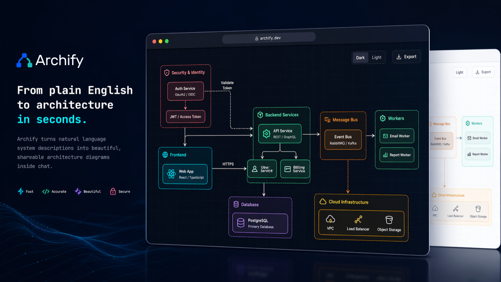</p>

<p align="center">アイデア、疑問、計画のどれから始めても構いません。AI エージェントに説明すれば、Archify が探索・カスタマイズ・共有できるインタラクティブな HTML を生成します。旅行の行程や学習マップから複雑なシステムまで、あなた自身のものに作り込めます。</p>

<p align="center">コミュニティが何を作っているかを見て、自分なら次に何を作れるかを考えてみてください。</p>

<p align="center">
  <a href="https://tt-a1i.github.io/archify/gallery.html"><strong>ライブデモ</strong></a> &nbsp;·&nbsp;
  <a href="#start"><strong>使ってみる</strong></a> &nbsp;·&nbsp;
  <a href="https://tt-a1i.github.io/archify/guide.html"><strong>シナリオガイド</strong></a> &nbsp;·&nbsp;
  <a href="#コミュニティ"><strong>コミュニティ</strong></a> &nbsp;·&nbsp;
  <a href="./README.md"><strong>English</strong></a> &nbsp;·&nbsp;
  <a href="./README_ZH.md"><strong>简体中文</strong></a>
</p>

<p align="center">
  <a href="https://trendshift.io/repositories/31352?utm_source=repository-badge&amp;utm_medium=badge&amp;utm_campaign=badge-repository-31352" target="_blank" rel="noopener noreferrer"></a>
</p>

<p align="center">
  <a href="https://github.com/tt-a1i/archify/stargazers"></a>
  <a href="LICENSE"></a>
  <a href="archify/SKILL.md"></a>
  <a href="CHANGELOG.md#unreleased"></a>
</p>

<p align="center">
  <a href="https://tt-a1i.github.io/archify/"></a>
  <a href="https://discord.gg/6xWMjgCeUq"></a>
  <a href="#コミュニティ"></a>
  <a href="#コミュニティ"></a>
  <a href="https://x.com/t20000622yy"></a>
</p>

## 実際の Archify

<p align="center">
  <a href="https://tt-a1i.github.io/archify/gallery.html">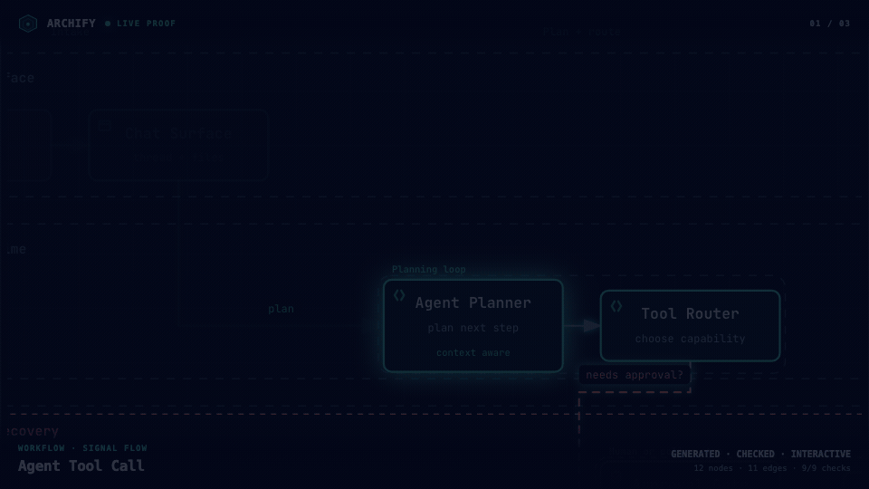</a>
  <br/>
  <sub><strong>実際に生成された 3 つの成果物。</strong> Signal Flow · Blueprint · Classic · <a href="https://tt-a1i.github.io/archify/gallery.html">インタラクティブな Proof Lab を開く ↗</a></sub>
</p>

**プレビューをクリックすると、実際のインタラクティブな成果物が開きます。** GIF は動きを見せるためのもので、実際に探索できるのはブラウザで開く HTML のほうです。

<a id="start"></a>

### インストールして、アイデアを説明する

Cursor、Claude Code、Codex CLI、OpenCode で利用できます。その他の連携については下記のインストール方法を参照してください。

```bash
npx skills add tt-a1i/archify -g
```

エージェントにこう送ってください:

```text
Use Archify to diagram a web request: Browser calls the API,
the API checks Redis, and a cache miss queries PostgreSQL and fills the cache.
```

そのまま「認証を追加して」「キャッシュミスの経路を強調して」「ライトテーマに切り替えて」と続けられます。

**リポジトリは不要です:** 説明から始めることも、リポジトリを読ませてソースに基づくアーキテクチャ図を作らせることもできます。

[エージェントを選ぶ](https://tt-a1i.github.io/archify/start.html?agent=cursor&type=architecture) · [インストールの詳細と更新チェック](#クイックスタート)

## ❤️ スポンサー

<table>
<tr>
  <td align="center" width="240"><a href="https://supercode.sh/?utm_source=archify"></a><br/><strong><a href="https://supercode.sh/?utm_source=archify">supercode.sh</a></strong></td>
<td><a href="https://supercode.sh/?utm_source=archify">Supercode</a> は Archify をスポンサーし、トークン最適化・厳選された Skills・仕様駆動開発によって Codex と Cursor を強化しています。Archify は <a href="https://supercode.sh/en/skills/tt-a1i/archify/archify">Supercode Editor’s Choice</a> スキルに選出されています。<br/><br/><a href="https://supercode.sh/en/skills/tt-a1i/archify/archify"></a></td>
</tr>
<tr><td align="center" width="240"><a href="https://github.com/EverMind-AI/Raven">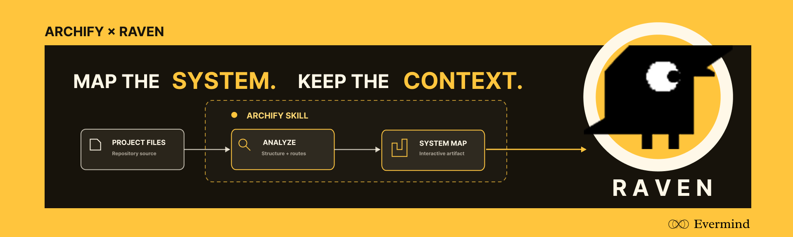</a><br/><strong><a href="https://github.com/EverMind-AI">EverMind</a> · <a href="https://github.com/EverMind-AI/Raven">Raven</a></strong></td><td>EverMind は Archify をスポンサーし、エージェント向けのメモリ基盤を開発しています。同社の <a href="https://github.com/EverMind-AI/Raven"><strong>Raven</strong></a> ハーネスは、検証済みでインタラクティブなシステムマップのために Archify を Skill としてサポートしています。</td></tr>
</table>

> Archify のスポンサーをご検討ですか？ [メールでお問い合わせください。](mailto:2801884530@qq.com)

## 伝えたいことを見せる

| エージェントのワークフローを説明する | キャッシュミスを追う | サービス間の関係を調べる |
|---|---|---|
| [](https://tt-a1i.github.io/archify/gallery/artifacts/agent-tool-call.workflow.html?theme=dark&present=1&play=1#view=happy-path) | [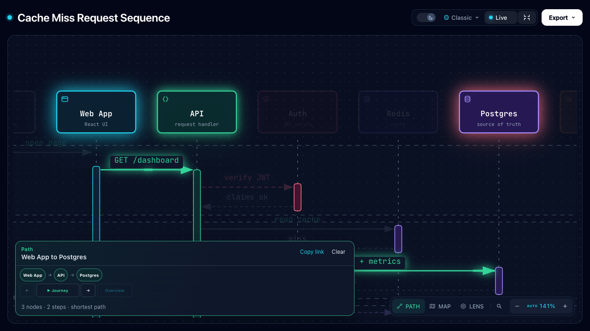](https://tt-a1i.github.io/archify/gallery/artifacts/cache-miss.sequence.html?theme=dark&present=1#route=web~db) | [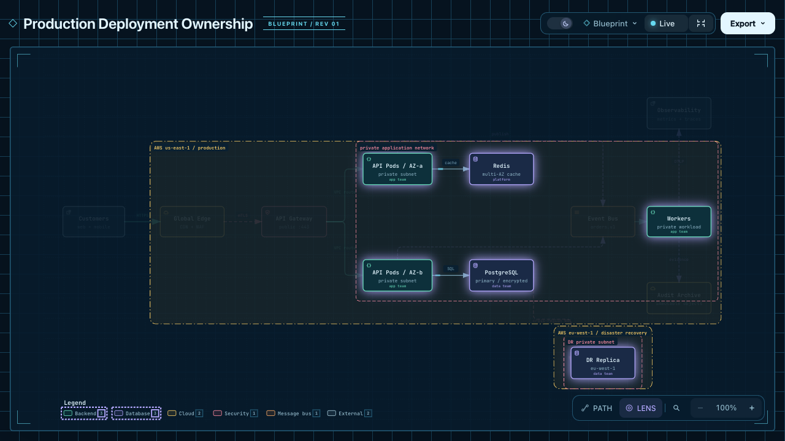](https://tt-a1i.github.io/archify/gallery/artifacts/production-deployment.architecture.html?theme=dark&present=1#lens=backend~database) |
| 図に記述された手順をたどります。 | Web アプリからデータベースまでの経路を強調します。 | 記述されたバックエンドとデータベースの接続に絞って見ます。 |

[Proof Lab](https://tt-a1i.github.io/archify/gallery.html) には、チェックイン済みの 11 シナリオすべてと、その JSON ソース、名前付きビュー、検証レシートが含まれています。

### 実際のリポジトリを理解する

<sub>CODE → DIAGRAM · ソースに基づくシステムマップ</sub>

[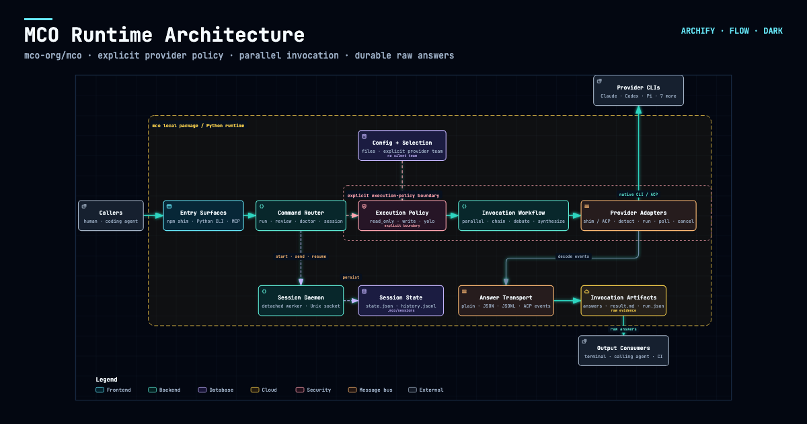](https://tt-a1i.github.io/archify/cases/mco-runtime.architecture.html?theme=dark&present=1#view=dispatch-path)

Archify は [`mco-org/mco`](https://github.com/mco-org/mco) の `9f1a1cf` を解析し、この検証済みマップを生成しました。**[開く ↗](https://tt-a1i.github.io/archify/cases/mco-runtime.architecture.html?theme=dark&present=1#view=dispatch-path)** · [到達範囲をトレース ↗](https://tt-a1i.github.io/archify/cases/mco-runtime.architecture.html?theme=dark#focus=router&reach=downstream) · [型付きソース](docs/cases/mco-runtime.architecture.json)

### 拡張しやすい。自分のものにする方法はいくつもある。

<sub>COMMUNITY STORIES · ユーザーが共有してくれた事例の一部</sub>

**図ができたあとも作り続けられます。** Archify はオープンソースで、出力は単体で動く HTML です。エージェントに頼んで手を加えたり、役立つリンクをつないだり、自分のワークフロー向けのインタラクションを足したりできます。コミュニティの作例はチームのコラボレーション、旅行の計画、法令引用のチェック、契約レビュー、インシデントの振り返りにまで広がっています。ここに挙げたのはその一部です。

あるユーザーは手描きのマルチエージェント構成図から始めてインタラクティブな図に変え、さらに会話を重ねて Kimi の実行プールを追加しました。別のユーザーはエージェントにプロジェクトを読ませ、できあがったアーキテクチャを Feishu や DingTalk に持ち込んでチームで議論しています。

上海 CityWalk のガイドを 4 日間の行程表に変えたユーザーもいます。日ごとに切り替え、立ち寄り先を確認し、Amap・Xiaohongshu・Dianping へ飛べます。作者は到着時のチェックインや立ち寄り先のメモも追加し、旅行中に使える小さなツールに仕立てました。これらの拡張は、この成果物のためにコミュニティの作者自身が加えたものです。

**[▶ インタラクティブな上海 CityWalk を見る](https://tt-a1i.github.io/archify/cases/community/shanghai-citywalk.html)**

[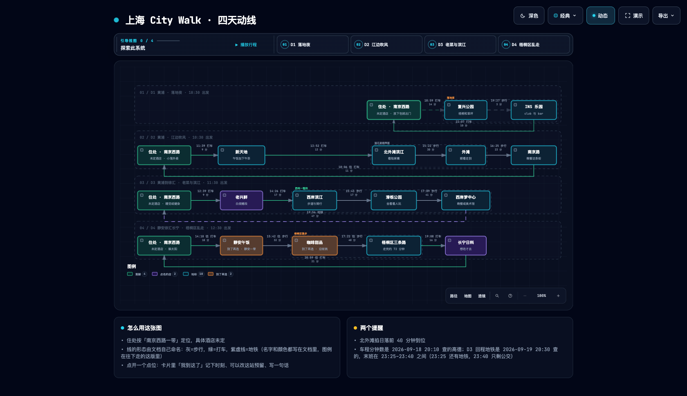](https://tt-a1i.github.io/archify/cases/community/shanghai-citywalk.html)

**[▶ インタラクティブ版を試す](https://tt-a1i.github.io/archify/cases/community/shanghai-citywalk.html)** · D1〜D4 を切り替え、場所をクリックして探索できます。

<sub>コミュニティ成果物 · 上海 CityWalk · 4 日分のルートと場所のリンク</sub>

### ダウンロードして、開いて、探索する

出力は単体で完結する HTML ファイルです。ダウンロードしてブラウザで開けば、その成果物に含まれるノードの詳細、経路の探索、ガイド付きチャプターをそのまま使えます。閲覧に Archify のインストールは必要ありません。HTML を誰かに送れば操作性もそのまま届きます。外部サイトや地図のリンクにはネットワーク接続が必要です。

**[上海 CityWalk を見る ↗](https://tt-a1i.github.io/archify/cases/community/shanghai-citywalk.html)** · **[HTML をダウンロード ↓](https://github.com/tt-a1i/archify/raw/refs/heads/main/docs/cases/community/shanghai-citywalk.html)**

<sub>D1〜D4 の切り替え、場所カードを開く、地図リンクをたどる、といった操作を試してみてください。時刻や場所の情報は作者の元の行程に基づいています。</sub>

## コミュニティと評価

- **GitHub Trending の週間・全言語リポジトリランキングで 1 位。** [作者が 2026 年 9 月 1 日に公開したランキングのスクリーンショット](https://x.com/t20000622yy/status/2094656813576880285)（全言語・「This week」を選択した状態）。
- **QbitAI（量子位）に取り上げられ、インタビューを受けました。** [プロジェクト紹介](https://www.qbitai.com/2026/09/482469.html) · [開発者のストーリー](https://www.qbitai.com/2026/09/488519.html)。
- **開発者コミュニティで共有されました。** [midudev の投稿](https://x.com/midudev/status/2094425974406320207)。

<sub>公開された記事、コミュニティでの共有、これまでの節目から一部を挙げています。日付と出典は各リンクを参照してください。</sub>

## プレビュー

<details>
<summary>テーマ、エクスポート、シェアカード</summary>

同じ図を 2 つのテーマで、ワンクリック切り替え:

| ダーク | ライト |
|---|---|
|  |  |

Export メニューから PNG をクリップボードにコピーしたり、静止画・モーション形式でダウンロードできます:

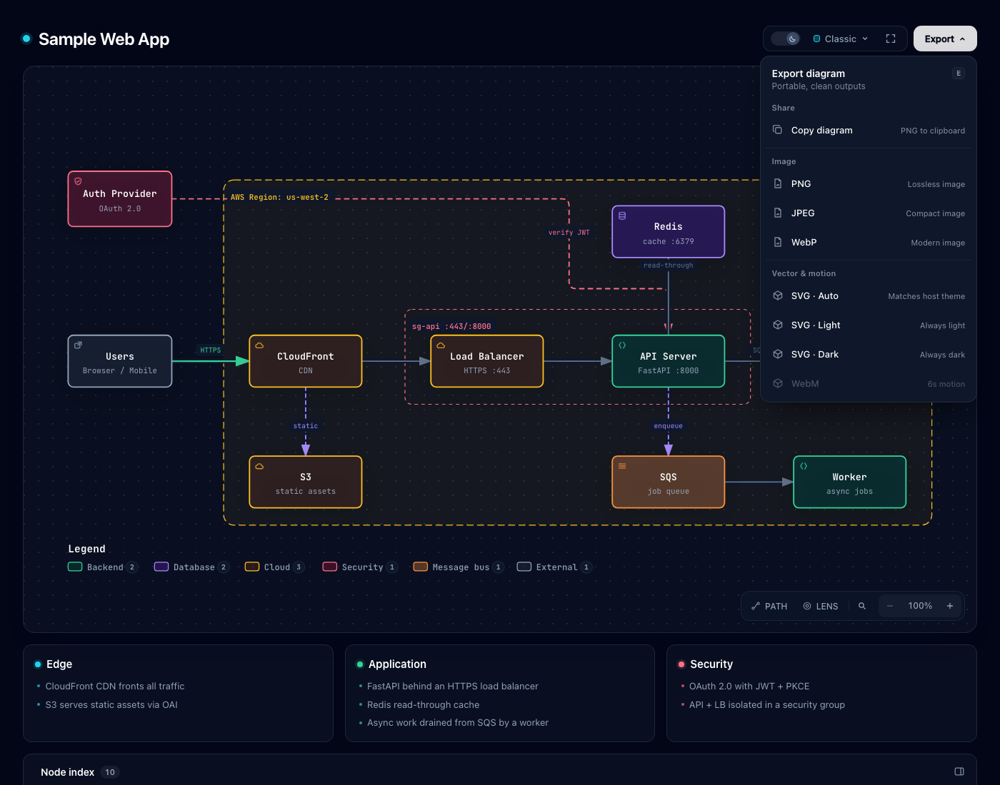

README やリリースノート、SNS 投稿向けに正規の 1200×630 画像が欲しいときは **Copy Share Card** を使ってください。

ルートをトレースしたあと、**Export → Route Share Card** を選ぶと、その記述済みパスを 1200×630 の PNG としてダウンロードできます。図全体も文脈として保持されます。

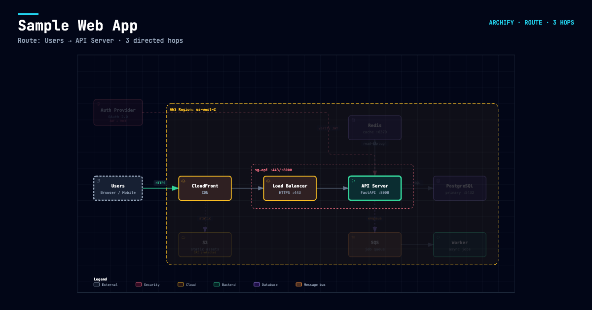

記述された `Upstream` / `Downstream` の到達範囲をトレースしたあと、**Export → Reach Share Card** はランタイム上の影響を主張することなく、その読み取り結果をそのまま切り出します。

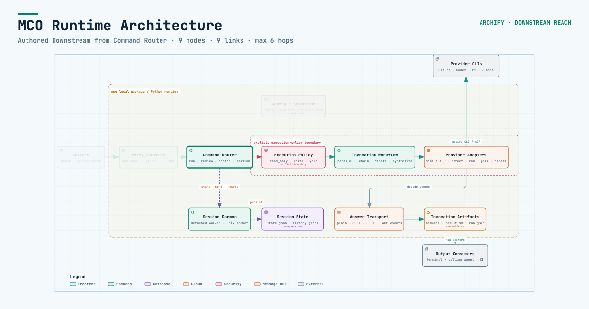

完全なビューアを試すには、[`examples/web-app.html`](examples/web-app.html) をローカルで開いてください。

</details>

## クイックスタート

**現在の開発版:** `v2.17.0-dev.1`。[変更履歴](CHANGELOG.md#unreleased)を参照してください。

### 1. インストール

```bash
npx skills add tt-a1i/archify -g
```

<details>
<summary>その他のインストール方法と更新チェックの詳細</summary>

Cursor に明示的・非対話的にインストールする場合:

```bash
npx -y skills add tt-a1i/archify --skill archify --agent cursor --global --copy --yes
```

インストールせずに試す場合:

```bash
npx skills use tt-a1i/archify@archify --agent codex
```

[DSH コミュニティ版（任意）](integrations/deepseek-harness/README.md): `dsh plugin --profile web add @tt-a1i/archify-dsh@0.1.0`

[エージェント切り替え](https://tt-a1i.github.io/archify/start.html?agent=cursor&type=architecture)は `cursor`、`codex`、`claude-code`、`opencode` に対応しています。

Archify は固定の安定版マニフェストを GET して任意の更新リマインダーを表示することがありますが、更新をダウンロードしたりインストールしたりすることはありません。チェックに成功すると次回まで約 72 時間（±20%）待機し、失敗した場合はアクティブに使用していれば 6 時間後、その後は 24 時間後に再試行します。サーバーが受け取るのは通常の HTTP メタデータ（IP と時刻）だけで、バージョン、Agent、プロジェクトデータ、プロンプト、アカウント／デバイス ID、ETag は送信されません。更新するかどうか、いつ更新するかは常にあなたが決めます。`ARCHIFY_UPDATE_CHECK_DISABLED=1` を設定すると、ネットワーク通信とリマインダー状態の書き込みを無効化できます。

</details>

### 2. 説明から始める — リポジトリは不要

```text
Use Archify to draw: Browser -> API -> Redis cache -> PostgreSQL fallback.
```

ソースを根拠にしたい場合は、リポジトリを開いてこう依頼します:

```text
Analyze this repository, then use archify to create a high-level runtime architecture diagram.
Show 8–12 core components, one primary path, external dependencies, and trust boundaries.
Put supporting detail in cards instead of adding more edges.
```

### 3. チャットで調整する

`add Redis`、`move auth to the left`、`highlight the rollback path` のように、焦点を絞った依頼を続けてください。Archify は型付きソースを保持しているため、狙った箇所だけを反復できます。

## 適切な図を選ぶ

<details>
<summary>5 種類の図、アーキテクチャの比較、サンプル</summary>


| 種類 | 向いている対象 | プロンプトに含めるもの |
|---|---|---|
| **Architecture** | コンポーネント、サービス、ストレージ、境界 | スコープ、主要コンポーネント、主経路 |
| **Workflow** | CI/CD、承認、ツール呼び出し、ランブック | 参加者、順序、分岐、例外 |
| **Sequence** | API 呼び出し、キャッシュフォールバック、認証、非同期トレース | 呼び出し元、呼び出し先、戻り、タイミング |
| **Data Flow** | パイプライン、リネージ、PII、コンシューマ | ソース、変換、ストア、境界 |
| **Lifecycle** | 状態、リトライ、待機、終端結果 | 状態、イベント、リトライとキャンセルの経路 |

Architecture の任意プロファイル `deployment-ownership` は、記述されたオーナー、リージョン配置、データベースのプライベートスコープ、名前付きの境界越えが欠けている場合は fail-closed で停止します。暗黙的に有効化されることはなく、ライブのインフラを検査することもありません。[検証済みのデプロイ実証](https://tt-a1i.github.io/archify/gallery.html#proof-deployment-ownership)を参照してください。

設計や PR のレビューでは、Architecture Delta が検証済みの Before / Delta / After スナップショットを機械可読なレシート付きで比較します。記述された変更を選ぶか、有限でビューア専用の Review を 1 つ再生してください。影響度・リスク・マージ安全性を推測することはありません。

`node archify/bin/archify.mjs compare architecture base.json head.json architecture-delta.html --json`

[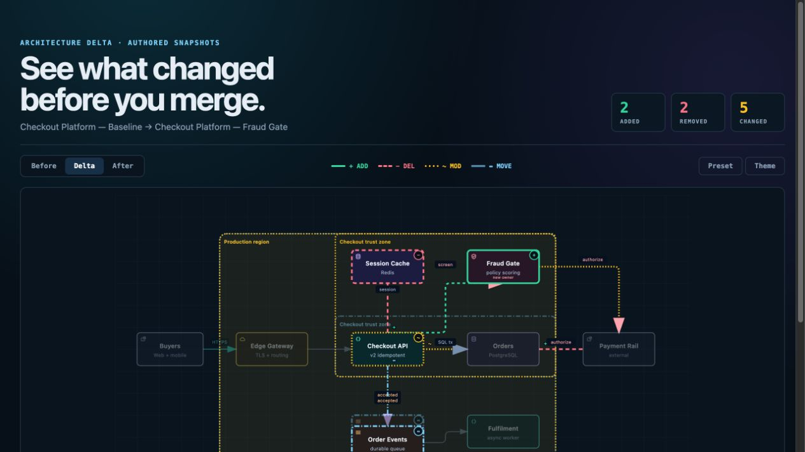](examples/checkout-platform-delta.html)

どれを選べばよいか分からない場合は、[インタラクティブなシナリオガイド](https://tt-a1i.github.io/archify/guide.html)を使うか、依存関係ゼロの CLI に尋ねてください:

```bash
node archify/bin/archify.mjs guide "Show an API request with Redis cache miss"
node archify/bin/archify.mjs guide "Map Kafka topics, consumer groups, replay, and DLQ" --json
```

Workflow はレーンをまたいでもハッピーパスを明確に保ちます:

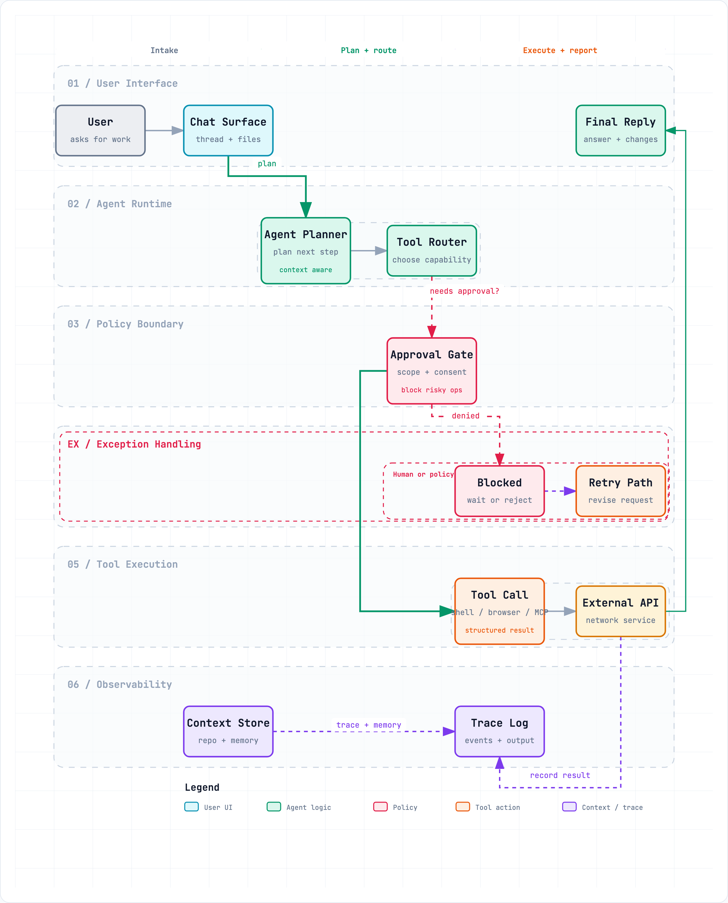

Sequence は 1 つのやり取りを時間軸で説明します:

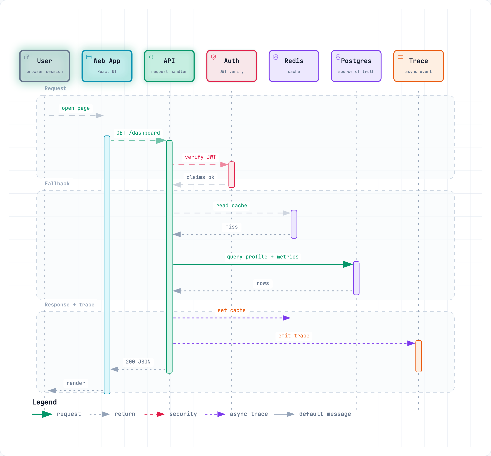

Data Flow はデータの移動と機密性の境界を明示します:

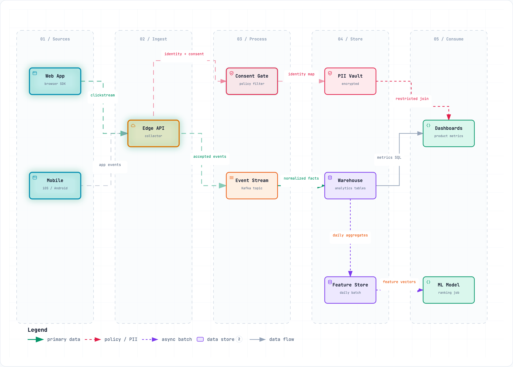

Lifecycle は進行、待機、リトライ、終端結果を切り分けます:

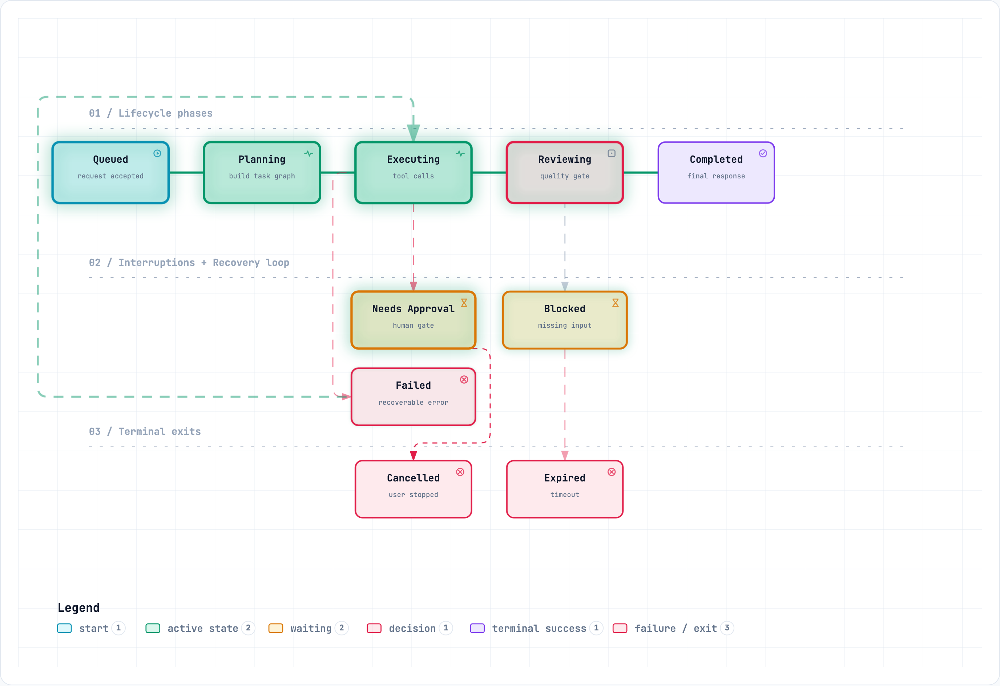

Architecture の例: [`web-app`](examples/web-app.html) · [`Archify pipeline`](examples/archify-repo.html) · [`grid placement`](examples/archify-repo-grid.html) · [`desktop agent`](examples/maka-architecture.html)

</details>

## Archify を選ぶ理由

| 構造を理解する | ストーリーをたどる |
|---|---|
| コードや説明から、コンポーネント、ワークフロー、関係を整理します。 | ノードを探索し、経路をたどり、プロセスをチャプターごとに説明します。 |
| **自分のやり方で拡張する** | **結果を共有する** |
| 編集可能なソースを保持したまま、オープンソースのコードや生成された HTML に独自のインタラクションやユースケースを積み上げられます。 | 単体で完結する HTML ファイルを共有するか、画像・動画・シェアカードとして書き出せます。 |

<details>
<summary>この体験を支えているエンジニアリング</summary>


- **汎用オートレイアウトではなくレイアウトの判断** — 階層、余白、経路、強調をエージェントが選択します。共有される自動接続点は決定論的に分散し、1 点に矢印が集中することはありません。
- **型付き JSON IR** — レンダラーが担うすべてのモードにスキーマと再現可能なソースがあります。
- **提供前のアトミックな検証** — スキーマ、レイアウト、HTML/SVG、経路、ラベルと経路のクリアランスのすべてのチェックに合格して初めて、ショーケース成果物が直前の正常な出力を置き換えます。
- **失敗には修復レシートが付く** — `validate --json` と `deliver --json` は、Node のスタックトレースや当てずっぽうのリトライではなく、安定したルールコード、対象、計測された根拠、サポートされている修復手段のみを返します。
- **last-good のライブプレビュー** — 任意のデスクトップループが 1 つの JSON ファイルを監視し、最新の候補がすべてのゲートを通過したときだけ更新します。保存が不完全または不正な場合は、直前の検証済み図を表示し続けます。
- **誠実なインタラクション** — フォーカス、上流/下流の到達範囲、正確な経路、ロール比較、ストーリーは、記述済みのノードと関係のみを再利用し、トポロジーを捏造したりランタイム上の影響を主張したりしません。
- **ソース根拠は要求されたときだけ** — 根拠付きの Architecture ノードは自らを `SRC n` と示し、1 つの公開コミットに固定された Git 検証済みのファイルと行範囲を開きます。通常の成果物はソース非依存のままです。
- **既定でポータブル** — 出力は 1 つの HTML ファイルです。エクスポートは常に図全体で、一時的なビューア状態を含みません。

Archify は汎用の作図エディタでも Mermaid のテーマでもありません。技術的な意図をコミュニケーションのための成果物に変えるツールです。

</details>

## 仕組み

<details>
<summary>生成、検証、プレビュー、デリバリーの詳細</summary>

| ステップ | 内容 |
|---|---|
| **Generate** | エージェントが説明から型付き JSON IR を生成します。 |
| **Validate** | 同梱のバリデータとレイアウトルールがソースを検査します。失敗時は、機械可読な JSON で修復すべき箇所を正確に示します。 |
| **Preview（任意）** | ループバック限定のデスクトップセッションが 1 つのソースを監視し、検証済みのリビジョンだけを再読み込みします。失敗時は last-good の成果物を保持します。 |
| **Deliver** | 同一ディレクトリに候補をレンダリングして検査し、合格したものだけがアトミックに対象を置き換えます。その後、任意の `--open` でそのファイルを開きます。 |
| **Iterate** | 無関係な構造は安定させたまま、エージェントがソースを更新します。 |

よく使うリポジトリコマンド:

```bash
cd archify
node bin/archify.mjs doctor
node bin/archify.mjs demo /tmp/archify-demo
node bin/archify.mjs guide "Show CI/CD checks, approval, deploy, and rollback"
node bin/archify.mjs validate workflow examples/agent-tool-call.workflow.json --quality showcase --json
node bin/archify.mjs preview workflow examples/agent-tool-call.workflow.json /tmp/workflow.html --quality showcase
node bin/archify.mjs deliver workflow examples/agent-tool-call.workflow.json /tmp/workflow.html --quality showcase --open --json
```

`preview` はループバック限定の明示的なデスクトップモードです。`127.0.0.1` のランダムポートで 1 つの JSON ファイルを監視し、失敗時も直前の検証済み出力を保持し、Ctrl-C で停止し、生成 HTML にランタイムを追加しません。テスト時や URL を自分で開きたい場合は `--no-open` を使ってください。

`deliver --open` は、コミット後に一度だけ実行されるオプトインの受け渡しです。オープナーが失敗しても成功は維持され、JSON は stdout に、手動で開くための絶対パスは stderr に出力されます。

失敗時でも、`validate --json` と `deliver --json` は 1 つの JSON オブジェクトを出力します。`diagnostics[]` の各対象について、その `supportedFixes` だけを Skill が定める 2 回の修正ラウンド内で適用してください。視覚的なレビューは引き続き分離されています。

設定:

```json
{
  "meta": {
    "locale": "en",
    "animation": "trace",
    "visual_preset": "signal-flow"
  }
}
```

`meta.locale=en|zh-CN` はページタイトル、Legend、状態／エラー、アクセシビリティ、HTML/SVG の `lang` をローカライズします（記述された内容自体は変更しません）。該当しない場合は省略し、要求された言語の文言はそのまま維持し、英語へフォールバックした場合はその旨を明示してください。静止出力では `animation` は省略され、`classic` が既定になります。

</details>

## 出力を探索して共有する

| 操作 | ショートカット |
|---|---|
| 事実ベースの Diagram Guide を開く | <kbd>?</kbd> |
| セマンティックノードを検索してフォーカス | <kbd>/</kbd> |
| 記述された上流/下流の到達範囲をトレース | ノードをフォーカス → `Upstream` / `Downstream` |
| 有向ルートを調べて経路を確認 | <kbd>R</kbd> または `PATH` |
| 1〜2 個のセマンティックロールを比較 | <kbd>L</kbd> または `LENS` |
| ライブの全体レーダーを開く | <kbd>M</kbd> または `MAP` |
| ガイド付きストーリーの再生 / チャプター切り替え | <kbd>P</kbd> / <kbd>[</kbd> <kbd>]</kbd> |
| プレゼンテーションステージに入る | <kbd>F</kbd> |
| ビジュアルスタイルを選択（`S` で循環）/ テーマ切り替え / Export を開く | <kbd>S</kbd> / <kbd>T</kbd> / <kbd>E</kbd> |
| ズーム / リセット | <kbd>+</kbd> / <kbd>-</kbd> / <kbd>0</kbd> |

安定したリンクで `#focus=<id>`、`#focus=<id>&reach=upstream|downstream`、`#relation=<id>`、`#route=<source>~<target>`、`#lens=<kind>~<kind>`、`#view=<view-id>` を復元できます。読み手が起動するモーションは有限で、`prefers-reduced-motion` を尊重し、正規のエクスポートには含まれません。

生成とビューアの完全な仕様は [`archify/SKILL.md`](archify/SKILL.md) にあります。

## インストール方法

| 環境 | インストール先または方法 | 機能 |
|---|---|---|
| **Claude Code** | `~/.claude/skills/` または `.claude/skills/` | レンダラー + 検証ワークフローのフル機能 |
| **Codex CLI** | `~/.agents/skills/` または `.agents/skills/` | レンダラー + 検証ワークフローのフル機能 |
| **opencode** | `~/.config/opencode/skills/`、`.opencode/skills/`、または `.agents/skills/` | レンダラー + 検証ワークフローのフル機能 |
| **Claude.ai** | Settings → Capabilities → Skills から `archify.zip` をアップロード | サンドボックスでの Node.js 利用可否に依存 |
| **Project Knowledge** | プロジェクトに `archify.zip` をアップロード | プロンプト駆動のアーキテクチャフォールバック |
| **Hermes Agent** | 明示的に有効化: `hermes skills install skills-sh/tt-a1i/archify/archify -y` | コミュニティ版の Skill のみの統合。Node `>=18`。Nous 公式製品ではありません。テレメトリはありません。切り替え対象には含まれません。[詳細](integrations/hermes-agent/README.md)。 |
| **DeepSeek Harness** | 明示的に有効化: `dsh plugin --profile web add @tt-a1i/archify-dsh@0.1.0`。呼び出し: `Use the archify skill to map this repository's runtime architecture.` 削除: `dsh plugin --profile web remove @tt-a1i/archify-dsh` | 開発者プレビュー版 `@deepseek-ai/dsh@0.1.0-rc.6` 向けのコミュニティ統合。Node `^22.19.0 \|\| >=24.0.0`。DeepSeek 公式製品ではなく、テレメトリもありません。シェルファイルには Web Produced Files ではなく、正確なワークスペースパスが必要です。[詳細](integrations/deepseek-harness/README.md)。 |

## リファレンスとスコープ

- [スキーマリファレンス](archify/schemas/README.md) · [Skill](archify/SKILL.md) · [サンプル](archify/examples/) · [エージェント向けクックブック](docs/authoring-cookbook.md)
- [変更履歴](CHANGELOG.md)
- [ロードマップ](ROADMAP.md)
- [生成された Proof Lab](https://tt-a1i.github.io/archify/gallery.html)

Mermaid の自動パース、汎用オートレイアウト、ホスティング型の共有、WYSIWYG 編集は、現時点では意図的にスコープ外としています。

## コミュニティ

👋 **Archify コミュニティへようこそ！**

他のユーザーや開発者とつながり、アイデアを共有し、機能を提案し、バグを報告し、開発について議論して、一緒に Archify をより良くしていきましょう。

-  [Discord](https://discord.gg/6xWMjgCeUq)
-  WeChat: 下の QR コードをスキャンしてください。WeChat のグループコードは定期的に失効します。失効していた場合は、Discord か QQ で最新のコードを尋ねてください。
-  QQ グループ: `1121948602`

<table>
<tr>
  <td align="center"><strong> WeChat</strong><br/></td>
  <td align="center"><strong> QQ</strong><br/></td>
</tr>
</table>

## ライセンス

[MIT](LICENSE) — 自由に利用・改変・配布できます。

## コントリビュート

Issue、プルリクエスト、実際の図の投稿を歓迎します。まずは[コントリビューションガイド](CONTRIBUTING.md)をご覧ください。不具合は再現可能なバグ報告フォームから、検証済みの図は[コミュニティショーケースフォーム](https://github.com/tt-a1i/archify/issues/new?template=showcase.yml)から投稿できます。&nbsp;·&nbsp;[LINUX&nbsp;DO](https://linux.do)

## Star History

<p align="center"><picture><source media="(prefers-color-scheme: dark)" srcset="https://raw.githubusercontent.com/tt-a1i/archify/star-history/assets/star-history-dark.svg" /></picture></p>
