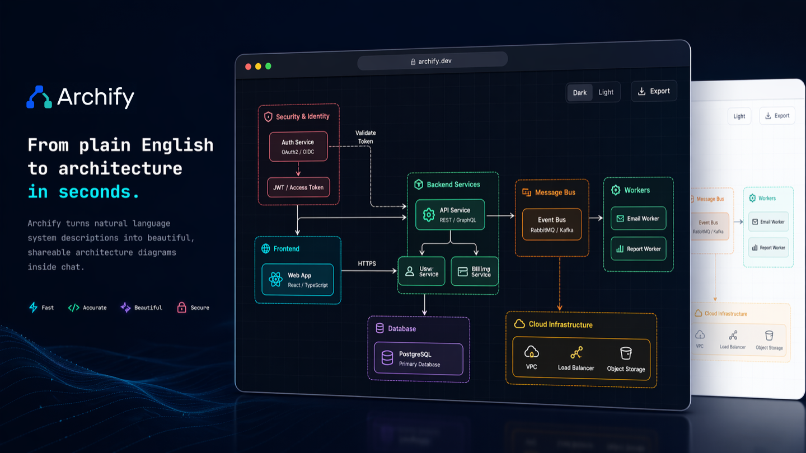
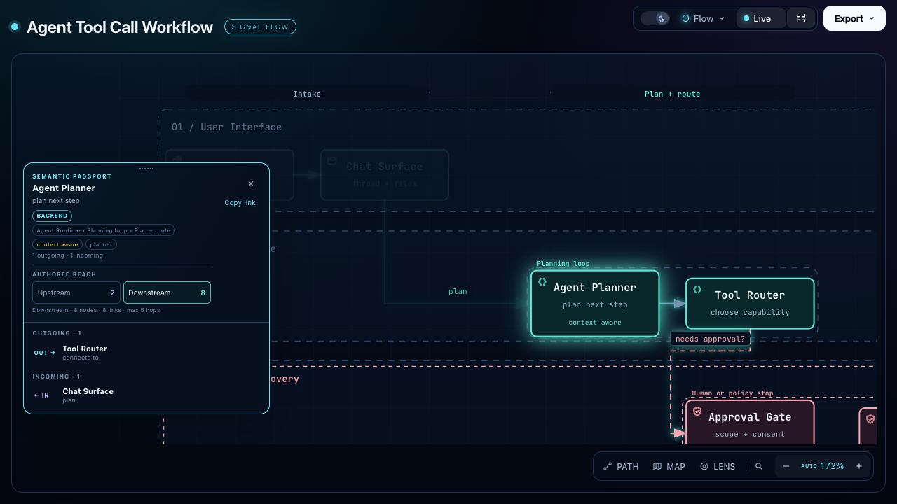
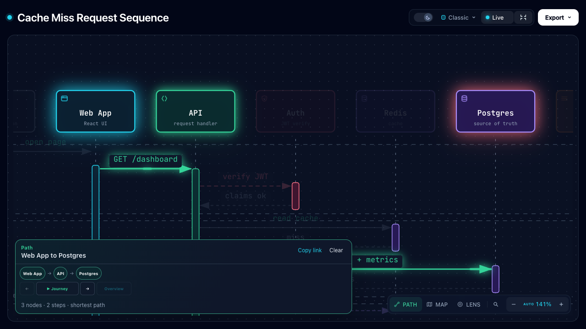
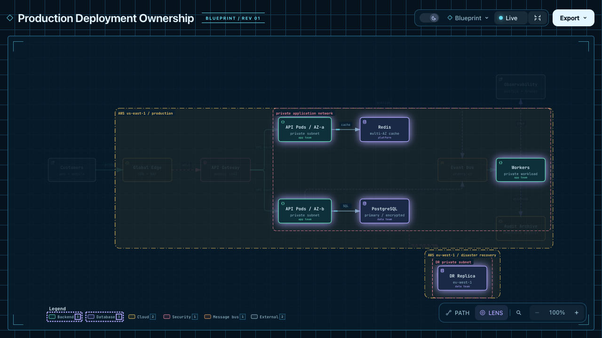

<p align="center">
  <picture>
    <source media="(prefers-color-scheme: dark)" srcset="docs/assets/archify-lockup-dark.svg" />
    
  </picture>
</p>
<h3 align="center">이해하고, 계획하고, 공유할 내용을 인터랙티브한 시각 자료로 만드세요.</h3>

<p align="center"></p>

<p align="center">아이디어, 질문, 계획을 AI 에이전트에게 설명하면 Archify가 탐색하고 수정하고 공유할 수 있는 인터랙티브 HTML을 만듭니다. 여행 일정과 학습 지도부터 복잡한 시스템까지 원하는 형태로 발전시킬 수 있습니다.</p>

<p align="center">
  <a href="https://tt-a1i.github.io/archify/gallery.html"><strong>라이브 데모</strong></a> &nbsp;·&nbsp;
  <a href="#start"><strong>시작하기</strong></a> &nbsp;·&nbsp;
  <a href="https://tt-a1i.github.io/archify/guide.html"><strong>시나리오 가이드</strong></a> &nbsp;·&nbsp;
  <a href="#community"><strong>커뮤니티</strong></a> &nbsp;·&nbsp;
  <a href="./README.md"><strong>English</strong></a> &nbsp;·&nbsp;
  <a href="./README_ZH.md"><strong>简体中文</strong></a> &nbsp;·&nbsp;
  <a href="./README_JA.md"><strong>日本語</strong></a>
</p>

<p align="center">
  <a href="https://github.com/tt-a1i/archify/stargazers"></a>
  <a href="LICENSE"></a>
  <a href="archify/SKILL.md"></a>
</p>

## Archify 살펴보기

<!-- archify-launch-video -->

https://github.com/user-attachments/assets/78570807-ba1d-4737-953f-55504a378a87

**한 문장으로 저장소를 지도처럼 파악하세요.** [인터랙티브 예제 보기 ↗](https://tt-a1i.github.io/archify/gallery.html)

<a id="start"></a>

### 설치한 뒤 아이디어 설명하기

Cursor, Claude Code, Codex CLI, OpenCode에서 사용할 수 있습니다.

```bash
npx skills add tt-a1i/archify -g
```

에이전트에게 다음과 같이 요청하세요.

```text
Archify로 웹 요청을 다이어그램으로 그려 줘. 브라우저가 API를 호출하고,
API는 Redis를 확인해. 캐시 미스면 PostgreSQL을 조회하고 캐시를 채워 줘.
```

그다음 “인증 추가해 줘”, “캐시 미스 경로를 강조해 줘”, “라이트 테마로 바꿔 줘”처럼 이어서 다듬을 수 있습니다. 저장소 없이 설명만으로 시작할 수도 있고, 코드 근거가 필요하면 에이전트에게 저장소를 분석하게 할 수도 있습니다.

```text
이 저장소를 분석한 뒤 Archify로 높은 수준의 런타임 아키텍처 다이어그램을 만들어 줘.
핵심 구성 요소 8~12개, 주요 경로, 외부 의존성, 신뢰 경계를 보여 줘.
연결선을 더 늘리는 대신 보조 세부 정보는 카드에 넣어 줘.
```

[에이전트 선택하기](https://tt-a1i.github.io/archify/start.html?agent=cursor&type=architecture) · [설치와 업데이트 확인 상세](#빠른-시작)

## 무엇을 보여줄 수 있나요?

| 에이전트 워크플로 설명 | 캐시 미스 추적 | 서비스 관계 탐색 |
|---|---|---|
| [](https://tt-a1i.github.io/archify/gallery/artifacts/agent-tool-call.workflow.html?theme=dark&present=1#focus=planner&reach=downstream) | [](https://tt-a1i.github.io/archify/gallery/artifacts/cache-miss.sequence.html?theme=dark&present=1#route=web~db) | [](https://tt-a1i.github.io/archify/gallery/artifacts/production-deployment.architecture.html?theme=dark&present=1#lens=backend~database) |
| 한 단계 이후의 흐름을 모두 따라갑니다. | 웹 앱부터 데이터베이스까지의 경로를 강조합니다. | 작성된 백엔드와 데이터베이스 연결에 집중합니다. |

[Proof Lab](https://tt-a1i.github.io/archify/gallery.html)에는 저장소에 포함된 시나리오와 JSON 소스, 검증 결과가 있습니다.

## 빠른 시작

**현재 안정 버전:** [변경 이력](CHANGELOG.md)을 확인하세요.

### 1. 설치

```bash
npx skills add tt-a1i/archify -g
```

<details>
<summary>다른 설치 방법과 업데이트 확인 동작</summary>

비대화형 Cursor 설치:

```bash
npx -y skills add tt-a1i/archify --skill archify --agent cursor --global --copy --yes
```

설치하지 않고 사용해 보기:

```bash
npx skills use tt-a1i/archify@archify --agent codex
```

Archify는 선택적 업데이트 알림을 위해 고정된 stable manifest를 GET할 수 있지만, 업데이트를 다운로드하거나 설치하지는 않습니다. `ARCHIFY_UPDATE_CHECK_DISABLED=1`을 설정하면 네트워크 요청과 알림 상태 저장을 모두 끌 수 있습니다.

</details>

### 2. 설명으로 시작하기 — 저장소는 필요하지 않습니다

```text
Archify로 그려 줘: Browser -> API -> Redis cache -> PostgreSQL fallback.
```

### 3. 대화로 다듬기

`Redis 추가`, `인증을 왼쪽으로 이동`, `롤백 경로 강조`처럼 구체적인 요청을 이어 가세요. Archify는 선택적 수정을 위해 typed source를 유지합니다.

## 적합한 다이어그램 고르기

| 유형 | 적합한 경우 | 요청에 포함할 내용 |
|---|---|---|
| **Architecture** | 구성 요소, 서비스, 저장소, 경계 | 범위, 핵심 구성 요소, 주요 경로 |
| **Workflow** | CI/CD, 승인, 도구 호출, 운영 절차 | 참여자, 순서, 분기, 예외 |
| **Sequence** | API 호출, 캐시 대체, 인증, 비동기 추적 | 호출자, 수신자, 응답, 시간 |
| **Data Flow** | 파이프라인, 계보, PII, 소비자 | 소스, 변환, 저장소, 경계 |
| **Lifecycle** | 상태, 재시도, 대기, 종료 결과 | 상태, 이벤트, 재시도와 취소 경로 |

어떤 유형이 맞는지 모르겠다면 [인터랙티브 시나리오 가이드](https://tt-a1i.github.io/archify/guide.html)를 보거나 CLI에 물어보세요.

```bash
node archify/bin/archify.mjs guide "Redis 캐시 미스가 있는 API 요청을 보여 줘"
node archify/bin/archify.mjs guide "Kafka 토픽, 컨슈머 그룹, 재처리, DLQ를 지도처럼 보여 줘" --json
```

## Archify를 선택하는 이유

| 구조 이해하기 | 흐름 따라가기 |
|---|---|
| 코드 또는 설명에서 구성 요소, 워크플로, 관계를 지도화합니다. | 노드를 탐색하고 경로를 따르며 현재 뷰를 링크로 공유합니다. |
| **원하는 방식으로 확장** | **결과 공유** |
| 편집 가능한 소스를 유지하고 오픈 소스 코드 또는 생성 HTML에 기능을 더할 수 있습니다. | 독립형 HTML을 공유하거나 이미지, 동영상, 공유 카드를 내보냅니다. |

- 렌더러 기반 모드마다 재현 가능한 typed JSON IR이 있습니다.
- 스키마, 레이아웃, HTML/SVG, 경로와 라벨 여유 공간 검증을 모두 통과해야 결과물을 교체합니다.
- `validate --json`과 `deliver --json`은 규칙 코드, 대상, 측정 근거, 지원되는 수정 방법을 반환합니다.
- 결과물은 기본적으로 하나의 HTML 파일입니다.

## 동작 방식

| 단계 | 수행 내용 |
|---|---|
| **Generate** | 에이전트가 설명에서 typed JSON IR을 만듭니다. |
| **Validate** | 내장 검증기와 레이아웃 규칙이 소스를 검사하고, 실패 시 정확한 수정 대상을 기계가 읽을 수 있는 JSON으로 알려 줍니다. |
| **Preview** | 선택적으로 하나의 소스를 감시하고 검증된 수정본만 다시 로드합니다. |
| **Deliver** | 렌더링과 검사를 마친 뒤 통과한 결과물만 대상 파일을 교체합니다. |
| **Iterate** | 에이전트가 source를 갱신하는 동안 관련 없는 구조는 안정적으로 유지합니다. |

```bash
cd archify
node bin/archify.mjs doctor
node bin/archify.mjs demo /tmp/archify-demo
node bin/archify.mjs guide "CI/CD 검사, 승인, 배포, 롤백을 보여 줘"
node bin/archify.mjs validate workflow examples/agent-tool-call.workflow.json --quality showcase --json
```

## 결과 탐색과 공유

| 작업 | 조작 |
|---|---|
| 다이어그램 가이드 열기 | `?` |
| 노드 찾기와 포커스 | `/` |
| 작성된 상류/하류 관계 추적 | 노드 포커스 → `Upstream` / `Downstream` |
| 방향 경로 탐색 | `R` 또는 `PATH` |
| 역할 하나 또는 둘 비교 | `L` 또는 `LENS` |
| 개요 지도 열기 | `M` 또는 `MAP` |
| 프레젠테이션 모드 | `F` |
| 시각 스타일, 테마, 내보내기 | `S` / `T` / `E` |
| 확대/축소 및 초기화 | `+` / `-` / `0` |

안정적인 링크로 `#focus=<id>`, `#focus=<id>&reach=upstream|downstream`, `#relation=<id>`, `#route=<source>~<target>`, `#lens=<kind>~<kind>` 상태를 복원할 수 있습니다.

## 설치 옵션

| 환경 | 설치 위치 또는 방법 | 기능 |
|---|---|---|
| Claude Code | `~/.claude/skills/` 또는 `.claude/skills/` | 전체 렌더러와 검증 워크플로 |
| Codex CLI | `~/.agents/skills/` 또는 `.agents/skills/` | 전체 렌더러와 검증 워크플로 |
| OpenCode | `~/.config/opencode/skills/`, `.opencode/skills/`, `.agents/skills/` | 전체 렌더러와 검증 워크플로 |
| Claude.ai | Settings → Capabilities → Skills에서 `archify.zip` 업로드 | 샌드박스의 Node.js 접근 여부에 따라 다름 |

## 참고 자료와 범위

- [스키마 참고](archify/schemas/README.md) · [Skill과 렌더러 계약](archify/SKILL.md) · [예제](archify/examples/) · [Agent 작성 가이드](docs/authoring-cookbook.md)
- [변경 이력](CHANGELOG.md) · [로드맵](ROADMAP.md) · [생성된 Proof Lab](https://tt-a1i.github.io/archify/gallery.html)

자동 Mermaid 파싱, 범용 자동 레이아웃, 호스팅 공유, WYSIWYG 편집기는 현재 범위에 포함되지 않습니다.

<a id="community"></a>

## 커뮤니티

다른 사용자 및 개발자와 소통하고, 아이디어와 기능 요청을 공유하고, 버그를 보고하며 Archify를 함께 개선해 보세요.

- [Discord](https://discord.gg/6xWMjgCeUq)
- WeChat: QR 코드는 주기적으로 만료될 수 있으며, 만료 시 Discord 또는 QQ로 최신 코드를 요청할 수 있습니다.
- QQ 그룹: `1121948602`

## 라이선스

[MIT](LICENSE) — 자유롭게 사용, 수정, 배포할 수 있습니다.

## 기여하기

Issue, Pull Request, 실제 사용 사례 다이어그램을 환영합니다. [기여 가이드](CONTRIBUTING.md)에서 시작하세요. 실패는 재현 가능한 버그 양식으로 제보하고, 검증된 다이어그램은 [커뮤니티 Showcase 양식](https://github.com/tt-a1i/archify/issues/new?template=showcase.yml)으로 제출할 수 있습니다.

## Star History

<p align="center"><picture><source media="(prefers-color-scheme: dark)" srcset="https://raw.githubusercontent.com/tt-a1i/archify/star-history/assets/star-history-dark.svg" /></picture></p>
