<p align="center">
  <picture>
    <source media="(prefers-color-scheme: dark)" srcset="docs/assets/archify-lockup-dark.svg" />
    
  </picture>
</p>
<h3 align="center">Anlamak, planlamak ya da paylaşmak istediğiniz her şeyi etkileşimli bir görsele dönüştürün.</h3>

<p align="center"></p>

<p align="center">Bir fikirle, bir soruyla ya da bir planla başlayın. Bunu AI agent'ınıza anlatın; Archify onu keşfedebileceğiniz, özelleştirebileceğiniz ve paylaşabileceğiniz etkileşimli bir HTML'e dönüştürsün. Seyahat planlarından öğrenme haritalarına, karmaşık sistemlere kadar—kendinize göre şekillendirin.</p>

<p align="center">Topluluğun neler ürettiğine göz atın—ve sırada sizin neler yapabileceğinizi hayal edin.</p>

<p align="center">
  <a href="https://archify.si/gallery.html"><strong>Canlı demolar</strong></a> &nbsp;·&nbsp;
  <a href="#start"><strong>Başlayın</strong></a> &nbsp;·&nbsp;
  <a href="https://archify.si/guide.html"><strong>Senaryo rehberi</strong></a> &nbsp;·&nbsp;
  <a href="#topluluk"><strong>Topluluk</strong></a> &nbsp;·&nbsp;
  <a href="./README.md"><strong>English</strong></a> &nbsp;·&nbsp;
  <a href="./README_ZH.md"><strong>简体中文</strong></a> &nbsp;·&nbsp;
  <a href="./README_JA.md"><strong>日本語</strong></a>
</p>

<p align="center">
  <a href="https://trendshift.io/repositories/31352?utm_source=repository-badge&amp;utm_medium=badge&amp;utm_campaign=badge-repository-31352" target="_blank" rel="noopener noreferrer"></a>
</p>

<p align="center">
  <a href="https://github.com/tt-a1i/archify/stargazers"></a>
  <a href="https://skills.sh/tt-a1i/archify/archify"></a>
  <a href="LICENSE"></a>
  <a href="#kurulum-seçenekleri"></a>
  <a href="CHANGELOG.md#unreleased"></a>
</p>

<p align="center">
  <a href="https://archify.si/"></a>
  <a href="https://discord.gg/6xWMjgCeUq"></a>
  <a href="#topluluk"></a>
  <a href="#topluluk"></a>
  <a href="https://x.com/t20000622yy"></a>
</p>

<p align="center"><a href="#sponsors"><strong>❤️ Partnerler ve sponsorlar: Kimi Work · Supercode · OpenLux</strong></a></p>

## Archify'ı iş başında görün

<!-- archify-launch-video -->

https://github.com/user-attachments/assets/78570807-ba1d-4737-953f-55504a378a87

**Tek bir cümle. Repo'nuz haritada.** 35 saniyelik demoyu izleyin: diyagramı keşfedin, kaynak linklerini takip edin ve bir yolu izleyin. [Etkileşimli örnekleri deneyin ↗](https://archify.si/gallery.html)

<a id="start"></a>

### Kurun, ardından fikrinizi anlatın

Cursor, Claude Code, Codex CLI ve OpenCode ile çalışır. Diğer entegrasyonlar için aşağıdaki kurulum seçeneklerine bakın.

```bash
npx skills add tt-a1i/archify -g
```

Agent'ınıza şunu gönderin:

```text
Use Archify to diagram a web request: Browser calls the API,
the API checks Redis, and a cache miss queries PostgreSQL and fills the cache.
```

Ardından devam edin: “Authentication ekle”, “Cache-miss yolunu vurgula” ya da “Açık temaya geç”.

**Repository gerekmez:** bir açıklamayla başlayın ya da kaynağa dayalı bir mimari diyagramı için agent'ınızdan bir repository'yi okumasını isteyin.

[Agent'ınızı seçin](https://archify.si/start.html?agent=cursor&type=architecture) · [Kurulum ayrıntıları ve güncelleme kontrolleri](#hızlı-başlangıç)

<a id="sponsors"></a>

## ❤️ Sponsorlar

<p align="center">
  <a href="https://www.kimi.ai/?aff=archify">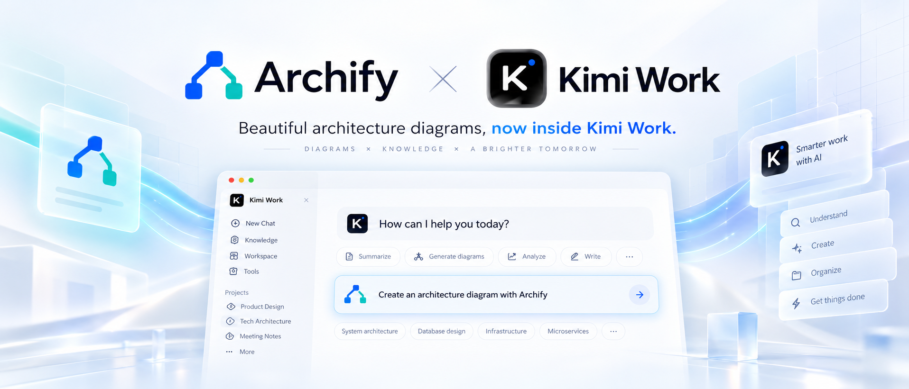</a>
</p>

**Archify × Kimi Work.** Archify'ı Kimi Work plugin mağazasında **Interactive Architecture Diagram** adıyla bulabilirsiniz. Etkileşimli bir diyagram oluşturmak için sisteminizi tek bir cümleyle anlatın. **[Kimi Work'te deneyin →](https://www.kimi.ai/?aff=archify)**

<table>
<tr>
  <td align="center" width="240"><a href="https://supercode.sh/?utm_source=archify"></a><br/><strong><a href="https://supercode.sh/?utm_source=archify">supercode.sh</a></strong></td>
<td><a href="https://supercode.sh/?utm_source=archify">Supercode</a>, Archify'a sponsor oluyor ve token optimizasyonu, özenle seçilmiş Skills ve spec-driven development ile Codex ve Cursor'ı güçlendiriyor. Archify, bir <a href="https://supercode.sh/en/skills/tt-a1i/archify/archify">Supercode Editor’s Choice</a> skill'i olarak öne çıkarılıyor.<br/><br/><a href="https://supercode.sh/en/skills/tt-a1i/archify/archify"></a></td>
</tr>
<tr>
<td align="center" width="240"><a href="https://www.openlux.ai/register?channel=c_qdvanbpc"></a><br/><strong><a href="https://www.openlux.ai/register?channel=c_qdvanbpc">OpenLux</a></strong></td>
<td>Bu projeye sponsor olduğu için OpenLux'a teşekkür ederiz! OpenLux, dünyanın önde gelen sağlayıcılarının lider AI modellerini bir araya getiren, işletmeler için hepsi bir arada bir AI platformudur. Hızlı ve güvenilir hizmeti ile ilgili teknik desteğiyle OpenLux; Claude, OpenAI ve Gemini modelleri için taban fiyatları sırasıyla resmi fiyatların %8,82'sine, %4'üne ve %8'ine kadar düşen seviyelerde sunar.<br/><br/>Archify kullanıcılarına özel teklif: Referans linkimiz üzerinden kaydolun ve kredi yüklemelerinde %7,5'e varan indirimden yararlanın!<br/><br/><a href="https://www.openlux.ai/register?channel=c_qdvanbpc">OpenLux ile başlayın →</a></td>
</tr>
<tr><td align="center" width="240"><a href="https://github.com/EverMind-AI/Raven">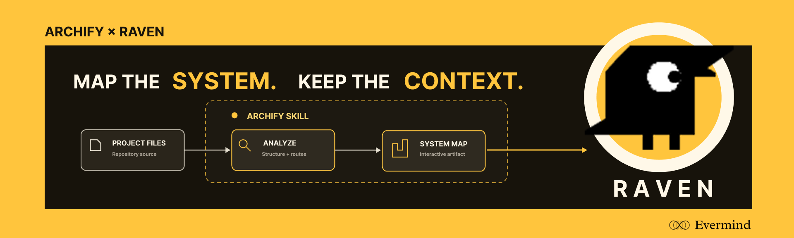</a><br/><strong><a href="https://github.com/EverMind-AI">EverMind</a> · <a href="https://github.com/EverMind-AI/Raven">Raven</a></strong></td><td>EverMind, Archify'a sponsor oluyor ve agent'lar için bellek altyapısı geliştiriyor. <a href="https://github.com/EverMind-AI/Raven"><strong>Raven</strong></a> harness'ı, doğrulanmış ve etkileşimli sistem haritaları için Archify'ı bir Skill olarak destekliyor.</td></tr>
</table>

> Archify'a sponsor olmak mı istiyorsunuz? [Bize e-posta ile ulaşın.](mailto:2801884530@qq.com)

## Önemli olanı gösterin

| Bir agent workflow'unu açıklayın | Bir cache miss'i takip edin | Servis ilişkilerini keşfedin |
|---|---|---|
| [](https://archify.si/gallery/artifacts/agent-tool-call.workflow.html?theme=dark&present=1#focus=planner&reach=downstream) | [](https://archify.si/gallery/artifacts/cache-miss.sequence.html?theme=dark&present=1#route=web~db) | [](https://archify.si/gallery/artifacts/production-deployment.architecture.html?theme=dark&present=1#lens=backend~database) |
| Bir adımın downstream'indeki her şeyi izleyin. | Web uygulamasından veritabanına giden yolu vurgulayın. | Tanımlanmış backend ve veritabanı bağlantılarına odaklanın. |

[Proof Lab](https://archify.si/gallery.html), repository'ye eklenmiş 11 senaryonun tamamını, bunların JSON kaynaklarını ve validation receipt'lerini içerir.

### Gerçek bir repository'yi anlayın

<sub>KOD → DİYAGRAM · Kaynağa dayalı bir sistem haritası</sub>

[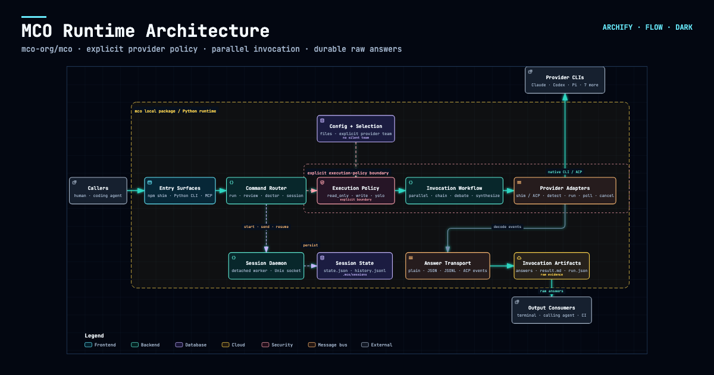](https://archify.si/cases/mco-runtime.architecture.html?theme=dark&present=1)

Archify, [`mco-org/mco`](https://github.com/mco-org/mco) repository'sini `9f1a1cf` commit'inde inceledi ve bu doğrulanmış haritayı üretti. **[Açın ↗](https://archify.si/cases/mco-runtime.architecture.html?theme=dark&present=1)** · [reach'i izleyin ↗](https://archify.si/cases/mco-runtime.architecture.html?theme=dark#focus=router&reach=downstream) · [typed kaynak](docs/cases/mco-runtime.architecture.json)

### Genişletmesi kolay. Kendinize göre uyarlamanın daha fazla yolu.

<sub>TOPLULUK HİKAYELERİ · Kullanıcıların paylaştığı seçme örnekler</sub>

**Diyagram oluşturulduktan sonra da geliştirmeye devam edin.** Archify açık kaynaklıdır ve çıktısı bağımsız (standalone) bir HTML'dir. Agent'ınızdan onu uyarlamasını, faydalı linkler bağlamasını ya da kendi workflow'unuz için etkileşimler eklemesini isteyin. Topluluk çalışmaları şimdiden ekip işbirliğinden seyahat planlamasına, hukuki atıf kontrollerinden sözleşme incelemesine ve incident retrospective'lere kadar uzanıyor. Bunlar yalnızca birkaç örnek.

Bir kullanıcı elle çizilmiş bir multi-agent mimarisiyle başladı, onu etkileşimli bir diyagrama dönüştürdü, ardından sohbet yoluyla bir Kimi execution pool'u ekledi. Diğerleri agent'larından bir projeyi okumasını istedi ve ortaya çıkan mimariyi ekip tartışması için Feishu veya DingTalk'a taşıdı.

Başka bir kullanıcı bir Şanghay CityWalk rehberini dört günlük bir seyahat planına dönüştürdü: günler arasında geçiş yapın, bir durağı inceleyin ve Amap, Xiaohongshu ya da Dianping'e atlayın. Yazar ayrıca varış check-in'leri ve durak notları ekleyerek planı seyahat sırasında kullanılacak küçük bir araca dönüştürdü. Bu eklemeler, topluluk yazarı tarafından bu artifact'e özel olarak yapıldı.

**[▶ Etkileşimli Şanghay CityWalk'u keşfedin](https://archify.si/cases/community/shanghai-citywalk.html)**

[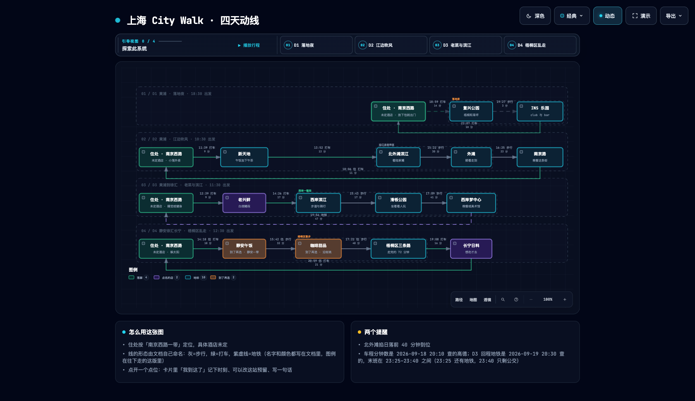](https://archify.si/cases/community/shanghai-citywalk.html)

**[▶ Etkileşimli versiyonu deneyin](https://archify.si/cases/community/shanghai-citywalk.html)** · D1–D4 arasında geçiş yapın ve keşfetmek için bir yere tıklayın.

<sub>Topluluk artifact'i · Şanghay CityWalk · Dört günlük rotalar ve yer linkleri</sub>

### İndirin. Açın. Keşfedin.

Çıktı, kendi kendine yeten (self-contained) bir HTML dosyasıdır. İndirin ve o artifact'te bulunan node ayrıntılarını ve yol keşfini kullanmak için tarayıcınızda açın. Görüntülemek için Archify kurulumu gerekmez. HTML'i başka birine gönderdiğinizde etkileşimler de onunla birlikte gider; harici web siteleri ve harita linkleri için internet bağlantısı gerekir.

**[Şanghay CityWalk'u keşfedin ↗](https://archify.si/cases/community/shanghai-citywalk.html)** · **[HTML'i indirin ↓](https://github.com/tt-a1i/archify/raw/refs/heads/main/docs/cases/community/shanghai-citywalk.html)**

<sub>D1–D4 arasında geçiş yapmayı, bir yer kartını açmayı ya da bir harita linkini takip etmeyi deneyin. Saatler ve yer bilgileri, yazarın orijinal seyahat planını yansıtır.</sub>

## Topluluk ve tanınırlık

- **GitHub Trending'in haftalık, tüm dillerdeki repository listesinde 1 numara.** [Yaratıcının 1 Eylül 2026'da paylaştığı sıralama ekran görüntüsü](https://x.com/t20000622yy/status/2094656813576880285); tüm diller ve “This week” seçili.
- **QbitAI'da yer aldı ve röportaj yapıldı.** [Proje tanıtımı](https://www.qbitai.com/2026/09/482469.html) · [Geliştiricinin hikayesi](https://www.qbitai.com/2026/09/488519.html).
- **Geliştirici topluluklarıyla paylaşıldı.** [midudev'in paylaşımı](https://x.com/midudev/status/2094425974406320207).

<sub>Kamuya açık haberlerden, topluluk paylaşımlarından ve geçmiş kilometre taşlarından bir seçki. Tarihler ve kaynaklar için linkleri takip edin.</sub>

## Önizleme

<details>
<summary>Temalar, dışa aktarımlar ve share card'lar</summary>

Aynı diyagram, iki tema, tek tıkla geçiş:

| Koyu | Açık |
|---|---|
|  |  |

Export menüsü PNG'yi panoya kopyalar ve statik ya da hareketli formatları indirir:

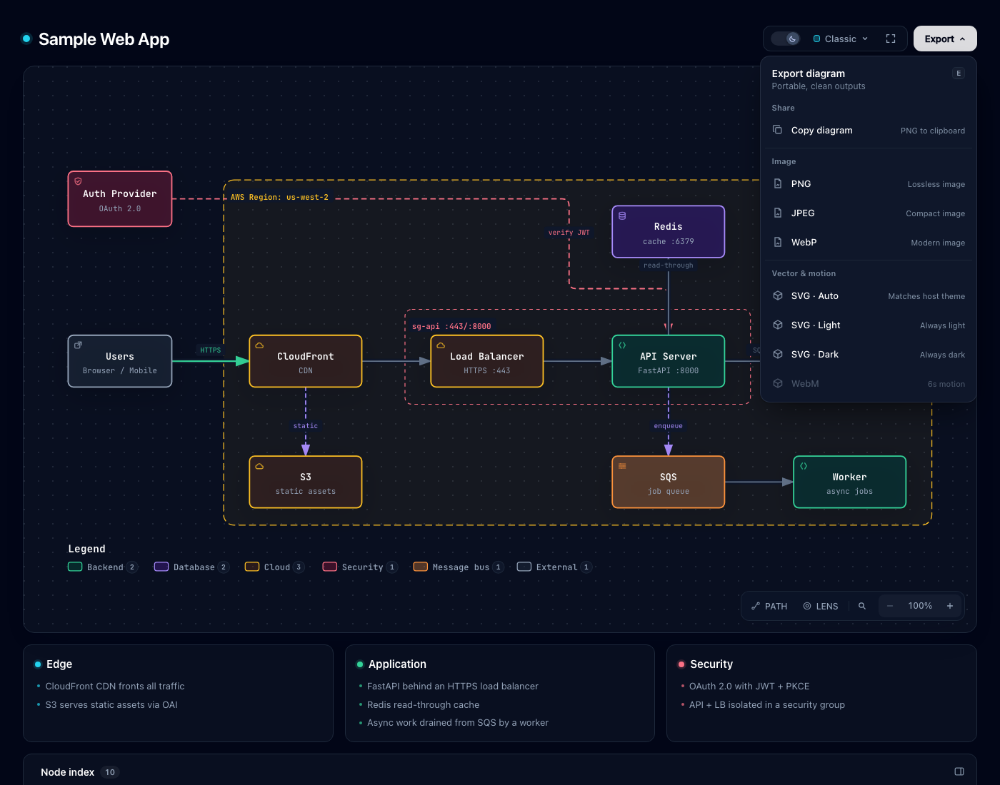

Bir rotayı izledikten sonra **Export → Route Share Card**, o tanımlanmış yolu, bağlam için tam diyagramı da koruyarak 1200×630 boyutunda bir PNG olarak indirir.

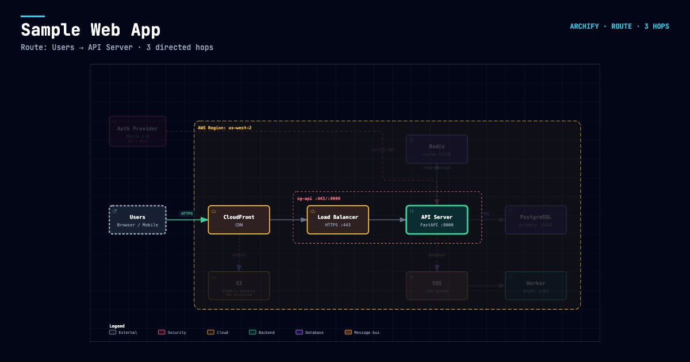

Tanımlanmış `Upstream` veya `Downstream` reach'i izledikten sonra **Export → Reach Share Card**, runtime etkisi iddia etmeden tam olarak o okumayı yakalar.

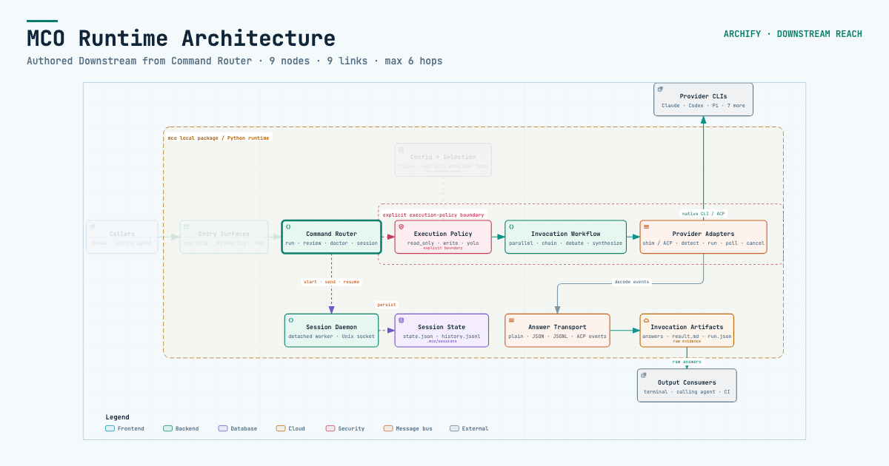

Viewer'ın tamamını denemek için [`examples/web-app.html`](examples/web-app.html) dosyasını yerel olarak açın.

</details>

## Hızlı başlangıç

**Güncel geliştirme sürümü:** `v3.0.2-dev.1`. Bkz. [Changelog](CHANGELOG.md#unreleased).

### 1. Kurulum

```bash
npx skills add tt-a1i/archify -g
```

<details>
<summary>Daha fazla kurulum seçeneği ve güncelleme kontrolü ayrıntıları</summary>

Açık ve etkileşimsiz bir Cursor kurulumu için:

```bash
npx -y skills add tt-a1i/archify --skill archify --agent cursor --global --copy --yes
```

Kurmadan denemek için:

```bash
npx skills use tt-a1i/archify@archify --agent codex
```

[DSH topluluk opt-in](integrations/deepseek-harness/README.md): `dsh plugin --profile web add @tt-a1i/archify-dsh@1.0.0`

[Agent switcher](https://archify.si/start.html?agent=cursor&type=architecture); `cursor`, `codex`, `claude-code` ve `opencode` seçeneklerini kapsar.

Archify, yalnızca isteğe bağlı bir hatırlatma göstermek amacıyla sabit stable manifest'e GET isteği gönderebilir; güncellemeleri asla indirmez veya kurmaz. Başarılı kontrollerden sonra yaklaşık 24 saat (±%20) beklenir; aktif kullanımda başarısız kontroller 6, ardından 24 saat sonra yeniden denenir. Sunucu normal HTTP meta verilerini (IP ve zaman) görür, ancak sürüm, Agent, proje verisi, prompt, hesap/cihaz kimliği veya ETag almaz. Güncelleyip güncellemeyeceğinize ve ne zaman güncelleyeceğinize siz karar verirsiniz. Ağ erişimini ve hatırlatma durumu yazımlarını devre dışı bırakmak için `ARCHIFY_UPDATE_CHECK_DISABLED=1` ayarlayın.

</details>

### Güncel kalın

- **Sürüm bildirimleri alın:** bu GitHub repository'sinin üst kısmında **Watch → Custom → Releases** seçeneğini seçin. Projeye yıldız vermek sizi sürüm bildirimlerine abone etmez.
- **Nelerin değiştiğini görün:** [Sürüm notları](https://github.com/tt-a1i/archify/releases).
- **Bir feed okuyucu kullanın:** [Sürüm feed'ine abone olun](https://github.com/tt-a1i/archify/releases.atom).

Güncelleme kontrolcüsüne sahip kurulumlar, diyagram teslimi sırasında daha yeni kararlı sürümleri de kontrol eder ve bir hatırlatma gösterebilir. Kontrolcü bulunmayan eski kurulumların bu özelliği kazanması için manuel güncelleme gerekir. Yükseltip yükseltmeyeceğinize ve ne zaman yükselteceğinize siz karar verirsiniz; Archify güncellemeleri asla otomatik olarak kurmaz.

### 2. Bir açıklamayla başlayın — repository gerekmez

```text
Use Archify to draw: Browser -> API -> Redis cache -> PostgreSQL fallback.
```

Kaynağa dayalı kanıt için bir repository açın ve şunu isteyin:

```text
Analyze this repository, then use archify to create a high-level runtime architecture diagram.
Show 8–12 core components, one primary path, external dependencies, and trust boundaries.
Put supporting detail in cards instead of adding more edges.
```

### 3. Sohbette iyileştirin

`add Redis`, `move auth to the left` veya `highlight the rollback path` gibi odaklı isteklerle devam edin. Archify, hedefli yinelemeler için typed kaynağı erişilebilir tutar.

## Doğru diyagramı seçin

<details>
<summary>Beş diyagram türü, mimari karşılaştırmaları ve örnekler</summary>


| Tür | En uygun olduğu alanlar | Prompt'unuza ekleyin |
|---|---|---|
| **Architecture** | Bileşenler, servisler, depolama, sınırlar | Kapsam, temel bileşenler, ana yol |
| **Workflow** | CI/CD, onaylar, tool call'lar, runbook'lar | Katılımcılar, sıra, dallanmalar, istisnalar |
| **Sequence** | API çağrıları, cache fallback, auth, async trace'ler | Çağıranlar, çağrılanlar, dönüş değerleri, zamanlama |
| **Data Flow** | Pipeline'lar, lineage, PII, consumer'lar | Kaynaklar, dönüşümler, depolar, sınırlar |
| **Lifecycle** | Durumlar, retry'lar, beklemeler, terminal sonuçlar | Durumlar, olaylar, retry ve iptal yolları |

Architecture'ın isteğe bağlı `deployment-ownership` profili; tanımlanmış sahipler, bölge yerleşimi, private veritabanı kapsamı veya adlandırılmış geçişler eksik olduğunda fail-closed davranır; asla örtük olarak devreye girmez ve canlı altyapıyı incelemez. Bkz. [doğrulanmış deployment kanıtı](https://archify.si/gallery.html#proof-deployment-ownership).

Tasarım veya PR incelemesi için Architecture Delta, doğrulanmış Before / Delta / After snapshot'larını makine tarafından okunabilir bir receipt ile karşılaştırır. Tanımlanmış bir değişikliği seçin ya da sonlu, yalnızca viewer'da çalışan bir Review oynatın; etki, risk veya merge güvenliği hakkında çıkarım yapmaz.

`node archify/bin/archify.mjs compare architecture base.json head.json architecture-delta.html --json`

[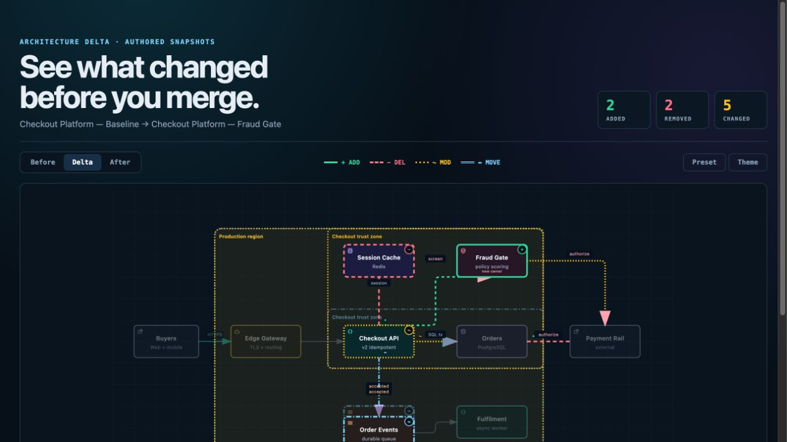](examples/checkout-platform-delta.html)

Hangisinin uygun olduğundan emin değil misiniz? [Etkileşimli senaryo rehberini](https://archify.si/guide.html) kullanın ya da sıfır bağımlılıklı CLI'a sorun:

```bash
node archify/bin/archify.mjs guide "Show an API request with Redis cache miss"
node archify/bin/archify.mjs guide "Map Kafka topics, consumer groups, replay, and DLQ" --json
```

Workflow, lane'ler boyunca happy path'i net tutar:

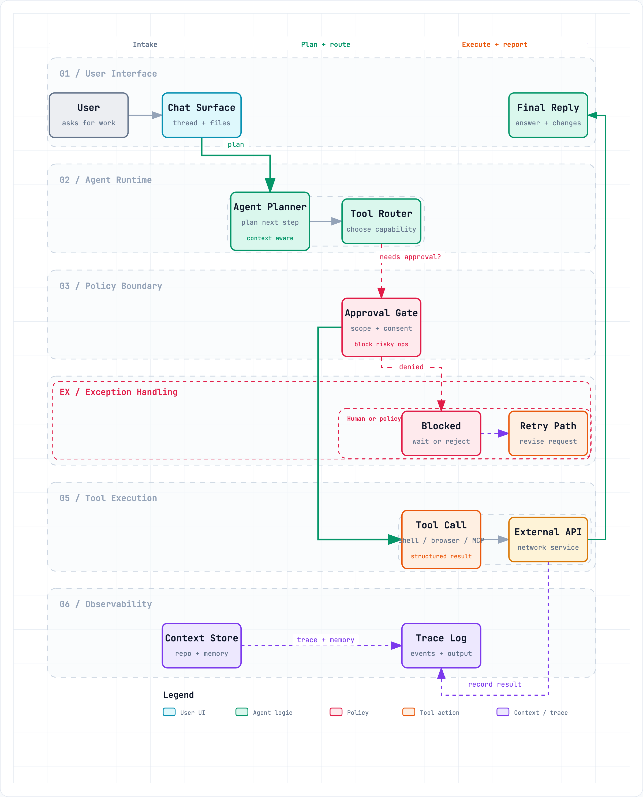

Sequence, tek bir etkileşimi zaman içinde açıklar:

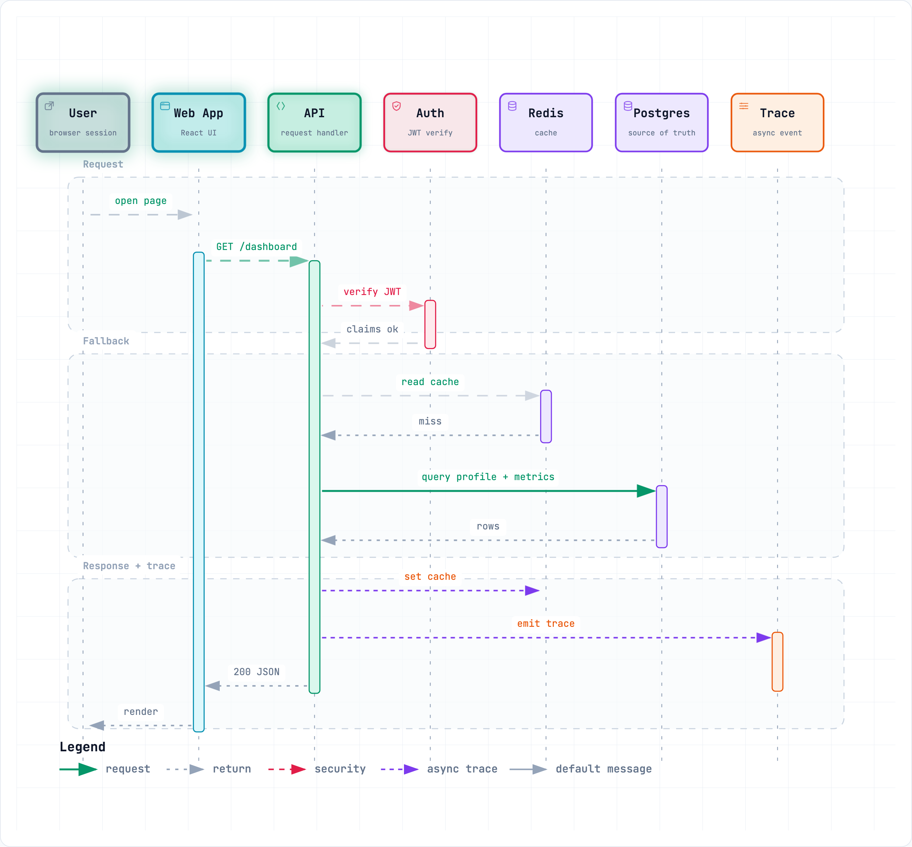

Data Flow, veri hareketini ve hassasiyet sınırlarını açık hale getirir:

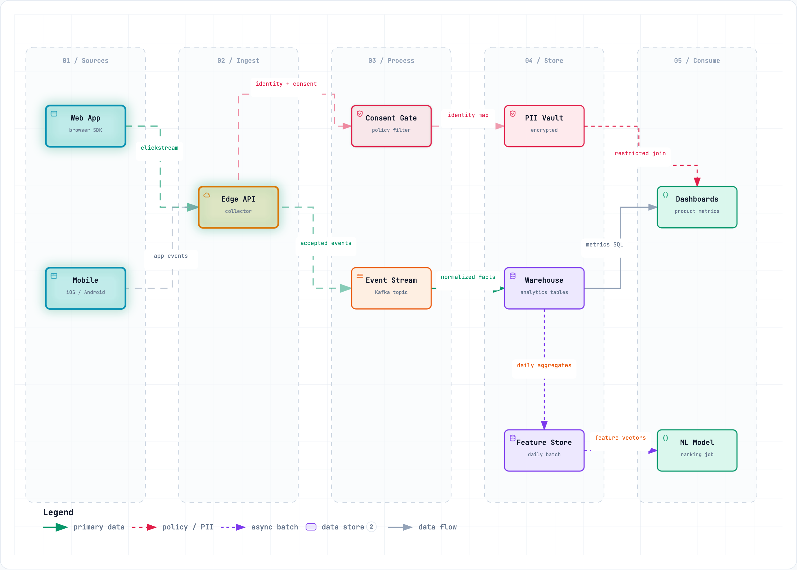

Lifecycle; ilerlemeyi, beklemeleri, retry'ları ve terminal sonuçları birbirinden ayırır:

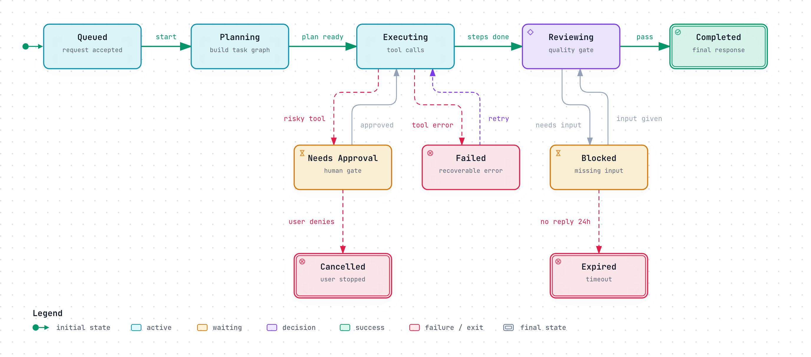

Architecture örnekleri: [`web-app`](examples/web-app.html) · [`Archify pipeline`](examples/archify-repo.html) · [`grid placement`](examples/archify-repo-grid.html) · [`desktop agent`](examples/maka-architecture.html)

</details>

## Neden Archify

| Yapıyı anlayın | Hikayeyi adım adım izleyin |
|---|---|
| Bileşenleri, workflow'ları ve ilişkileri koddan ya da bir açıklamadan haritalayın. | Node'ları keşfedin, yolları takip edin ve herhangi bir görünümü link olarak paylaşın. |
| **Kendi yönteminizle genişletin** | **Sonucu paylaşın** |
| Düzenlenebilir bir kaynak tutun; açık kaynak kodun ya da üretilen HTML'in üzerine kendi etkileşimlerinizi ve kullanım senaryolarınızı inşa edin. | Kendi kendine yeten bir HTML dosyası paylaşın ya da görsel, video ve share card olarak dışa aktarın. |

<details>
<summary>Deneyimin arkasındaki mühendislik</summary>


- **Genel amaçlı auto-layout yerine layout muhakemesi** — hiyerarşiyi, boşlukları, rotaları ve vurguyu agent seçer; paylaşılan otomatik uç noktalar, okları tek bir orta noktaya yığmak yerine deterministik olarak dağıtılır.
- **Typed JSON IR** — renderer destekli her modun bir şeması ve yeniden üretilebilir bir kaynağı vardır.
- **Teslimden önce atomik doğrulama** — bir showcase artifact'i son bilinen iyi çıktının yerini almadan önce şema, layout, HTML/SVG, rota ve etiket-rota mesafesi kontrollerinin tamamı geçmelidir.
- **Hatalar bir repair receipt ile gelir** — `validate --json` ve `deliver --json`, bir Node stack trace'i ya da yapılandırılmamış bir yeniden deneme tahmini yerine kararlı kural kodlarını, tam konuyu (subject), ölçülmüş kanıtı ve yalnızca desteklenen onarım kontrollerini döndürür.
- **Last-good canlı önizleme** — isteğe bağlı bir masaüstü döngüsü tek bir JSON dosyasını izler, yalnızca en son aday tüm kontrollerden geçtikten sonra yenilenir ve bir kayıt eksik ya da geçersiz olduğunda önceki doğrulanmış diyagramı görünür tutar.
- **Dürüst etkileşim** — focus, upstream/downstream reach, kesin rotalar, rol karşılaştırması ve hikayeler; topoloji uydurmak ya da runtime etkisi iddia etmek yerine tanımlanmış node'ları ve ilişkileri yeniden kullanır.
- **Kaynak kanıtı, yalnızca istendiğinde** — kanıta dayalı Architecture node'ları kendilerini `SRC n` ile işaretler ve tek bir public commit'e sabitlenmiş, Git ile doğrulanmış dosyaları ve satır aralıklarını açar; sıradan artifact'ler kaynaksız kalır.
- **Varsayılan olarak taşınabilir** — sonuç tek bir HTML dosyasıdır; dışa aktarımlar diyagramın tamamını içerir ve geçici viewer durumundan arındırılmıştır.

Archify genel amaçlı bir çizim editörü ya da bir Mermaid teması değildir. Teknik niyeti bir iletişim artifact'ine dönüştürür.

</details>

## Nasıl çalışır

<details>
<summary>Üretim, doğrulama, önizleme ve teslim ayrıntıları</summary>

| Adım | Ne olur |
|---|---|
| **Generate** | Agent, açıklamanızdan typed JSON IR oluşturur. |
| **Validate** | Paketle gelen validator'lar ve layout kuralları kaynağı kontrol eder; hatalar, makine tarafından okunabilir JSON içinde gereken yerel onarımı tam olarak belirtir. |
| **Preview (isteğe bağlı)** | Yalnızca loopback üzerinde çalışan bir masaüstü oturumu tek bir kaynağı izler ve yalnızca doğrulanmış revizyonları yeniden yükler; hata durumunda last-good artifact korunur. |
| **Deliver** | Aynı dizinde bir aday render edilir ve kontrol edilir; yalnızca kontrollerden geçen bir artifact hedefin yerini atomik olarak alır, ardından isteğe bağlı `--open` tam olarak o dosyayı açar. |
| **Iterate** | Agent kaynağı güncellerken ilgisiz yapı sabit kalır. |

Faydalı repository komutları:

```bash
cd archify
node bin/archify.mjs doctor
node bin/archify.mjs demo /tmp/archify-demo
node bin/archify.mjs guide "Show CI/CD checks, approval, deploy, and rollback"
node bin/archify.mjs validate workflow examples/agent-tool-call.workflow.json --quality showcase --json
node bin/archify.mjs preview workflow examples/agent-tool-call.workflow.json /tmp/workflow.html --quality showcase
node bin/archify.mjs deliver workflow examples/agent-tool-call.workflow.json /tmp/workflow.html --quality showcase --open --json
```

`preview`, yalnızca loopback üzerinde çalışan, açıkça çağrılan bir masaüstü modudur: rastgele bir `127.0.0.1` portunda tek bir JSON dosyasını izler, hatalar boyunca son doğrulanmış çıktıyı korur, Ctrl-C ile durur ve üretilen HTML'e herhangi bir runtime eklemez. Testler veya URL'yi elle açmak için `--no-open` kullanın.

`deliver --open`, commit'ten sonra isteğe bağlı, tek seferlik bir handoff'tur. Açma işleminin başarısız olması başarılı sonucu değiştirmez; JSON stdout'ta kalır ve mutlak yedek yol stderr'e yazılır.

Hata durumunda `validate --json` ve `deliver --json` tek bir JSON nesnesi üretir. Skill'in iki düzeltme turu içinde, her `diagnostics[]` konusu için yalnızca `supportedFixes` değerlerini uygulayın; görsel inceleme ayrı kalır.

Ayarlar:

```json
{
  "meta": {
    "locale": "en",
    "animation": "trace",
    "visual_preset": "signal-flow"
  }
}
```

`meta.locale`; sayfa başlığını, Legend'ı, durumları/hataları, a11y'yi ve HTML/SVG `lang` değerini yerelleştirir—tanımlanmış içeriği asla değiştirmez. `en`, `zh-CN`, `zh-TW`, `es` ve `ko` paketle birlikte gelir ve yalnızca `meta.locale` gerektirir; `meta.translations` (kanonik mesaj anahtarı → çevrilmiş metin) tek tek anahtarları geçersiz kılar ve dilin geri kalanını korur. Diğer diller kendi kataloglarını burada sağlar (bkz. `archify/examples/locales/`), aksi halde renderer İngilizceye geri döner ve bunu belirtir. Statik çıktıda `animation` atlanır; varsayılan değer `classic`'tir.

</details>

## Çıktıyı keşfedin ve paylaşın

| Eylem | Kontrol |
|---|---|
| Olgulara dayalı Diagram Guide'ı açın | <kbd>?</kbd> |
| Semantik bir node bulun ve ona odaklanın | <kbd>/</kbd> |
| Tanımlanmış upstream/downstream reach'i izleyin | Bir node'a odaklanın → `Upstream` / `Downstream` |
| Yönlü bir rotayı yoklayın ve yolculuğunu inceleyin | <kbd>R</kbd> veya `PATH` |
| Bir veya iki semantik rolü karşılaştırın | <kbd>L</kbd> veya `LENS` |
| Canlı genel bakış radarını açın | <kbd>M</kbd> veya `MAP` |
| Presentation Stage'e girin | <kbd>F</kbd> |
| Görsel stil seçin (`S` stiller arasında döner) / temayı değiştirin / Export'u açın | <kbd>S</kbd> / <kbd>T</kbd> / <kbd>E</kbd> |
| Yakınlaştırın veya sıfırlayın | <kbd>+</kbd> / <kbd>-</kbd> / <kbd>0</kbd> |

Kalıcı linkler `#focus=<id>`, `#focus=<id>&reach=upstream|downstream`, `#relation=<id>`, `#route=<source>~<target>` ve `#lens=<kind>~<kind>` durumlarını geri yükleyebilir. Okuyucunun tetiklediği hareket sonludur, `prefers-reduced-motion` ayarına uyar ve kanonik dışa aktarımlara asla dahil edilmez.

Eksiksiz üretim ve viewer sözleşmesi [`archify/SKILL.md`](archify/SKILL.md) dosyasındadır.

## Kurulum seçenekleri

| Ortam | Kurulum konumu veya yöntemi | Yetenek |
|---|---|---|
| **Claude Code** | `~/.claude/skills/` veya `.claude/skills/` | Tam renderer + doğrulama workflow'u |
| **Codex CLI** | `~/.agents/skills/` veya `.agents/skills/` | Tam renderer + doğrulama workflow'u |
| **opencode** | `~/.config/opencode/skills/`, `.opencode/skills/` veya `.agents/skills/` | Tam renderer + doğrulama workflow'u |
| **Claude.ai** | Settings → Capabilities → Skills altında `archify.zip` dosyasını yükleyin | Sandbox'taki Node.js erişimine bağlıdır |
| **Project Knowledge** | `archify.zip` dosyasını projeye yükleyin | Prompt odaklı mimari fallback'i |
| **Hermes Agent** | Opt-in: `hermes skills install skills-sh/tt-a1i/archify/archify -y` | Topluluk tarafından sağlanan, yalnızca Skill içeren entegrasyon; Node `>=18`; resmi bir Nous ürünü değildir. Telemetri yok. Switcher hedefi değildir. [Ayrıntılar](integrations/hermes-agent/README.md). |
| **DeepSeek Harness** | Opt-in: `dsh plugin --profile web add @tt-a1i/archify-dsh@1.0.0`. Çağırma: `Use the archify skill to map this repository's runtime architecture.` Kaldırma: `dsh plugin --profile web remove @tt-a1i/archify-dsh`. | Developer-preview `@deepseek-ai/dsh@0.1.2-rc.1` için topluluk entegrasyonu; Node `^22.19.0 \|\| >=24.0.0`; resmi bir DeepSeek ürünü değildir. Telemetri yok. Shell dosyaları Web Produced Files değil, tam workspace yolları gerektirir. [Ayrıntılar](integrations/deepseek-harness/README.md). |

## Referans ve kapsam

- [Şema referansı](archify/schemas/README.md) · [Skill](archify/SKILL.md) · [Örnekler](archify/examples/) · [Agent cookbook](docs/authoring-cookbook.md)
- [Changelog](CHANGELOG.md)
- [Roadmap](ROADMAP.md)
- [Üretilmiş Proof Lab](https://archify.si/gallery.html)

Otomatik Mermaid ayrıştırma, genel amaçlı auto-layout, hosted paylaşım ve WYSIWYG düzenleme bilinçli olarak mevcut kapsamın dışında tutulmuştur.

## Topluluk

👋 **Archify Topluluğuna hoş geldiniz!**

Diğer kullanıcılar ve geliştiricilerle bağlantı kurun, fikirlerinizi paylaşın, özellik isteyin, hata bildirin, geliştirme hakkında tartışın ve Archify'ı birlikte daha iyi hale getirmeye yardımcı olun.

-  [Discord](https://discord.gg/6xWMjgCeUq)
-  WeChat: aşağıdaki QR kodunu tarayın. WeChat grup kodlarının süresi düzenli olarak dolar; bu kodun süresi dolmuşsa güncel kodu Discord veya QQ üzerinden isteyin.
-  QQ grubu: `1121948602`

<table>
<tr>
  <td align="center"><strong> WeChat</strong><br/></td>
  <td align="center"><strong> QQ</strong><br/>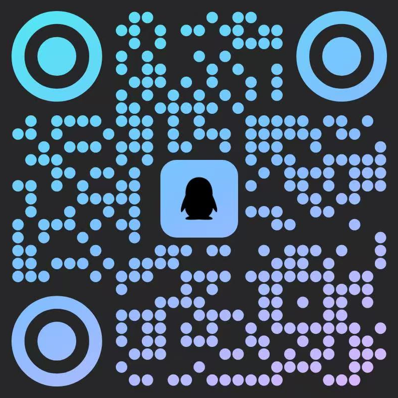</td>
</tr>
</table>

## Lisans

[MIT](LICENSE) — kullanmak, değiştirmek ve dağıtmak serbesttir.

## Katkıda bulunma

Archify üzerine bağımsız bir paket mi geliştiriyorsunuz? [Topluluk kataloğuna gönderin](community/README.md#submitting-a-package); rehber, açılır kapanır bir örnek ve eksiksiz Çince adımlar içerir.

Issue'lar, pull request'ler ve gerçek dünyadan diyagramlar memnuniyetle karşılanır. [Katkı rehberiyle](CONTRIBUTING.md) başlayın, hatalar için yeniden üretilebilir bug formunu kullanın ya da doğrulanmış bir diyagramı [topluluk showcase formu](https://github.com/tt-a1i/archify/issues/new?template=showcase.yml) aracılığıyla gönderin.&nbsp;·&nbsp;[LINUX&nbsp;DO](https://linux.do)

## Archify'ı destekleyin

Archify işinize yaradıysa, sürekli gelişimine destek olabilirsiniz. Projenin devam etmesine yardımcı olduğunuz için teşekkürler ❤️

<details>
<summary>WeChat Pay ile destek olun</summary>

Aşağıdaki QR kodunu WeChat ile tarayın ya da kaydedip taramak için WeChat'te açın.

<p align="center"></p>

</details>

<details>
<summary>Alipay ile destek olun</summary>

Aşağıdaki QR kodunu Alipay ile tarayın ya da kaydedip taramak için Alipay'de açın.

<p align="center"></p>

</details>

Archify'ı kullanmak, paylaşmak, hata bildirmek ve iyileştirmelere katkıda bulunmak da yardım etmenin yollarıdır.

## Star History

<p align="center"><picture><source media="(prefers-color-scheme: dark)" srcset="https://raw.githubusercontent.com/tt-a1i/archify/star-history/assets/star-history-dark.svg" /></picture></p>
