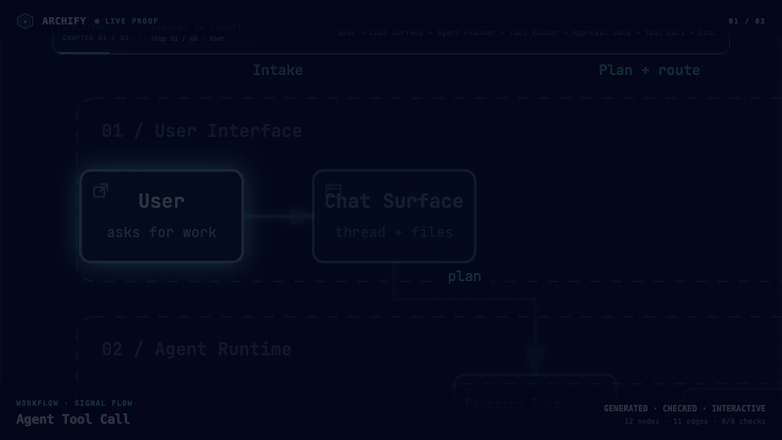
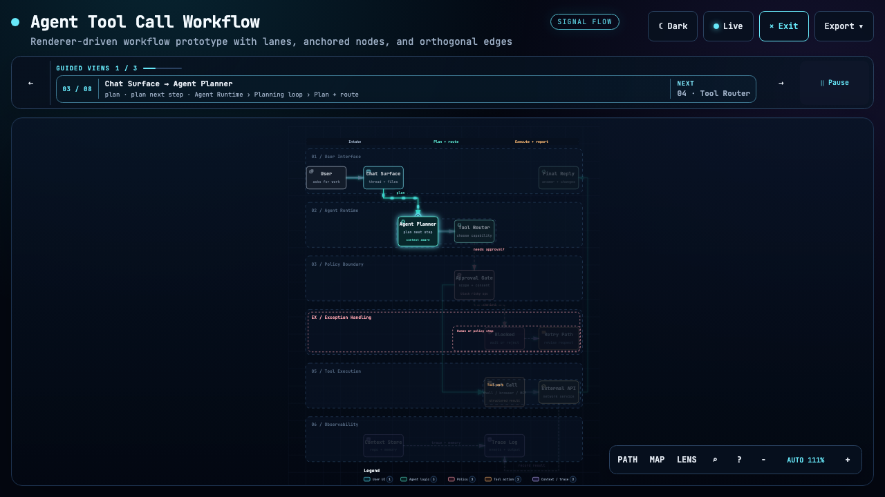
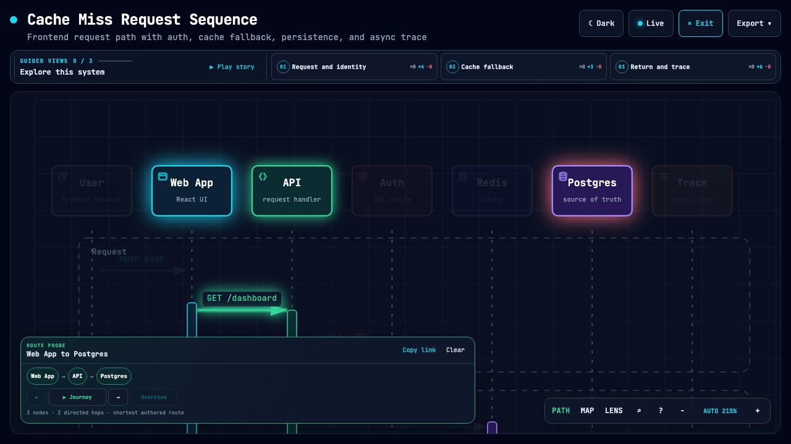
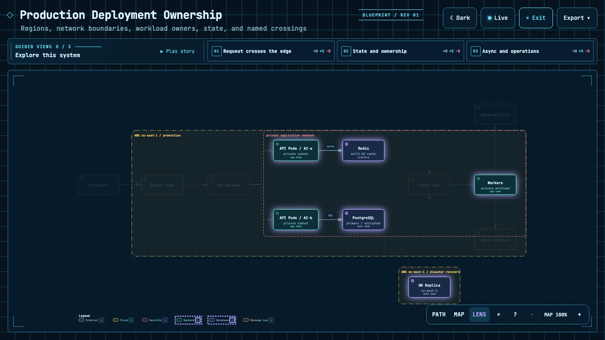
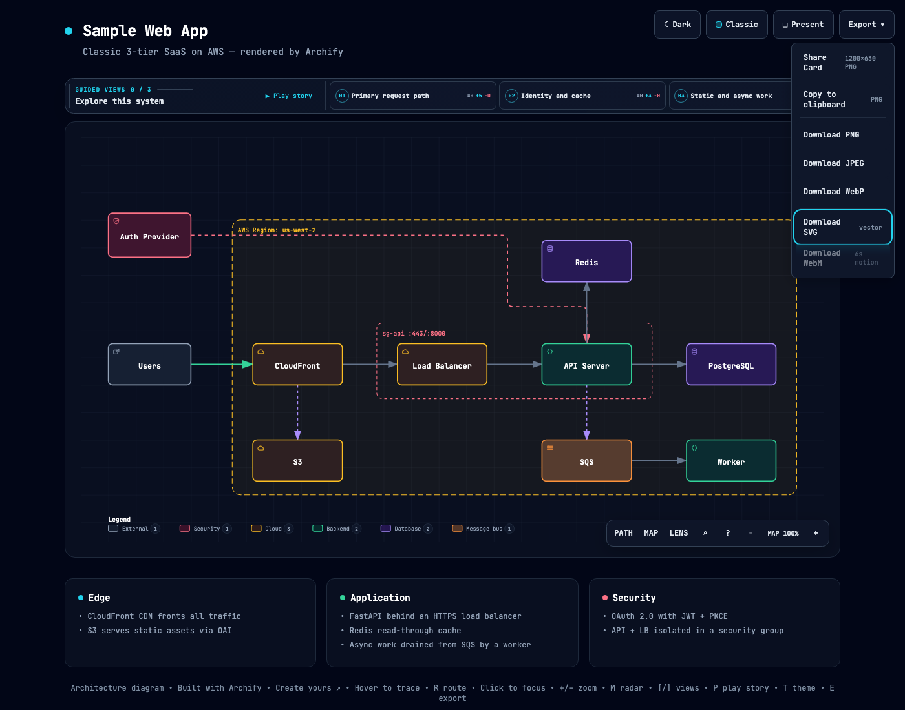
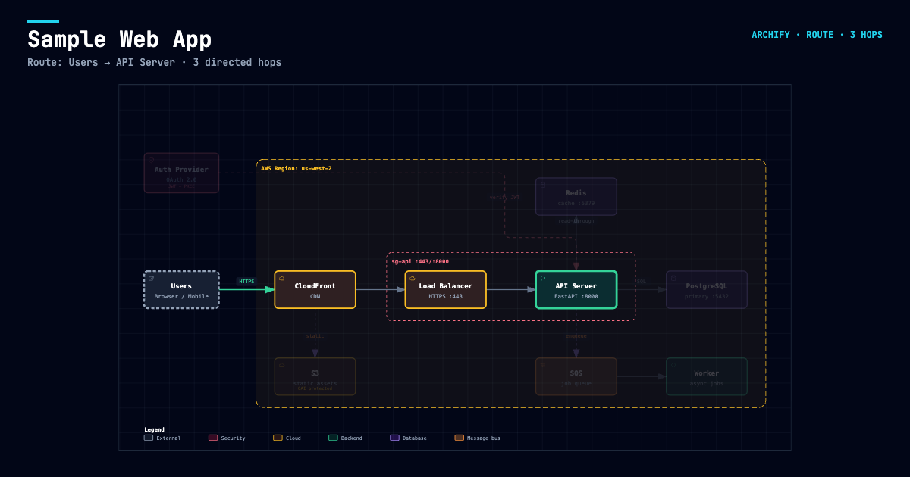

<p align="center">
  <a href="./README.md">English</a> · <strong>简体中文</strong>
</p>


# Archify

**在对话里，把自然语言描述变成漂亮、可靠的架构图、工作流图、时序图、数据流图和生命周期图。**

Archify 是一个可用于 Claude、Codex CLI 和 opencode 的 Agent Skill。它生成单文件 HTML 技术图：浏览器直接打开，可切换深浅主题、聚焦探索真实拓扑，并导出清晰的静态或动态结果。

- **五种图表类型** —— Architecture、Workflow、Sequence、Data Flow、Lifecycle
- **三套实时视觉预设** —— 先确定作者默认风格，再在同一拓扑上试穿 `classic`、`signal-flow` 或 `blueprint`
- **探索真实拓扑** —— 查找节点、检查关系、探查路径、对比角色、播放引导故事
- **动态默认关闭** —— 只有显式设置 `meta.animation: "trace"` 才启用动态
- **便携导出** —— 一键生成、复制或下载 1200×630 Share Card；把已解析路径导出为聚焦的 Route Share Card；也可导出 PNG / JPEG / WebP / 双主题 SVG / WebM
- **Typed + Checked** —— Typed JSON IR、内置 Schema 校验、默认语义安全门禁和可选构图档位
- **结果完全独立** —— 一个 HTML 文件即可查看和分享，不依赖 Viewer 服务
- **适合 Agent 工作流** —— 安装一次，通过对话持续生成和细调；需要时只打开已经验证的最终成品


**[在线项目页](https://tt-a1i.github.io/archify/)** · **[场景选图指南](https://tt-a1i.github.io/archify/guide.html)** · **[Proof Lab](https://tt-a1i.github.io/archify/gallery.html)**

```bash
npx skills add tt-a1i/archify -g
```

然后告诉 Agent：`使用 archify 梳理这个仓库的运行时架构。`

## 2.11 交互演示

下面都是真实生成的 Archify 成品，不是产品效果图。点击画面即可打开对应的可分享交互状态。

<p align="center">
  <a href="https://tt-a1i.github.io/archify/gallery.html"></a>
  <br/>
  <sub><strong>三个真实生成、校验通过的成品。</strong> Signal Flow · Blueprint · Classic · <a href="https://tt-a1i.github.io/archify/gallery.html">打开可交互验证作品集 ↗</a></sub>
</p>

| 引导故事 | 路径探查 | 语义角色对比 |
|---|---|---|
| [](https://tt-a1i.github.io/archify/gallery/artifacts/agent-tool-call.workflow.html?theme=dark&present=1&play=1#view=happy-path) | [](https://tt-a1i.github.io/archify/gallery/artifacts/cache-miss.sequence.html?theme=dark&present=1#route=web~db) | [](https://tt-a1i.github.io/archify/gallery/artifacts/production-deployment.architecture.html?theme=dark&present=1#lens=backend~database) |
| 播放一次有限的命名章节。 | 检查最短的作者有向路径。 | 对比语义角色之间的真实流量。 |

[Proof Lab](https://tt-a1i.github.io/archify/gallery.html) 收录全部 11 个仓库内场景、JSON 源、命名视图和校验回执。

## 预览

同一张图，两套主题，一键切换：

| 深色 | 浅色 |
|---|---|
|  |  |

Export 菜单支持复制 PNG，并下载静态或动态格式：



路径解析完成后，打开 **Export → Route Share Card**，即可把这条真实有向路径下载为 1200×630 PNG，同时保留完整拓扑作为上下文。它是可选、仅下载的 Share Card 变体；普通导出仍保持 canonical。



在本地打开 [`examples/web-app.html`](examples/web-app.html)，即可体验完整 Viewer。

## 快速开始

### 1. 安装

```bash
npx skills add tt-a1i/archify -g
```

如果只想临时体验：

```bash
npx skills use tt-a1i/archify@archify --agent codex
```

需要时可以把 `codex` 换成 `claude-code` 或 `opencode`。仓库内的 [`archify.zip`](archify.zip) 也不需要执行 `npm install`。

### 2. 先画一个边界清楚的视图

```text
分析这个仓库，然后使用 archify 生成一张高层运行时架构图。
只保留 8–12 个核心组件，突出一条主要路径，并标出外部依赖与信任边界。
辅助信息放进说明卡片，不要继续增加连线。
```

如果只想解释一条调用链：

```text
使用 archify 画出这条登录流程：Browser -> Web App -> API -> JWT 校验 ->
Redis Session 查询 -> PostgreSQL 回源。把缓存未命中作为次要路径。
```

### 3. 在对话中细调

继续说：`增加 Redis`、`把鉴权移到左侧`、`突出回滚路径`。Archify 会保留 Typed Source，只修改相关部分。

## 选择合适的图表

| 类型 | 最适合 | Prompt 中应包含 |
|---|---|---|
| **Architecture** | 组件、服务、存储和系统边界 | 范围、核心组件、主要路径 |
| **Workflow** | CI/CD、审批、工具调用、Runbook | 参与者、顺序、分支、异常 |
| **Sequence** | API 调用、缓存回源、鉴权、异步链路 | 调用方、被调用方、返回、时序 |
| **Data Flow** | 数据管线、血缘、PII、下游消费者 | 来源、转换、存储、边界 |
| **Lifecycle** | 状态、重试、等待、终态 | 状态、事件、重试与取消路径 |

不知道选哪一种？打开[交互式场景指南](https://tt-a1i.github.io/archify/guide.html)，或直接询问零依赖 CLI：

```bash
node archify/bin/archify.mjs guide "展示带 Redis 缓存未命中的 API 请求"
node archify/bin/archify.mjs guide "梳理 Kafka Topic、消费者组、重放和死信队列" --json
```

Workflow 用泳道保持主路径清晰：


Sequence 解释一次交互随时间如何推进：


Data Flow 突出数据移动和敏感边界：


Lifecycle 区分正常进展、等待、重试和终态：


Architecture 示例：[`Web App`](examples/web-app.html) · [`Archify Pipeline`](examples/archify-repo.html) · [`Grid 布局`](examples/archify-repo-grid.html) · [`桌面 Agent`](examples/maka-architecture.html)

## 为什么用 Archify

- **用布局判断代替通用自动布局** —— Agent 根据故事选择层级、留白、线路和强调关系；共享的自动端点会确定性展开，不再让多支箭头堆在同一个中点。
- **Typed JSON IR** —— 每种 Renderer 模式都有 Schema 和可复现的源文件。
- **原子交付前校验** —— Schema、布局、HTML/SVG、线路和标签到其他路径的净空检查必须全部通过，Showcase 成品才会替换上一份可信结果。
- **交互不编造拓扑** —— 聚焦、路径、角色对比和故事都复用作者定义的节点与关系。
- **结果默认便携** —— 一个 HTML 文件即可分享；导出永远是完整原图，不携带临时 Viewer 状态。可选的 `--with-source` 能把它变成可继续编辑的交接件。

Archify 不是通用绘图编辑器，也不是 Mermaid 主题；它负责把技术意图变成可交流的成品。

## 工作原理

| 步骤 | 发生什么 |
|---|---|
| **生成** | Agent 根据描述创建 Typed JSON IR。 |
| **校验** | 内置 Validator 和布局规则检查源文件。 |
| **交付** | 在目标同目录生成并检查候选；只有通过门禁的结果才原子替换目标文件，随后可选用 `--open` 打开这个确切成品。 |
| **迭代** | Agent 修改源文件，不干扰无关结构。 |

仓库常用命令：

```bash
cd archify
node bin/archify.mjs doctor
node bin/archify.mjs demo /tmp/archify-demo
node bin/archify.mjs guide "展示 CI/CD 检查、审批、部署和回滚"
node bin/archify.mjs validate workflow examples/agent-tool-call.workflow.json --quality showcase --json
node bin/archify.mjs deliver workflow examples/agent-tool-call.workflow.json /tmp/workflow.html --quality showcase --open --json
```

`--open` 只适合本地交互式交付。它默认关闭，并且只在验证成品原子提交后执行；系统无法打开时，交付仍保持成功，JSON 只写 stdout，stderr 会给出可手动打开的绝对路径。

源 JSON 默认不会进入 HTML。只有收件人需要继续编辑时才添加 `--with-source`，此时可从 **Export → Source JSON** 下载通过校验的 JSON；图片、SVG、WebM 和 Share Card 导出仍然不携带源数据。

动态和演示样式需要显式选择：

```json
{
  "meta": {
    "animation": "trace",
    "visual_preset": "signal-flow"
  }
}
```

不设置 `animation` 时结果完全静态；`classic` 始终是默认视觉预设。

## 探索与分享

| 操作 | 控制方式 |
|---|---|
| 打开事实型 Diagram Guide | <kbd>?</kbd> |
| 查找并聚焦语义节点 | <kbd>/</kbd> |
| 探查有向路径并逐站检查 | <kbd>R</kbd> 或 `PATH` |
| 对比一种或两种语义角色 | <kbd>L</kbd> 或 `LENS` |
| 打开实时全局雷达 | <kbd>M</kbd> 或 `MAP` |
| 播放故事 / 切换章节 | <kbd>P</kbd> / <kbd>[</kbd> <kbd>]</kbd> |
| 进入 Presentation Stage | <kbd>F</kbd> |
| 切换视觉风格 / 主题 / 打开 Export | <kbd>S</kbd> / <kbd>T</kbd> / <kbd>E</kbd> |
| 缩放或复位 | <kbd>+</kbd> / <kbd>-</kbd> / <kbd>0</kbd> |

稳定链接可以恢复 `#focus=<id>`、`#relation=<id>`、`#route=<source>~<target>`、`#lens=<kind>~<kind>` 和 `#view=<view-id>`。读者触发的动态有限运行、遵守 `prefers-reduced-motion`，并且不会进入标准导出。

完整生成与 Viewer 契约请查看 [`archify/SKILL.md`](archify/SKILL.md)。

## 安装方式

| 使用位置 | 安装位置或方法 | 能力 |
|---|---|---|
| **Claude Code** | `~/.claude/skills/` 或 `.claude/skills/` | 完整 Renderer + Validation 工作流 |
| **Codex CLI** | `~/.agents/skills/` 或 `.agents/skills/` | 完整 Renderer + Validation 工作流 |
| **opencode** | `~/.config/opencode/skills/`、`.opencode/skills/` 或 `.agents/skills/` | 完整 Renderer + Validation 工作流 |
| **Claude.ai** | Settings → Capabilities → Skills 中上传 `archify.zip` | 取决于沙箱是否提供 Node.js |
| **Project Knowledge** | 把 `archify.zip` 上传到项目 | Prompt 驱动的 Architecture Fallback |

Claude.ai 中的上传入口：


## 参考与边界

- [Schema 说明](archify/schemas/README.md)
- [Skill 与 Renderer 契约](archify/SKILL.md)
- [示例](archify/examples/)
- [版本历史](CHANGELOG.md)
- [路线图](ROADMAP.md)
- [自动生成的 Proof Lab](https://tt-a1i.github.io/archify/gallery.html)

Archify 2.11 已覆盖五种 Typed IR、三套视觉预设、可选有限动态、引导视图、语义探索、可分享深链、浏览器原生 WebM，以及显式 `standard` / `showcase` 质量档位。

自动 Mermaid Parser、通用自动布局、托管分享服务和 WYSIWYG 编辑器目前都不在产品范围内。

## 致谢

Archify 基于 [Cocoon-AI/architecture-diagram-generator](https://github.com/Cocoon-AI/architecture-diagram-generator) v1.0 Fork 和重写。原始视觉语言仍归功于 Cocoon AI；Archify 2.x 在此基础上增加主题、导出、Typed Renderer、校验、无障碍、交互和统一 CLI。两个项目都采用 MIT License。

## License

[MIT](LICENSE) —— 可以自由使用、修改和分发。

## 参与贡献

欢迎提交 Issue、Pull Request 和分享生成的图。报告产物问题时，请附上 Prompt、图表类型和 Archify 版本。修改内置示例或独立 Viewer 后，请运行 `node scripts/build-gallery.mjs` 同步自动生成作品集。
