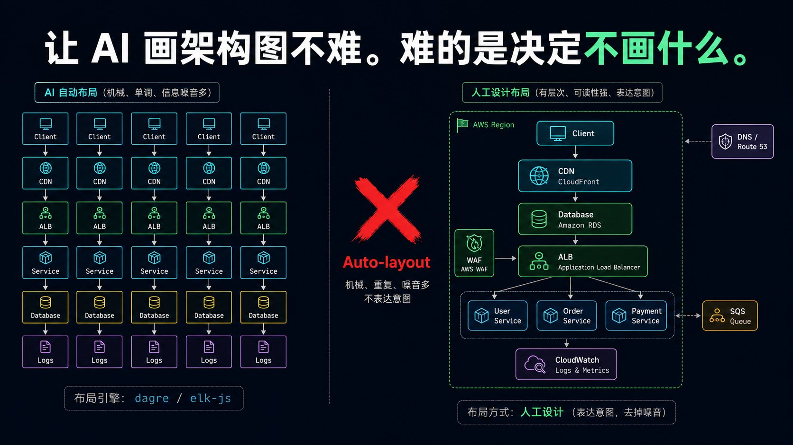
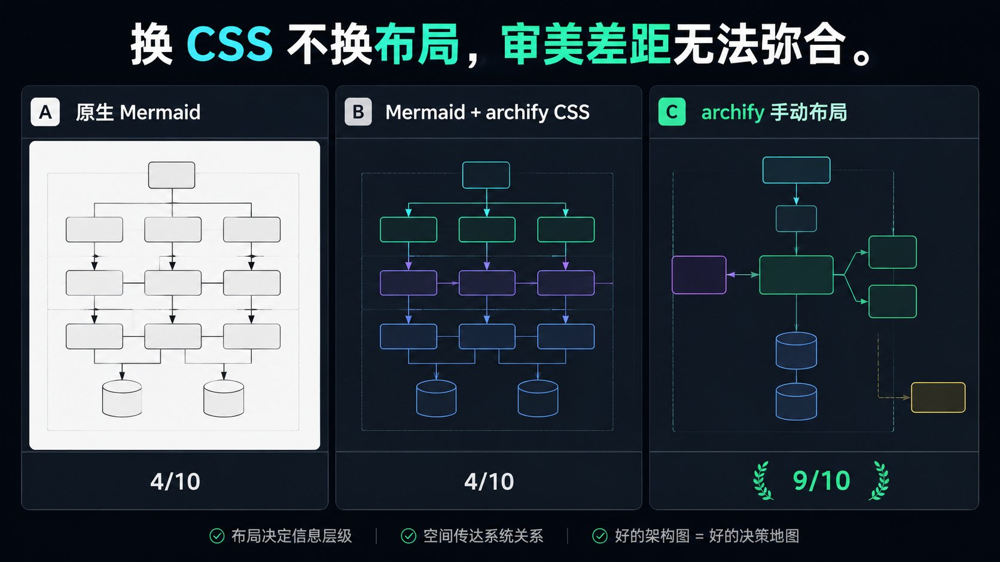
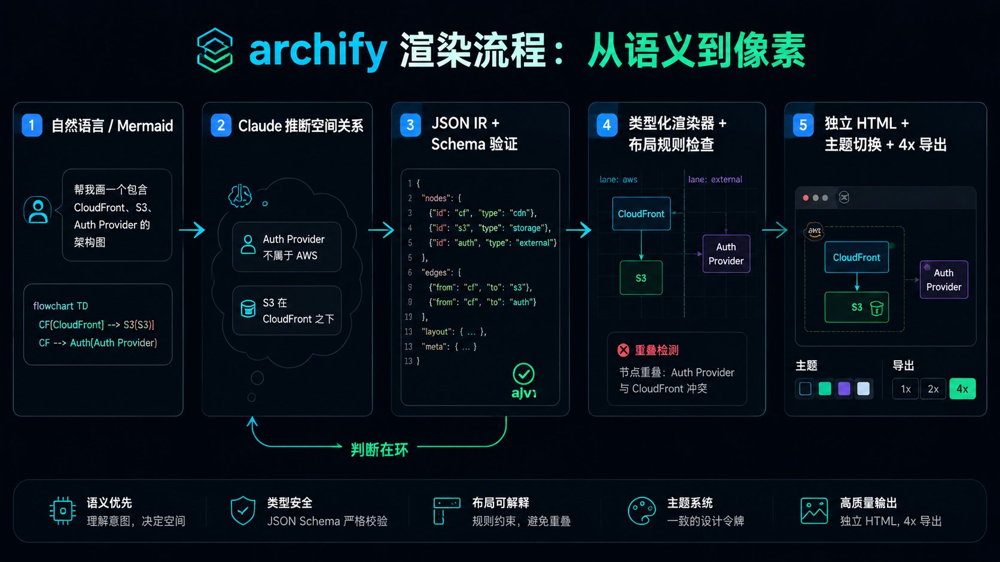
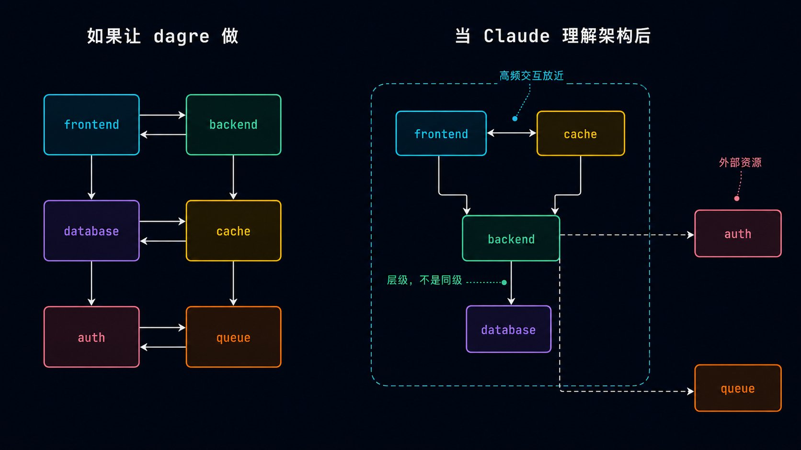
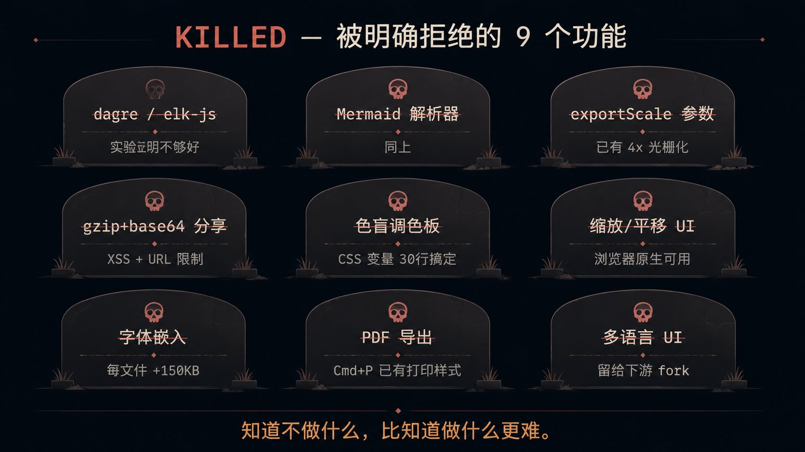

# 让 AI 画架构图不难。难的是决定不画什么。



一条命令：

```
node renderers/architecture/render-architecture.mjs web-app.json web-app.html
```

跑完你会得到一个独立的 HTML 文件。打开浏览器，深色/浅色一键切换。PNG、JPEG、WebP、SVG 四种导出，4x 原生光栅化，复制到剪贴板就能贴进 Notion 或 GitHub README。

看起来只是一张架构图。但打开浏览器你会注意到，这图不是均匀的方格阵列。

Auth Provider 飘在 AWS 区域的左上角外面——它不是 AWS 的资源。S3 放在 CloudFront 下方而非旁边——这是层级关系，不是同级关系。security-group 的虚线边界精确地画在 30px padding 处。

这些不是样式。是布局。

---

**Archify 是一个让 Claude 用自然语言画技术架构图的 Skill**。支持五种图表类型——Architecture（系统架构）、Workflow（工作流水线）、Sequence（调用时序）、Data Flow（数据管线）、Lifecycle（状态机）。每种都有独立的 JSON Schema、独立的渲染器、独立的布局规则检查。项目从 Cocoon AI 的 v1 分支重写而来，目前 v2.6，MIT 协议。

但这篇文章关心的不是功能列表。我关心的是一个设计决策——Archify 明确拒绝了自动布局引擎。而且这个拒绝不是"我们还没做"，是"我们实验验证了，这条路不通"。

---

## 一个实验：换 CSS 不换布局，能差多远？

Archify 的 Roadmap 里有一段不常出现在开源项目中的文字：

> **Auto-layout (dagre / elk-js) is a dead end for archify.**

为了验证这个判断，作者做了一个盲测实验。

五张真实 Mermaid 流程图，每张渲染三个版本：

- **版本 A**：原生 Mermaid，dagre 布局，默认主题。
- **版本 B**：同样 dagre 布局，但换上 archify 的深色配色、JetBrains Mono 字体、slate-900 背景。布局不动——只换皮。
- **版本 C**：archify 手动布局——Claude 分配语义类（`c-frontend`、`c-backend`、`c-security` 等），手动摆放坐标，archify CSS 是最后一步。

15 张截图打乱、去标签，盲评 1-10 分。

结论写在 `experiments/v3-mermaid-validation/RESULT.md` 里，只一行：

> **C looks good; A and B both don't look good. B is not meaningfully better than A.**

换 CSS 不换布局，审美差距**无法弥合**。B 不比 A 更好看。一张均匀网格涂上更好的颜色，仍然是一张均匀网格。



这就是为什么 ROADMAP.md 里用了"dead end"这种词——不是因为 dagre 或 elk-js 不好，而是因为 Archify 的审美**不来自配色，来自空间叙事**。Auth Provider 为什么放在外面？S3 为什么比 CloudFront 低 30px？虚线边界为什么是 30/50 padding？这些都是 Claude 的判断。去掉布局判断，就去了产品骨头。

相应的，Roadmap 里 P1（Mermaid 解析器引入 dagre 自动布局）打了 **KILLED**。P3（end-to-end 解析管线）、P4（IR → Mermaid 输出、C4 输入）同样。

另外一个要命的问题也在 Roadmap 里写清楚了：

> **"Prettier Mermaid renderer" is already taken.** lukilabs/beautiful-mermaid 有 15 套主题（Tokyo Night、Catppuccin、Nord、Dracula），8.1k stars。Mermaid 11.14 自己加了 Neo/Redux 主题、ELK 布局、Hand Drawn 风格。做"更好看的 Mermaid"是已经被占领的赛道。

Archify 选的是一条更窄但更硬的路：**让 Claude 做信息架构决策，而不只是往布局引擎的输出上刷 CSS。**

---

## 不是"人类在环"，是"判断在环"



这句话你可能在别的 AI 工具文章里看过："人机协作"、"人类在回路中"。太模糊了——谁在回路里？做了什么事？

Archify 的回路里有一个具体的决策者：Claude。它做一件事——**从语义推断空间关系**。

举个例子。你要画一个 Web 应用架构：

```
用户说：AWS 上跑着 Next.js 前端、Go 后端和 PostgreSQL。
前端通过 CloudFront 分发，缓存打在 S3 上。
所有流量经过 WAF，auth 走独立 Identity Provider。
```

dagre 会怎么做：六个节点排成两行三列。整齐、均匀、无聊。

Claude 的答案——当 Archify 让它自己决定坐标时：S3 放在 CloudFront 下方而非旁边，因为"缓存打在 S3 上"意味着**层级关系**而非**同级关系**。Identity Provider 故意浮在 AWS region 边界外面，因为它不是 AWS 的资源。WAF 画在整个入口处。PostgreSQL 和 Go backend 靠得更近，因为它们高频交互。

这不是配色问题。这是**对"谁依赖谁"、"谁在外面"、"什么应该靠在一起"的空间翻译**。



这个设计哲学在 Archify 的架构上有个精确的落点：**类型化渲染器不是自动布局引擎**。

Workflow、Sequence、Dataflow、Lifecycle 四种模式的渲染器有预定义的 lane/stage/row 网格。它们告诉你哪些坐标是合法的——但是 Claude 仍然决定把哪个节点放进哪个泳道、哪个阶段、主路径上放哪些步、连接线走哪条 route。渲染器给的是约束，不是解。

举个具体的例子——layout-rules.test.mjs 里的一条断言：

```
节点重叠 → 报错："/nodes/3 (label: 'Data Cache') overlaps /nodes/5 (label: 'CDN Edge')"
标签越界 → 报错并给出数值阈值
跨泳道重叠 → 报错并命名两边的泳道名
```

这四种错误的返回格式不是随意写的。它们的格式专门服务于一件事——**让 LLM 能自我修复**。每条错误消息包含 JSON path、违规的两个对象名、超出的数值或合法范围。Claude 读到这种错误后，可以自己修正 JSON 并重新渲染，不需要人介入。

不是"人类在环"。是"判断在环"。人类提供的是判断——API 架构师理解"Identity Provider 不是 AWS 资源"——AI 负责执行判断（选坐标、定距离、调间距）并接受约束检查。

---

## 决心不做什么，比做了什么更难

翻 Archify 的 ROADMAP.md 和 CHANGELOG，最惊讶的不是它做了什么，是它**公开拒绝了多少东西**。

| 被拒绝的功能 | 理由 |
|---|---|
| dagre / elk-js 自动布局 | 实验证明 auto-layout + CSS 不比原生 Mermaid 更好 |
| Mermaid 解析器管线 | 同上的实验结论 |
| `?exportScale=N` URL 参数 | 诱导用户选低质量的缩放下采样，而项目已经有 4x 原生光栅化 |
| gzip+base64 分享链接 | XSS 向量，URL 长度限制，大家已经接受了"发 HTML 文件" |
| 色盲安全调色板 | 维护负担过重，CSS 变量系统使下游 fork 在约 30 行内就能完成 |
| 缩放/平移 UI | 浏览器原生双指缩放和 Cmd+滚轮已经可用 |
| 字体嵌入光栅导出 | 每文件增加约 150KB，收益有限 |
| PDF 导出按钮 | Cmd+P 自带打印样式表（`@page landscape`） |
| 多语言 UI | 保持界面极简，国际化交给下游 |

这些决策每一项都带着成本意识。gzip+base64 分享听起来方便——但一旦做了，就要一直维护 XSS 防护，还要处理 URL 长度在各个平台上的表现差异。"发 HTML 文件"在今天已经很自然了——Slack 传文件、GitHub 上传、邮件附件——再叠一层 base64 包装，增加的复杂度买回来的便利微乎其微。

另一类决策更有意思——"我们已经有了更好的替代方案"。4x 原生光栅化比 `?exportScale=N` 质量好得多；浏览器 Cmd+P 比内置 PDF 按钮稳定得多；CSS 变量系统比硬编码调色板灵活得多。**做了新东西，就可以不维护旧方案。**

Archify 在这件事上极其诚实。没有任何一项被拒绝的功能挂着"未来考虑"的标签。砍了就砍了，理由写清楚，不留后路。

这种诚实在中国开源项目里少见。大部分项目 Roadmap 里堆满了"计划中"、"考虑中"，Archify 的 Roadmap 却有一整节的 **KILLED**。



---

## 什么情况下它会失效

Archify 的布局哲学有一个硬前提：**负责做布局判断的那个人（或 AI）真的理解架构语义**。

当图太大时，这个前提会崩。一个 30 节点的微服务拓扑、横跨 3 个 region 的部署图——Claude 会在中间某个节点处丢失全局结构，开始随机分配坐标。它不会再被语义驱使，只是机械地在 viewBox 里填满剩余空间。这种时候，dagre 的均匀网格反而更好——至少它不出错。

第二类失效场景是：用户自己描述不清楚。"帮我画个架构图"——然后就没了。Archify 的 SKILL.md 在开头就告诉你，Claude 需要问清楚：组件类型、拓扑关系、安全边界、主要数据流。如果用户说不清楚，问出来的图也不会有信息架构。

第三类失效更微妙：当图的审美**不需要空间叙事**时，Archify 的所有设计都变成了过度设计。一个 4 步骤的审批流画在泳道里很清爽，但为了它走 JSON IR → schema 验证 → renderer 的全套流程，不如直接在 Excalidraw 里拖四个方块。

Archify 不适用于"所有图"。它适用于**那些组件之间的空间关系本身就携带信息的图**。

---

## 那么，Archify 真正值得学习的是什么？

不是配色系统。不是 4x 导出。甚至不是五种图表类型——类型会继续增加。

值得看的是三件事。

**第一，一个 AI 工具的设计哲学可以小到"一个实验结果"。**

Archify 拒绝 auto-layout 不是哲学讨论——是先跑了一个 5 张图的盲测，结果 B 不比 A 好，然后 ROADMAP 里所有跟 dagre 相关的任务集体被杀。设计决策不是从观点出发的，是从一堆截图和评分的表格出发的。这比任何关于"AI 工具该怎么设计"的方法论都可信。

**第二，"知道自己不是什么"比"知道自己是什么"更值钱。**

"Prettier Mermaid renderer is already taken" —— 这句话省了至少三个月的工作。Archify 不跟 beautiful-mermaid 比配色、不跟 Mermaid 11.14 比 Hand Drawn 风格。它选了一个更窄的赛道：信息架构。你画的是架构图，配色只是最后一步，布局才是主角——而布局是 Claude 的理解，不是 dagre 的均匀网格。

**第三，对 AI 来说，"约束"和"自由"不是对立的。**

Archify 的渲染器给你一个 lane/stage 网格（约束），但让你决定每个节点进哪个泳道、每个连接走哪条路由（自由）。Schema 验证会卡你格式（约束），但错误消息格式被专门设计成 Claude 能自动修复（自由）。如果你想让 Claude 稳定在一条特定的布局路径上，给它一个比"随便画"更窄的系统。

---

Archify 的 JSON IR 有一个强制字段叫 `schema_version: 1`。从第一天就强制了。打破性变更触发版本号升级，旧版本永远合法。

这一行比它前面 200 行的 SKILL.md 都更能说明问题。

因为这个字段承认了一件事：今天最好的布局判断，明天可能就不是最好的了。版本号是给未来留的退路——**在不知道明天会更好的情况下，先保证今天不会更差。**
