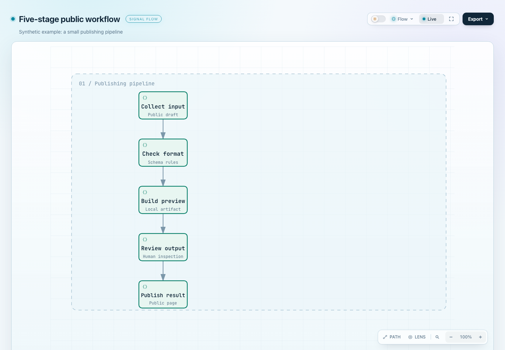
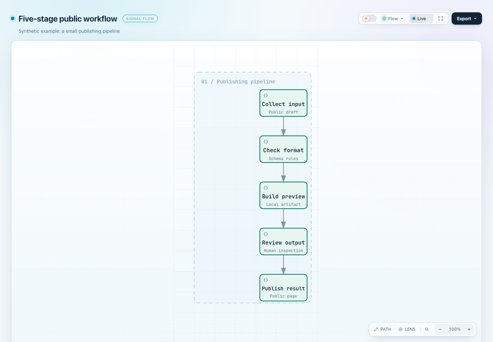
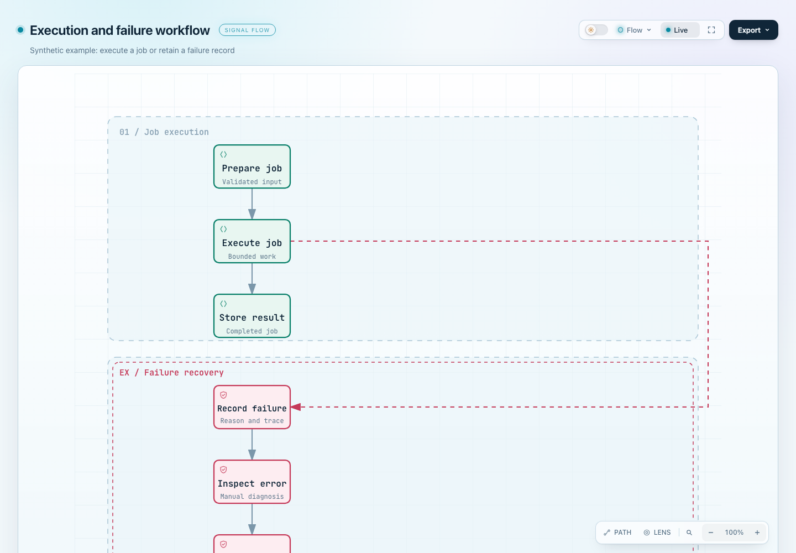
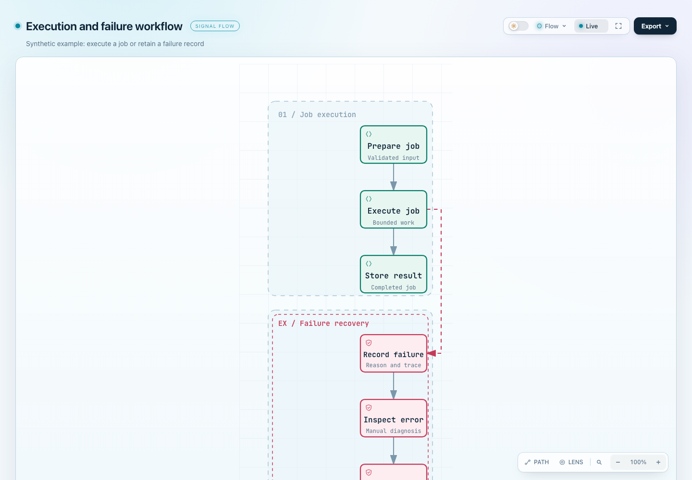

# Single-column canvas prototype — #747

This Draft explores whether tighter automatic lane frames are useful. It does not establish a typography or scrolling improvement. Related issue: [#747](https://github.com/tt-a1i/archify/issues/747).

Comparison base: `0c5550a6e5c7c3fc42ab6f2ed2c96d223461dbe3`. Candidate: that base plus this branch's compiler/test/capture-script changes. The source hashes in [revision.json](revision.json) identify the exact tested files. These existing results are reused because those files and the target base remain unchanged; adding this evidence directory does not constitute a new renderer test run.

## Same-input comparisons

Chrome 154, 1440×1000, signal-flow, Showcase, light theme, 100% camera, page top, settled fonts; motion frozen for capture. Intrinsic dimensions use SVG units; font and scroll measurements use CSS pixels.

| Public input | Canvas before → after | Minimum primary / auxiliary text | Document scroll |
| --- | --- | --- | --- |
| Five-stage | 768×626 → 284×626 | 15 / 12px, unchanged | 289px, unchanged |
| Execution/failure | 780×736 → 296×736 | 15 / 12px, unchanged | 549px, unchanged |

Both versions reach the existing 1.5× enlargement cap. Neither case has horizontal overflow. The visible benefit is less lane/frame whitespace and a shorter side detour in the execution/failure case. The outer reader panel remains full width, and the original column offset remains.

| Five-stage before | Five-stage after |
| --- | --- |
|  |  |

| Execution/failure before | Execution/failure after |
| --- | --- |
|  |  |

The public inputs already live in `test/fixtures/reader-readability/`. [measurements.json](measurements.json) includes actual font sizes, route bounds, complete text and bottom-scroll reachability. It also records dark-theme and labeled-side-route controls. Only the four primary light-theme screenshots are included here; the capture script regenerates all twelve screenshots and six standalone HTML files in a fresh output directory.

## Scope and checks

The compiler measures occupied width for automatic v2 single-column vertical stacks, retaining node positions and the existing reader policy. It reserves room for labeled side routes before routing; final bounds still include routes and labels. Explicit geometry and multi-column/v1 paths retain the existing policy. The label reservation is conservative and may retain more width than strictly necessary.

The test-value check retains topology, containment and compatibility protection. One obsolete automatic-width snapshot becomes height/group-containment checks. Two regressions cover unused ranks and a labeled outside-right route that collided with nodes in the initial naive shrinking attempt. No unrelated refactor is included.

- [Workflow log](workflow-regressions.log): 233 passed, 0 failed, 0 skipped.
- [Core CLI log](core-smoke.log): 18 passed, 0 failed, 0 skipped.
- [Browser log](browser-regressions.log): 28 passed, 0 failed, 0 skipped, covering desktop-reader and reader-layout suites.
- [Compatibility matrix](compatibility.json): 17 inputs × Standard/Showcase, all 34 comparisons successful; 20 designated controls have byte-identical SVGs.
- [Baseline regression](regression-before.log) fails the unused-rank case; [candidate regression](regression-after.log) passes both #747 cases. The labeled-route control passes on both revisions.
- [Timings](timings.json): compiler including routing, 5 warmups and 31 alternating samples per revision. Medians are comparable on these small cases; labeled-route p95 rises from 0.423 to 0.763ms. No general speedup is claimed.

Local environment for the original prototype evidence: macOS arm64, Node 26.11.0, Chrome 154.0.8037.98. Prior visual review inspected the twelve page-top screenshots. Mobile and full animation/export interaction remain outside this prototype's evidence.

CI follow-up: rebuilt the distribution ZIP with official Node 22.23.3 and bundled zlib 1.3.1-e00f703; only the Workflow compiler entry changed. The release-package and update-notifier suites passed locally with 120 passes, zero failures and four platform/toolchain skips. The stale-claim race test now allows its deliberately pending mock fetch 2 seconds instead of the fixture's 50ms, while preserving its one-request assertions and the separate timeout tests. Remote CI must qualify the updated candidate. Gallery outputs are unchanged; the bundled Workflow example controls retained byte-identical SVGs.

## Reproduce

From a checkout of this candidate branch, with Chrome/Chromium installed:

```sh
npm ci
npm --prefix archify ci
git worktree add --detach ../archify-747-baseline 0c5550a6e5c7c3fc42ab6f2ed2c96d223461dbe3
npm run test:focus -- test/workflow-*.test.mjs
npm test
ARCHIFY_CHROME="/path/to/chrome" npm run test:browser -- test/desktop-reader-browser.test.mjs test/reader-layout-browser.test.mjs
ARCHIFY_CHROME="/path/to/chrome" node scripts/capture-workflow-canvas.mjs ../archify-747-baseline ../archify-747-reproduced
```

Choose unused baseline and output directory names. The capture script compares the same public inputs through both compilers and the real viewer, and asserts text, overflow, route containment and bottom-scroll reachability. To repeat the red/green experiment, temporarily copy the candidate compiler test file into the disposable baseline worktree and run `node --test --test-name-pattern='issue #747' test/workflow-compiler.test.mjs` there; restore that test afterward.
