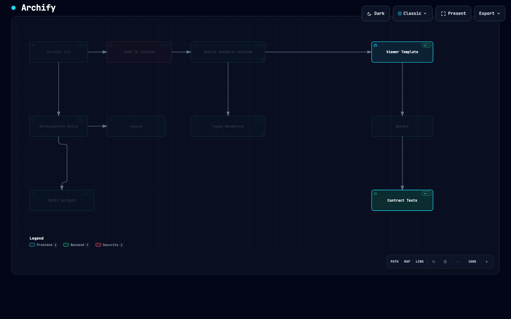
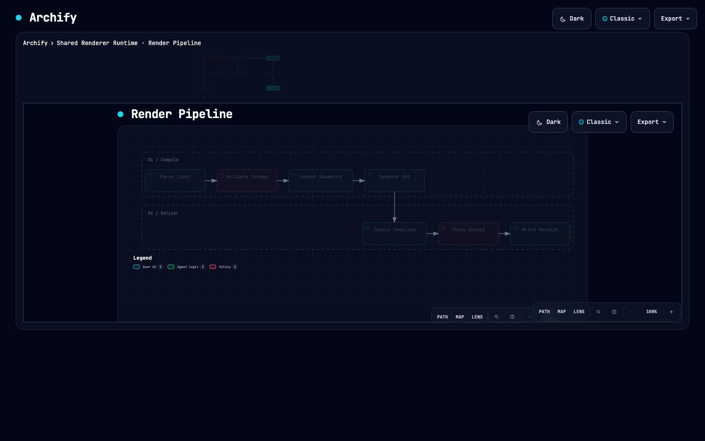
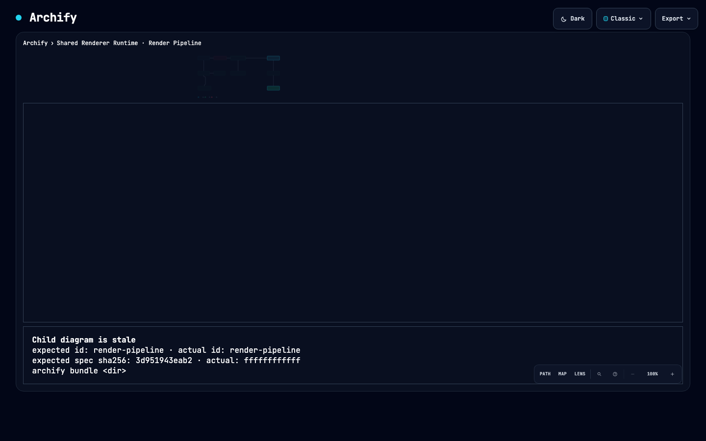

# Identity map: ownership sidecar, `archify locate`, drilldown bundles

Date: 2026-09-09. Branch: `feature/identity-map`. Baseline at the time: `1072200` (then `origin/main`).

This record consolidates three working drafts — on the ownership sidecar and `locate`, on
identity-based drilldown, and on the pre-registered experiments — into one decision document and
reconciles them against the implementation that now exists on the branch. The drafts have been
removed; this file replaces them. Where a draft and the code disagreed, the code is authoritative
and the divergence is recorded in
[Divergences from the drafts](#11-divergences-from-the-drafts). The numeric citations below are historical notebook references, not current API documentation.
For maintained contracts, use [Locate](../../archify/references/locate.md) and
[drilldown bundles](../../archify/references/drilldown-bundles.md). The six named cold-read
navigation errors were rechecked against public commit `dc2153b` and replaced below with
fixed-revision symbol links. Other old line references have not all been semantically re-audited.
The [recovery disposition](../identity-map-legacy-disposition-2026-09-12.md) supersedes the old
experiment, implementation-status and future-work claims where they differ.

Raw experiment data stays beside this file: `e1-fix-classification.json`, `e3-replay.json`,
`e3-map-at-base.json`, `e3-map-at-head.json`, `e3-sources-decay.json`, `e3-deep-summary.json`.

---

## 1. Context and scope

A checked-in Archify map is a stable identity for a system: authored component ids, authored
relationships, authored evidence pointers. This work adds two things on top of that identity.

1. **Change localization.** `archify locate <base>..<head>` answers one decidable question: for
   this Git range, which components does each changed path belong to, and which glob proves the
   attribution. It is pure computation over Git output plus one validated diagram JSON and one
   validated ownership sidecar — no model call, no inference, no map edits
   (`archify/locate/locate.mjs:13-16`, `archify/schemas/locate-receipt.schema.json:5`).
2. **Nested reading.** `archify bundle <dir>` turns a directory of delivered diagrams into a
   two-level bundle so a reader can descend from one component into a child diagram and come
   back to the same pixels (`archify/bundle/diagram-bundle.mjs:302`,
   [modular Viewer `Archify.drilldown` / `back()`](https://github.com/tt-a1i/archify/blob/dc2153b41a214c3984b78f874330ddc6f59ddd89/viewer/template.source.html#L6722)).

The purpose is orientation: helping a reader — human or agent — understand where a change lands
and what the inside of a component looks like. It is not a review verdict. The receipt carries
its own limits verbatim:

```
Path ownership only; no runtime impact, causality, risk, or mergeability is inferred.
Import facts are reported as-is and never reconciled against authored connections.
```

(`archify/locate/locate.mjs:13-16`.) The rendered locate HTML enforces the same boundary by
rejecting its own output if it contains a risk or merge claim
(`archify/locate/locate-html.mjs:10`, `:154`), extending the ban list Delta already applies to
comparison artifacts.

External wording is restricted to "understand a change" and "locate". E1 (§8) measured 16% of
sampled fix commits as structurally expressible; that band supports a complement to review, not
a defect-finding claim.

---

## 2. Decisions already fixed by the maintainer

Reproduced verbatim.

- 下钻用 bundle：一个入口 HTML + 同目录子文件，manifest 用 id + 内容 sha256 互相校验；对不上时界面明确显示「子图过期」，不静默展示。不做内嵌单文件，不做裸路径 href。
- 下钻靶点用组件 id，不用文件路径；子图可以是五种类型任一；子图的 ownership glob 必须是父 glob 的子集，越界是 diagnostic。先做两层，每层守现有 12 节点上限。
- ownership 做 sidecar 文件，不改 architecture schema 的既有字段语义。
- `locate` 是纯计算：输入 git 输出 + 两个已校验 JSON，无 LLM、无推断；输出状态只允许 touched / uncovered / ambiguous / excluded / stale；组件间 import 边变化作为独立事实列表附带（`--facts` 可选输入），不与 `connections` 对账。歧义如实报告，不做隐式 glob 优先级；`--lint` 把歧义变成作者期错误。
- 交互是「原地下潜」：父图缩为面包屑 + 剪影，子图在同一画布展开；返回后父图坐标一像素不动。变化投影从父到子透传。
- 对外措辞只说「理解变化」「定位」。

---

## 3. Drilldown contract

### 3.1 Authored field

An architecture component may declare `"drilldown": <child diagram id>`
(`archify/schemas/architecture.schema.json:128`). It reuses `common.schema.json#/$defs/id`, so
the target is an identifier, never a path. The renderer reads it from its own input JSON and
draws a visible mark inside the node
(`archify/renderers/architecture/render-architecture.mjs:1001-1010`,
`archify/renderers/shared/cli.mjs:234-237`) and exposes it as `data-drilldown-child` on the node
group (`archify/renderers/shared/cli.mjs:211`). Because the mark is part of the rendered SVG, it
survives canonical export; no tool rewrites delivered bytes to add it.

### 3.2 Bundle directory layout

One directory is one bundle. `archify bundle` scans it for `<id>.html` + `<id>.json` pairs
(`archify/bundle/diagram-bundle.mjs:171-221`); every diagram must be a same-directory HTML file
matching `^[A-Za-z0-9][A-Za-z0-9._-]*\.html$` (`archify/bundle/diagram-bundle.mjs:14`,
`archify/schemas/bundle.schema.json:23`). Subdirectories, `../`, absolute paths, and URL schemes
are unrepresentable. The self-map bundle is the worked example:

```
docs/cases/archify-self/
  archify-self.html            entry   (architecture, level 0)
  archify-self.json
  archify-self.ownership.json
  archify-renderers.html       child   (architecture, level 1)
  archify-renderers.json
  archify-renderers.ownership.json
  render-pipeline.html         child   (workflow, level 1)
  render-pipeline.json
  render-pipeline.ownership.json
  manifest.json
```

Child diagrams may be any of the five types; the self-map exercises this with a `workflow`
child under an `architecture` entry (`docs/cases/archify-self/manifest.json:30`,
`archify/schemas/bundle.schema.json:24`).

### 3.3 Manifest format

`archify/schemas/bundle.schema.json` is `additionalProperties: false` and requires
`schema_version`, `bundle_type: "drilldown"`, `entry`, `diagrams`
(`archify/schemas/bundle.schema.json:6-11`). `max_depth` is `const: 2`
(`:12`); `diagrams` holds at most 13 entries — one entry plus twelve children (`:16`); each
diagram carries `id`, `file`, `diagram_type`, `title`, `level` (0 or 1), optional `node_count`
capped at 12, `spec_sha256`, and `artifact_sha256` (`:20-29`). `drilldowns[]` is the
`parent`/`component`/`child` resolution table with an optional 80-character `label` (`:33-45`),
and `ownership` records the sidecar filename plus its sha256 (`:47-54`).

The entry HTML embeds a byte-identical copy of the manifest as
`<script id="archify-bundle-manifest" type="application/json">`
(`archify/bundle/diagram-bundle.mjs:56-62`). This exists because a `file://` document cannot
`fetch('./manifest.json')`; the disk manifest remains the normative source, and check 6 below
forces the two to stay byte-equal.

### 3.4 Two-hash rule

- `spec_sha256` — sha256 of the sibling JSON bytes. It is the **runtime** check: the renderer
  writes it onto the SVG root as `data-bundle-spec-sha256`
  (`archify/renderers/shared/cli.mjs:175-176`), and the child reports it back over `postMessage`
  during the handshake ([child `onMessage()` acknowledgement](https://github.com/tt-a1i/archify/blob/dc2153b41a214c3984b78f874330ddc6f59ddd89/viewer/template.source.html#L6744)).
- `artifact_sha256` — sha256 of the HTML bytes, computed on disk. It is the **offline** check; a
  self-contained HTML file cannot contain its own digest, and under `file://` the parent cannot
  read child bytes.

The two are not interchangeable. Any child that is re-delivered must be re-bundled.

Exception, and a divergence from the draft: for a file that already carries an embedded
manifest, `htmlArtifactSha256` strips the `archify-bundle-manifest` script before hashing
(`archify/bundle/diagram-bundle.mjs:64-68`). Without this the entry's digest could never be
stable, since injecting the manifest changes the bytes the manifest describes. The consequence
is that `artifact_sha256` pins the entry's *pre-injection* bytes, not the delivered file.

### 3.5 Validation rules

`validateBundle(dir)` collects failures and raises one `bundle/invalid` carrying all of them
(`archify/bundle/diagram-bundle.mjs:379-385`, `:581-584`), mirroring
`validateArchitectureDeltaHtml`. The checks:

| # | Check | Failure code | Line |
|---|---|---|---|
| 1 | `manifest.json` exists, parses, passes `bundle.schema.json` | `bundle/manifest-missing`, `bundle/manifest-parse`, `bundle/schema` | `:388`, `:401`, `:407` |
| 2 | entry exists in `diagrams[]` at `level: 0`; every other diagram is `level: 1`; `max_depth` is 2 | `bundle/entry-level`, `bundle/child-level`, `bundle/max-depth` | `:419-425` |
| 3 | `id` and `file` unique; each `file` is a same-directory HTML that exists | `bundle/duplicate-id`, `bundle/duplicate-file`, `bundle/file-path`, `bundle/file-missing` | `:429-441` |
| 4 | each HTML's `data-bundle-id` / `data-bundle-role` / `data-bundle-spec-sha256` match the manifest | `bundle/child-stale` | `:445-460` |
| 5 | recomputed artifact and spec digests match the manifest | `bundle/child-stale` | `:467-479` |
| 6 | entry embeds exactly one manifest copy, byte-identical to disk | `bundle/embed-count`, `bundle/embed-mismatch` | `:482-490` |
| 7 | every `drilldowns[]` row: parent is the entry, `component` exists in the entry's semantic collection, `child` exists in `diagrams[]`, one child per component, no cycle, no nesting | `bundle/drilldown-parent`, `-component`, `-child`, `-duplicate`, `-cycle`, `-nested` | `:493-513` |
| 8 | every diagram has 1–12 primary nodes | `bundle/node-cap` | `:515-524` |
| 9 | no child HTML carries a drilldown mark (the second layer does not descend) | `bundle/child-mark` | `:526-533` |
| 10 | ownership sidecar present in the manifest: file exists, sha256 matches, parses, and passes the subset rule | `bundle/ownership-missing`, `-stale`, `-parse`, `-not-subset` | `:535-578` |

`SEMANTIC_COLLECTIONS` (`archify/renderers/shared/cli.mjs:72-78`) supplies the per-type node
collection for checks 7 and 8, so all five diagram types are handled by one code path.

The return value is `{ ok: true, checksPassed, checkCount }` derived from a `checks` array of
`{ name, ok }` recorded as each of the ten checks runs
(`archify/bundle/diagram-bundle.mjs:360-365`, `:371-377`, `:584`). A single failing check
reports `checksPassed === checkCount - 1` on the error evidence. `validateLocateHtml` derives
its counts the same way (`archify/locate/locate-html.mjs:140-173`).

### 3.6 Stale behavior

Nothing is rendered silently when the identity does not line up.

**Runtime.** After the iframe loads, the entry posts `archify:bundle-hello` with the expected id
and spec digest (`archify/assets/template.html:15237-15244`). The child answers
`archify:bundle-ack` with its own `data-bundle-id` and `data-bundle-spec-sha256`
(`:15349-15357`). The parent accepts only messages whose `event.source` is the frame's
`contentWindow` (`:15367`), and only ids matching `^[a-zA-Z][a-zA-Z0-9_-]*$` and digests matching
`^[a-f0-9]{64}$` (`:15369-15370`). A mismatch, a missing attribute, an unsafe filename, or a
handshake that does not complete within 1200 ms (`:15304-15307`) removes the iframe and shows
an explicit stale card built with `createElement` + `textContent` — never `innerHTML`
(`:15015-15055`). The card states the expected and actual id, the first 12 hex of the expected
and actual spec digest, the failure reason, and the single repair action `archify bundle <dir>`
(`:15004-15013`). The breadcrumb stays; `Esc` still ascends; the parent's geometry is untouched.

**Offline.** `validateBundle` raises the same fact as `bundle/child-stale`
(`archify/bundle/diagram-bundle.mjs:459`, `:474`, `:477`), and the CLI promotes that string to
the top-level diagnostic code (`archify/bin/archify.mjs:2058-2065`).

### 3.7 Interaction: descend in place

- **Activation is a named control, not a click.** Single click keeps its existing one-hop focus
  meaning. Descending happens through the Semantic Passport's `Descend` button
  (`archify/assets/template.html:15165-15170`, `archify/renderers/shared/i18n.mjs:307`) or by
  activating the drilldown mark itself (`:15379-15387`).
- **The parent never leaves the DOM or the layout.** `descend()` sets `data-drilldown-level`
  and the child is overlaid in a same-directory iframe; the entry SVG is kept in flow with
  `visibility: hidden`, never `display: none` (`archify/assets/template.html:4400-4411`), and
  the adaptive reader and viewer-chrome measurers are frozen while descended (`:11115`,
  `:11157`, `:11174`, `:11200`, `:11401`, `:11507`). This is deliberate: the first
  implementation used `display: none`, and CI's headless Chrome showed the reader shrinking
  `--archify-reader-width` from 1376px to 960px on reveal because the collapsed SVG no longer
  reserved its box — every node scaled by 0.691. Geometry is unchanged only if no fit runs, so
  no fit is allowed to run.
- **Scroll is restored.** `descend()` captures window and canvas scroll offsets (`:15275`,
  `:15121-15129`); `back()` restores them after revealing the parent (`:15336`), which is what
  makes "the same pixels" true when the reader scrolled inside level 1.
- **Breadcrumb.** `entry title › <component label> · <child title>`, the first rung being a
  button that ascends, the current rung carrying `aria-current="page"`
  (`:15204-15221`). It is rendered after `setState`, so exactly one rung is current.
- **Silhouette.** A 96 px static clone of the parent SVG with text, sigils, beacons, brand marks
  and images removed, the descended component outlined in Verified Cyan `#22D3EE`, and
  `aria-hidden="true"` (`:15178-15202`).
- **Motion.** `descending` / `ascending` run at ~170 ms and switch instantly under
  `prefers-reduced-motion` (`:15308-15318`, `:15340-15341`).
- **Escape.** The drilldown rung sits in the existing Escape ladder after every transient state
  and before `presentation.exit()` (`:15512-15514`). `Backspace` is a synonym. A child that has
  exhausted its own ladder forwards `archify:drilldown-escape` to the parent
  (`:15518-15523`, handled at `:15375-15377`), so `Esc` ascends even when focus is inside the
  iframe.
- **Level 1 restrictions.** Presentation Stage is disabled while nested or at level 1
  (`:15466-15469`); a nested child forces the motion governor to Still (`:15358`, `:15391`);
  `clearTransient()` clears focus, lens, route probe, intent trace, presentation and guided views
  before descending (`:15139-15146`).

### 3.8 Locate projection pass-through

`archify locate --bundle <dir>` embeds `<script id="archify-locate-projection">` into a copy of
the entry HTML (`archify/locate/cli.mjs:283-327`, `archify/locate/locate.mjs:387-397`). The
projection is `{ schemaVersion, base, head, components: { <id>: { state, files_touched_inside } },
children: { <childId>: { nodes: { <id>: 'touched'|'untouched' } } } }`
([`buildLocateProjection()`](https://github.com/tt-a1i/archify/blob/dc2153b41a214c3984b78f874330ddc6f59ddd89/archify/locate/locate.mjs#L406)).

At level 0 the entry applies component states to its own SVG on load
(`archify/assets/template.html:15393-15400`). On a successful handshake the parent posts
`archify:locate-projection` to the child, which applies it to its own nodes
(`:15258-15262`, `:15361-15364`). Unrecognized states are removed rather than rendered
(`:14979-14994`).

The visual rules:

- Dim-and-lighten reuses the focus pattern: everything under `svg[data-locate-active]` sits at
  low opacity, `touched` and `stale` return to 1
  (`archify/assets/template.html:4367-4368`).
- The parent chip reads "N FILES TOUCHED INSIDE" and is **hidden when the count is zero**
  (`:14995-15003`, `:15171-15176`). A clean projection is an empty list, not a reassurance.
- No check marks, no green, no risk vocabulary. `stale` uses its own non-green treatment
  (`:4372-4377`).
- With no projection attached, no `data-locate-*` is written and the child renders fully lit.

---

## 4. Ownership sidecar

### 4.1 File naming and shape

The sidecar lives beside the map and is derived by replacing the `.json` suffix with
`.ownership.json` (`archify/locate/ownership.mjs:8-13`): `archify-self.json` →
`archify-self.ownership.json`. `--ownership <file>` overrides it
(`archify/locate/cli.mjs:66-70`).

`archify/schemas/ownership.schema.json` requires `schema_version: 1`, `kind: "ownership"`,
`map`, and `components` (`:7-10`). `map` is a POSIX path **relative to the sidecar's own
directory**, so the pair can be moved together (`:11-14`, resolved at
`archify/locate/ownership.mjs:200-207`; a mismatch is `locate/ownership-map-mismatch`).
`components[]` is an array of `{ id, globs, child_map? }` (`:31-51`); `excluded[]` is an optional
list of globs applied before component matching (`:25-30`); `parent` is the optional
`{ map, component }` back-link that makes a diagram a drilldown child (`:15-24`).

Loader-enforced rules beyond the schema (`archify/locate/ownership.mjs:88-122`):

- duplicate sidecar ids → `locate/ownership-duplicate-component`
- a sidecar id absent from the map → `locate/ownership-unknown-component`
- a map id absent from the sidecar → `locate/ownership-component-unmapped`

Every map component must appear exactly once. An empty `globs` array is a valid, explicit
declaration that a component owns no repository path — the normal case for `external`
components.

### 4.2 Glob language

The matcher is ~35 lines with no dependencies (`archify/locate/glob.mjs`). Paths are POSIX,
relative to the Git top-level. A glob is `/`-separated segments; each segment is either `**` or a
pattern segment (`archify/locate/glob.mjs:87-104`):

| Token | Expansion | Note |
|---|---|---|
| `*` | `[^/]*` | does not cross `/`, may match empty |
| `?` | `[^/]` | one character, does not cross `/` |
| `{a,b}` | literal alternation | not nested, no wildcards inside, expanded before matching (`:32-71`) |
| `**` (non-final segment) | `(?:[^/]+/)*` | zero or more whole segments |
| `**` (final segment) | `[^/]+(?:/[^/]+)*` | one or more whole segments |

`**` must occupy a whole segment; `a/b**/c` is `locate/ownership-glob-invalid` (`:92-94`), and
the schema regex rejects the same shape plus leading `/`, backslashes, empty segments and
`.`/`..` segments (`archify/schemas/ownership.schema.json:66-67`). Brace expansion is capped at
64 variants (`archify/locate/glob.mjs:3`, `:58-69`). Matching is anchored at both ends and
case-sensitive. There is no implicit directory expansion: `archify/schemas` matches only a file
with that exact path; covering a directory requires `archify/schemas/**`.

### 4.3 States

Classification of one path is a fixed order producing exactly one state
(`archify/locate/ownership.mjs:259-278`):

| State | Definition |
|---|---|
| `excluded` | matches an `excluded` glob. Decided first; component globs are not consulted. |
| `uncovered` | matches no `excluded` glob and no component glob. |
| `touched` | matches exactly one component's globs. `componentId` and `matchedGlob` are recorded. |
| `ambiguous` | matches two or more components. All candidate ids are listed; no owner is chosen. |

There is no last-match-wins, no specificity ranking, no negation. Ambiguity is reported as-is and
is resolved by the map author narrowing a glob.

A **component** state is one of `touched`, `untouched`, `stale`
(`archify/locate/locate.mjs:122-128`):

| State | Definition |
|---|---|
| `stale` | at least one `components[].sources[].path` is not a blob in the range-end tree. Architecture maps only, since only they carry `sources`. |
| `touched` | not stale, and at least one `touched` file is attributed to it. |
| `untouched` | not stale and no touched file. |

`stale` wins over `touched` because it is the only state that requires the author to edit the
map, but `touchedCount` and `touchedFiles` are still populated, so no information is lost
(`archify/locate/locate.mjs:124-127`). When the missing path is the old side of a rename in the
range, `staleSources[].renamedTo` gives the mechanical repair
(`archify/locate/locate.mjs:114-120`).

### 4.4 Subset rule via `subsumes`

A child diagram declares `parent: { map, component }`; the parent component declares
`child_map`. If either side does not point back, the loader raises
`locate/ownership-parent-mismatch` (`archify/locate/ownership.mjs:158-165`, `:185-189`).

Every glob in the child sidecar — component globs **and** `excluded` — must be a syntactic subset
of some glob on the **parent component that declares `child_map` / `drilldown` to this child**.
The check lives in one function, `validateChildOwnershipSubset`
(`archify/locate/ownership.mjs:222-248`). Locate calls it from the sidecar loader
(`:167-173`, `:191-196`, code `locate/ownership-not-subset`). Bundle calls the same function
(`archify/bundle/diagram-bundle.mjs:126-133`, `:569-577`, code `bundle/ownership-not-subset`).
Parent `excluded` is **not** part of this check and is not copied into the child sidecar.

The matcher is `subsumes()` (`archify/locate/glob.mjs:142-148`), a **sound but incomplete**
rule: everything accepted is a true subset, but some true subsets are rejected. It expands
braces on both sides, then walks segment lists (`:128-140`):

- empty parent list subsumes only an empty child list;
- a parent whose only remaining segment is `**` subsumes any non-empty child;
- a non-final parent `**` may be skipped, or may consume one child segment;
- a child `**` facing a non-`**` parent segment is refused;
- otherwise segments are compared by `segSubsumes` (`:120-126`): parent `*` accepts anything,
  literal equality accepts, a wildcard-free child segment accepts if the parent's single-segment
  regex matches it, and a wildcard-bearing child segment is refused unless the parent is `*` or
  identical.

So `archify/renderers/**` subsumes `archify/renderers/shared/**`, and
`archify/scripts/*.mjs` does **not** subsume `archify/scripts/**`. A rejected but genuinely
narrower glob is repaired by rewriting it as a literal extension of a parent glob, or by widening
the parent.

Parent `excluded` is **inherited at projection time**. `inheritParentExcluded`
(`archify/locate/ownership.mjs:251-257`) prepends the parent sidecar's `excluded` list onto the
child's before classification. The parent receipt's `inside` counts use that merge
(`archify/locate/locate.mjs:141`); `locate --bundle` applies the same merge to each child
receipt (`archify/locate/cli.mjs:304`). A file excluded by the parent is `excluded` in the child
projection even when a child component glob would have matched it, and it does not increment
`files_touched_inside`. The child sidecar does not need to repeat parent exclusions.

### 4.5 Aggregation into the parent

A parent component with `child_map` gets `childMap` and, when the child sidecar loads,
`inside: { touched, uncovered, ambiguous, excluded }` — the child classifier run only over the
range paths that match the parent component's globs, using the child's sidecar plus inherited
parent exclusions (`archify/locate/locate.mjs:131-146`). The parent's own
`touchedCount` counts only files its own globs matched; the two numbers never merge. Only
`inside.touched` reaches the viewer chip (`archify/locate/locate.mjs:396`).
`inside.touched + inside.uncovered + inside.ambiguous + inside.excluded` equals the number of
range paths inside the parent component. On the checked-in self-map receipts both drilldown
parents report `{ touched: 0, uncovered: 0, ambiguous: 0, excluded: 0 }` for PR #256 and PR #352
— neither range touches a path under `archify/renderers/**`.

### 4.6 Lint semantics

`archify locate --lint [<rev>]` (default `HEAD`) lists the tracked tree with
`git ls-tree -r --name-only` and runs the identical classifier
(`archify/locate/cli.mjs:429-445`, `archify/locate/locate.mjs:321-329`). Every file gets
`changeType: "tracked"`.

- Any `ambiguous` path → exit 1 with one `locate/ambiguous-ownership` diagnostic per path,
  including its candidates, on both the human and `--json` paths
  (`archify/locate/cli.mjs:384-395`, `:523-534`).
- `uncovered` is counted, surfaced as the advisory `files_uncovered`, and never fails
  (`archify/locate/locate.mjs:162`). Requiring full coverage would force a 10-component map to
  mirror the file tree; `excluded` is the author's noise control, not a coverage substitute.

In lint mode `buildComponents` receives an empty change list
(`archify/locate/locate.mjs:364-371`), so `inside` counters are all zero even though the full
tree is available. Recorded as a known limit.

---

## 5. Locate receipt format

Governed by `archify/schemas/locate-receipt.schema.json`, `additionalProperties: false` at every
level.

| Field | Meaning | Reference |
|---|---|---|
| `schemaVersion` | `1` | `:26` |
| `ok` | `true`; a failed run emits a separate failure payload instead | `:27`, `archify/locate/cli.mjs:249-255` |
| `command` | `"locate"` | `:28` |
| `locatorVersion` | integer, currently `1` | `:29`, `archify/locate/locate.mjs:11` |
| `mode` | `"range"` or `"lint"` | `:30` |
| `completeness` | `"complete"` | `:31` |
| `repository` | `root` is the literal `"."`; `url` / `linkMode` from `meta.repository`; `base`+`head` in range mode, `revision` in lint mode | `:33-67`, `archify/locate/locate.mjs:302-304`, `:350-352` |
| `map` | `path`, `diagramType`, `semanticSha256`, optional `revision` and `mapBehindBy` | `:70-92` |
| `ownership` | `path`, `sha256` of the raw sidecar bytes, optional `parent` link | `:94-111` |
| `review` | `required`, `blocking[]`, `advisory[]` | `:113-131` |
| `summary` | file counts (`touched`/`uncovered`/`ambiguous`/`excluded`/`total`) and component counts (`touched`/`untouched`/`stale`/`total`) | `:133-162` |
| `files` | one entry per classified path, sorted by path | `:164-253` |
| `components` | one entry per map component, sorted by id, including untouched ones, with the label inlined | `:255-322` |
| `facts` | `moved_between_components` and `import_edge_change` observations | `:324-355` |
| `mapDelta` | present only when the map JSON changed in the range | `:357-371` |
| `limitations` | the two verbatim sentences above | `:373-377` |

`files[]` entries carry `path`, `changeType` (`A`/`M`/`D`/`R`/`C`/`T`, or `tracked` in lint mode),
`state`, and state-conditional fields the schema enforces with `if`/`then`: `touched` requires
`componentId` + `matchedGlob` and forbids `candidates` (`:194-207`); `ambiguous` requires at least
two `candidates` and forbids `componentId` (`:208-225`); `uncovered` forbids all three
(`:226-237`); `excluded` requires `matchedGlob` only (`:238-249`).

A rename produces **two** entries — the base path and the head path — distinguished by
`side: "base" | "head"` and cross-linked with `renamedFrom` / `renamedTo`
(`archify/locate/locate.mjs:61-91`). If the two sides attribute to different components (with
`null` for any non-`touched` side), one `moved_between_components` fact is emitted. Facts never
change a state.

`components[].state` is `touched` / `untouched` / `stale`, with `staleSources[]` required when
stale (`:308-315`) and `touchedCount: 0` plus an empty `touchedFiles` enforced when untouched
(`:316-319`). `childMap` and `inside` describe drilldown parents; `inside` requires `childMap`
(`:307`).

`review` is the explicit needs-review contract so a consumer never derives it from counts
(`archify/locate/locate.mjs:156-173`):

- `blocking` ⊆ `files_ambiguous`, `components_stale`, `map_changed`
- `advisory` ⊆ `files_uncovered`, `map_behind`, `map_revision_unavailable`, `import_edges_unmapped`
- `required` is `blocking.length > 0`

Both arrays are emitted in a fixed order (`archify/locate/locate.mjs:19-20`, `:176-177`).
A pinned `meta.repository.revision` that is absent locally omits `mapBehindBy` and adds
`map_revision_unavailable` instead of aborting (`archify/locate/cli.mjs:330-338`).

`--facts before.json after.json` optionally reads two raw-facts files and uses only `imports[]`
(`archify/locate/locate.mjs:206-221`). Edge identity is `from + to + specifier + kind` with the
line number deliberately excluded, because line numbers are not stable across a range
(`:224-229`, schema note at `:343`). Endpoints are attributed through the same classifier;
an endpoint whose path fails the repo-path check is kept with `componentId: null` and the raw
`path` string (`:191-199`, `:233-241`, schema `factsAttributedPath` at `:410`). A non-string
endpoint is `locate/facts-invalid`. `kind` must be one of `static`, `dynamic`, `require`, `export`
(`:21`, `:213`); anything else is `locate/facts-invalid`. These facts are never reconciled
against authored `connections`.

### 5.1 Determinism guarantees

- **Stable sort.** `files` by `path`, `components` by `id`, `facts` by the canonical JSON of each
  entry, candidate lists by code point — all through Delta's existing
  `codepointOrder` / `canonical` / `sortedBy` (`archify/locate/locate.mjs:3-7`, `:98`, `:147`,
  `:279`).
- **No timestamps, no randomness.** Nothing in `archify/locate/` reads a clock or a random
  source.
- **No absolute paths.** `repository.root` is the literal `"."` and every path is relativized to
  the Git top-level (`archify/locate/cli.mjs:119-123`). Note that failure *diagnostics* may still
  carry resolved absolute paths in `evidence.path`; the receipt does not.
- **40-character lowercase SHAs.** `resolveCommit` validates against `^[a-f0-9]{40}$` and
  lowercases (`archify/locate/git.mjs:90-95`); the schema repeats the constraint
  (`archify/schemas/locate-receipt.schema.json:381`).
- **Two digests.** `map.semanticSha256` is sha256 over the canonical map JSON —
  `canonicalArchitectureJson` for architecture, `canonical` otherwise
  (`archify/locate/locate.mjs:175-178`). `ownership.sha256` is sha256 over the sidecar's raw
  bytes (`archify/locate/ownership.mjs:217`).
- **Atomic write.** The receipt is `JSON.stringify(x, null, 2)` plus a trailing newline, written
  in an OS temp staging directory and committed by rename, with the staging directory removed in
  a `finally` (`archify/locate/cli.mjs:498-508`, `:553-560`).

### 5.2 `mapDelta` attachment semantics

When the map JSON itself is one of the changed paths, `mapDelta` is added with `path` and the two
`<40-hex-sha>:<path>` blob names (`archify/locate/locate.mjs:236-241`).

In range mode, locate then runs `archify compare` **as a child process** and attaches the result
under `<out>/compare/` (`archify/locate/cli.mjs:347-378`, `:471-484`):

| `status` | When | Extra fields |
|---|---|---|
| `compared` | the child process exited 0 and both artifacts exist | `receiptPath: "compare/map-delta.receipt.json"`, `htmlPath: "compare/map-delta.html"`, `exitCode: 0` |
| `compare-failed` | the child process failed or an artifact is missing | `exitCode` from the child |
| `unsupported-type` | the map is not `architecture` | — |

The compare runs with the base and head blobs extracted via `git show` into the staging
directory (`:355-358`), and it never touches locate's own stdout or exit status: the locate
receipt is still written, `ok` stays `true`, and locate still exits 0. The compare's own exit
code appears only inside `mapDelta.exitCode`. Because the map changed, `review.blocking`
contains `map_changed` regardless of the compare outcome
(`archify/locate/locate.mjs:160`).

`--lint` never attaches a compare (`archify/locate/cli.mjs:472`).

---

## 6. Diagnostic codes

All are fail-closed and follow the repository's `code` / `severity` / `message` / `subject` /
`evidence` / `supportedFixes` shape (`archify/locate/error.mjs:18-27`).

### 6.1 `locate`

| Code | Emitted when | Exit |
|---|---|---|
| `locate/git-unavailable` | `git` cannot be spawned (`archify/locate/git.mjs:14`) | 1 |
| `locate/git-command` | a git subcommand exits non-zero (`archify/locate/git.mjs:34`) | 1 |
| `locate/root-unreadable` | `--repo-root` or the resolved top-level cannot be read (`archify/locate/git.mjs:43`, `:64`) | 1 |
| `locate/root-not-top-level` | the resolved root is not the Git top-level (`archify/locate/git.mjs:53`, `:69`) | 1 |
| `locate/range-invalid` | the positional argument is not `<base>..<head>`, or an endpoint does not resolve (`archify/locate/cli.mjs:109`, `:334`) | **2** |
| `locate/revision-unavailable` | a lint revision does not exist locally or does not resolve to a 40-hex commit (`archify/locate/git.mjs:85`, `:92`) | 1 |
| `locate/map-unreadable` | the `--map` file cannot be read (`archify/locate/cli.mjs:130`) | 1 |
| `locate/map-invalid` | the map does not parse, is not one of the five diagram types, or fails its schema (`archify/locate/cli.mjs:139`, `:145`, `:152`) | 1 |
| `locate/ownership-missing` | the sidecar cannot be read (`archify/locate/ownership.mjs:125`) | 1 |
| `locate/ownership-invalid` | the sidecar does not parse or fails `ownership.schema.json` (`archify/locate/ownership.mjs:81`, `:125`) | 1 |
| `locate/ownership-map-mismatch` | `ownership.map` does not resolve to `--map` (`archify/locate/ownership.mjs:207`) | 1 |
| `locate/ownership-duplicate-component` | a component id repeats in the sidecar (`archify/locate/ownership.mjs:93`) | 1 |
| `locate/ownership-unknown-component` | a sidecar id is not in the map (`archify/locate/ownership.mjs:106`) | 1 |
| `locate/ownership-component-unmapped` | a map component has no sidecar entry (`archify/locate/ownership.mjs:115`) | 1 |
| `locate/ownership-glob-invalid` | unclosed or nested brace, wildcards inside a brace, more than 64 variants, or `**` sharing a segment (`archify/locate/glob.mjs:5`, `:92`) | 1 |
| `locate/ownership-parent-mismatch` | `parent` and `child_map` do not refer to each other (`archify/locate/ownership.mjs:159`, `:186`) | 1 |
| `locate/ownership-parent-missing` | a child `parent` pointer names a map or sidecar that is not on disk (`archify/locate/ownership.mjs:142`, `:148`) | 1 |
| `locate/ownership-not-subset` | a child glob is not subsumed by the parent component's globs (`archify/locate/ownership.mjs:222`) | 1 |
| `locate/facts-invalid` | a `--facts` file is unreadable, or an `imports[]` record is malformed (`archify/locate/cli.mjs:166`, `archify/locate/locate.mjs:190`, `:198`) | 1 |
| `locate/out-directory` | `--out` cannot be created or read, is not a directory, or an existing target is not a regular file (`archify/locate/cli.mjs:198`, `:206`, `:211`, `:227`) | 1 |
| `locate/artifact-invalid` | the rendered locate HTML fails its own checks — missing or duplicated embedded receipt, missing annotation, a risk or merge claim, non-finite output, or an incomplete receipt (`archify/locate/locate-html.mjs:158`) | 1 |
| `locate/ambiguous-ownership` | `--lint` found at least one ambiguous path; one diagnostic per path ([`ambiguousDiagnostics()`](https://github.com/tt-a1i/archify/blob/dc2153b41a214c3984b78f874330ddc6f59ddd89/archify/locate/cli.mjs#L444)) | 1 |
| `locate/internal` | an un-classified failure reaches the reporter (`archify/locate/error.mjs:20`) | 1 |

Usage errors — missing `--map`, missing `--out`, an unknown option, a flag without its value,
`--facts` without two paths, `--lint` combined with a range — go through the shared `fail()` and
exit 2 (`archify/bin/archify.mjs:42-45`, `archify/locate/cli.mjs:96-105`, `:417`).

### 6.2 `bundle`

`archify bundle` raises a single `bundle/invalid` whose `evidence.failures[]` holds the
individual strings from the table in §3.5 (`archify/bundle/diagram-bundle.mjs:581-584`). When any
failure mentions `bundle/child-stale`, the CLI promotes that to the top-level diagnostic code
(`archify/bin/archify.mjs:2058-2065`). Manifest-build failures raise `bundle/invalid` directly
with `bundle/dir-missing`, `bundle/id-invalid`, `bundle/spec-missing`, `bundle/spec-parse`,
`bundle/empty`, `bundle/entry-ambiguous`, `bundle/entry-missing`, `bundle/type-unknown`,
`bundle/render-failed`, `bundle/drilldown-duplicate`, or `bundle/embed-missing`
(`archify/bundle/diagram-bundle.mjs:173`–`:308`, `:59`).

Every `bundle` failure exits **2** ([`commandBundle()` failure exit](https://github.com/tt-a1i/archify/blob/dc2153b41a214c3984b78f874330ddc6f59ddd89/archify/bin/archify.mjs#L2092)), including validation
failures; there is no exit-1 tier.

---

## 7. What we do not do

1. No inference of impact, causality, risk, or merge readiness. `uncovered`, `ambiguous`, and
   `componentId: null` are final answers, not placeholders
   (`archify/locate/locate.mjs:13-16`).
2. No reconciliation of import facts against authored `connections`; no dependency-constraint
   checking; no cycle detection.
3. No implicit glob priority, no CODEOWNERS-style last-match-wins, no implicit directory
   expansion, no negative globs (`archify/locate/ownership.mjs:259-278`).
4. No complete glob-containment decision procedure. The subset rule stays conservative
   (`archify/locate/glob.mjs:128-148`).
5. No map generation and no map editing. Maps and sidecars are authored.
6. No coverage gate beyond `--lint`; `uncovered` never fails a run.
7. No third level. `max_depth` is `const: 2`, and check 9 forbids marks on children
   (`archify/schemas/bundle.schema.json:12`, `archify/bundle/diagram-bundle.mjs:526-533`).
8. No path targets. Drilldown targets are diagram ids; filenames appear only in
   `manifest.diagrams[].file`.
9. No single-file embedding of children, and no cross-directory, cross-repository, or
   `http(s)` targets.
10. No auto-layout. Children are authored with coordinates like every other diagram.
11. No model call and no network access anywhere in `locate` or `bundle`.
12. No second resident panel and no second animation owner in the viewer.
13. No workspace or multi-root operation; one Git top-level per run.
14. `locate` and `bundle` do not enter the SKILL.md fast path; their documentation lives in
    `archify/references/`, as `compare` does.

---

## 8. Experiments

### 8.1 E3 — ownership maintenance cost

Range `b744b0b..1072200` (`HEAD~100..HEAD`), 100 first-parent commits out of 139 total, replayed
read-only. Data: `e3-replay.json`, base and head maps in `e3-map-at-base.json` /
`e3-map-at-head.json`.

| Metric | Value |
|---|---|
| first-parent commits | 100 |
| all commits in range (incl. merges) | 139 |
| merge commits in the first-parent sequence | 13 |
| commits requiring a map edit | **9 / 100 = 9.0%** |
| minimal edits applied | 10 (4 new components, 5 added globs, 1 added exclusion) |
| commits with residual uncovered/ambiguous after the edit | **0** |
| ambiguous paths across the whole replay | **0** |
| changed paths total | 1751 (832 excluded, 872 covered, 47 uncovered) |
| self-audit at BASE | 335 files = 105 excluded + 230 covered + 0 uncovered + 0 ambiguous |
| self-audit at HEAD | 483 files = 105 excluded + 378 covered + 0 uncovered + 0 ambiguous |
| merge commits requiring an edit | 0 / 13 |

The nine triggering commits and their edits: `733fb16` (+ component `benchmarks`), `3b5035f`
(`references` += `archify/references/**`), `5a4d853` (+ component
`integrations-deepseek-harness`), `a0bc059` (+ component `brand-marks`), `9a50605`
(`build-scripts` += `.gitattributes`), `b36d79f` (`build-scripts` +=
`archify/skill-release.json`), `8b2aed2` (+ component `migrations`, `excluded` +=
`generated/**`), `06dd052` (`references` += `archify/THIRD_PARTY_NOTICES.md`), `06bd6fe`
(`build-scripts` += `.coderabbit.yaml`).

**Band: CONTINUE** (pre-registered as ≤10% with uncovered returning to ~0). The shape matters
more than the rate: 6 of the 10 edits are "the repository grew a new top-level directory" and 4
are "a new repository-level configuration file". Maintenance tracks directory-structure
evolution, not day-to-day code edits, and each edit is one line.

Components touched per commit: median 2, mean 3.54; 17% of commits touch exactly one component,
48% touch three or more, one commit touches none (everything landed in excluded generated
output). 19% of commits touch `viewer`; **0%** touch only `viewer`. The most frequently touched
components are `tests` (76), `references` (53), `build-scripts` (48). In 23% of commits the
excluded paths outnumber the covered ones, which is why `excluded` is a prerequisite rather than
an option.

**E3 at depth.** Replaying the same *current* ten-component sidecar against the full first-parent
history of `origin/main` is a different measurement. That history is 191 first-parent commits
(190 steps after the root); the counts live in
[`e3-deep-summary.json`](e3-deep-summary.json). Under the narrow rule — a new uncovered
`archify/` source file that today's map does not claim — the edit rate is 2/190 = 1%. Under a
broad rule — that, or any new path in another top-level tree — it is 21/190 = 11%, and 15% on
the recent 100 commits versus 6.7% on the older 90. The original 9/100 = 9% was measured against
a broader, evolving map during a busy window. The two numbers answer different maintenance
policies: "keep this product-core map honest" versus "claim the whole repository as it grows".
They are not a continue/stop disagreement.

**Caveat: historical SHAs.** Running today's map against old commits reports `stale` for
components whose `sources` files did not yet exist. On a sweep of 93 merged PRs classified
against this sidecar, 18 of those `stale` hits were `delta` only — `archify/delta/` was added
later. Do not use that `stale` bit as a gate on old commits; it is a future-map artifact, not
evidence that the historical change broke the map.

### 8.2 E3 — `sources` anchor decay

Same range, 67 `path`+`line` anchors across 23 files, simulated because the case map's
`meta.repository` points at a different repository. Data: `e3-sources-decay.json`.

| Metric | Value |
|---|---|
| anchors / files | 67 / 23 |
| commits invalidating at least one anchor | **18 / 100 = 18.0%** |
| commits touching any anchor file | 50 / 100 = 50.0% |
| anchors still valid at HEAD | **21 / 67 = 31.3%** (68.7% decayed) |

One commit invalidated 11 anchors at once. Only `schemas` anchors survived intact (4/4). Against
9% for glob ownership, line anchors are roughly seven times more fragile. Conclusion: identity
must rest on globs; `sources` line numbers are a best-effort annotation that degrades quietly,
not a first-class contract.

### 8.3 E1 — how many fixes are structural

50 fix commits classified against the litmus "could a component-and-relationship map with no
line numbers plausibly have surfaced this?". Data: `e1-fix-classification.json`.

| Class | Count | Share |
|---|---|---|
| structural | 8 | **16.0%** |
| intra-module logic | 42 | 84.0% |
| cannot judge | 0 | 0% |

Robustness: `--grep='^fix'` matched whole messages, so 6 merge commits entered the sample and 5
of them duplicate a non-merge entry; excluding merges gives 7/44 = 15.9%, the same band.
Sensitivity: demoting all 4 borderline structural entries gives 6.0%; promoting all 4 borderline
intra-module entries gives 24.0%.

**Band: 15–30% → complement only.** Every reading stays below the 30% threshold that would
license a structural-defect narrative, and the sensitivity interval (6–24%) is wider than the
15% line itself, so "below 15%" versus "15–30%" is not robustly separated. What this fixes is
the wording: the honest claims are "orientation" and "locate where a change lands"; claims about
finding defects or guarding architecture are not supported by this data. The remaining 84% are
rendering geometry, condition and argument parsing, platform differences, copy and thresholds,
and async ordering — all inside a single component.

One pattern in the structural 8 is worth keeping: 4 of them (`ed9e91f`, `0853a80`, `a097c2d`,
`c8594f3`) are the same shape — a capability exists in one component and is silently missing from
its siblings, and the fix extracts a shared module. If a structural-insight direction is ever
pursued, that is the only empirically supported opening, and it needs a capability-alignment
view rather than an ordinary architecture diagram.

### 8.4 External repos

A first-pass map on three foreign trees — Hono, FastAPI, and Hugo — took 12 / 10 / 14 minutes
and needed 0 glob edits to reach zero ambiguity. Raw last-40 uncovered rates were 7% / 99% /
66%; after stripping docs, tests, CI, and manifests ("product-only") they were 0% / 0% / 11%.
Hugo needed 5 product map edits in 40 commits because the 12-component cap cannot name a
30-package Go tree. Directory-layered cards (Hono `src/middleware/**`) hold without iteration;
flat packages and many-package trees leak, and default-branch history that is mostly
translations or release notes makes raw `uncovered` a noise meter rather than a map-quality
meter.

The useful generalization is as a product-path classifier. It does not generalize as
"uncovered means the map is wrong" unless noise classes are separated from product holes.
That separation is recorded as an open question; it is not implemented here.

---

## 9. Gap assessment: PR #269 and PR #281

Both assessments are carried over from the drilldown draft. Neither PR branch is present in
this working tree, so the descriptions of their contents could not be re-verified here; what *is* verified is
which pieces of each approach exist in the current implementation.

### PR #269 — `feat/subarchitecture-drilldowns`

Aligned with this contract: one-level cap, 1–12 nodes per child, structured diagnostics with
precise JSON pointers, and a real test surface.

Conflicts with the fixed decisions: children are inlined into a single HTML through a template
slot, so there are no child files, no manifest, no digests, and no stale state (decision 1);
`component.subarchitecture` is an inline subgraph object rather than a `component id → diagram
id` target, which also leaves the sidecar's `parent` link nowhere to attach (decision 2);
architecture → architecture only (decision 2); a drawer with its own mini-passport instead of
descend-in-place, with no breadcrumb and no silhouette (decision 4); and a large
`architecture.schema.json` restructuring to host full child-diagram semantics rather than one
optional navigation field. `canonicalArchitecture` and the Delta field groups were not updated,
so subarchitecture changes would classify silently.

Verified against the current tree: none of #269's structural pieces were adopted. There is no
`archify/renderers/architecture/architecture-compiler.mjs` and no
`subarchitecture-validation.mjs`; `archify/renderers/architecture/` contains only `grid.mjs` and
`render-architecture.mjs`. The draft's ~30% survival estimate did not materialise as reuse.

### PR #281 — `feat/cross-diagram-drilldown`

Aligned: type-agnostic from day one, a clean same-directory safety boundary, a visible mark drawn
into the SVG so it survives canonical export, and targets listed in the Passport rather than in a
new panel.

Conflicts: the target is a bare `filename.html` rather than a diagram id (decisions 1 and 2); no
manifest, no digests, and therefore a browser 404 instead of an explicit stale state (decision
1); navigation is a real page change with `?from=` and a header back bar, so parent coordinates
are restored by reload rather than preserved (decision 4); no depth cap (decision 3); no
one-child-per-component constraint; and single click competes with the existing one-hop focus
meaning.

Verified against the current tree: the salvageable pieces did survive.
`renderDrilldownMark` exists at `archify/renderers/shared/cli.mjs:234-237` and is wired into
architecture rendering (`archify/renderers/architecture/render-architecture.mjs:1003-1010`);
`common.schema.json#/$defs/diagramTypeName` exists (`archify/schemas/common.schema.json:114-116`)
and is referenced by the bundle manifest (`archify/schemas/bundle.schema.json:24`). The href
machinery — `isSiblingHtmlHref`, `wrapSingleChildAnchor`, `meta.parentHref`, `?from=`, the back
bar — is absent, as required: resolution goes through the manifest instead
(`archify/assets/template.html:15102-15117`).

Neither PR needs to be closed by this record; both contributed pieces or negative evidence.

---

## 10. Schema changes needing maintainer sign-off

Two additions touch public contracts and are called out explicitly.

### 10.1 `drilldown` on architecture components

`archify/schemas/architecture.schema.json:128` adds an optional `drilldown` whose value is
`common.schema.json#/$defs/id`. `components[]` is `additionalProperties: false`
(`archify/schemas/architecture.schema.json:90`), so this is a schema change, not an ignorable
extra key. Existing documents remain valid because the field is optional.

This is Option A from the drilldown draft. Option B — declaring drilldowns only in
`manifest.json` — was rejected because the renderer would then need a post-pass over delivered
HTML to add the mark, which weakens the delivery guarantee that rendering produces final bytes.

### 10.2 Delta `navigation` field group

`canonicalArchitecture` preserves component fields through
[`normalizeComponent()`](https://github.com/tt-a1i/archify/blob/dc2153b41a214c3984b78f874330ddc6f59ddd89/archify/delta/architecture-delta.mjs#L55),
so `drilldown` already enters `semanticSha256`. Without a classification it would produce the
worst outcome: a changed hash with status `same`. The implementation therefore classifies it
explicitly:

- `COMPONENT_FIELDS` gains `navigation: ['drilldown']`
  (`archify/delta/architecture-delta.mjs:164-169`).
- `statusFor` returns `'navigation-changed'` — after `topology`/`semantic`/`scope` → `changed`,
  after `evidence` → `evidence-changed`, and after `geometry` → `moved`
  (`archify/delta/architecture-delta.mjs:177-183`). A drilldown-only edit therefore does not
  inflate `changed` or `moved`.
- `summaryFor` gains `navigationChanged` in the component shape
  (`archify/delta/architecture-delta.mjs:316`), the change-row marker table gains `↳`
  (`:360`), the review strip lists the new status (`:750`), and the artifact CSS gives it its own
  colour `#a78bfa` (`:682`, `:911`).

Rationale for a new group rather than reuse: `semantic` would report a retargeted drilldown as
equivalent to changing a label or type, overstating it; `geometry` would report it as `moved`,
which is simply wrong.

Both additions are implemented and tested on this branch but are recorded here as **pending
maintainer sign-off**, per the contract-change rule in `CONTRIBUTING.md:9` and
`CONTRIBUTING.md:36`.

---

## 11. Divergences from the drafts

The code wins in every row below.

| # | Draft | Code | Why it matters |
|---|---|---|---|
| 1 | §8: `--out` scopes disk output (implying it is optional) | `--out <dir>` is required; without it the command exits 2 (`archify/locate/cli.mjs:417`) | No accidental writes into the working directory |
| 2 | §8: "locate does not run compare itself" | locate spawns `archify compare` as a child process and attaches it under `<out>/compare/` with `compared` / `compare-failed` / `unsupported-type` (`archify/locate/cli.mjs:347-378`); the schema now documents this (`archify/schemas/locate-receipt.schema.json:361`) | Locate's own exit code and receipt stay independent, but the artifact is produced |
| 3 | §11 item 3: no HTML layer, no template change | locate renders its own standalone `locate.html` (`archify/locate/locate-html.mjs:56`), and `archify/assets/template.html` gained the drilldown runtime and the locate projection CSS | The no-HTML boundary applied to the ownership draft only; the drilldown draft required the template work |
| 4 | not in any draft | `--bundle <dir>` writes `<map-stem>.locate.html` with an embedded projection (`archify/locate/cli.mjs:283-327`) | This is the seam that carries locate into the drilldown viewer |
| 5 | drilldown §1.4: digests are over raw bytes with no normalization | the entry's `artifact_sha256` is computed after stripping the embedded manifest (`archify/bundle/diagram-bundle.mjs:64-68`) | Otherwise the entry digest could never be stable |
| 6 | drilldown §1.6: input is already-delivered HTML | `buildBundleManifest` re-renders every diagram with `--bundle-*` flags and overwrites it in place (`archify/bundle/diagram-bundle.mjs:239-250`, `:292-296`); the spawn also sets `ARCHIFY_REPO_ROOT` from the Git top-level (`:211-217`) | The bundle attributes have to reach the SVG root somehow; the renderer is the only writer |
| 7 | drilldown §1.2: `entry` is declared | the entry is inferred as the unique diagram that declares drilldowns and is not itself a target (`archify/bundle/diagram-bundle.mjs:191-209`); ambiguity is `bundle/entry-ambiguous` | Fewer authored fields, but the directory must have exactly one root |
| 8 | ownership §6: child `excluded` must be a subset of the parent component's globs | **Resolved.** One function, `validateChildOwnershipSubset` (`archify/locate/ownership.mjs:222-248`), is the subset rule for both gates. Bundle no longer requires the child to cover parent `excluded`. Parent exclusions are inherited at projection time (`:251-257`). | Same rule, two diagnostic prefixes (`locate/ownership-not-subset` / `bundle/ownership-not-subset`) |
| 9 | ownership §9: three-code error table | the code also emits `locate/artifact-invalid` and `locate/internal`, and `locate/range-invalid` exits 2, not 1 (`archify/locate/cli.mjs:558`) | The full list is §6 |
| 10 | ownership §5: non-architecture maps skip stale and `mapBehindBy` | true, and additionally non-architecture maps get a minimal receipt-only HTML instead of an annotated one (`archify/locate/cli.mjs:380-382`, `:487`) | All five types run; only architecture gets the annotated canvas |
| 11 | ownership §2: `<map>.ownership.json` derived from the map path | implemented, but a map path not ending in `.json` gets `.ownership.json` appended rather than substituted (`archify/locate/ownership.mjs:8-13`) | Edge case only |
| 13 | ownership §7: unmapped import endpoints are recorded as `componentId: null` | **Resolved.** An endpoint whose path fails the repo-path check is kept with `componentId: null` and the raw `path` (`archify/locate/locate.mjs:191-199`, `:233-241`). A non-string endpoint is `locate/facts-invalid`. | No silent drop |
| 14 | drilldown §7 S13: SKILL.md gains a section | SKILL.md is untouched | Matches the "no new fast-path reading" requirement; see §13 |

A `_draft-locate-receipt.schema.json` was referenced by the ownership draft but does not exist
in this tree, and a repository-wide search
found no reference to it. The authoritative schema is
`archify/schemas/locate-receipt.schema.json`, already listed in
`archify/schemas/README.md:17`.

---

## 12. Screenshots



Level 0 of the self-map with the PR #256 projection attached. `viewer` and `test` are the two
touched components; the rest sit at low opacity. No "files touched inside" chip appears, because
both drilldown parents report `inside: { touched: 0, uncovered: 0, ambiguous: 0, excluded: 0 }`
(`docs/cases/archify-self/locate-pr-256/locate.receipt.json:380-385`, `:394-399`), so
`files_touched_inside` is 0 and the chip is hidden
(`archify/assets/template.html:14998-15005`).



Descend in place from `renderers-shared` into the `render-pipeline` workflow child. The
breadcrumb reads `Archify › Shared Renderer Runtime · Render Pipeline`, the parent is reduced to
a 96 px silhouette, and the child occupies the canvas as a complete viewer.



The stale state after a failed handshake. The card names the expected id `render-pipeline`, the
expected spec digest prefix `3d951943eab2`, the empty actual values, and the single repair
action `archify bundle <dir>`. The child is not rendered; the breadcrumb and the return path
remain.

---

## 13. Open questions

1. **Two `excluded` subset rules** (divergence 8) — **resolved.** The subset rule won. Every
   child `components[].globs` entry and every child `excluded` glob must be subsumed by at least
   one glob of the parent component that declares the drilldown
   (`validateChildOwnershipSubset`, `archify/locate/ownership.mjs:222-248`). Parent `excluded`
   is inherited at projection time (`inheritParentExcluded`, `:251-257`) and is not repeated
   in the child sidecar. Locate and bundle share that function; they keep
   `locate/ownership-not-subset` and `bundle/ownership-not-subset` as surface codes.
2. **`checksPassed` / `checkCount` are literals** — **resolved.** Both `validateBundle`
   (`archify/bundle/diagram-bundle.mjs:360-365`, `:584`) and `validateLocateHtml`
   (`archify/locate/locate-html.mjs:140-173`) derive `checkCount` / `checksPassed` from a
   `checks` array of `{ name, ok }` recorded as each check runs.
3. **`inside` in lint mode.** Always zero because `buildComponents` gets an empty change list
   (`archify/locate/locate.mjs:364-371`). Either classify the tracked tree for `inside`, or omit
   the key in lint mode.
4. **`inside.uncovered` semantics** — **resolved.** `inside` is scoped to the parent component:
   only range paths that match the parent component's globs are fed to the child classifier
   (`archify/locate/locate.mjs:136-146`). `inside.touched + uncovered + ambiguous + excluded`
   equals that inside-parent path count.
5. **Dangling parent links** — **resolved.** `checkParentChild` emits
   `locate/ownership-parent-missing` and names the missing path
   (`archify/locate/ownership.mjs:142`, `:148`).
6. **`chooseOwnershipFile` depends on directory order** — **resolved.** The bundle uses only
   `<entryId>.ownership.json`. If that file is absent and other `*.ownership.json` files exist,
   it raises `bundle/ownership-missing` naming the expected file
   (`archify/bundle/diagram-bundle.mjs:219-228`). If no sidecar exists, ownership stays optional.
7. **`mapBehindBy` is not fail-soft** — **resolved.** A pinned revision that is absent locally
   omits `mapBehindBy` and adds `map_revision_unavailable` to `review.advisory`
   (`archify/locate/cli.mjs:330-338`, `archify/locate/locate.mjs:20`, `:170`). The run does not abort.
8. **Renderer bundle flags read `process.argv`** — **resolved.** `loadDiagram` parses
   `--bundle-*` once from the renderer CLI argv (`archify/renderers/shared/cli.mjs:38`, `:149`)
   and each renderer passes `{ bundle }` into `svgRootAttrs`. The library function no longer
   reads argv (`archify/renderers/shared/cli.mjs:167`).
9. **Non-architecture renderers ship the drilldown runtime** (~19 KB per artifact) even though
   only `architecture.schema.json` has the `drilldown` field.
10. **`docs/cases/archify-self/` is checked in.** Regenerating it requires `archify bundle` and
    two `locate` runs (`docs/cases/archify-self/README.md`); whether these belong under a CI
    freshness check is undecided.
11. **Noise class as a first-class ownership state.** External maps drown in docs, tests, CI,
    and lockfiles; raw `uncovered` then stops meaning "product path the map missed". A
    maintainer decision is needed on whether `excluded` presets, a `kind:` on globs, or a
    third file state (`ignored` / `nonproduct`) should keep those paths out of
    `files_uncovered`. Not implemented in this batch.
