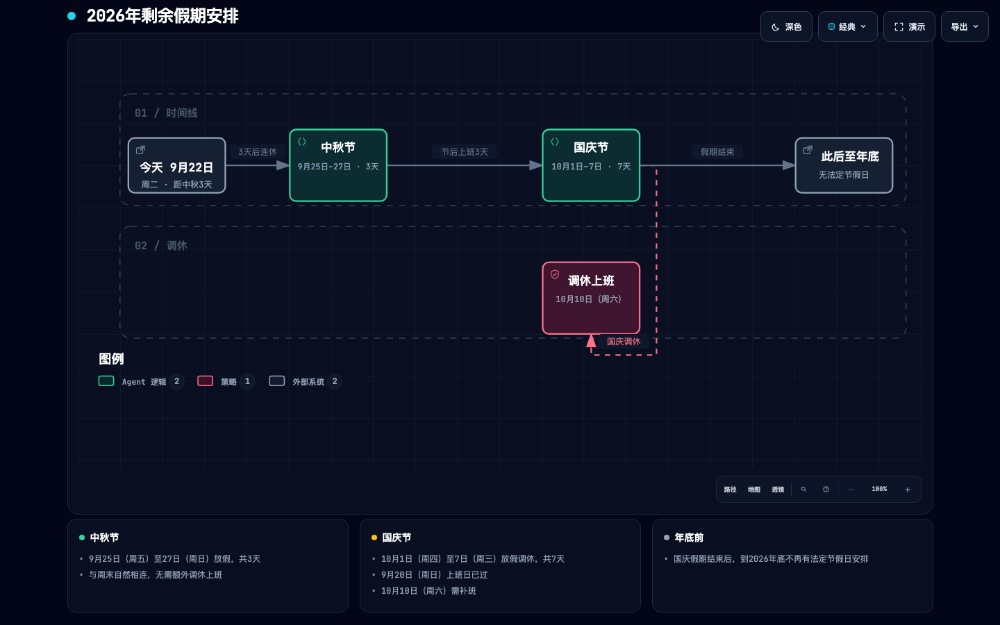
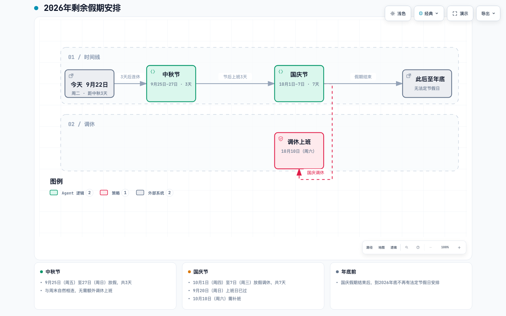

# Domain-specific node icons (#506)

Comparison base: `9b3d3f0cb930d8d2e93c66eb00f74db4974965b2`.
The baseline uses [before.workflow.json](before.workflow.json); the candidate uses
[holiday-planning.workflow.json](../../../archify/examples/holiday-planning.workflow.json).
The only authored differences are five `icon` fields and three existing legend-label overrides.
Holiday dates are fixture content supplied with the reported diagram; this change does not validate calendar policy.

| 1440×900, Classic, 100%, still | Before | After |
| --- | --- | --- |
| Dark |  |  |
| Light |  |  |

Automated delivery and browser evidence passed for both artifacts. The condensed
[evidence receipt](evidence.json) retains artifact and screenshot hashes, containment,
readability, and Viewer-chrome results. Perceptual review of the 1440×900 light/dark
captures passed: time markers, holidays, and make-up work now have appropriate
symbols and legend names; node placement and routes are unchanged.

Reproduce the candidate from the repository root:

```sh
node archify/bin/archify.mjs deliver workflow archify/examples/holiday-planning.workflow.json /tmp/holiday-icons.html --quality showcase --json
ARCHIFY_CHROME="/path/to/chrome" node archify/bin/archify.mjs visual-check /tmp/holiday-icons.html --json
```

For the baseline, use the recorded base checkout's CLI with `before.workflow.json`.
All five renderer tests also compare the entire emitted HTML with only the icon
markup removed, including with a brand mark present. The catalog is exercised in
each mode; `none` removes only the symbol and unknown names are rejected.

Validation on the original main-based implementation: 1,350 passed, 53 skipped,
zero failures. After adapting to dev, the five-mode icon suite passed independently
in two runs. Both dev-base/candidate Chrome visual checks passed. Official Node 22
is used for canonical ZIP compression; Homebrew Node 22 produces different bytes.
