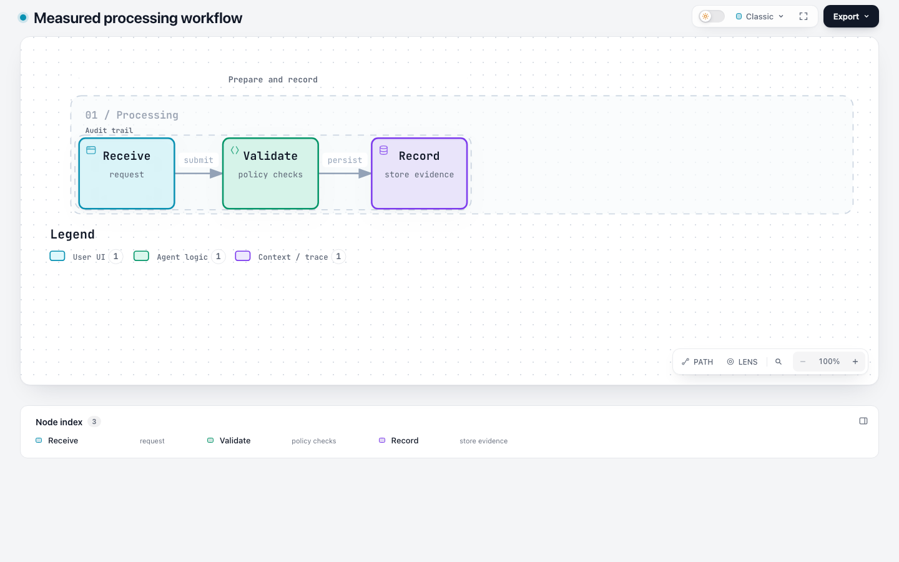
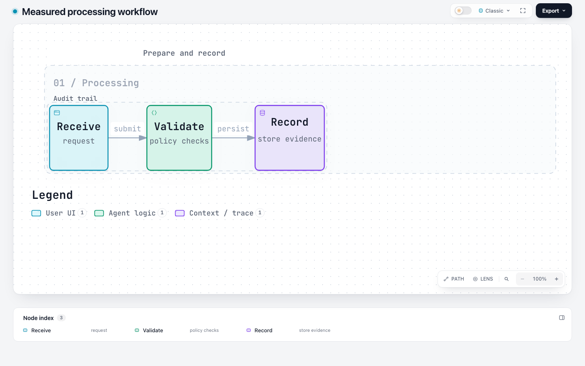
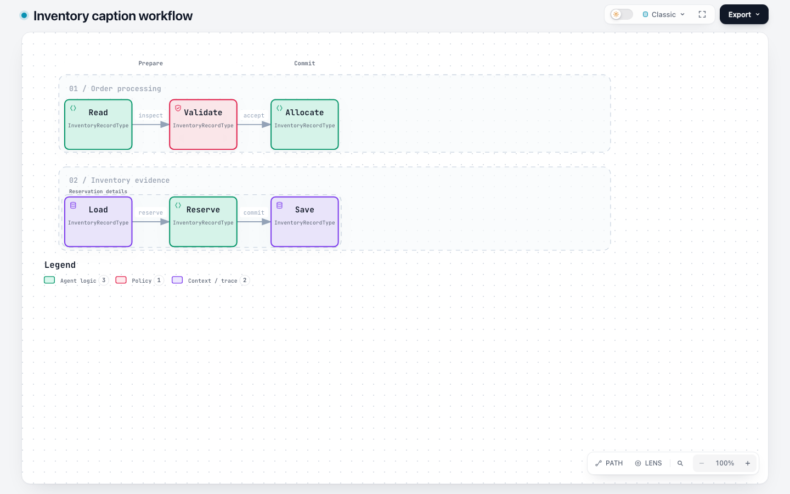
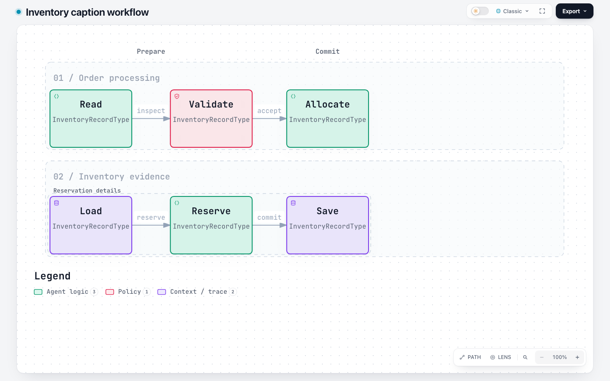
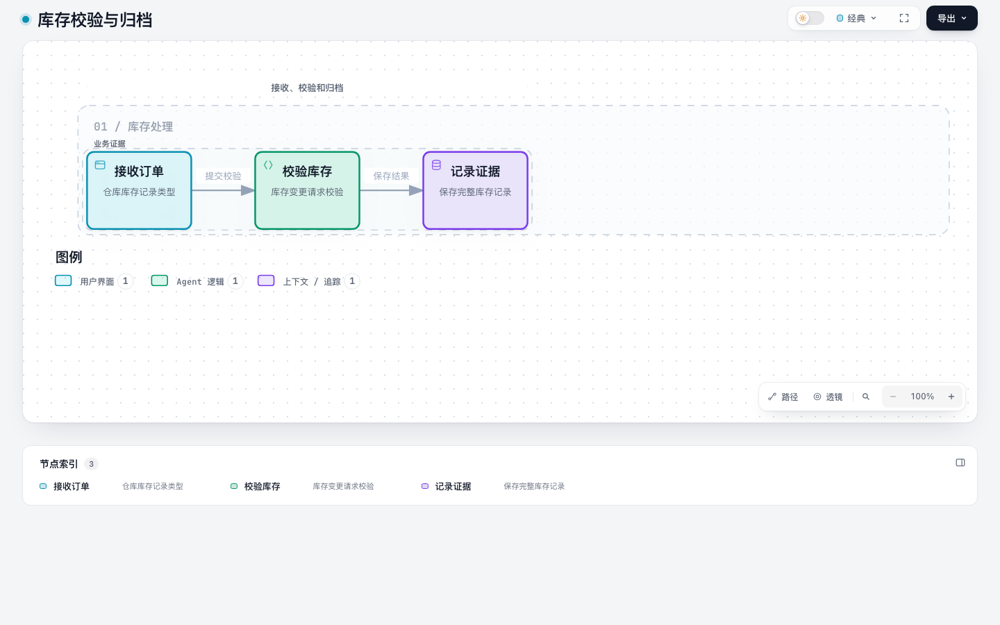
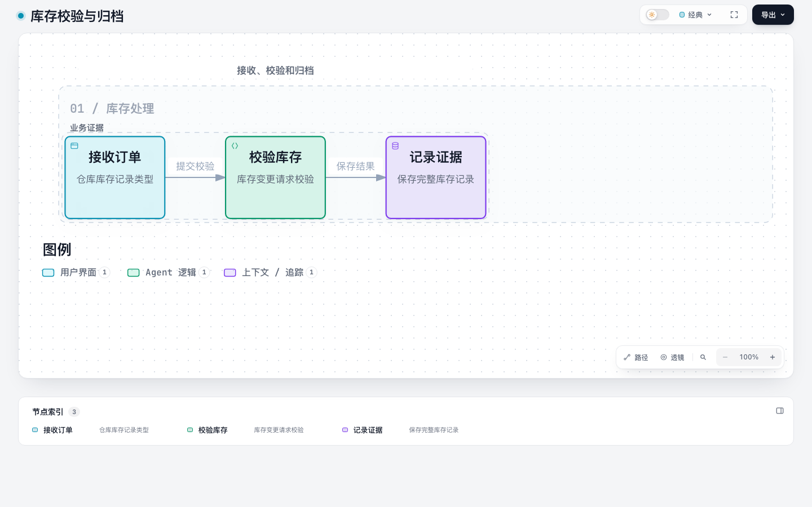
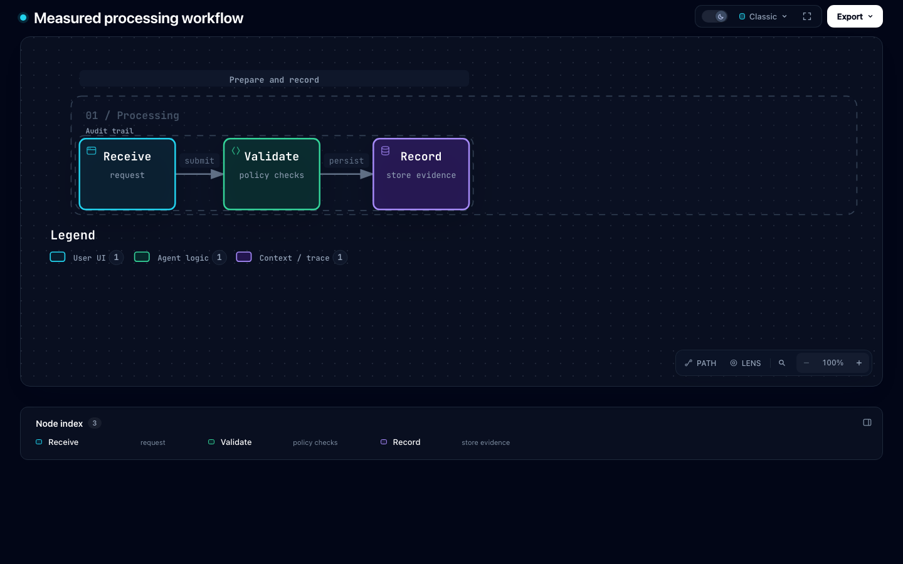
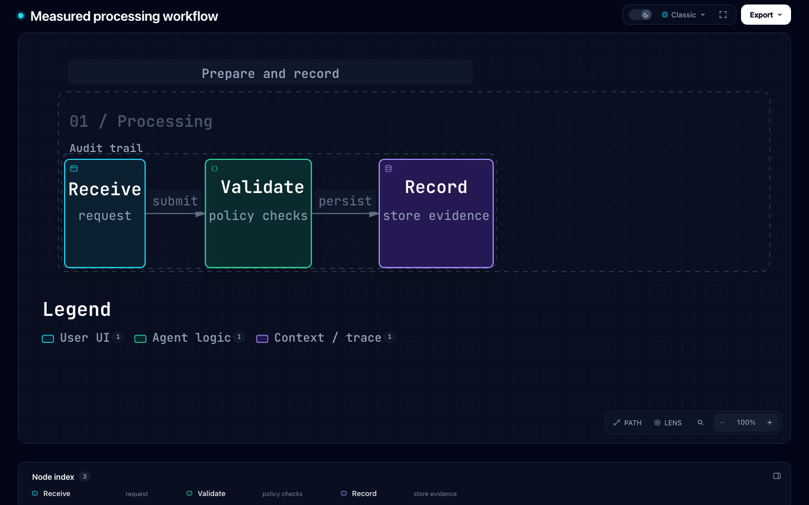

# Workflow v2 字体缩放验证（#631）

2026-10-07 两条源码上下文容量审查的修复与验证见[本轮记录](source-capacity-review/README.md)。

2026-10-04 的维护者跟进见 [字体布局与 Viewer 放大的三状态对照](zoom-comparison/README.md)：
基于最新 `dev` 的公开发布流程、可交互 HTML、同视口截图、真实字号/上下文和性能采样。
下文保留原 `f12947c` 基线的合成用例证据，不将旧结果重新标成最新基线测试。

上游基线：`f12947c420810399cfbaa254870de4f41b087bba`。
开发标识基础：已有 PR #615 的 `96acfb0f372b3c5a566dda1d93e98ee8eb0640ec`；
合并基础为 `48a4dee6726022cad5879b756e95f100205e1cb5`。
生产文件摘要和各输入对应的 HTML 摘要见 [measurements.json](measurements.json)。

## 规格与边界

用户已确认 Workflow v2 可选字号配置与布局联动的范围；上游依据为
[维护者在 #631 的回复](https://github.com/tt-a1i/archify/issues/631#issuecomment-5905457102)。
`meta.typography_scale` 为 1–2，省略或显式 1 保持原有 SVG；v1 拒绝新增字段。
节点文本、连线标签、泳道/阶段/分组标题及图例共享测量后的尺寸，显式尺寸和绝对路径坐标保持权威。
本次不调整阅读器策略或全局可读性门槛，不覆盖 Architecture #578 的字体配置。

## 可复现比较

固定输入现位于 `test/fixtures/workflow-typography/`。每对比较使用相同输入，
只增加 `meta.typography_scale`；未删除标签、节点或关系。默认 SVG 的摘要冻结到上述上游基线，
因此候选版本省略配置的行为有独立兼容性检查，非仅候选版本内部自比较。

以下命令适用于测试迁入仓库根目录后的结构（用实际 Chrome 路径替换占位符）。
重新执行会测量当前源码；下面保留的数值仍属于上面标明的历史提交。

```bash
npm ci
npm --prefix archify ci
node --test test/workflow-typography.test.mjs test/legend-typography.test.mjs
ARCHIFY_CHROME="/path/to/chrome" \
ARCHIFY_TYPOGRAPHY_EVIDENCE_DIR="/tmp/workflow-typography-evidence" \
node --test test/workflow-typography-browser.test.mjs
```

最后一个命令生成每个用例的前后 HTML、PNG 和详细 DOM 测量；环境变量仅用于测试证据输出。
浏览器条件为 Chrome、经典预设、100% 镜头缩放、READ 默认细节层级，
1440×900 和 1920×1080，深色与浅色主题，等待字体和布局稳定。

4 个用例为普通图 1.5 倍、普通图 2 倍、密集图 1.5 倍、中文图 1.5 倍。
自动检查覆盖 32 次默认页面测量和另外 32 次点击聚焦节点：检查实际文字包围盒、
行间重叠、标题与节点碰撞、标签遮罩、画布裁剪、横向溢出以及聚焦后 tag 的可见性。
READ 默认隐藏 fine/tag 的既有行为不变；隐藏文字不计入“可见副标题”最小字号。

## 测量结果

下表为 1440×900 下的实际可见副标题最小字号，深浅主题结果一致。
字号来自计算样式乘以 `getScreenCTM()` 的实际缩放，不使用静态检查的 1 倍上限。

| 用例 | 默认字号（CSS px） | 配置后（CSS px） |
|---|---:|---:|
| 普通图，1.5 倍 | 13.28 | 18.76 |
| 普通图，2 倍 | 13.28 | 22.69 |
| 密集图，1.5 倍 | 9.72 | 15.98 |
| 中文图，1.5 倍 | 13.05 | 17.11 |

密集图在原有 **930px 静态预算**下，CLI `validate --json` 的
`composition.desktopReadability.minimumProjectedTextPx` 从 **6.789** 变为 **11.16**，
`actualBudgetPx=930`、`hardFloorPx=6` 均保持不变。该合成用例满足下游 9px 目标；
不能据此推断任意长文案或密集图都能在固定屏幕达到同一目标。

以下为保留的代表性截图；完整 32 张可通过命令重建。

### 普通图：默认 / 1.5 倍




### 密集图：默认 / 1.5 倍




### 中文图：默认 / 1.5 倍




### 深色主题：默认 / 2 倍




## 视觉审阅与局限

已查看普通、密集、中文及 2 倍缩放的代表性截图，文字变大且文案保留，
没有观察到节点文字越界或标签重叠。增大字体需要更多空间；本次不改变自动阅读器策略，
也不把其既有细节隐藏机制当作文字丢失。上述截图检查与自动浏览器断言分别构成证据，
不声称人工逐页审阅了全部 32 张截图，也未对任意系统字体或设备作普遍保证。

单行紧凑节点、真正不足的固定宽高、固定画布、via/labelAt/channelX/channelY、
配置范围以及布局回执中的字号均有公开接口回归测试。schema validator 与发布 ZIP
由源码重新生成；其他已发布示例没有配置缩放，其 SVG 保持兼容。
