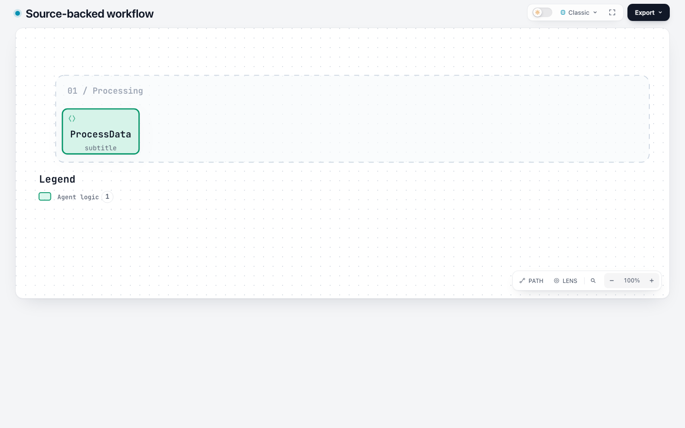
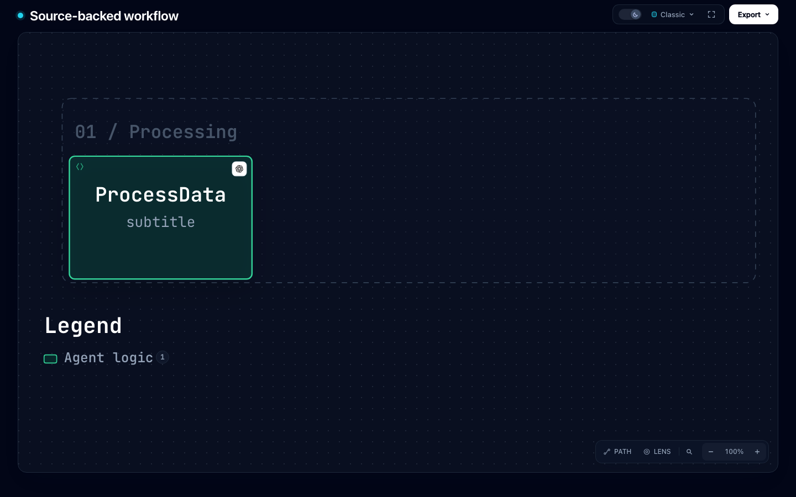

# 源码上下文容量修复记录（#649）

本轮落实[维护者完整审查](https://github.com/tt-a1i/archify/pull/649#pullrequestreview-5416198018)
中的两条 P2：自动高度遗漏源码上下文，以及修复探测遗漏 `sourceEvidence`。
维护者已认可字体控制的价值；四份历史 HTML 的单独归档是非阻塞建议。

## 已确认规格

- 自动高度与容量校验使用同一套、包含已验证来源信息和品牌图标的文本测量。
- 节点尺寸同时参与列间避让、泳道与分组空间、节点定位、路由和 SVG，不在绘制末尾单独加高。
- 省略倍率、显式倍率 `1` 和 schema v1 保留既有行为；作者指定的尺寸、画布和路径仍保持权威。
- 修复探测沿用原来的 `sourceEvidence`、已解析品牌信息和质量配置，禁止在探测内再次发现修复，避免递归。
- JSON 克隆会丢失品牌解析信息，因此候选节点按稳定 ID 恢复已有解析上下文；不重新解析或抓取品牌资源。
- 每项提供给用户的尺寸建议都在相同仓库上下文下通过公开 `validate` 和 `render` 重放。
- 当前 Viewer 的来源交互位于 Focus/Finder；不恢复上游已经移除的节点来源徽章。

## 比较版本

- 维护者审查 head：`3ceffd6561002376f30c307a64dcf069e6361549`。
- 本轮上游基线：`7112cc6d559f7b74fb156cfafe6aa501d1fdf120`。
- 合并与测试目录迁移完成后的未修复版本：`75c6721f910f3d78db8e87716acd9827a293b750`。
- 完成修复并重新构建 ZIP 的运行时版本：`417282bf86a2ad071f5416cc1a68eef7bdd1a55a`。
- 该整合版本的原有字体/图例专项 28 项通过；这不能代替新增失败场景的验证。

## 初始复现

使用含一行 `source.js` 的临时 Git 仓库、与输入一致的 origin/revision，以及相同的 `--repo-root`。

| 输入 | 修复前表现 |
| --- | --- |
| 来源节点，倍率 1.01，自动尺寸 | 自动 `92×53`，容量检查要求高度 54；validate/render 失败。 |
| 来源与品牌节点，倍率 1.1，自动尺寸 | 自动 `136×58`，容量检查要求高度 60；validate/render 失败。 |
| 来源节点，倍率 1.01，固定 `92×40` | 提供删除宽高的建议，但按建议重放仍失败；设为 `92×54` 可通过。 |

## 验证记录

官方 Node 22.23.1、bundled zlib `1.3.1-e00f703`，macOS，Chrome 154.0.8037.98。
下面的运行时验证结果固定于 `417282bf` 的源码及测试；后续仓库证据工具变更单独记录。

| 检查 | 结果 |
| --- | --- |
| 初始新增 CLI 回归（整合版本） | 10 项中 5 项失败，抓到自动高度、部分显式尺寸及建议重放问题。 |
| 最终字体 CLI 专项 | 35 通过、0 失败、0 跳过。 |
| 真实 Chrome 字体专项 | 6 通过、0 失败、0 跳过，含两个新的源码场景。 |
| 仓库根目录完整 `npm test` | 2727 通过、0 失败、102 跳过，约 393 秒。可选平台/浏览器跳过不计为通过；字体浏览器专项单独执行。 |
| 默认输出兼容比较 | 十类图、16 个固定输入，公开 validate/render 均成功，完整 HTML 和原始 SVG 均逐字节一致。 |
| canonical ZIP | 两次构建字节一致；在仓库外解包、无已安装依赖的 macOS package smoke 通过。 |

兼容性原始记录见 [default-compatibility.json](default-compatibility.json)，覆盖六种原有类型、
class/tree/timeline/waterfall、三个字体夹具、v1 Workflow 和两个来源输入。
品牌默认倍率的对照使用合法的显式 `140×80` 节点，避免将既有不足宽度输入误作兼容基线。

### 修复探测的独立回归

两个节点都需要修复时，只修改其中一个不能让整张图通过，诊断不应宣称该单节点建议有效：

- 来源节点：两个显式 `92×53` 节点，真实所需高度为 54；遗漏来源上下文时最小高度变成 52。
- 来源＋品牌节点：两个显式 `136×59` 节点，真实所需高度为 60；JSON 克隆丢失品牌上下文也会误判。

最终测试断言上述场景没有虚假的单节点建议；先修好另一个节点后，对剩余节点返回的每条建议
都在相同 `--repo-root` 下重新 validate/render，检查输入、来源和品牌仍保留。
品牌场景反转作者节点顺序，验证诊断路径和品牌上下文按节点 ID 对应。

为防止自动高度修复掩盖第二个缺陷，还在临时副本中保留自动高度修复、只删除探测中的
`sourceEvidence`，确认双 `92×53` 回归会失败。该中间源码的摘要与实验边界见
[source-probe-mutation.json](source-probe-mutation.json)；它不是最终提交的替代验证。

独立复审还通过公开 CLI 检查了分组、偏移、临界垂直重叠、同列堆叠及真实连线；
预先解析后冻结的品牌节点也保持原输入和可执行修复。没有发现剩余阻断问题。

### 浏览器与视觉检查

原有四个普通/密集/CJK/大倍率用例继续运行；新增来源 1.01 倍浅色和来源＋品牌＋tag 2 倍深色。
DOM 检查验证文字、品牌和类型图标在框内且互不遮挡，节点点击后 Focus 中保留精确 revision 的来源链接，
来源 payload 和无障碍计数仍在。数据见 [browser-observations.json](browser-observations.json)。

人工查看了下面两个默认阅读状态截图，没有观察到文字裁切或装饰遮挡。tag 仍遵循默认 READ 隐藏、聚焦后显示的规则；
其显示与 Focus 链接由额外的自动交互断言验证。这里没有恢复旧 SRC 徽章，也不构成移动端或任意图的视觉保证。




## 重现命令

以下从同步后的仓库根目录执行，先使用上述官方 Node 22 工具链：

```sh
npm ci
npm --prefix archify ci
node --test test/workflow-typography.test.mjs test/legend-typography.test.mjs
ARCHIFY_CHROME="/path/to/chrome" \
ARCHIFY_TYPOGRAPHY_EVIDENCE_DIR="/tmp/archify-typography-source-evidence" \
node --test test/workflow-typography-browser.test.mjs
npm test
```

将基线检出到独立目录后，比较相同输入的完整产物；脚本会记录两个目录的实际 Git SHA：

```sh
node docs/evidence/workflow-typography/source-capacity-review/compare-defaults.mjs \
  /absolute/path/to/archify-at-7112cc6d
```

ZIP SHA-256：`ec2032190fd415ebfe4291d11d9bfe4f432ff572e6717451e6f0a96456150074`。
校验器由合并后的十类 schema 重新生成；该运行时修复没有新增 schema 字段或版本标识。
以前的三状态 HTML/截图保留原版本归属，不能重新标为此次最新 `dev` 的浏览器结果。
本地结果与远端最终 head 的 CI、维护者复审及正式发布仍分别记录。

## 证据工具的复审收尾

完整自动审查另指出：历史对照生成器不能改写已经绑定截图的 HTML。
当前 `zoom-comparison/generate.mjs` 默认分配新的临时目录，显式输出路径只接受新目录或空目录。
非空目录及普通文件路径会在任何产物写入前被拒绝，并同步更新了重放命令。

`test/typography-evidence-output.test.mjs` 的 6 项文件系统/CLI 回归先失败后通过，
覆盖默认目录隔离、显式路径、旧文件字节保留以及真实 CLI 接线；语法和帮助输出检查通过。
该项只改变仓库证据工具及其测试，不改变上述运行时或 ZIP。
复核确认 26 份历史 HTML/PNG/JSON 的摘要完全不变，历史 `generatorSha256` 仍属于原版本。
