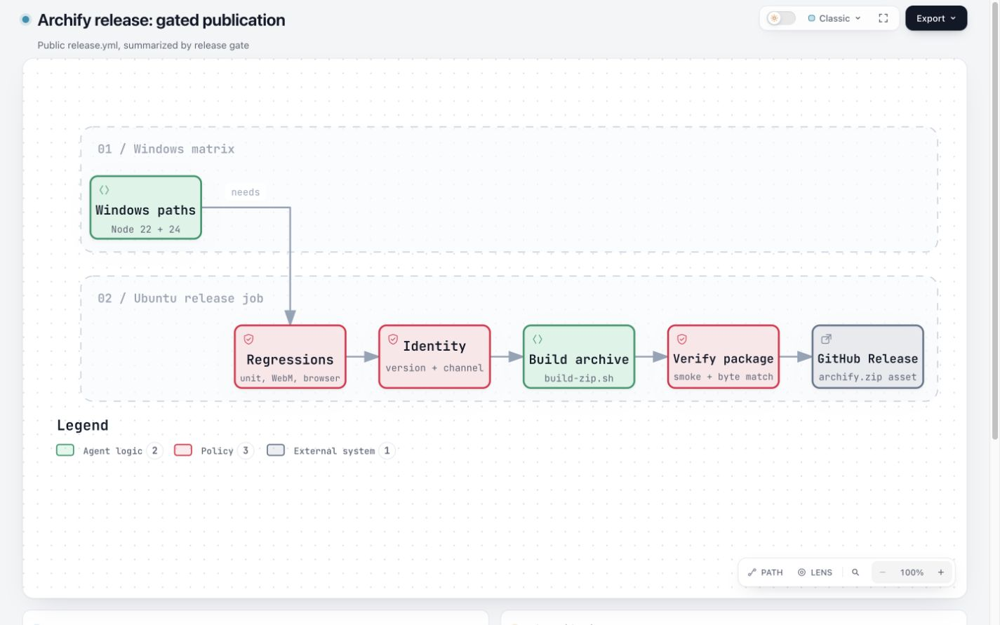
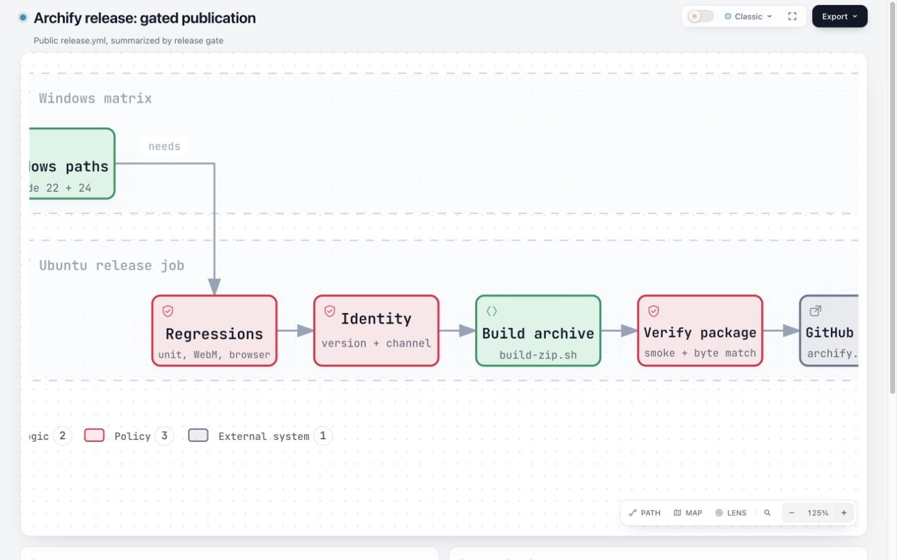
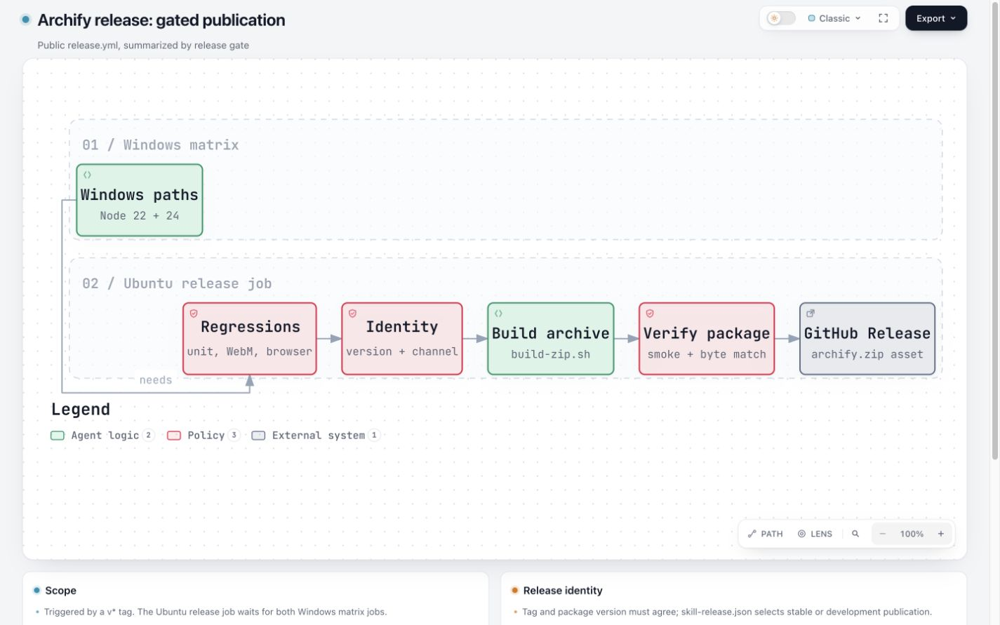
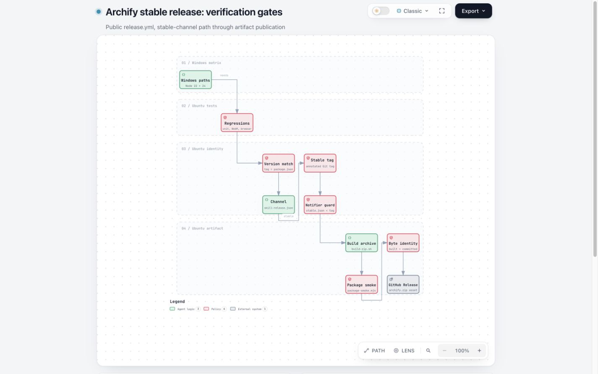
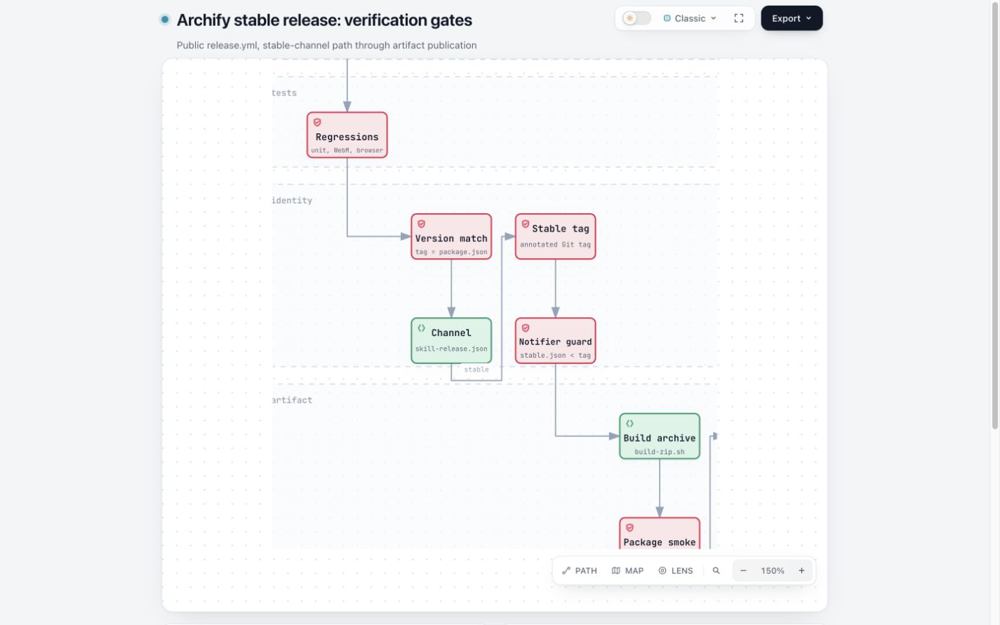
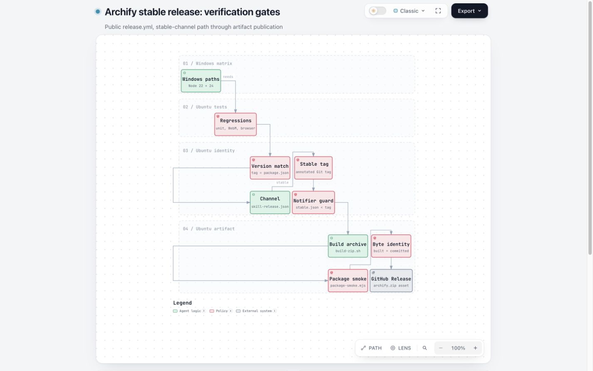

# 字体布局与 Viewer 放大的三状态对照

本次回应 [#649 的维护者问题](https://github.com/tt-a1i/archify/pull/649#issuecomment-5977152445)：
现有放大已经可以改善局部阅读；字体配置额外提供的是生成时的文字与几何比例控制。
在这两张公开发布流程图上，新版 100% 能以更大的文字保留全部节点，原版放大到近似字号后需要平移查看端点。
但这不证明任意图都能满足 9px，也不证明新版的每条自动连线更美观。

## 输入、版本与验收范围

- 基线：`98c839a43eedb95f38700aa5243ea778c0482777`，2026-10-04 核对的 `dev`。
- 候选运行时：`ae9255f7412799488544dc4910892a306da45caf`，已合并该基线。后续证据提交不改变运行时。
- [来源映射](source-map.md)把每个节点对应到同一提交的 `.github/workflows/release.yml`；这是实际配置的摘要，不代表一次发布成功。
- 概览图：6 个节点、5 条边；稳定版门禁图：10 个节点、9 条边。后者展开版本、通道、稳定 tag、通知清单和归档验证。
- 两图均由编译器计算画布和节点大小，没有为对比指定固定 viewBox 或节点宽高。稳定版图使用相同的上下偏移表达同列顺序步骤。
- 新版只增加 `meta.typography_scale: 1.5`。节点、边 ID、作者文字不变；候选默认倍率的完整 HTML 与基线逐字节一致。
- 这两图不冒充 #631 的 n14/WMS 私有输入。公开讨论尚未提供那两个项目的完整可重放 JSON，因此其真实验收仍需原报告者补充输入。

运行时摘要、输入/HTML/SVG 摘要和 CLI 回执见 [generation.json](generation.json)。
这些 HTML、截图和测量保留 `3ceffd65` 归档时的字节，`generatorSha256` 仍对应当时的脚本。
当前生成脚本默认创建并打印新的临时目录；显式输出目录必须是新目录或空目录，以保持每组浏览器证据与其 HTML 对应。

## 对照方法

使用同一内置字体、Classic 预设、默认 READ 状态，浏览器页面缩放保持 100%；三态中的百分比是 **Viewer 内部镜头**。
浏览器为 Codex 内置 Chromium 154，macOS / Apple M2 Max。视口为 1440×900 和 1920×1080 CSS px，DPR 1。
每次等待字体、布局及镜头变换稳定，并回到页面顶部，所有记录的 `scrollY` 都为 0。

三个状态分别为原版 100%、原版点击实际缩放控件、新版 100%。原版选择最接近新版副标题字号的现有 25% 档位，
因此匹配误差最多约 8.9%，并非精确连续缩放。使用所有状态共有的副标题；本次 125%/150% 均保持 READ，未跨过 175% 的 FULL 切换。

[measure-browser.js](measure-browser.js)读取计算字体乘以 `getScreenCTM()` 得到真实 CSS px，
结合浏览器视口、父级 overflow 和镜头 `clip-path` 判断节点是否完整入框。
节点数量是形状的几何入框数量，不是理解度、眼动或浮层遮挡评估；截图没有展开菜单、雷达或聚焦卡片。
表中字号使用视口内副标题最小值 `inFrameSublabelMinCssPx`，本次与同态全图投影最小值一致。

## 结果

单元格为「副标题最小字号 / 完整入框节点数」。

| 流程 / 视口 | 原版 100% | 原版放大 | 新版 100% |
| --- | --- | --- | --- |
| 概览 / 1440×900 | 12.65px / 6 of 6 | 125%：15.81px / 4 of 6 | 15.86px / 6 of 6 |
| 概览 / 1920×1080 | 15.08px / 6 of 6 | 125%：18.84px / 4 of 6 | 20.52px / 6 of 6 |
| 稳定版门禁 / 1440×900 | 6.08px / 10 of 10 | 150%：9.13px / 6 of 10 | 8.39px / 10 of 10 |
| 稳定版门禁 / 1920×1080 | 7.05px / 10 of 10 | 150%：10.58px / 6 of 10 | 9.72px / 10 of 10 |

1440×900 深色的稳定版图得到相同字号和节点数。共 15 个实测状态保留于 [measurements.json](measurements.json)，
每组三态的 SVG 文字内容及边 ID 一致，全部节点文字保持在其框内；检查过程中没有相关控制台错误。

原版放大后的概览图两端节点被镜头裁切，需要平移才能看全；密集图的首尾门禁同样不能同时完整入框。
这不是内容删除。新配置让作者选择更大的生成字号，同时由布局重新安排尺寸。
本次新版无需镜头平移即可保留所有节点；下方说明卡片在部分视口仍需页面滚动。

在 1440 下，原版概览放大后的节点范围比镜头窗口宽约 168px；密集图超出约 225px 宽、97px 高。
这些是覆盖两端所需位移跨度的几何下界，不是最优阅读路径。已实际拖动概览图，分别将 Windows 和 GitHub Release 端点完整移入镜头，
见 [panning-check.json](panning-check.json)；它们无法在匹配字号时同时完整入框。

**静态指标不能代替实际使用验证。** 稳定版门禁图的 930px 静态最小字号从 7.3 变成 12，
但 1440×900 中实际副标题只有 8.39px，因为阅读器还受高度约束。因此，这份结果支持可选字体控制，
不支持“只加倍率就解决下游 9px 要求”的主张。字体阈值、930px 假设和 reader-fit 策略仍可以另行比较。

## HTML 与截图

下载 HTML 后可直接打开交互，也可按后文命令通过本地 HTTP 查看。

| 输入 | 原版 HTML | 新版 HTML |
| --- | --- | --- |
| [发布概览](release-overview.workflow.json) | [before.html](release-overview/before.html) | [after.html](release-overview/after.html) |
| [稳定版门禁](stable-release-gates.workflow.json) | [before.html](stable-release-gates/before.html) | [after.html](stable-release-gates/after.html) |

### 发布概览，1440×900

原版 100%：



原版 125%：



新版 100%：



### 稳定版门禁，1440×900

原版 100%：



原版 150%：



新版 100%：



其他完整三态：[概览 1920 原版](release-overview/before-1920x1080-light.png)、[放大](release-overview/zoom-1920x1080-light.png)、[新版](release-overview/after-1920x1080-light.png)；
[门禁 1920 原版](stable-release-gates/before-1920x1080-light.png)、[放大](stable-release-gates/zoom-1920x1080-light.png)、[新版](stable-release-gates/after-1920x1080-light.png)；
[门禁深色原版](stable-release-gates/before-1440x900-dark.png)、[放大](stable-release-gates/zoom-1440x900-dark.png)、[新版](stable-release-gates/after-1440x900-dark.png)。

人工查看了 1440 下两个流程的三态与密集图深色新版：文字更清楚，保留了完整流程，但密集图仍显得小；
概览的 Windows→Regressions 自动路线从较直接的连接变为较长的绕行。这是布局代价，不能称为全面改善。
自动布局、截图观感和真实下游阅读体验是三类不同证据；没有做读者研究或移动设备验收。

## 小型性能检查

在两个完整测试结束后串行采样，官方 Node 22.23.1 / bundled zlib 1.3.1-e00f703，macOS / Apple M2 Max。
每个 CLI 变体预热 3 次，记录 15 次，每轮轮换变体顺序；包含新进程、解析、渲染校验和写 HTML，不含单独 validate 或浏览器。

| 流程 | 基线中位数 / p95 | 候选默认中位数 / p95 | 候选 1.5 中位数 / p95 |
| --- | --- | --- | --- |
| 发布概览 | 151.79 / 155.91 ms | 151.34 / 157.05 ms | 154.29 / 157.67 ms |
| 稳定版门禁 | 174.61 / 177.46 ms | 176.40 / 181.60 ms | 176.25 / 180.63 ms |

原始采样见 [generation-benchmark.json](generation-benchmark.json)。这两个小用例的增加约 1–3ms，
与本地样本波动接近；不将其解读为零开销，也不推广到大图。

浏览器另外对四份 HTML 执行真实点击，交替 100%↔125%，每份丢弃 4 次预热，记录 16 次，所有事件 `isTrusted=true`。
[measure-interactions.js](measure-interactions.js)从浏览器捕获点击事件开始计时，读取首次、第二次 `requestAnimationFrame` 回调及镜头 CSS 变换稳定时间；
不包含自动化工具的传输时间。记录见 [interaction-benchmark.json](interaction-benchmark.json)。
原始字段 `firstFrameMs` / `twoFrameFeedbackMs` 指回调调度时间，不是经测量的实际像素呈现延迟。

| 流程 | 第二次 rAF 回调中位数：原版→新版 | 镜头稳定中位数：原版→新版 |
| --- | --- | --- |
| 发布概览 | 11.70→11.35 ms | 169.75→169.70 ms |
| 稳定版门禁 | 11.45→11.35 ms | 170.00→169.70 ms |

未观察到这两例的帧调度或镜头收敛退化。约 170ms 的稳定时间包含已有 180ms CSS 动画及 0.001 的收敛容差，
不能当成业务计算耗时；本轮也不覆盖低端设备、巨型图或长期会话。

## 重放与当前验证

先依 [source-map.md](source-map.md#可重复生成)准备固定基线，再在候选仓库根目录执行。
将 `EVIDENCE_DIR` 设为一个新目录或空目录；本目录已经包含历史证据，重放结果应使用另一目录：

```sh
NODE22="/absolute/path/to/node-v22.23.1/bin/node"
BASE_REPO="/absolute/path/to/archify-base"
EVIDENCE_DIR="/absolute/path/to/new-typography-evidence"
"$NODE22" docs/evidence/workflow-typography/zoom-comparison/generate.mjs \
  --base-repo "$BASE_REPO" --out-dir "$EVIDENCE_DIR" \
  --benchmark-runs 15 --benchmark-warmups 3
python3 -m http.server 8796 --bind 127.0.0.1 \
  --directory "$EVIDENCE_DIR"
```

打开 `http://127.0.0.1:8796/release-overview/before.html` 和对应 after 页面，设定表中的视口，
点击一次或两次 Viewer 的 Zoom in，回到页面顶部后截取视口。需机器测量时在页面开发者控制台执行
`measure-browser.js` 的内容；实际点击前执行 `measure-interactions.js`，从
`window.__archifyTypographyTiming.records` 读取结果，刷新页面移除测量监听器。
本次浏览器通过 Codex Browser 插件驱动真实控件，未修改生成 HTML。
HTML 保留渲染器的原始字节及既有空白，便于复核摘要；源码、JSON 和 Markdown 的空白检查通过，未为消除生成 HTML 的空行尾空格而改写产物。

候选运行时 `ae9255f7` 的本地验证：完整 `npm test` **2412 通过、0 失败、93 跳过**；
字体浏览器专项 **4 通过、0 失败、0 跳过**，覆盖原有 32 次页面及 32 次节点聚焦检查；
字体/图例/ERD 专项 55 项通过；解包后无已安装依赖的 package smoke 通过。
与最新 dev 合并时新增的图例回归先失败再通过，保留 ERD 的字色和字重。上述结果不代表远端 CI 或维护者已批准。
