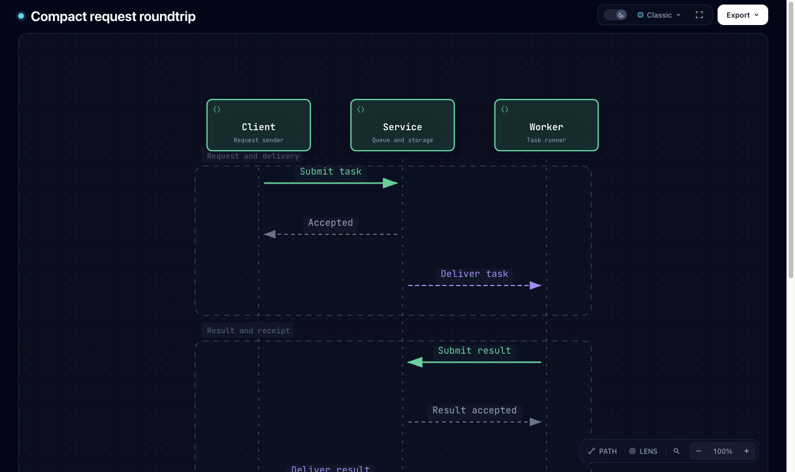
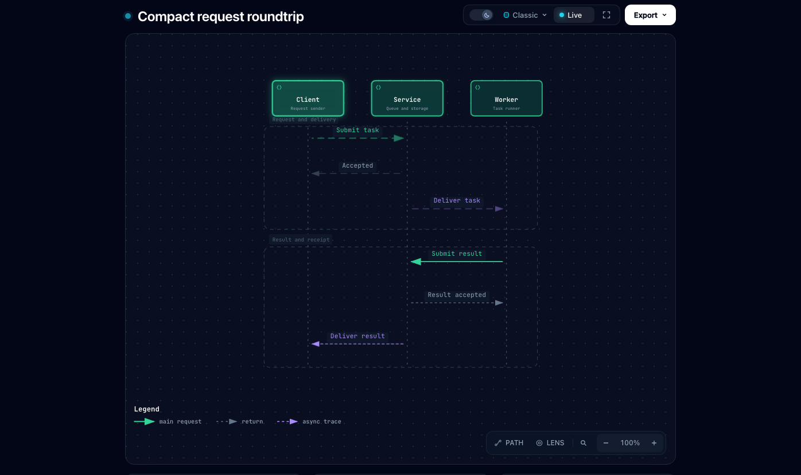

# Compact Sequence initial view

The compact automatic Sequence in the regression fixture has three participants,
six messages, and a 560×658 SVG. On `dev@9ef09617`, its ordinary initial view
enlarges to 840×987, putting the final messages and legend below the first screen.
The candidate fits the complete diagram without shrinking its source text.
Long automatic sequences retain reading width and normal page scrolling.
The original legend stays at the outer reading area's bottom-left content
corner, including when the first-screen fit does not bind the enlargement cap.

Both captures use the same redacted input, a 1396×830 viewport, dark theme,
Classic preset, Read detail, camera at 100%, and page at scrollY=0.
The baseline capture uses the unchanged base Reader fragment in the generated
fixture; its CSS differs only by the updated explanatory comment. No runtime
layout values are injected. [Observed bounds](observations.json) record the
actual browser dimensions.
The candidate includes `dev@8a1ef5c8`'s default Live motion and export cleanup;
its updated capture records that state. The older baseline keeps its original
rendering state. Motion does not change this diagram's measured layout.

| State | SVG size | Diagram bottom | Viewport height |
| --- | --- | --- | --- |
| Base | 840×987 | 1123 | 830 |
| Candidate | 575×675.6 | 811.6 | 830 |

| Before | After |
| --- | --- |
|  |  |

The fixture removes repository and source references and uses generic labels.
The reported real artifact was also inspected locally under the same conditions;
its bounds match these captures. Perceptual review passed for the intended
complete first-screen diagram, legend, and controls. Notes still belong below
the diagram and may require ordinary page scrolling.

Reproduce the candidate from the repository root:

```sh
node archify/bin/archify.mjs render sequence test/fixtures/reader-readability/compact-roundtrip.sequence.json /tmp/compact-sequence.html
ARCHIFY_CHROME="/path/to/chrome" npm run test:focus -- test/reader-layout-browser.test.mjs
```

The added browser regression fails on the base and passes on the candidate.
It also covers a shorter window and resize recovery, presentation entry/exit,
a short wide sequence, a long automatic sequence, and an explicit canvas.
The legend follow-up failed on `5e2c7ef6`: fitting was correct, but corner
placement was absent and the legend was offset from the stage's content
corner by about 219px horizontally and 52px vertically. On the final candidate,
both gaps are zero and there is no navigation overlap. The same Chrome session
also verifies 150% camera zoom, Reset, presentation and print roundtrips, and
canonical export restoration without altering the live SVG. The real reported
diagram was visually inspected after the move; the legend does not cover its
messages or segment labels. This is evidence for this input, rather than a
general content-avoidance guarantee.
Independent Chrome review exercised an expanded right rail across the fit
threshold without layout oscillation or controls leaving the viewport. A window
that cannot fit the original text size returns to the existing reading scale;
the threshold transition is not a continuously interpolated scale.

All SVG blocks in the 44 refreshed diagram HTML artifacts are byte-identical
to the latest target base, `dev@8a1ef5c8`. The Reader change affects only the
outer layout; upstream motion changes remain intact.
