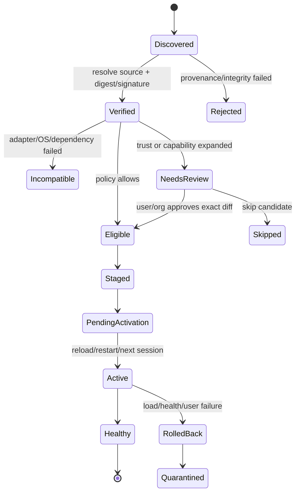

# AI Agent Skills 频繁更新提醒：市场机制与统一方案

> 调研日期：2026-08-28
> 范围：Codex、Claude Code、GitHub Copilot、Gemini CLI、Cursor、OpenCode、VS Code Agent Plugins，以及跨 Agent Skills 管理器。
> 证据口径：只采用厂商官方文档、官方规范和官方源码。普通浏览器/IDE 扩展仅作极少量 UX 旁证，不作为方案主体。

## 结论先行

市场上还没有一套同时覆盖“跨 Agent 安装、可靠版本识别、权限差异、低打扰提醒、自动更新、回滚”的完整 Skills 更新系统。现有成熟能力分散在不同产品中：

- Claude Code 的插件自动更新最完整：按 marketplace 区分默认策略，启动后延迟检查，更新写盘但不热替换当前会话，并用一次 reload 提醒完成激活。
- GitHub `gh skill` 是目前最接近“跨 Agent Skill 更新控制面”的官方工具：覆盖多种宿主，具备来源追踪、目录树 SHA、固定版本、安装前 preview、dry-run 和交互确认。
- Gemini CLI Extensions 有逐扩展 opt-in 自动更新、手动更新、预发布选择和重启后生效。
- VS Code Agent Plugins 给出了很实用的边界：官方/受控来源可以自动检查，npm/PyPI 等外部命令来源只提示、再确认安装。
- Vercel Labs `skills` 覆盖大量 Agent 目录，是较强的跨 Agent 安装适配层，但更新仍是用户主动运行命令，缺少后台提醒、权限 diff 和回滚体验。
- Codex、Cursor、OpenCode 对 Skills 的发现和使用已有官方文档，但公开文档没有形成完整的“已安装远程 Skill 更新提醒”闭环。

因此推荐建设一个独立于各 Agent 的 **Skill Update Control Plane（技能更新控制面）**：一份规范化 release/lock 状态，一次检查和风险评估，一条聚合提醒，再由 Codex、Claude、Copilot、Gemini、Cursor、OpenCode adapter 分发到各自目录或调用原生更新能力。不要让六个 Agent 对同一个 Skill 各自检查、各自弹一次。

以下段落使用两个标签：

- **来源事实**：官方资料直接支持。
- **综合推断**：基于多家机制提炼的产品/架构建议，不表示任何一家已经完整实现。

## 1. 先定义对象：Skill 不是“无代码的小插件”

**来源事实。** Agent Skills 开放规范把 Skill 定义为至少包含 `SKILL.md` 的目录，还可包含可执行的 `scripts/`、按需读取的 `references/` 和 `assets/`。规范 frontmatter 强制字段只有 `name`、`description`；`compatibility` 是自由文本，`metadata` 是字符串键值映射，`allowed-tools` 仍是实验字段。规范没有强制的版本号、发布通道、内容摘要、签名、结构化权限或更新协议。[Agent Skills Specification](https://agentskills.io/specification)

**综合推断。** 更新系统不能只比较 `version: 1.2.3`，也不能把“只改 Markdown”默认视为无风险。Skill 的说明本身会改变 Agent 行为，脚本还可能直接执行；因此候选更新至少要比较：来源身份、内容摘要、指令变化、可执行内容、工具/网络/文件/命令能力、依赖和宿主兼容性。

## 2. 市场对比矩阵

表中“未见公开机制”表示本次查阅的官方材料没有给出该能力，不等于厂商内部一定不存在。

| 生态/工具 | 对象与更新触发 | 版本、来源与完整性 | 提醒与生效 | 用户控制 | 官方证据与主要缺口 |
|---|---|---|---|---|---|
| Claude Code | Plugin；启用自动更新后，启动后在后台检查，并随机延迟 0–10 分钟 | 版本依次可来自 `plugin.json`、marketplace、Git commit SHA 或 archive SHA256；archive 可声明并校验 SHA256 | 更新写入磁盘，但当前会话继续使用旧版本；只提示一次 `/reload-plugins`，也可下次启动生效 | 官方 marketplace 默认自动，第三方/本地默认关闭；可逐 marketplace 切换；环境变量可全局关闭或强制 | [自动更新](https://code.claude.com/docs/en/discover-plugins#configure-auto-updates)、[版本管理](https://code.claude.com/docs/en/plugins-reference#version-management)、[marketplace 完整性与发布通道](https://code.claude.com/docs/en/plugin-marketplaces)。缺口：公开文档未给出 snooze、skip-this-version 和可操作 rollback |
| GitHub Copilot CLI Plugins | First-party marketplace 在受信工作目录的每次会话开始时更新；第三方 marketplace 仅在 `autoUpdate: true` 时更新；也可手动 update | Git 来源可固定精确 SHA；插件清单有严格 schema | `/plugin` 显示更新状态；CLI 支持更新单个或全部插件 | marketplace 级自动更新；组织可通过 managed configuration 约束 | [Copilot CLI plugin update options](https://docs.github.com/en/copilot/reference/copilot-cli-reference/cli-plugin-reference#copilot-plugins-update-options)。缺口：未见权限 diff、snooze、按版本跳过和 rollback 的公开说明 |
| GitHub `gh skill` | 独立 Skills；扫描 Copilot、Claude、Cursor、Codex、Gemini、OpenCode 等已知宿主目录；`gh skill update` 手动检查单个或全部 | 安装时把 source/ref/tree SHA 写入 `SKILL.md` provenance；更新比较本地 tree SHA 与远端；可固定 tag/SHA 或 `--pin` | `preview` 可在安装前浏览 `SKILL.md`、scripts/references；更新交互模式列出候选再确认；`--dry-run` 只报告 | pinned Skill 被跳过；可 `--unpin`；`--force` 覆盖本地修改 | [添加与更新 Skills](https://docs.github.com/en/copilot/how-tos/copilot-on-github/customize-copilot/customize-cloud-agent/add-skills)、[`gh skill update`](https://cli.github.com/manual/gh_skill_update)、[`gh skill preview`](https://cli.github.com/manual/gh_skill_preview)。目前最接近成熟跨 Agent 更新骨架；缺口是后台 cadence、聚合提醒、签名、兼容门和 rollback |
| Gemini CLI Extensions / Skills | Extension 可包含 agent skills；安装时 `--auto-update` 逐扩展 opt-in，也可 update 单个/全部。独立 Skill 可从 Git/本地安装，但公开 CLI 文档未见 `gemini skills update` | `gemini-extension.json` 有 `name/version`；Git 来源可指定 ref；支持 `--pre-release`；`migratedTo` 可迁移更新源。独立 `SKILL.md` 无强制 version | Extension 管理变化在 CLI 重启后生效；独立 Skill 上游提醒未见公开机制 | 安装 Extension 时可选自动更新、预发布；可启用/禁用扩展；企业安全配置可限制 Git 扩展 | [Gemini CLI extension reference](https://github.com/google-gemini/gemini-cli/blob/main/docs/extensions/reference.md)、[Managing Agent Skills](https://github.com/google-gemini/gemini-cli/blob/main/docs/cli/using-agent-skills.md)、[安全配置](https://github.com/google-gemini/gemini-cli/blob/main/docs/reference/configuration.md)。缺口：公开文档未说明提醒节流、权限 diff、完整性摘要和 rollback UX |
| VS Code Agent Plugins | Agent Plugin；自动更新开启时约每 24 小时检查，也可手动检查 | marketplace 安装有信任确认；插件可能包含 hooks/MCP；npm/PyPI 外部来源不自动更新 | marketplace 更新可自动；外部来源只显示 Update，点击后仍需确认才运行安装命令 | 全局更新策略和插件管理入口；可启用、禁用、卸载 | [VS Code Agent plugins](https://code.visualstudio.com/docs/agent-customization/agent-plugins)。优势是明确区分“受控包”和“外部安装命令” |
| Codex / ChatGPT Plugins | Plugin 是 skills/connectors 的安装包；公开商店发布时，Skill 是提交时快照；修改后需重新扫描、审阅并提交新版本 | plugin manifest 可声明版本和精确 Git/NPM 来源；提交链路会扫描和审核 Skill | 官方公开资料描述了发布与审核，但未建立本地已安装 Skill 的自动检查 cadence/提醒节流 | 发布者提交 release notes，审核后选择发布；连接服务与授权权限分开 | [Skills & Plugins](https://developers.openai.com/codex/skills-and-plugins)、[打包 Plugin](https://developers.openai.com/plugins/build/plugins)、[提交与发布](https://developers.openai.com/plugins/deploy/submission)。缺口：客户端更新提醒、permission diff 和自助 rollback 未见公开约定 |
| OpenAI Hosted Skills API | 服务端 Skill 版本对象 | 版本不可变，并有 default/latest 指向 | API 原语，不是本地 Codex Skill 更新提醒 UI | 调用方选择版本 | [OpenAI Skills API](https://developers.openai.com/api/reference/resources/skills)。可借鉴不可变版本，但不能当作 Codex 本地更新机制的证据 |
| Cursor | 启动时发现本地/插件 Skill；UI 支持从 GitHub 导入。公共 Marketplace 的首次发布和每次更新都人工审核；团队 Marketplace 可跟踪分支并在 push 后最多约 10 分钟内 re-index | Skills 可含脚本、引用和资产；Marketplace 审核是发布侧 gate，不等同于客户端签名 | 可在 Customize > Skills 查看；团队 re-index cadence 不能推断成客户端每 10 分钟检查 | 团队发布有 Default Off、Default On、Required | [Cursor Agent Skills](https://cursor.com/docs/skills)、[Plugins](https://cursor.com/docs/plugins)、[Marketplace security](https://cursor.com/help/security-and-privacy/marketplace-security)、[Plugin help](https://cursor.com/help/customization/plugins)。缺口：Skills 文档未说明 installed-vs-latest 提醒、固定版本、校验、diff 或回滚 |
| OpenCode | 从项目、用户以及 Claude/`.agents` 兼容目录发现 `SKILL.md`；V2 另支持本地目录和 HTTP catalog | 稳定版接受 `compatibility`、`metadata`；V2 catalog 有 opaque `version` 和文件列表，但无 checksum/signature；V2 明确 portability 字段不执行兼容门 | 原生 `skill` 工具按需加载；V2 catalog 可刷新缓存 | 可对 Skill 工具设权限或禁用 | [OpenCode Agent Skills](https://opencode.ai/docs/skills)、[OpenCode V2 Skills](https://opencode.ai/v2/docs/skills/)。缺口：稳定版未见 provenance/更新提醒；V2 也未见 pin、diff、签名、确认或回滚。`autoupdate: "notify"` 是 OpenCode 主程序更新，不是 Skill 更新 |
| Vercel Labs `skills` | 跨 Agent CLI；`npx skills update` 手动更新 project/global/specific Skills；推荐一份 canonical copy 再链接到多个宿主 | lock v3 记录 `skillFolderHash`/`skillPath`；GitHub 来源比较最新目录 tree SHA，well-known 来源比较 digest | 命令发现变化后直接用内部 `add -y` 重新安装；没有官方后台 reminder 服务 | 支持 scope 和指定 Skill；无法自动检查的来源会报告原因 | [Vercel Labs skills](https://github.com/vercel-labs/skills)、[项目架构与 lock 字段](https://github.com/vercel-labs/skills/blob/main/AGENTS.md)、[更新实现](https://github.com/vercel-labs/skills/blob/main/src/update.ts)。关键边界：源码把 `check`、`update`、`upgrade` 路由到同一更新流程，`check` 不是只读 dry-run；优势是宿主覆盖广，缺口是安全 diff、逐项确认、按版本抑制和 rollback |
| Agent Plugins 开放规范 | 定义可携带 Skills、MCP、hooks 等的跨 Agent Plugin 格式 | `$schema` 是机器可判定的格式兼容门；可选 `version` 推荐 SemVer | 安装、分发、启用、更新和 UI 被明确划为 client-managed | 由各客户端自行实现 | [Agent Plugins Specification](https://agent-plugins.org/specification)、[Plugin package boundary](https://agent-plugins.org/plugin-authors/build-an-agent-plugin)。说明市场为什么仍需要统一更新控制面：规范没有统一签名、checksum、提醒或回滚协议 |

## 3. 从现有产品中可复用的成熟模式

### 3.1 检查、下载、安装、激活、提醒必须解耦

**来源事实。** Claude Code 会在启动后延迟检查，更新落盘但当前会话不切换，只给一次 reload 提醒；Gemini CLI 的扩展变化也要重启会话才生效；VS Code Agent Plugins 则把自动检查与外部安装命令的显式确认分开。来源见上表。

**综合推断。** 用五个独立时间点建模：

1. `checked_at`：何时查询远端。
2. `staged_at`：何时下载到隔离区并完成校验。
3. `approved_at`：自动策略或用户何时批准。
4. `activated_at`：何时对新会话/宿主生效。
5. `notified_at`：何时真正打扰用户。

检查频繁不等于提醒频繁。后台每天检查一次完全可以只在每周摘要里提醒一次。

### 3.2 来源信任决定默认策略

**来源事实。** Claude Code 对官方 marketplace 默认开启自动更新，对第三方/本地 marketplace 默认关闭；Copilot CLI 对 first-party marketplace 在会话启动时更新，而第三方需显式 `autoUpdate: true`；VS Code Agent Plugins 的 npm/PyPI 外部来源永不自动更新，需要用户确认命令。[Claude 自动更新](https://code.claude.com/docs/en/discover-plugins#configure-auto-updates)、[Copilot 更新选项](https://docs.github.com/en/copilot/reference/copilot-cli-reference/cli-plugin-reference#copilot-plugins-update-options)、[VS Code Agent Plugins](https://code.visualstudio.com/docs/agent-customization/agent-plugins)

**综合推断。** 默认策略不应只按 semver major/minor/patch 判断，应先按 `source_trust`：

- `official-managed`：可允许低风险更新自动 staged/activated。
- `verified-publisher`：用户 opt-in 后才自动。
- `community-git`：默认 Prompt。
- `local/path/external-command`：默认 Manual；更新源或命令变化必须重新确认。

### 3.3 不可变身份比版本字符串可靠

**来源事实。** Claude 的版本解析可落到 Git commit SHA 或 archive SHA256；`gh skill` 用目录 tree SHA 判断远端是否改变；Vercel Labs `skills` 也用 `skillFolderHash`/digest；OpenAI Hosted Skills 的版本对象不可变。[Claude 版本管理](https://code.claude.com/docs/en/plugins-reference#version-management)、[`gh skill update`](https://cli.github.com/manual/gh_skill_update)、[Vercel update source](https://github.com/vercel-labs/skills/blob/main/src/update.ts)、[OpenAI Skills API](https://developers.openai.com/api/reference/resources/skills)

**综合推断。** `version` 用于人类理解和兼容策略；真正的安装身份必须是不可变的 `resolved.commit_sha`、`resolved.tree_sha` 或 `resolved.content_sha256`。校验和证明“下载内容与声明一致”，但不证明发布者可信，二者不可混为一谈。

### 3.4 固定版本、通道和依赖约束是稳定性工具

**来源事实。** `gh skill` 支持指定 tag/SHA 与 pin；Claude marketplace 可通过不同 ref/marketplace 表达 stable/latest 等通道，插件依赖可用 semver 约束，自动更新时解析满足约束的最高版本；Gemini CLI 有 `--pre-release`。[GitHub Skills](https://docs.github.com/en/copilot/how-tos/copilot-on-github/customize-copilot/customize-cloud-agent/add-skills)、[Claude 发布通道](https://code.claude.com/docs/en/plugin-marketplaces#version-resolution-and-release-channels)、[Claude 依赖](https://code.claude.com/docs/en/plugin-dependencies)、[Gemini Extension reference](https://github.com/google-gemini/gemini-cli/blob/main/docs/extensions/reference.md)

**综合推断。** 用户设置应同时支持：`channel = stable|beta|nightly`、`constraint = ^1.4`、`pin = immutable digest`。Pin 是“明确保持现状”，Skip 是“只忽略这个候选版本”，Snooze 是“稍后提醒”；三者语义必须分开。

### 3.5 当前会话不热替换

**来源事实。** Claude Code 和 Gemini CLI 都把扩展更新推迟到 reload/restart/下一会话生效。来源见上表。

**综合推断。** Agent 会话已经加载了 Skill 名称、描述乃至正文，半途中热替换会造成同一任务前后规则不一致。默认应在会话边界原子切换；只有纯静态资产且宿主明确支持时才考虑热刷新。

### 3.6 高风险变化需要重新同意

**来源事实。** Claude marketplace 的命令来源和 `headersHelper` 等高风险配置变更需要精确批准；无同意的后台更新会被跳过并进入错误状态。Skill/Plugin 本身可能以用户权限执行代码，官方要求只安装可信来源。[Claude marketplace command sources](https://code.claude.com/docs/en/plugin-marketplaces)、[Claude plugin security](https://code.claude.com/docs/en/discover-plugins#security)

GitHub 同样明确警告，Agent Skills 并不由 GitHub 验证，可能包含 prompt injection、隐藏指令或恶意脚本，建议安装前先 preview；这也是独立 Skills 不应默认无感更新的重要事实基础。[GitHub: Add and update Agent Skills](https://docs.github.com/en/copilot/how-tos/copilot-on-github/customize-copilot/customize-cloud-agent/add-skills)、[`gh skill preview`](https://cli.github.com/manual/gh_skill_preview)

**综合推断。** 需要批准的边界应是“能力或信任发生变化”，而不是“版本号变化”：新增脚本/hooks/MCP、扩大网络/文件/命令/secret 权限、更换发布者或源、改变安装命令、降低宿主兼容置信度，都应暂停自动更新并展示 diff。

### 3.7 `check`、`preview`、`apply` 必须是不同操作

**来源事实。** `gh skill preview` 可以不安装就查看 Skill 文件和内容，`gh skill update --dry-run` 只报告候选，交互更新先列出再确认。相反，Vercel Labs `skills` 当前源码把 `check`、`update`、`upgrade` 都路由到同一 `runUpdate`，发现变化后会重新安装，只有上游删除另行确认。[`gh skill preview`](https://cli.github.com/manual/gh_skill_preview)、[`gh skill update`](https://cli.github.com/manual/gh_skill_update)、[Vercel CLI routing](https://github.com/vercel-labs/skills/blob/main/src/cli.ts)、[Vercel update implementation](https://github.com/vercel-labs/skills/blob/main/src/update.ts)

**综合推断。** 更新控制面的 API 和 UI 必须严格区分：

- `check`：只取元数据、解析 candidate，不写宿主目录。
- `preview/diff`：可下载到隔离缓存，但不激活。
- `stage`：验证后准备不可变内容。
- `apply/activate`：明确改变宿主状态。

任何名为 check/dry-run 的入口都不能产生安装副作用，这是自动提醒服务可被用户信任的前提。

## 4. 推荐架构：一个控制面，多个 Agent Adapter

```text
Registries / Git / Archives / Local sources
                    │
          Resolver + Provenance verifier
                    │
       Candidate diff + Risk classifier
                    │
     Policy engine + Reminder scheduler
                    │
      Content-addressed staging store
                    │
    ┌────────┬────────┬────────┬────────┐
  Codex    Claude   Copilot   Gemini  Cursor/OpenCode
 adapter   adapter   adapter   adapter      adapters
    └────────┴────────┴────────┴────────┘
                    │
        Activation / health / rollback log
```

**综合推断。** 同一个 canonical Skill 被多个 Agent 使用时，只生成一个候选、一次安全评估、一个提醒事件；adapter 只负责宿主路径、manifest 转换、reload/restart 和原生命令调用。内容保存在 content-addressed store，宿主目录使用原子复制或链接到当前版本，避免六份内容漂移。

### 4.1 三类数据必须分开

1. **Publisher release（发布者声明，不可变）**：版本、来源、摘要、通道、兼容性、权限、依赖、变更说明、签名。
2. **Installation lock（解析结果，不可变历史）**：最终 commit/tree/content SHA、安装时间、adapter 目标、previous/LKG。
3. **User policy & reminder state（用户本地可变）**：Auto/Prompt/Manual、pin、snooze、skip-version、已批准权限、上次提醒时间。

不要把 `snoozed_until` 写进发布者 manifest，也不要让发布者覆盖用户已批准权限。

### 4.2 推荐统一 release manifest

为保持 Agent Skills 兼容，继续把 `SKILL.md` 作为运行时入口；新增 sidecar `skill-release.json`，或由 registry 在服务端提供同构记录。Agent Skills 的 `metadata` 仅是字符串映射，不适合承载复杂权限和宿主矩阵。[Agent Skills Specification](https://agentskills.io/specification) Agent Plugins 的 `$schema` 已证明“宿主不支持 schema 就拒绝”是一条可机器执行的格式兼容边界，但其 update 生命周期仍由客户端管理；本方案沿用 schema gate，再补 host capability matrix。[Agent Plugins Specification](https://agent-plugins.org/specification)

```json
{
  "schema": "skill-release/v1",
  "id": "com.example/pdf-review",
  "name": "pdf-review",
  "version": "2.3.1",
  "channel": "stable",
  "publisher": { "id": "example", "keyId": "sigstore:key-123" },
  "source": {
    "type": "git",
    "url": "https://github.com/example/skills",
    "ref": "v2.3.1",
    "subdir": "skills/pdf-review"
  },
  "resolved": {
    "commitSha": "...",
    "treeSha": "...",
    "contentSha256": "..."
  },
  "compatibility": {
    "manager": ">=1.2.0",
    "agents": {
      "codex": ">=2026.8",
      "claude-code": ">=2.1",
      "copilot-cli": "*",
      "gemini-cli": ">=0.8",
      "cursor": "*",
      "opencode": "*"
    },
    "os": ["darwin", "linux", "win32"]
  },
  "components": {
    "instructions": true,
    "scripts": ["scripts/extract.py"],
    "hooks": [],
    "mcpServers": []
  },
  "permissions": {
    "tools": ["shell:python"],
    "filesystem": ["read:user-selected"],
    "network": ["api.example.com:443"],
    "secrets": [],
    "commands": ["python scripts/extract.py"]
  },
  "dependencies": { "skills": { "base-review": "^1.4" } },
  "release": {
    "publishedAt": "2026-08-28T00:00:00Z",
    "severity": "normal",
    "breaking": false,
    "notesUrl": "https://example.com/releases/2.3.1"
  },
  "signatures": [{ "type": "sigstore", "bundle": "..." }]
}
```

manifest 必须通过 canonical JSON 计算摘要；`resolved` 字段由 resolver 锁定后写入 lock，不能盲信远端自报。结构化 permissions 是更新评审用的“能力意图”，不替代宿主运行时 sandbox/approval。

### 4.3 推荐 lock 与提醒状态

```json
{
  "skillId": "com.example/pdf-review",
  "installed": {
    "version": "2.3.0",
    "contentSha256": "old...",
    "sourceIdentity": "git:https://github.com/example/skills#skills/pdf-review",
    "activatedAt": "2026-08-01T09:00:00Z"
  },
  "candidate": {
    "version": "2.3.1",
    "contentSha256": "new...",
    "risk": "R1",
    "compatibility": "pass",
    "permissionDiff": { "added": [], "removed": [] }
  },
  "policy": {
    "mode": "prompt",
    "channel": "stable",
    "constraint": "^2.3",
    "pin": null
  },
  "reminder": {
    "eventKey": "com.example/pdf-review@new...",
    "lastNotifiedAt": null,
    "snoozedUntil": null,
    "skippedCandidate": null
  },
  "activation": {
    "previousContentSha256": "older...",
    "lastKnownGoodContentSha256": "old...",
    "targets": ["codex", "claude-code", "cursor"]
  }
}
```

`eventKey = skill_id + target_digest` 是去重核心：同一候选无论检查多少次都只累计一条 inbox 事件；新 digest 到来会自动解除旧版本的 skip，但不会解除 pin。

### 4.4 状态机



每个状态变化写入审计日志；`Rejected`、`Incompatible`、`Quarantined` 不能被普通自动更新策略绕过。

## 5. 风险分级与默认动作

| 等级 | 典型条件 | 默认更新动作 | 默认提醒 |
|---|---|---|---|
| R0 可信低风险 | 官方/已验证发布者；签名与 digest 有效；同源同通道；无权限、脚本、hook、MCP、依赖或兼容变化；用户已 opt-in 自动更新 | 24 小时冷静期后 staged，在下一会话原子激活 | 静默写入 Recent updates；周摘要可见 |
| R1 普通变化 | 指令/资产/常规功能变化；无新增特权能力；兼容通过 | Prompt 模式待用户批量更新；Auto 模式可 staged | 导航 badge + 更新收件箱；每日或每周摘要，不弹模态 |
| R2 高风险变化 | 新增/改变脚本、hooks、MCP、安装命令、网络/文件/secret 权限；换源/换发布者/换通道；兼容未知；本地副本已修改 | 阻断自动更新，要求批准精确 diff | 安静但持久的 badge；用户进入管理页时展示确认面板 |
| R3 安全事件 | 已知恶意、签名撤销、严重漏洞、来源劫持 | 立即 quarantine/禁用；有可信修复时按组织策略强制更新 | 高优先级通知，说明采取了什么动作、影响、审计与恢复入口 |

**综合推断。** 即使是 R0，也只有用户或组织事先允许该信任域自动更新时才能静默。Skill 的指令变化具有供应链风险，不建议对任意社区 Git 仓库默认自动更新。

## 6. 频繁更新时的低打扰提醒设计

### 6.1 检查 cadence

**来源事实。** VS Code Agent Plugins 提供了每 24 小时的明确行业锚点；Claude Code 使用启动后 0–10 分钟随机延迟，避免所有实例同时请求。[VS Code Agent Plugins](https://code.visualstudio.com/docs/agent-customization/agent-plugins)、[Claude 自动更新](https://code.claude.com/docs/en/discover-plugins#configure-auto-updates)

**综合推断。** 推荐默认：

- 后台：每 24 小时一次，加基于设备 ID 的确定性 ±20% jitter。
- 用户打开 Skills/Plugins 管理页：若缓存超过 15 分钟，立即刷新。
- 手动“检查更新”：立即检查，支持 dry-run。
- 网络错误：指数退避，最多 7 天；不要把失败当成“没有更新”。
- 安全撤销：独立 advisory 通道或更短 TTL，不等待普通轮询。
- 使用 ETag/If-None-Match、Git tree SHA 或 registry delta cursor，避免频繁下载完整 Skill。

### 6.2 提醒层级

1. **事件日志**：所有检查、staging、成功、失败、回滚都进入 Recent updates。
2. **导航 badge**：显示需要人处理的候选数，不显示已静默完成数。
3. **更新收件箱**：按 Skill 聚合，展示当前→目标、来源、发布者、diff、兼容、是否需 reload、回滚入口。
4. **摘要**：默认每天一次或每周一次，合并“可更新、成功、失败”。
5. **强交互**：只用于 R2 用户正主动更新时，或 R3 安全阻断；不要在 Agent 正执行任务时突然弹窗。

### 6.3 去重、延后与跳过

- 同一个 `eventKey` 最多生成一条 inbox 项；再次检查只刷新时间和严重度。
- `Snooze 1/3/7 days` 只改变下次提醒时间，不改变候选与安全状态。
- `Skip this version` 绑定不可变 target digest；新候选出现后重新提醒。
- `Pin` 绑定约束或 digest，直到用户显式 unpin；安全撤销仍可提示。
- 多 Agent adapter 失败只在同一条 Skill 事件里展开为 target 子状态，不生成六条通知。

**证据边界。** Pin/dry-run 在 `gh skill` 中有官方实现；“Snooze”和“Skip this version”在本次查阅的主流 Agent Skills 官方机制中未形成共同标准，属于本方案为高频更新补齐的产品能力。

### 6.4 一条合格的提醒至少显示

- `pdf-review 2.3.0 → 2.3.1`，以及 immutable target digest。
- 来源与发布者是否变化、签名/完整性状态。
- 变更摘要，并把 `SKILL.md` 指令、scripts、hooks、MCP、依赖分栏。
- 权限 diff：新增、收窄、移除。
- 各目标 Agent 的兼容状态与生效方式。
- “更新全部低风险项”“查看差异”“稍后”“跳过此版本”“固定当前版本”。
- 更新后“恢复上一版本”及其数据兼容警告。

## 7. 各 Agent Adapter 设计

| Adapter | 优先策略 | 激活语义 | 特殊处理 |
|---|---|---|---|
| Codex | 对公开 Plugin 走原生 marketplace/审核版本；对 standalone/local Skill 由控制面维护 lock 和内容目录 | 下一会话；宿主支持刷新时再显式调用 | 不把 OpenAI Hosted Skills API 当成本地更新器；本地修改必须 dirty-check |
| Claude Code | marketplace Plugin 优先委托原生自动更新；控制面读取/汇总 marketplace 错误和 reload 状态；独立 Skill 才走通用安装 | `/reload-plugins` 或下一启动 | 保留官方/第三方 marketplace 默认差异；高风险 command/source delta 不绕过原生同意 |
| GitHub Copilot | Plugin 走 Copilot 原生命令；独立 Skill 可复用 `gh skill` provenance/pin/dry-run，或读取同等 lock | 下一会话/宿主重载 | 避免同时让 `gh skill` 与控制面更新同一目录；明确唯一 owner |
| Gemini CLI | Extension 优先调用 `gemini extensions update`；纯 Skill 可由 adapter 安装到被发现目录或封装成 extension | 重启 CLI/extension | 映射 pre-release/channel；尊重 Git extension 安全策略与 enable/disable |
| Cursor | adapter 管理 GitHub 导入或本地 Skill 的 provenance、digest 和原子替换 | 下一次启动/重新发现 | 官方文档没有原生远端更新协议，控制面应成为唯一更新 owner |
| OpenCode | 写入 `.agents/skills` 或 OpenCode 专用目录，并维护独立 lock | 下一会话/重新扫描 | 保留 OpenCode 的 Skill tool 权限；frontmatter 未识别的更新字段放 sidecar，不依赖宿主解析 |
| VS Code Agent Plugins | marketplace 来源尽量委托原生 24h 更新；npm/PyPI/外部命令仍保留显式确认 | 按宿主 reload/restart | 不因统一控制面而绕过外部命令确认 |

Adapter 必须实现统一接口：

```ts
interface SkillHostAdapter {
  discover(): Promise<InstalledTarget[]>;
  validate(release: SkillRelease): Promise<CompatibilityResult>;
  stage(release: ResolvedRelease): Promise<StagedTarget>;
  activate(staged: StagedTarget, boundary: "reload" | "restart" | "next-session"): Promise<void>;
  healthCheck(target: InstalledTarget): Promise<HealthResult>;
  rollback(toDigest: string): Promise<void>;
}
```

## 8. 本地修改、依赖和回滚

### 8.1 本地修改

**来源事实。** `gh skill update --force` 可以覆盖本地修改，但不会删除额外本地文件；Vercel `skills` 的 update 实现会从 lock 中恢复来源并重新执行安装。[`gh skill update`](https://cli.github.com/manual/gh_skill_update)、[Vercel update implementation](https://github.com/vercel-labs/skills/blob/main/src/update.ts)

**综合推断。** 自动更新前计算安装基线与当前目录的差异。若 dirty：

- 默认进入 R2，不覆盖。
- 提供“保留当前并 fork 为 local Skill”“三方合并”“导出 patch 后替换”“放弃本地修改并更新”。
- 自动更新系统自己写入的 adapter/lock 元数据不应被误判为用户修改。

### 8.2 依赖求解

依赖求解要先于提醒：如果 A 的新版本要求 B `^3`，而 B 被 pin 在 `2.x`，通知应是“一组不可满足的更新”，而不是先提醒 A、更新后才报错。Claude 的 semver 依赖约束是可复用先例。[Claude plugin dependencies](https://code.claude.com/docs/en/plugin-dependencies)

### 8.3 真正可用的回滚

**来源事实。** Claude 会把旧 plugin 版本缓存约 14 天，但公开文档没有把它描述为面向用户的 downgrade/rollback 命令，不能把“有缓存”误报成“已有回滚”。[Claude plugin caching](https://code.claude.com/docs/en/plugins-reference#plugin-caching-and-file-resolution)

**综合推断。** 每次激活前保留 `previous` 与 `lastKnownGood`：

- 内容目录不可变，激活只是原子切换 `current` 指针。
- parse/load/adapter 部署失败自动回滚。
- 用户可在 Recent updates 中一键回滚。
- 回滚同时 quarantine 失败 digest，直到用户显式重试或发布新 digest。
- 若 Skill 写入了外部数据，release manifest 应声明数据迁移和 `rollbackSafe`；否则只回滚 Skill 文件可能不安全。

## 9. 反模式

1. **每次检查都弹窗。** 会把高频发布直接变成通知疲劳。
2. **只比较 semver。** 发布者可复用版本号，Git 分支会移动；必须锁不可变摘要。
3. **把 checksum 当成信任。** 它只能证明内容一致，不能证明来源善意。
4. **把“只改提示词”视为无风险。** 指令变化可能引入 prompt injection、数据外传或行为漂移。
5. **对所有第三方源默认自动更新。** 与 Claude、Copilot、VS Code Agent Plugins 的信任分层经验相反。
6. **更新当前活跃会话。** 同一任务内出现两套 Skill 规则，难以审计和复现。
7. **一个 Agent 一套提醒。** 同一 Skill 被六个宿主重复提醒，是跨 Agent 用户最明显的噪声来源。
8. **静默覆盖本地修改。** 破坏用户定制，且无法判断新版本失败还是本地 patch 失败。
9. **失败后继续反复尝试并反复提醒。** 应 quarantine 失败 digest，并对事件去重。
10. **把缓存宣传成回滚。** 没有原子切换、状态恢复、入口和审计的缓存不等于可用回滚。
11. **只写 changelog，不展示能力 diff。** 用户真正需要知道的是新增脚本、工具、网络、secret、MCP 和来源变化。
12. **由管理器绕过宿主安全确认。** Adapter 必须保留 Claude 高风险来源同意、Gemini 企业策略、VS Code 外部命令确认等原生边界。

## 10. 推荐落地路线

### MVP：先解决“知道有更新，但不骚扰，也不装错”

建议 4–6 周完成：

- 支持 Git/HTTPS archive/local 三类源，至少覆盖 Codex、Claude、Cursor、OpenCode 的目录 adapter。
- 建立 `skill-release.json`、lock v1、source identity、commit/tree/content SHA。
- 手动 `check --dry-run` 和每天一次后台检查；24h + jitter。
- 候选更新收件箱、导航 badge、按 `skill_id@digest` 去重。
- 展示 `SKILL.md`、scripts/hooks/MCP、来源和权限的结构化 diff。
- 默认模式：官方/验证源 Prompt，社区 Git Prompt，本地 Manual；MVP 不做静默自动激活。
- 下一会话原子激活，保留 previous，支持手动回滚。
- 检测本地 dirty，禁止静默覆盖。

MVP 验收指标：

- 同一候选在 30 天内最多产生 1 条活跃 inbox 事件。
- 六个 Agent 共用一个 Skill 时只生成 1 条用户提醒。
- 100% 安装都有不可变 digest 和来源记录。
- R2 条件 100% 阻断自动激活。
- adapter 安装失败不改变当前可用版本。

### V1：可信低风险自动更新

- 补齐 Gemini、Copilot、VS Code Agent Plugin adapter，并能委托原生 updater。
- Publisher key/signature、组织 allowlist、channel/constraint/pin。
- R0 自动 staged，下一会话激活；每日/每周摘要。
- 兼容矩阵、依赖求解、reload/restart 编排。
- 激活健康检查、自动 rollback、失败 digest quarantine。
- Snooze、Skip this version、Recent updates、审计导出。

### 进阶：面向团队和 marketplace

- Registry advisory/revocation 通道与强制 quarantine 策略。
- 灰度发布：1% → 5% → 25% → 100%，按加载失败、rollback、用户拒绝率自动暂停。
- 透明日志、可验证构建、签名轮换、SBOM/脚本依赖扫描。
- 团队策略：可信 publisher、自动更新窗口、最大版本跨度、冻结期、紧急例外。
- 多设备同步“策略”，但不跨设备复制 secret 或本地批准令牌。
- 语义评估：对高影响 Skill 在隔离样例任务上跑回归 eval，再进入 R0/R1。

## 11. 监控指标与防打扰预算

| 指标 | 目标方向 | 用途 |
|---|---|---|
| 每用户每周主动提醒数 | 下降；建议普通更新 ≤ 1 个摘要 | 衡量打扰 |
| badge 打开率 / 更新执行率 | 上升 | 衡量提醒是否有用 |
| 发现到安全修复激活时间 | 下降 | 衡量安全时效 |
| 自动更新失败率 | < 0.5% 起步目标 | 决定是否扩大 R0 |
| 更新后 24h rollback 率 | < 1% 起步目标 | 发现坏版本 |
| R2 误放行率 | 0 | 安全红线 |
| 重复事件率 | 0 | 验证 eventKey 去重 |
| 多 Agent 重复提醒率 | 0 | 验证控制面聚合 |
| 长期 stale 且有高危 advisory 的 Skill 数 | 下降并告警 | 避免 pin/skip 掩盖风险 |

自动更新只有在来源可验证、diff 可解释、激活可回滚、失败可观测四项同时成立时才应扩大范围。

## 12. 最终产品建议

推荐默认体验是：**后台每天检查，平时不弹；一个更新中心聚合所有 Agent；可信且无能力扩张的更新可在用户 opt-in 后于下一会话静默生效；新增脚本、权限、MCP、来源或不兼容变化必须持久提醒并重新批准；任何更新都能看到来源、digest、diff、目标 Agent 和回滚入口。**

这套设计不是复制某一家，而是以 GitHub `gh skill` 的 provenance/pin/preview/dry-run/confirm 为控制面骨架，组合 Claude 的信任分层与会话边界、Gemini 的逐扩展 auto-update 与 restart、VS Code Agent Plugins 的外部命令确认、Cursor 的 marketplace 更新复审、Vercel `skills` 的 canonical copy 与跨 Agent adapter 思路，再补上当前市场普遍缺失的统一提醒状态、权限 diff 和真正回滚。

## 官方来源索引

- [Agent Skills Specification](https://agentskills.io/specification)
- [OpenAI Skills & Plugins](https://developers.openai.com/codex/skills-and-plugins)
- [OpenAI: Package your plugin](https://developers.openai.com/plugins/build/plugins)
- [OpenAI: Submit plugins](https://developers.openai.com/plugins/deploy/submission)
- [OpenAI Skills API](https://developers.openai.com/api/reference/resources/skills)
- [Claude Code: Discover and install plugins](https://code.claude.com/docs/en/discover-plugins)
- [Claude Code: Plugins reference](https://code.claude.com/docs/en/plugins-reference)
- [Claude Code: Plugin marketplaces](https://code.claude.com/docs/en/plugin-marketplaces)
- [Claude Code: Plugin dependencies](https://code.claude.com/docs/en/plugin-dependencies)
- [GitHub Copilot CLI plugin reference](https://docs.github.com/en/copilot/reference/copilot-cli-reference/cli-plugin-reference)
- [GitHub: Add and update Agent Skills](https://docs.github.com/en/copilot/how-tos/copilot-on-github/customize-copilot/customize-cloud-agent/add-skills)
- [GitHub CLI: gh skill update](https://cli.github.com/manual/gh_skill_update)
- [GitHub CLI: gh skill preview](https://cli.github.com/manual/gh_skill_preview)
- [Gemini CLI extension reference](https://github.com/google-gemini/gemini-cli/blob/main/docs/extensions/reference.md)
- [Gemini CLI security/configuration](https://github.com/google-gemini/gemini-cli/blob/main/docs/reference/configuration.md)
- [VS Code Agent Plugins](https://code.visualstudio.com/docs/agent-customization/agent-plugins)
- [Cursor Agent Skills](https://cursor.com/docs/skills)
- [OpenCode Agent Skills](https://opencode.ai/docs/skills)
- [OpenCode V2 Agent Skills](https://opencode.ai/v2/docs/skills/)
- [Vercel Labs skills](https://github.com/vercel-labs/skills)
- [Vercel Labs skills update implementation](https://github.com/vercel-labs/skills/blob/main/src/update.ts)
- [Agent Plugins Specification](https://agent-plugins.org/specification)
