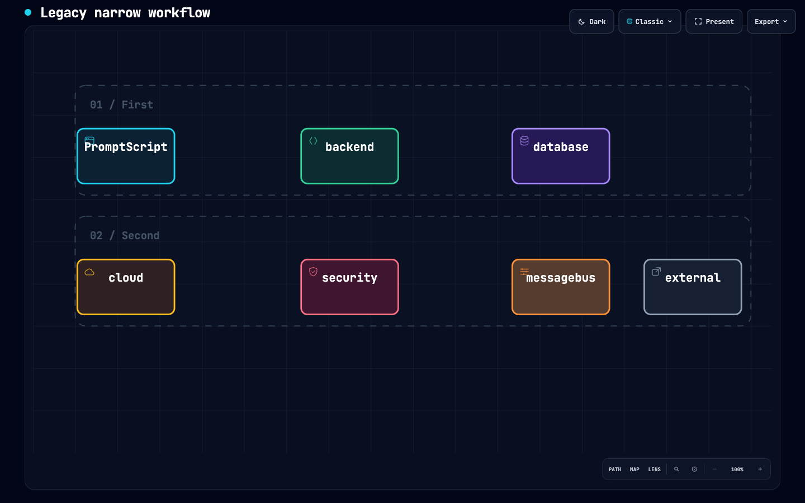
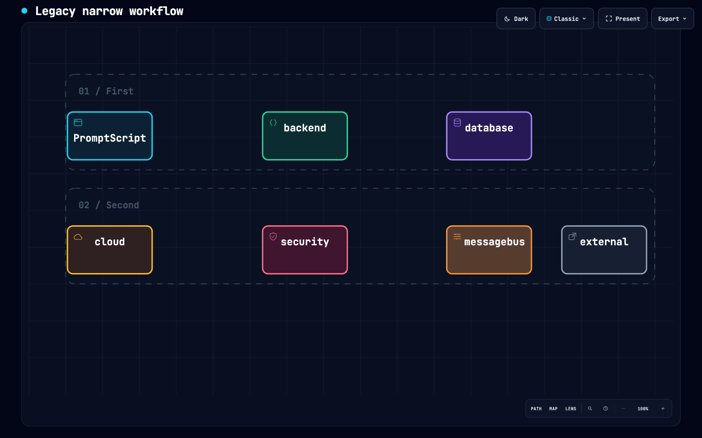
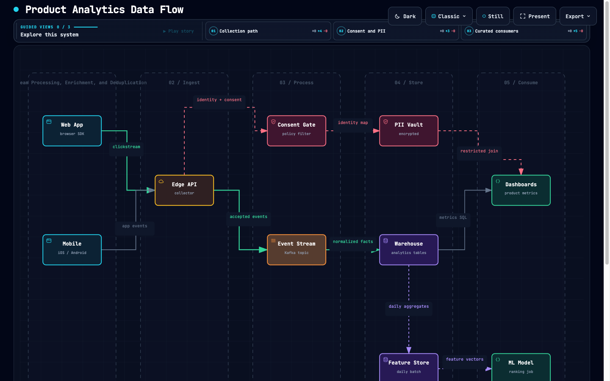

# Label clearance without rejecting existing diagrams

Comparison base: `dev` at `5769206e556e3a74a382b826ad84391080280ccc`.
Related work: [#199](https://github.com/tt-a1i/archify/issues/199),
[#220](https://github.com/tt-a1i/archify/pull/220),
[#257](https://github.com/tt-a1i/archify/pull/257), and the already merged
[#425](https://github.com/tt-a1i/archify/pull/425).

## Behavior and compatibility

Workflow v1/v2, dataflow and lifecycle node labels move only when their existing
position reaches the semantic icon or lifecycle step. The existing node font
size is retained. When horizontal clearance is insufficient, the text stack
moves below the decoration rail inside the same authored box. Deliberately
short fixed boxes retain their text and use a smaller decorative icon instead.

Dataflow stage titles include their ordinal in width measurement, fit down to
7px, then wrap by word or grapheme when the stage has room above its nodes.
No new validation error is introduced. If an extreme title or explicit node
position leaves insufficient room, the compatible single-line rendering is
retained: this avoids creating a new vertical collision, but does not claim to
solve arbitrary text overflow inside fixed geometry.

Node positions, sizes, ports, edge routes, topology, label contents, node font
sizes, schemas and acceptance rules remain unchanged. Stage title size and line
breaks, and colliding node text positions, intentionally change. Sequence keeps
#425's separate icon/title/context rows unchanged. The fixed-v1 regression now
pins the old SVG after normalizing only node text coordinates; all remaining
bytes are still compared to hashes obtained from the pre-fix base.

## Reproductions and evidence

`archify/test/label-clearance.test.mjs` exercises the public `deliver` command:

- A 50px dataflow node named `Ingester` still delivers in standard and showcase.
- A 92px workflow v1/v2 node named `PromptScript` clears the sigil at 11px.
- A 32px-high fixed workflow node retains its bounds and complete text.
- Lifecycle step, title, sublabel and tag remain present.
- `Stream Processing, Enrichment, and Deduplication` wraps without failing in
  standard or showcase; Chinese text remains complete; an extreme title cannot
  wrap down into the node area.

Local test commands (Node 22.23.2):

- `npm test` from `archify/`: freshness and golden gates passed; 2,108 tests,
  2,039 passed, 0 failed, 69 skipped. Skips include optional Chrome suites and
  platform-specific cases, not browser passes.
- `node --test test/label-clearance.test.mjs`: 10/10 passed, also included in
  the full suite. `workflow-compiler`, `layout-rules` and `sequence-column-fit`
  are included in the full suite.

Additional matched-input local evidence:

- 14 input/profile pairs delivered on both base and candidate (28 successful
  calls). All pairs retained node rectangles, full node text, font sizes and
  viewBox; compared edge paths were identical. Sequence artifacts were retained.
- Nine candidate diagrams at 1440×900 and 2048×900, light and dark (36 browser
  states): no measured label/sigil, label/brand or node-text intersections.
  The medium, long and CJK stage-title samples stayed within their stage width.
  Browser checks waited for fonts, reader layout and theme transitions.
- Real workflow SVG and PNG downloads succeeded; the exported PNG was visually
  inspected. Clicking the repaired node still opened its semantic passport.
- An extracted ZIP outside the repository delivered the workflow, narrow-node
  and long-stage-title reproductions successfully.
- Gallery generation: 11 artifacts / 99 checks. Changed examples, affected
  gallery artifacts and their receipts, and `archify.zip` were regenerated.

Perceptual review passed for the shown reproductions. Browser measurements,
structural comparisons, unit tests and perceptual inspection are separate
claims; none establishes universal absence of regressions.

### Workflow overlap

Same input and viewport, before and after. The `PromptScript` label keeps its
font size and node bounds while moving below the icon.

| Base | Candidate |
| --- | --- |
|  |  |

### Long stage title

The title wraps inside the existing stage frame without rejecting the input.

| Base | Candidate |
| --- | --- |
|  |  |

## Attribution

- Souptik Chakraborty (`Souptik96`, #220): semantic icon footprint and selective
  label-clearance approach; adapted here to preserve narrow-input acceptance
  and cover workflow.
- `276970789` (#257): measuring the complete ordinal-prefixed stage title and
  fitting it to the frame; extended here with non-rejecting wrapping.
- `mekhovov` (#425): the existing sequence header fix is preserved in dev and
  remains attributed through its original commit history.

The integration commit credits the two adapted contributions with
`Co-authored-by` trailers. The overlapping PRs are not automatically closed.

## Bounded performance check

After the full suite finished, public CLI `deliver` ran seven alternating
base/candidate pairs per input on the same machine (Node 22.23.2). The first
pair was discarded as warm-up; these are medians of six samples per version.

| Input | Base | Candidate | Change |
| --- | ---: | ---: | ---: |
| narrow-valid | 331.19 ms | 331.57 ms | +0.11% |
| stage-long | 360.24 ms | 359.96 ms | -0.08% |
| workflow-v2 | 398.99 ms | 390.94 ms | -2.02% |

No material slowdown was observed in these small matched samples. This measures
local rendering/validation/delivery, not agent authoring, browser interaction,
or a general performance guarantee. No speedup is claimed.

Canonical ZIP note: the local Homebrew Node 22.23.2 links zlib 1.2.12, while
the official Node 22.23.2 runtime uses zlib 1.3.1-e00f703. The first CI ZIP
byte comparison exposed that difference. The final archive was rebuilt with
the SHA-256-verified official runtime; all 84 uncompressed entries are identical
to the already-tested archive. This follow-up changes compression bytes only.
