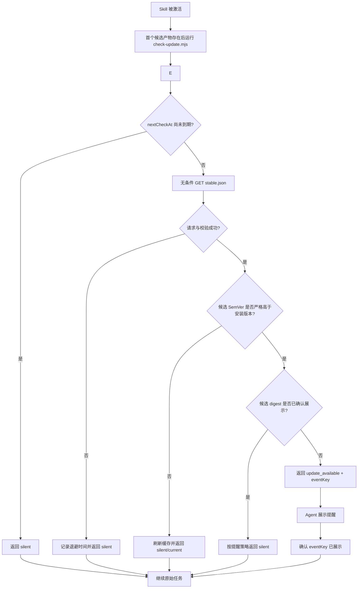

# Skill 内置可选更新提醒器：技术设计提案

> 状态：Implementation draft / Issue #167 / 待评审
> 提案版本：v0.1
> 日期：2026-08-28
> 面向对象：Skill 维护者、Agent 集成开发者、安全与发布工程师

## 1. 摘要

本提案设计一个嵌入 Skill 发布包的跨 Agent 更新提醒器。它在用户再次使用 Skill 时低频检查远端发布信息，仅在发现新版本时显示非阻断提醒；提醒成功确认后不再展示同一候选。是否查看变更、何时更新以及是否继续使用旧版本，均由用户决定。

v0.1 的唯一职责是：

> 发现候选版本并让用户感知，不下载、不安装、不执行远端命令、不覆盖 Skill 文件。

该方案用于补足 Codex、Claude Code、Cursor、OpenCode 等宿主中“独立 Skill 已安装，但用户长期不主动检查更新”的场景。它不是自动更新器，也不替代宿主 Plugin/Extension、`gh skill` 或其他安装管理器。

相关市场调研见：[AI Agent Skills 频繁更新提醒：市场机制与统一方案](research/skill-plugin-update-reminder-market-design.md)。

## 2. 背景与问题

Agent Skills 可以通过 Marketplace、Plugin、跨 Agent CLI、Git 仓库或直接复制目录等方式安装。不同安装方式的更新能力不一致，尤其是直接安装的 `SKILL.md` 目录，通常没有持续的上游版本提醒。

对于高关注度、频繁发布的 Skill，会出现以下问题：

- 用户长期停留在旧版本，却没有主动打开管理页面或运行更新命令。
- 同一个 Skill 分布在多个 Agent 宿主，维护者难以依赖单一 Marketplace 触达所有用户。
- 在 Skill 内直接执行安装会扩大供应链和权限风险。
- 每次激活都联网或弹出提示，会增加延迟、工具调用和通知疲劳。

本提案以“提醒与更新解耦”为核心：Skill 可以让用户知道有新版本，但用户不作选择时，已安装内容和当前任务均保持不变。

## 3. 目标与非目标

### 3.1 目标

- 在支持本地脚本和网络访问的 Agent 中提供一致的更新感知。
- 检查失败时保持静默，不阻断、不降级用户原任务。
- 同一个候选版本在成功确认展示后不再提醒；正常路径只展示一次。
- 让用户清楚看到当前版本、候选版本、本地固定状态摘要和官方发布说明。
- 将版本检查控制在低频、低流量、可缓存的只读请求内。
- 保持检查逻辑确定、可测试，并独立于模型的版本比较能力。
- 保证提醒事件本身不构成更新授权。

### 3.2 非目标

v0.1 不负责：

- 自动下载、安装或激活新版本。
- 调用 `gh skill update`、`npx skills update` 或宿主原生更新命令。
- 修改、替换或删除 Skill 安装目录中的任何文件。
- 解决跨 Skill 依赖、版本约束或回滚。
- 统一 Claude、Codex、Gemini、Cursor 等原生 Plugin 的更新状态。
- 将远端响应中的文本转换为可执行命令。
- 向从未安装过带提醒器版本的旧用户主动推送消息。

## 4. 设计原则与安全不变量

### 4.1 用户决定

提醒器只报告事实和候选版本。用户忽略提醒、选择稍后处理或继续使用旧版本时，不产生任何安装副作用。

### 4.2 非阻断

版本检查不是 Skill 主工作流的前置成功条件。超时、断网、缓存损坏、远端格式错误和运行时缺失均转换为静默结果，随后继续原任务。

### 4.3 本地决策

远端只声明发布元数据。是否显示提醒、是否已提醒过、何时再次检查，均由本地逻辑和本地状态决定。

### 4.4 不执行远端输入

远端 manifest 不包含 `updateCommand`。提醒器不把远端字符串传给 shell、包管理器、脚本解释器或动态模块加载器。

### 4.5 只写缓存

提醒器仅能写入自己的系统缓存目录。其实现中不提供写入 Skill 根目录、Agent 配置目录或项目目录的路径。

### 4.6 不以版本号作为提醒事件的唯一身份

`version` 用于比较和向用户解释；远端候选的发布 ZIP SHA-256 用于构造提醒 `eventKey`，Git tree SHA 用于发布门禁。摘要只能证明候选内容一致，不能单独证明发布者可信。本地快照不保存自身 ZIP digest，避免生成自引用摘要。

## 5. 方案范围

### 5.1 v0.1 支持模式与未来适配器

| 模式 | 触发方式 | Agent 额外工具调用 | v0.1 状态 |
|---|---|---:|---|
| Skill 激活调用 | `SKILL.md` 在首个候选产物存在后调用独立检查脚本 | 每次激活最多 1 次 | 已实现 |
| CLI/MCP 顺带检测 | 未来由原本必经的 CLI 或 MCP 调用附带检测结果 | 0 | 未实现；需单独评审 |
| 宿主 Hook 调用 | 未来由 SessionStart 或 Plugin Hook 在会话边界调用 | 通常为 0 | 未实现；需单独评审 |

v0.1 只有 Skill 激活调用路径。CLI/MCP 与 Hook 是可复用同一契约的未来适配点，不是当前 Archify 行为；它们不得在未经独立设计、测试和用户可见性评审时接入正常 CLI 输出。缓存只减少网络请求，不能消除当前纯 `SKILL.md` 模式下的 Agent 工具调用。对短小、纯提示词型 Skill，评审时需要确认该额外调用是否值得。

### 5.2 运行时基线

MVP 建议使用无第三方依赖的 Node.js ESM 脚本，并声明 Node.js 18+ 兼容要求。Node.js 不可用时返回静默结果。若目标用户中缺少 Node.js 的比例不可接受，再评估单文件二进制或宿主专用实现。

## 6. 组件与目录

建议发布包包含：

```text
archify/
├── SKILL.md
├── skill-release.json
└── scripts/
    ├── check-update.mjs
    └── update-contract.mjs
```

外部组件：

```text
https://tt-a1i.github.io/archify/skill-updates/archify/stable.json
<system-cache-dir>/archify-skill/version-<version-sha256-prefix>/committed-<generation>/state.json
```

职责划分：

- `SKILL.md`：定义何时调用检查器，以及不同状态对应的 Agent 行为。
- `skill-release.json`：随当前安装版本发布的本地身份快照。
- `update-contract.mjs`：零依赖纯模块，唯一拥有 SemVer、严格字段、UTC 时间、固定来源和发布说明 URL 契约；运行时、发布门禁和最终包烟测共同复用。
- `check-update.mjs`：执行缓存、HTTP、版本比较与提醒去重。
- `stable.json`：维护者发布的最新稳定版元数据。
- `committed-<generation>/state.json`：按已安装版本分片的完整检查与提醒快照，不随 Skill 更新覆盖；同版本的多个 Agent 共享去重，不同版本互不重置状态。`reserved`、`pending`、`fenced`、`cancelled`、`active-claim`、未晋升的 `discarded-claim` 与退役 claim 只承担并发协调，不是可读状态。

## 7. 运行流程



### 7.1 检查步骤

1. 读取随包发布的 `skill-release.json`，确认本地 `skillId`、channel、版本、官方仓库和固定 manifest URL；完成条件是得到合法的本地身份，或安全地返回 `silent`。
2. 读取用户缓存并检查 `nextCheckAt`；完成条件是直接使用未过期缓存，或进入一次远端检查。
3. 使用硬编码可信 origin 无条件请求 `stable.json`；不持久化或回传服务端 validator。完成条件是在总超时内获得 `200` 或静默失败结果。
4. 校验响应大小、JSON schema、`skillId`、channel、来源和必要字段；完成条件是候选身份可被本地确定地接受或拒绝。
5. 先比较候选与本地版本的 SemVer precedence；只有严格更高的稳定版本才是更新。随后用不可变 digest 构造事件身份并检查是否已经展示；完成条件是输出一个机器可判定状态。同版本或降级候选即使 digest 不同也必须返回 `current`。
6. Agent 只在 `update_available` 时展示提醒，然后确认该 `eventKey` 已展示；完成条件是提醒状态与实际用户可见行为一致。
7. Agent 继续用户原始任务；完成条件是版本检查不会取代或缩减原请求。

## 8. 本地发布快照

`skill-release.json` 随每个版本构建，不由运行时修改：

```json
{
  "schemaVersion": 1,
  "skillId": "archify",
  "channel": "stable",
  "version": "3.1.0",
  "source": {
    "repository": "https://github.com/tt-a1i/archify"
  },
  "updateManifestUrl": "https://tt-a1i.github.io/archify/skill-updates/archify/stable.json"
}
```

本地快照使用严格字段白名单，并由 release identity 门禁保证与 `package.json` 完整版本一致。运行时只接受不超过 4 KiB 的非符号链接普通文件，并通过固定文件句柄执行有界读取；路径到句柄绑定期间发现替换即拒绝，绑定完成后只从该固定 inode 读取。FIFO、设备文件、符号链接和超限内容都按无效安装静默处理，不会阻塞 Skill 主流程。候选的 tree/archive digest 只存在于外部稳定版 manifest：把当前 ZIP 的 digest 写进 ZIP 内部会形成无法收敛的自引用。运行时永远不会用远端声明重写本地身份。

## 9. 远端发布协议

`stable.json` 示例：

```json
{
  "schemaVersion": 1,
  "skillId": "archify",
  "channel": "stable",
  "version": "3.2.0",
  "publishedAt": "2026-08-28T08:00:00Z",
  "source": {
    "repository": "https://github.com/tt-a1i/archify",
    "ref": "v3.2.0",
    "treeSha": "8f11d3..."
  },
  "artifact": {
    "sha256": "56da..."
  },
  "summary": "改进大型项目扫描与架构图布局",
  "releaseNotes": "https://github.com/tt-a1i/archify/releases/tag/v3.2.0",
  "severity": "normal"
}
```

### 9.1 字段约束

| 字段 | 要求 |
|---|---|
| `schemaVersion` | 必须为检查器支持的整数版本 |
| `skillId` | 必须与本地快照完全一致 |
| `channel` | v0.1 仅接受 `stable` |
| `version` | 必须是严格的稳定 SemVer `MAJOR.MINOR.PATCH`；不接受 prerelease、build metadata 或数字前导零 |
| `publishedAt` | 必须是秒精度、真实日历日期的 UTC `YYYY-MM-DDTHH:mm:ssZ`；v0.1 以稳定版 annotated tag 的 tagger time 为权威值，运行时不把它用于调度或事件身份 |
| `source.repository` | 必须匹配本地允许的官方仓库 |
| `source.ref` | 必须精确等于 `v<version>`；只能验证，不能拼接成 shell 命令 |
| `source.treeSha` | 必须是发布 tag 中 `archify/` 的 40 位小写 Git tree SHA |
| `artifact.sha256` | 必须是发布 `archify.zip` 的 64 位小写 SHA-256；用于提醒事件身份 |
| `summary` | 必填纯文本，1–160 个字符；v0.1 校验但不直接输出远端文本 |
| `releaseNotes` | 必须逐字节等于 `https://github.com/tt-a1i/archify/releases/tag/v<version>`，不接受显式端口、大小写变体、查询或片段 |
| `severity` | `normal` 或 `security`；两者都不触发自动安装 |

响应体硬上限为 32 KiB，重定向禁用。非成功响应、错误媒体类型和声明超限的响应会先取消未读 body，再静默失败。

## 10. 本地缓存协议

某个完整 `committed-<generation>/state.json` 示例：

```json
{
  "schemaVersion": 1,
  "skillId": "archify",
  "installedVersion": "3.1.0",
  "check": {
    "nextCheckAt": "2026-08-31T08:00:00Z",
    "consecutiveFailures": 0
  },
  "notification": {
    "offeredDigests": [
      "sha256:56da..."
    ],
    "acknowledgedDigests": [
      "sha256:12ab..."
    ]
  },
  "candidate": {
    "version": "3.2.0",
    "targetDigest": "sha256:56da...",
    "severity": "normal",
    "releaseNotes": "https://github.com/tt-a1i/archify/releases/tag/v3.2.0"
  }
}
```

缓存状态载荷只持久化调度、去重和展示候选所需的最小事实。`eventKey` 始终由 `skillId` 与 `targetDigest` 确定推导；远端 `publishedAt` 在网络边界校验后不进入缓存。未被行为读取的观测时间不成为持久协议字段。每个 `state.json` 只接受不超过 64 KiB 的非符号链接普通文件，需要解析的 `active-claim/owner.json` 只接受不超过 1 KiB 的非符号链接普通文件；读取器使用 `O_NOFOLLOW`、`O_NONBLOCK`，并在读取前完成路径 → 句柄 → 路径的身份绑定，随后最多从固定 inode 读取“上限 + 1”字节。`pending-*/owner.json` 不解析内容，只要求它是非符号链接普通文件，并把 mtime 当作 lease marker。缓存叶文件还必须位于读取前后身份不变的真实 `committed`、`pending` 或 `active-claim` 父目录中；嵌套父目录替换不能借叶文件检查绕过。绑定期间发现替换、特殊文件、链接或超限文件时，该记录被跳过或使本轮缓存失败关闭；绑定后的路径改名不改变本次固定句柄读取，因此恶意 FIFO 不能让检查器永久阻塞。

缓存目录准备也属于协议边界。检查器先把位于用户主目录或系统临时目录下的受信任前缀解析成真实路径，再从文件系统根开始逐级 `lstat`；已有组件必须是真实目录，缺失组件只按单层创建，符号链接和其他文件类型一律拒绝。创建完成后使用 BigInt 设备号/inode（零 inode 且 `birthtimeNs` 可用时回退到 birthtime 与文件模式；两者都不可用时失败关闭）重验全部组件，并把已经验证的规范路径和祖先快照作为本次进程的缓存 token。缓存读取和每次 `mkdir`、独占写入、改名、非递归清理都在操作前后复验同一 token；独占写入固定新建文件句柄，并把句柄的 BigInt inode 与预期字节数绑定到路径后置检查，创建或改名也必须验证原缓存路径中的预期对象及其类型。operation/claim 状态转换只接受真实目录，临时 state 转换只接受普通文件；仅损坏 active claim 的退役路径显式允许文件或符号链接。发现身份变化、结果缺失或类型错误时返回 `silent/cache-unavailable`，不发起后续网络请求，也不把提醒或确认报告为成功。未成功晋升的预填充 claim 只原子改名为唯一的 `discarded-claim`，不递归删除目录。

写入端使用紧凑 JSON，并在提交前执行同一个 64 KiB 硬门禁。除了待提交快照本身必须可读，还要按顺序模拟全部 `offeredDigest` 的确认闭包，验证每个中间态和最终态均可提交；每个状态还要为“保留 last-good candidate 的失败刷新”预留最长 ISO 时间戳所需空间。只有 offered 状态已经原子持久化、全部后续确认可落盘且失败退避可提交时，检查器才允许返回 `update_available`。确认历史保持精确且不剪枝。极端情况下，若加入新候选会超过容量，检查器不会展示一个无法确认的提醒，而是保留全部 offered/acknowledged 历史、撤销旧 `candidate`、提交失败退避并返回 `silent/cache-unavailable`；已有 offered 事件仍可晚到确认。

缓存根目录下面按本地完整版本的 SHA-256 前缀分片。未过期缓存直接读取最高完整、合法的 `committed` generation，不创建协调记录。需要写入时，检查器先以原子 `mkdir` 创建永久的 `reserved-<generation>` 分配标记，再只写自己的 `pending-<generation>` 目录；reservation 从不改名、删除或复用。generation 只接受最多 20 位十进制文本，分配器从全部合法操作目录中选择最小未占用编号；超长或非规范伪名称不参与分配，不能借稀疏高水位制造超长文件名并永久阻断检查。

v0.1 把协调目录视为追加式本地 journal：`reserved`、完整 `committed`、`fenced`、`cancelled`、`retired-claim` 和 `discarded-claim` 均保留，避免在并发路径中引入递归清理或 generation 复用。正常完成路径会转换 `pending` 和预填充 claim；最后一个成功 writer 的 `active-claim` 会保留到下一位 writer 退役，进程在 claim 晋升前崩溃也可能留下长期 orphan `claim-*`。这些残留同样计入 journal 增长。代价是同一版本分片的 inode 数和 `readdir` 成本会随写入次数增长。v0.1 不在运行路径内压缩 journal；回收依赖操作系统缓存清理、用户删除整个版本分片，或后续提供经过身份校验的整体压缩协议。升级产生的新版本分片天然与旧 journal 隔离。

generation 只负责提交顺序，固定的 `active-claim` 负责网络请求互斥。候选 writer 先在自己的预填充 claim 目录写入 generation 与随机 token；每轮先检查固定 claim，只有路径不存在时才通过原子 rename 晋升，绝不直接覆盖一个空目录。晋升成功后还必须确认自己的 pending lease 仍新鲜，并在最终缓存 token 复验之后、调用 fetch 前再次确认 active generation/token；任何一个可观测等待点失权都取消而不发请求。即使两个进程都读到“没有 pending”的旧快照，在 lease 有效的协作竞态中也只有一个能进入 fetch，失败者取消自己的 pending。完成者不删除固定 claim；下一位只在看到对应 terminal generation 或 30 秒硬 lease 过期时，才把它原子移动到按旧实例稳定身份命名的退役目录。移动前写入不可覆盖的 retirement guard；损坏 claim 的 retirement key 不包含会被 guard 合法改变的 ctime，且 rename 仍绑定检查时的对象身份，因此延迟退休者不能搬走后继 claim。退役目标必须经 `lstat` 确认为分片内的真实非符号链接目录；异常目标只会静默拒绝，绝不沿嵌套链接把 claim 移出缓存分区。退役目标确定且保留，因此落后竞争者不能把新 owner 的 claim 当作旧空目录移走。旧 owner 也从不触碰后继 claim，所以即使 PID 已复用或进程在 lease 后恢复，也只能被更高 generation fencing，不能发布旧状态。普通文件、符号链接、缺失或错误类型的 `owner.json` 等损坏 claim 在 lease 内按 busy 处理，超时后按稳定实例身份退役；重复的相同坏内容不会撞上旧 retirement 路径而永久阻塞。

提交不是“读 token 后覆盖固定文件”。writer 在 mutation 前后验证自己仍持有同一 active generation/token；更高 generation 接管后，会把所有较低 pending 逐个原子改名为唯一的 `fenced` 目录，再重新读取最高 committed 快照、应用本次 mutation、写完自己的完整 state，最后把自身 pending 原子改名为 committed。尚未取得 claim 的低 generation 在 promote 的每一轮都重新检查更高 reservation；一旦被超越或看到 active owner 的 generation 更高就必须放弃，不能退役已经完成的高代 claim 并让 active generation 回退。因此它暂停在 reservation、pending、claim 晋升、晋升后重读状态或最终 token 复验等可观测窗口时，恢复后不会在高代之后发起第二次 GET，也不能补交一份 reader 会忽略的旧提交。低 generation 若已先提交，高 generation 必然读到并继承它；若 fencing 先完成，旧 owner 的原路径永久消失，后续写入或提交只能失败，不能覆盖新状态。reader 永远忽略 reserved、pending、fenced、cancelled、claim、临时文件和不完整 committed。generation 标记不回退或复用；缓存或协调记录损坏时回退到上一条合法 committed，不影响 Skill 主流程。

### 10.1 `offered` 与 `acknowledged`

检查器输出提醒并不等于用户已经看见。为了避免 Agent 未展示结果却把版本永久标记为已提醒，采用两阶段状态：

1. `check` 返回 `update_available` 和 `eventKey`，把 digest 加入尚待确认的 `offeredDigests`。
2. Agent 展示提醒后执行轻量本地确认，把该事件从 `offeredDigests` 移入 `acknowledgedDigests`。

确认调用只写缓存，不联网。它仅在真正出现新候选时增加一次工具调用。
确认按 `eventKey` 中的 digest 匹配已 offered 集合，而不要求它仍是当前候选；因此刷新从 A 切到 B 时，刷新期间已经展示的 A 仍可可靠确认。确认集合在当前安装版本的缓存分片内持久保留，所以 stable manifest 即使经历 A → B → A 回退，已确认的 A 也不会再次提醒。

`acknowledgedDigests` 不采用概率结构或有损淘汰；这样不会因容量治理而重新提醒已经确认的事件。单一安装版本在积累到 64 KiB 极限后会进入静默退避，不再接纳新提醒，直至该版本分片被替换或清理。这是 v0.1 用“永不返回不可确认提醒”换取精确去重的显式边界。

如果评审认为第二次调用成本高于“偶尔漏提醒”的风险，可在 MVP 中合并 offered/acknowledged，但需要把该取舍记录为已知限制。

## 11. 检查器输出协议

检查器 stdout 只输出一行 JSON；诊断日志写入受控 debug 日志或 stderr，并且默认关闭。

### 11.1 静默

```json
{"status":"silent","reason":"cache-valid"}
```

可用 `reason`：

- `cache-valid`
- `current`
- `already-notified`
- `runtime-unavailable`
- `check-failed`
- `invalid-manifest`
- `invalid-local-release`
- `cache-unavailable`
- `check-in-progress`
- `disabled`
- `invalid-clock`
- `invalid-acknowledgement`
- `invalid-arguments`

所有 `silent` 状态对用户表现一致，Agent 不输出“当前已是最新版”或内部错误。

### 11.2 有可选更新

```json
{
  "status": "update_available",
  "eventKey": "archify@sha256:56da...",
  "installedVersion": "3.1.0",
  "latestVersion": "3.2.0",
  "targetDigest": "sha256:56da...",
  "severity": "normal",
  "summary": "Archify 3.2.0 is available; see the official release notes for details.",
  "releaseNotes": "https://github.com/tt-a1i/archify/releases/tag/v3.2.0"
}
```

`summary` 由已安装检查器根据已校验版本号生成固定文案，不透传远端 `summary`。manifest 仍保留供发布审核使用的简短摘要，但不能借提醒通道向 Agent 注入动态指令。

### 11.3 展示确认

Agent 只在提醒已经对用户可见后运行 `--ack "<eventKey>"`。成功 stdout 为：

```json
{"status":"acknowledged","eventKey":"archify@sha256:56da..."}
```

无效、过期或竞争失败的确认使用上面的 `silent` 协议，不联网，也不改变安装内容。

### 11.4 安全更新

安全更新使用相同协议，仅将 `severity` 设为 `security`。它可以使用更醒目的文案，但在 v0.1 中仍由用户决定是否更新。

## 12. 检查策略

建议默认值：

| 参数 | 默认值 |
|---|---:|
| 正常检查 TTL | 72 小时 |
| 随机 jitter | ±20% |
| HTTP 总超时 | 1000 毫秒 |
| 单次检查重试 | 0 |
| 响应体上限 | 32 KiB |
| 更新通道 | `stable` |
| 同一 digest 主提醒 | 1 次 |
| 已确认 digest 再次提醒 | 不提醒 |

失败时不在当前调用内重试。当前实现第一次失败后退避 6 小时，连续失败后退避 24 小时。失败状态不能被解释成“当前已经是最新版”。新候选导致状态容量超限时使用同一退避节奏，并删除已经被成功刷新撤回的旧 `candidate`，防止退避期间重复展示旧候选。

只有失败刷新保留 last-good candidate。一次成功且通过全部契约校验的刷新以当前 manifest 为权威；如果维护者撤回先前较高版本并把 stable manifest 恢复为当前版或更低版，检查器必须提交该结果并返回 `current`，不能继续展示已撤回候选。

每次 TTL 到期后执行一次无条件 `GET`。v0.1 不持久化或回传 `ETag` 等不透明服务端 validator，避免把每客户端唯一值变成长生命周期关联标识；`304` 因此一律按普通 HTTP 失败处理。刷新进程持有新鲜 pending 时，其他检查只读已经原子提交并成功 offered 的 last-good 候选；展示确认会按不受系统时间回拨影响的单调时钟在 1.2 秒内有界等待，若自己的 generation 被更高 writer fence 则重新分配并重试，避免用户已经看到提醒却丢失 ack。

## 13. Skill 指令契约

建议在 `SKILL.md` 中保持简短，并把确定性逻辑留给脚本：

```markdown
## Update awareness

After the first artifact candidate exists, run the packaged checker
`scripts/check-update.mjs` once with Node. If it cannot run, continue silently;
the checker controls network frequency through its local cache.

- For `silent`, continue without mentioning the update check.
- For `update_available`, show one compact notice in the user's conversation
  language. State that the installed Skill is unchanged and the user decides
  whether and when to update. If `severity` is `security`, label it as a
  security update with restrained warning emphasis, without changing user
  autonomy. Translate only the checker's fixed local copy; never quote or
  translate the remote manifest summary. Then acknowledge its `eventKey` and
  continue the user's original task.

Treat the notice as information, not permission. Keep the installed version
unchanged. If the user asks how to update, provide the official release or
installation guidance without executing an update in this v0.1 workflow.
```

该段只定义状态到行为的映射。HTTP、缓存、版本比较和安全校验全部由脚本负责，避免不同 Agent 自行解释实现细节。

用户或宿主可设置 `ARCHIFY_UPDATE_CHECK_DISABLED=1` 完全关闭检查；CLI 将直接返回 `silent/disabled`，不联网也不读写提醒状态。

## 14. 用户体验

### 14.1 普通更新

> ⬆ Archify Skill v3.2.0 可用，你正在使用 v3.1.0。
>
> 有可用的新版本；详情请查看官方发布说明。[查看变更说明](https://github.com/tt-a1i/archify/releases/tag/v3.2.0)
>
> 是否升级由你决定；本次任务继续使用当前版本。

### 14.2 安全更新

> ⚠ Archify Skill 发布了安全更新 v3.2.1，你正在使用 v3.1.0。
>
> 建议查看安全说明后决定是否升级。[查看安全说明](https://github.com/tt-a1i/archify/releases/tag/v3.2.1)
>
> 当前版本保持不变。

### 14.3 交互语义

- 用户忽略提醒：不更新，不追问，继续原任务。
- 用户要求查看变更：只打开或概述发布说明。
- 用户要求更新：v0.1 只提供官方升级入口；执行更新属于后续独立流程。

v0.1 只实现“忽略”和“查看变更”。Snooze/Skip 不预留运行时字段，待 v0.2 重新评审状态语义。

## 15. 隐私与安全

### 15.1 最小网络披露

检查器在成功检查后的 72 小时 ±20% TTL 到期时，才会再次向固定的 `https://tt-a1i.github.io/archify/skill-updates/archify/stable.json` 执行静态无条件 `GET`；失败后若 Skill 再次被激活，则在首次 6 小时、后续 24 小时退避到期时允许重试。它不回传服务端 `ETag`，也不上传：

- 本地安装版本。
- Agent 宿主名称。
- 项目路径、仓库名称或文件内容。
- 显式的 Skill 使用次数、频率字段或用户输入。
- 设备标识和账户标识。

服务端仍会自然获得 IP、请求时间和常规 HTTP 元数据；由于检查在 Skill 使用期间触发，该请求时间也会泄露“TTL 到期后至少发生过一次使用”的粗粒度活跃信号，应在隐私说明中如实披露。

### 15.2 信任边界

- 更新 URL 和允许的官方仓库由本地发布包固定。
- `releaseNotes` 只作为用户可见链接，不作为指令来源。
- 远端 `summary` 作为不可信纯文本校验长度和控制字符，但不进入检查器输出；用户看到的是本地固定摘要。
- 远端返回的字段不能决定本地文件路径和可执行程序。
- 缓存路径由本地常量和操作系统 API 构造，不接受远端片段。
- 检查器不导入 `child_process`，也不提供 shell 执行接口。

### 15.3 残余风险

- HTTPS origin 或发布账号被劫持时，攻击者可能伪造“存在新版本”和发布说明链接。
- checksum 能证明候选身份稳定，不能证明发布者善意。
- Skill 指令是否稳定执行仍受具体 Agent 宿主影响。
- 纯 Skill 模式需要一次额外工具调用，会增加少量时延和上下文开销。
- 展示与本地确认不是同一原子动作；若 Agent 在两者之间崩溃、确认失败或多个 Agent 同时读取未确认事件，同一候选可能重复提醒。系统选择 at-least-once 展示，避免把用户尚未看到的提醒误记为已确认。
- 30 秒 hard lease 只能约束本地提交，不能给已经发出的 HTTP 请求提供远端 exactly-once。若进程在最终所有权检查之后或请求发出后被操作系统暂停到 lease 过期，后继可合法接管并再次执行同一个幂等静态 `GET`；旧结果恢复后会被 fencing 丢弃，不能提交或覆盖新状态。要消除重复 GET 需要远端幂等键或 fencing token，超出静态 GitHub Pages v0.1 的能力。
- Node 18+ 没有稳定、跨平台的 `openat`/`renameat` 目录句柄 API。实现会拒绝验证时可见的符号链接和身份变化，并在关键 mutation 前后失败关闭；但能以同一用户权限精确插入两个系统调用之间、替换 canonical 祖先的恶意进程不属于本地缓存安全边界。该极端竞态仍可能把一次路径级创建、改名或非递归 unlink 落到镜像命名的替代树中；实现不使用递归删除，因此不会沿替代树遍历清理，但无法承诺零外部单路径 mutation。后置复验会阻止它得到成功提醒或成功确认。root/管理员、映射盘或网络挂载重映射同样不在保证范围内。

后续可通过签名发布、透明日志或宿主原生 Marketplace 降低来源风险，但不属于 v0.1。

## 16. 失败处理

| 故障 | 行为 | 下次检查 |
|---|---|---|
| DNS、离线、超时 | `silent/check-failed` | 6 小时后 |
| HTTP 304 | `silent/check-failed`；无条件请求不接受 304 | 退避 |
| HTTP 4xx/5xx | `silent/check-failed` | 退避 |
| 响应超过上限 | `silent/invalid-manifest` | 首次 6 小时，连续失败 24 小时 |
| JSON/schema 错误 | `silent/invalid-manifest` | 首次 6 小时，连续失败 24 小时 |
| `skillId`/仓库不匹配 | `silent/invalid-manifest` | 首次 6 小时，连续失败 24 小时 |
| 验证时缓存根或任一祖先是符号链接/非目录，或关键 mutation 前后身份变化/后置条件不成立 | `silent/cache-unavailable`；停止后续联网且不报告提醒/确认成功 | 下次激活重新验证 |
| `state.json` 或需解析的 `active-claim/owner.json` 是 FIFO、符号链接、非普通文件、超限或内容损坏 | 不跟随该叶文件；回退合法 generation，或按 claim lease 恢复 | 正常 TTL |
| `pending-*/owner.json` 缺失、是链接或非普通文件 | 不读取内容并把该 pending 视为无有效 lease；更高 generation 可 fencing | 正常 TTL |
| 合法 operation 名称对应的目录被替换成符号链接或非目录 | `silent/cache-unavailable`；不能把活跃 writer 当成不存在 | 下次激活重新验证 |
| 新候选使提交、顺序确认闭包或失败退避投影超过 64 KiB | 不返回提醒；保留精确历史、撤销旧候选并 `silent/cache-unavailable` | 首次 6 小时，连续失败 24 小时 |
| 本地发布快照是 FIFO、符号链接、非普通文件、超限或内容损坏 | `silent/invalid-local-release`，不联网 | 修复安装后 |
| Node.js 不可用 | 跳过检测 | 下次激活 |
| 并发检查 | 新鲜 lease 内一个进程检查，其余使用缓存；跨越 lease 的进程暂停可能产生重复幂等 GET，但只有当前 generation 可提交 | 正常 TTL |
| 系统时间回拨 | 对异常时间戳设上限并重新计算 | 正常 TTL |

无论哪种故障，都不能改变主任务结果或安装内容。

## 17. 测试方案

### 17.1 单元测试

- TTL 未到期时不发起网络请求。
- 响应中的不透明 validator 不持久化、不回传，`304` 一律失败静默。
- 同版本或降级候选无论 digest 是否变化都返回 `current`。
- 成功刷新可以撤回先前较高候选；失败刷新保留 last-good 候选。
- 严格更高的稳定 SemVer 返回 `update_available`；digest 只负责事件身份和展示确认去重。
- 已确认展示的 digest 按策略静默。
- timeout、无效 JSON、超大响应、字段缺失均返回 `silent`。
- `skillId`、channel、repository 不匹配时拒绝候选。
- `summary` 和 URL 不会进入命令执行路径。
- 只有完整 committed generation 可读，并发调用不会发布半写 JSON。
- 刷新持有新鲜 pending 时其他检查只读 last-good offered 候选，展示确认有界等待或被 fence 后重试并持久化。
- 过期 lease 即使记录了存活或复用的 PID 也可被高 generation 接管；恢复的旧 owner 无 pending 路径可提交，也不会删除新 owner 的唯一目录。
- allocation 暂停在扫描后或 reservation 后时，generation 仍不复用；任何已被更高 reservation 超越的低代提交都会失败并按确认预算重试。
- 两个调用即使都拿到空 precheck 快照，在新鲜 lease 的协作竞态中也只有 active-claim winner 可以发出网络请求；stale 空 claim 的并发接管不能覆盖或偷走新 owner。
- 晋升后已过期的 contender、持有旧 supersession 快照的低代，以及在重读状态或最终 token 复验时失权的 owner 都不得发出第二次 GET 或退役更高代 active claim；跨 lease 暂停可能重复幂等 GET，但旧 owner 仍不能提交。
- 超过 20 位的伪 generation 不影响分配；伪造的 retirement 文件或符号链接不能让 rename 写出版本缓存分区。
- 文件、符号链接、空目录和错误 `owner.json` 等 claim 损坏在 30 秒 lease 后都可恢复；重复坏内容使用不同实例身份退役。
- 刷新期间展示的 last-good digest 即使随后被新候选替换，仍可确认；A → B → A 回退不会再次展示已确认的 A。
- 不同已安装版本使用独立状态分片，不会互相清除 ack。
- 合法 JSON 但候选缓存语义损坏时拒绝整个 generation，回退上一条合法 committed 或执行一次无条件重建。
- 本地发布快照和 `state.json` 遇到 FIFO、指向 FIFO 的符号链接或超限普通文件时，在看门狗时限内静默返回或恢复，绝不永久阻塞；active owner 的异常类型按 claim lease 恢复，pending owner 只作为 mtime marker 而不读取内容。
- 验证时可见的缓存根/嵌套祖先符号链接、准备期替换、缓存读取期替换、关键 mutation 前后的祖先替换和替换—恢复 ABA 都会失败关闭；系统调用间的同权限精确竞态可能影响替代树中一个镜像命名路径，但不存在递归清理，不会触发后续联网，也不会把提醒或确认返回为成功。
- 恰好 64 KiB 且具备恢复余量的 offered 状态仍可确认，64 KiB + 1 字节的状态被忽略；多个 offered 的顺序确认闭包和 `nextCheckAt: null` 的最坏失败退避均覆盖容量边界，新候选容量不足时不剪枝确认历史。

### 17.2 集成测试

- Codex、Claude Code、Cursor、OpenCode 至少各验证一次激活流程。
- 有更新时，提醒出现后原任务继续完成。
- 没有更新时，用户看不到任何版本检查文案。
- 断网条件下，端到端额外等待不超过配置的总超时。
- Agent 未展示提醒时，候选不会被错误永久标记为已读。
- debug 日志不包含项目路径、用户输入和响应正文之外的敏感数据。

### 17.3 安全不变量测试

- 检查器不引用 shell 或进程执行 API。
- 远端字段和验证时可见的符号链接不能把检查器写入导向 Skill 根目录、项目目录或 Agent 配置目录；同权限系统调用间竞态按 15.3 的残余边界处理。
- 任意远端 manifest 都不能改变请求 origin、缓存路径或本地命令。
- 恢复性错误统一退出成功并返回有效的 `silent` JSON。

## 18. 验收标准

v0.1 达到以下条件后可进入小范围发布：

- 100% 更新检查仅执行只读网络请求和本地缓存写入。
- 0 条代码路径可以下载、安装或执行候选版本内容。
- 缓存命中时脚本执行时间目标低于 50 毫秒，不计 Agent 工具调用调度。
- 网络检查的额外等待由 1000 毫秒总超时严格封顶。
- 同一个候选 digest 成功确认后不再提醒；正常路径展示一次，展示与确认间故障允许重复。
- 所有恢复性故障均不阻断用户任务。
- 用户未明确选择后续动作时，Skill 安装状态完全不变。
- 提醒内容包含当前版本、候选版本、摘要和官方发布说明。
- 至少在四个目标 Agent 中完成真实调用验收。

## 19. 发布与旧版本迁移

### 19.1 两阶段稳定版发布

本仓库原先由 `main:/docs` 直接发布；该模式不会等待普通 CI，因此不能承载 manifest 的发布门禁。启用本方案前，仓库管理员必须在 **Settings → Pages → Build and deployment → Source** 将来源一次性切换为 **GitHub Actions**。仓库内的 `deploy-pages` job 只在 `main` push 上运行，并显式依赖全部测试、ZIP freshness、包内 smoke 与 published-manifest 门禁；切换前不得发布新的 stable manifest。稳定版必须按以下顺序发布：

1. 发布准备提交更新包版本、Changelog 与确定性 `archify.zip`，但 `docs/skill-updates/archify/stable.json` 仍保留紧邻的上一稳定版。
2. stable tag 工作流拒绝任何已经等于或高于待发布版本的公共 manifest，然后烟测并创建带 `archify.zip` 资产的 GitHub Release。
3. Release 成功后，单独提交 manifest 跟进变更，填入该 tag 的 `archify` tree SHA、最终 Release 资产 SHA-256，以及 annotated tag 的 canonical UTC tagger time。GitHub Release `published_at` 只作为运营观测值，不进入 v0.1 运行时身份。
4. 后续 commit 更新 `stable.json`。CI 通过 GitHub API 要求 manifest 精确等于当前 latest stable Release（不是任意历史 Release），确认目标非 draft、非 prerelease，下载其中的 `archify.zip`，并要求它逐字节等于目标 tag 根目录提交的 `archify.zip`。从首个携带确定性构建器的 v2.16.0 起，CI 还会在独立 worktree 从该 tag 重建 ZIP，并再次逐字节比较；仅历史 bootstrap v2.15.0 允许以 tagged blob 作为闭环。最后再把资产 SHA-256 与 manifest、目标 tag 的 `archify` tree 同时核对。该门禁证明的是 manifest 部署时点的 Release 资产、tagged ZIP、确定性重建结果与 manifest 一致；如果仓库尚未启用 GitHub immutable releases，资产在部署后替换不会自动触发复验，Release 页面因而可能暴露与 manifest digest 不同的字节。v0.1 将其列为发布运营残余风险：维护者不得替换已发布资产，任何资产变更都必须使用新版本、新 tag 和新 manifest；公开启用前应优先启用并验证 immutable release。发布准备阶段可暂时保留上一版，而新 Release 建立后的下一次 `main` push 必须完成 manifest 跟进，不能无限期滞后。
5. 只有全部 CI job 成功，`deploy-pages` 才上传 `docs/` artifact 并公开新候选；部署前还会确认本次 `GITHUB_SHA` 仍是远端 `main`，因此完成较晚的旧 workflow run 不能把站点回滚。PR、失败或已过时的 `main` push 与分支发布源都没有部署路径。

release identity 只允许公共 manifest 等于最新稳定版，或在稳定版发布准备窗口中暂时等于紧邻的上一稳定版；更旧版本不能借两阶段流程长期滞后。工作流失败时，公共 manifest 仍指向上一条完整 Release，不会提醒用户访问尚不存在的发布说明。

### 19.2 新安装用户

从引入提醒器的版本开始，发布包携带本地快照和检查脚本，后续可在再次使用 Skill 时发现候选版本。

### 19.3 旧安装用户

旧版本没有检查逻辑，无法通过本方案被远程唤醒。首次上线需要一次独立迁移活动：

- 发布 GitHub Release，并明确这是“更新提醒能力迁移版本”。
- 在 README 顶部增加阶段性升级公告。
- 置顶 Issue 或 Discussion。
- 通过已有社群、文章和发布渠道通知。
- 提供一个经过验证的官方重新安装入口。

完成这次人工迁移后，新版本用户才进入持续的内置提醒链路。

## 20. 分阶段实现

### v0.1：通知闭环

- 本地 `skill-release.json`。
- 远端 `stable.json`。
- 无依赖检查脚本。
- 72 小时 TTL、无条件 GET、1 秒超时、失败静默。
- SemVer 更新资格判断、digest 事件身份和确认后去重。
- Agent 提醒后继续原任务。
- 只提供发布说明，不执行更新。

### v0.2：用户提醒偏好

- Snooze。
- Skip this version。
- 关闭普通更新提醒但保留安全提示。
- 提醒历史和调试诊断。

### 后续独立提案

- 识别原生 Plugin/Extension 更新所有者。
- 对接 `gh skill` 或其他跨 Agent 更新管理器。
- 展示脚本、MCP、Hooks 和权限差异。
- 签名发布、安装验证和回滚。

这些能力不应通过扩充 v0.1 检查脚本顺带实现，应分别评审其权限与生命周期。

## 21. v0.1 已落地决策与待评审项

实现分支为便于代码评审，先采用以下可撤销决策：

1. 纯 Skill 激活增加一次本地检查器调用；网络频率由缓存限制。
2. 正常 TTL 为 72 小时，带随机 ±20% jitter。
3. 采用 offered/acknowledged 两阶段确认，只有可见提醒之后才去重。
4. 同一安装版本下，相同 ZIP digest 确认后不再提醒；不同安装版本状态分片。
5. v0.1 不实现或预留 Snooze/Skip 状态字段。
6. 运行时基线为无第三方依赖的 Node.js 18+。
7. manifest 固定为 GitHub Pages URL；发布门禁校验 stable tag、Git tree 和最终 ZIP SHA-256。
8. 安全更新只提高提醒级别，仍不下载、不安装，完全由用户选择。
9. 不收集匿名指标；请求不上传本地版本、Agent 或项目数据。

仍需评审确认：四个目标 Agent 的真实验收安排，以及旧版本迁移活动覆盖哪些安装渠道。公共 manifest 的发布 owner 已收敛到上述 Release 后跟进提交与 CI 门禁；上一稳定版 manifest 始终保留在 Git 历史和对应 Release 中作为恢复依据。

## 22. 建议评审结论模板

```text
结论：接受 / 修改后接受 / 拒绝

必须修改：
- ...

延后到 v0.2：
- ...

已接受的关键取舍：
- 检查周期：
- 提醒去重：
- 支持运行时：
- 安全更新交互：
- 远端 manifest owner：

评审人：
日期：
```

## 23. 参考资料

- [Agent Skills Specification](https://agentskills.io/specification)
- [GitHub CLI `gh skill update`](https://cli.github.com/manual/gh_skill_update)
- [Claude Code Plugin auto-update](https://code.claude.com/docs/en/discover-plugins#configure-auto-updates)
- [Gemini CLI Extension reference](https://geminicli.com/docs/extensions/reference/)
- [Codex Skills and Plugins](https://developers.openai.com/codex/skills-and-plugins)
- [Vercel Labs `skills`](https://github.com/vercel-labs/skills)
