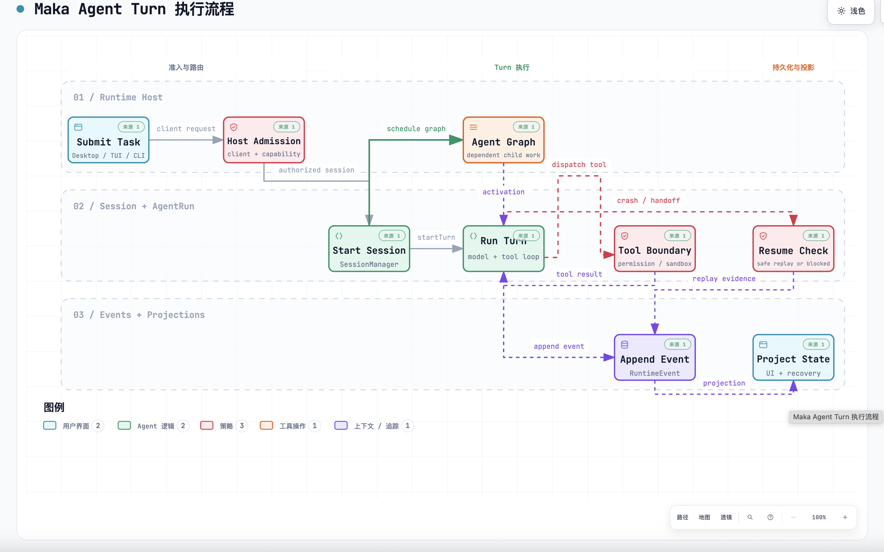
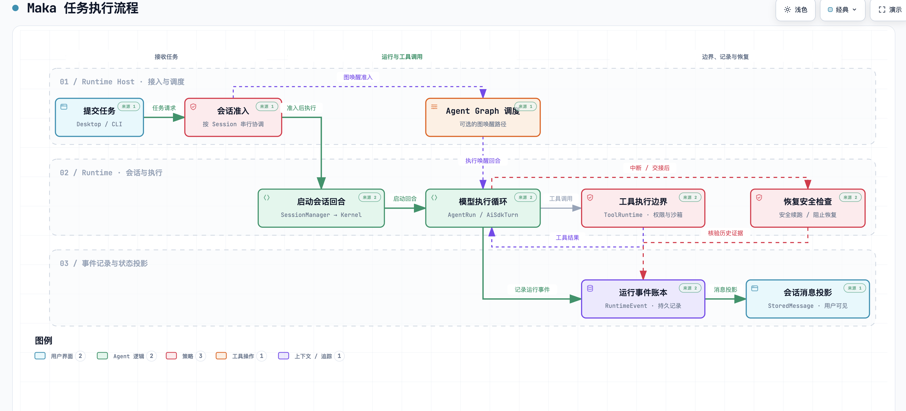
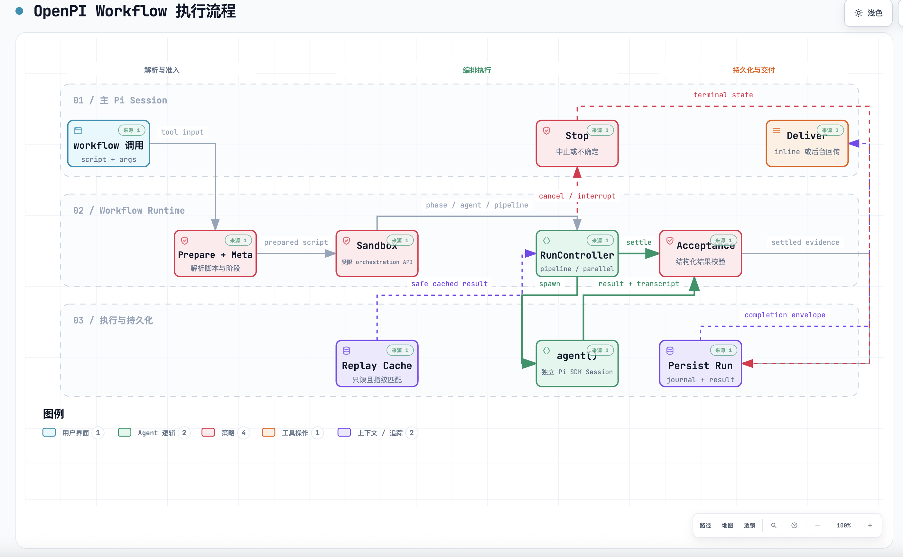
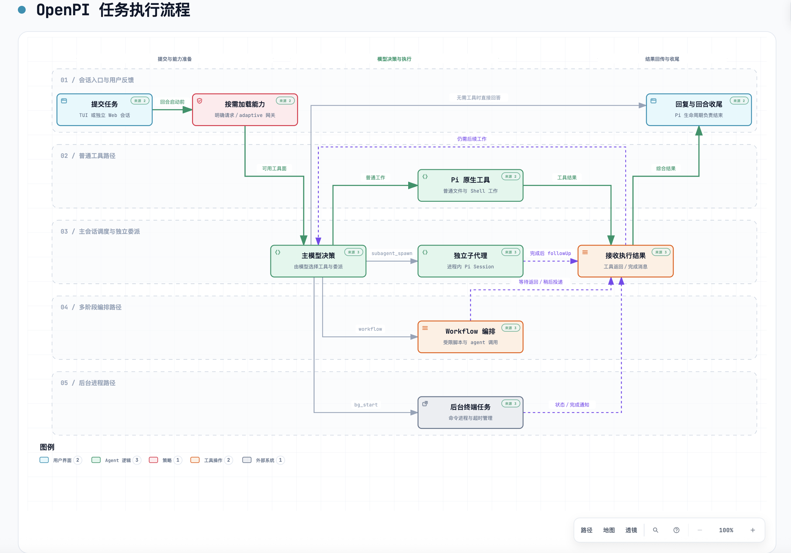

# Workflow routing clarity: scope and validation

## Scope

Workflow v2 routes sharing a node must remain distinguishable: long shared
corridors, mixed-style/counterflow overlaps and colliding arrowheads are not
exempt merely because edges share an endpoint. Compatible terminal stubs of at
most 24 SVG units remain allowed. Fixed route coordinates remain authoritative;
automatic routes use separate ports and bounded local repair (one pass, at most
eight seed plans, offsets of ±16/±32).

Compiler and final-HTML checking share the classifier; readable v2 HTML is
checked from its actual path geometry rather than stale composition metadata.
Standard reports warnings, showcase reports failures. Workflow v1 and the
default geometry policy used by other diagram types remain unchanged. No new
schema fields, dependencies, layout engine or version changes are introduced.

## User-provided end-to-end comparisons

| Project | Before | After |
| --- | --- | --- |
| Maka |  |  |
| OpenPI |  |  |

These original screenshots are qualitative end-to-end examples, **not a
controlled same-input routing benchmark**. Labels, authored layout and topology
also changed. In particular, OpenPI before shows workflow-runtime internals,
whereas after shows the broader task-orchestration overview. The entire visual
difference must not be attributed to routing alone. Private project source and
local delivery artifacts are not included in this PR.

## Fixed-input acceptance evidence

The prior implementation acceptance used base commit `1c1e47ad` plus the
first-round changes as its second-round baseline. Same-input OpenPI comparison:
9 nodes and 13 edges retained; node geometry, 1210×776 canvas and authored
channelY=180 unchanged. Three long overlaps of 113/113/98 SVG units became zero;
proper crossings, ambiguous corridors, arrowhead collisions and label-clearance
issues were zero. Maximum bends decreased from 3 to 2; maximum stretch stayed
1.64. Public, sanitized regressions are checked in as
`archify/test/workflow-routing-clarity.test.mjs` and
`archify/test/workflow-shared-trunks.test.mjs`, with their matching fixtures.

Prior focused checks: 279 passed. Prior complete `env -u ARCHIFY_CHROME npm test`
from `archify/`: 2360 total, 2277 passed, 0 failed, 83 skipped (201.195 seconds).
Skipped tests are not browser passes. This evidence predates integration of
`upstream/dev` at `9a76b742`; final integration results are recorded in the PR.

Prior browser collection was run manually by the user: six frozen before/after
HTML files, light/dark themes at 1440×900 and 2048×1320, 24 screenshots inspected
by the agent. Browser receipts and independent perceptual review are distinct;
native visual-review fields were not rewritten as human approval. These are
reused results, not a new browser run for this PR or the newly authored Maka
screenshot above. Workflow runtime source SHA-256 at that acceptance:

| Source | SHA-256 |
| --- | --- |
| `archify/renderers/shared/geometry.mjs` | `dafdd8d3233a6e7a5ef3588a6f21a2651799af95f412afada201d6b68cdee68f` |
| `archify/renderers/workflow/workflow-compiler.mjs` | `4f494c35e5b9fbffd33a47e50adee14e0738c54f4900bc76bcacc8e8340ec266` |
| `archify/scripts/check-render-output.mjs` | `82ea7d9a826cbf2cf3c629a84b29d87b32a70a7fb439e87c2852e75164b13f15` |

Performance: Node 22.23.1, three warm-ups and ten measured runs per fixed input.
Median milliseconds (second-round baseline → candidate): OpenPI 31.890→38.163;
Maka 23.009→28.197; alternate Maka 22.295→28.440; fan-out 29.427→37.989;
bundled example 20.477→22.762; crowded fixture 9.585→13.691. Each met the agreed
ceiling of max(baseline × 1.25, baseline + 10 ms). Local raw project receipts
are intentionally not published; checked-in regressions are reproducible.

## Ablation and remaining boundary

- Removed extra port expansion for labelAt/explicit-side constrained edges;
  279 related checks passed while the original compatibility guard remained.
- Removed the second local-repair pass; 95 routing/constraint checks and the
  final 279 focused checks passed with one pass.
- Removed the duplicate unused `axisOverlapLength` helper.
- Restored the eight-seed bound after a two-seed bound failed crowded fan-out.
- Restored ±32 offsets after ±16 alone failed the same crowded regression.

The 120-character-label synthetic stress fixture fails final showcase HTML
desktop readability on both baseline and candidate (projected font 5.66/5.54,
minimum 6). Candidate canvas width grows 1315→1343 to separate routes, within
the fixture's 1400 bound. It is compiler/performance evidence, not an accepted
diagram delivery. No quality gate was lowered to hide this limitation.

## Generated outputs

The bundled/root workflow example, Gallery HTML/artifact/manifest, README GIF
and its proof receipt were regenerated during implementation. The README GIF
was actually re-recorded by the user, not merely rehashed. The distributable
`archify.zip` must be rebuilt with Node 22 from the combined tracked sources
after integrating dev's independent lifecycle fixes. Remote CI remains a
separate requirement; local success does not imply CI or maintainer approval.

## PR #558 review follow-up

The follow-up to reviewed head `6def29f9` fixes two reproduced P2 findings:

- Shared-endpoint proper crossings now reach public compiler/layout-JSON
  receipts as `composition/proper-crossing`, with relationship IDs, intersection
  coordinates and supported fixes. V2 standard warnings and showcase errors
  are both covered; v1 and other callers retain the default shared-helper policy.
- The final HTML checker uses the same forward-collinear analysis as the
  compiler for readable-v2. Adding a redundant via at an intersection no longer
  hides it. Regression coverage includes splits on either/both strokes, real
  bends, reversals, endpoint touches, stale metadata and the v1 exemption.

The P3 opt-in simplification was investigated rather than applied blindly:
first-round delivered HTML exists with only `workflow-v2-auto` edge markers and
no root contract. The marker-only compatibility path is retained and documented
in the workflow renderer README; the root contract remains authoritative.

Both new failure reproductions were observed red before fixing. The six focused
test files now pass 282 tests with no failures or skips. Removing diagnostic
forwarding reproduces the empty-diagnostic failure; removing collinear analysis
reproduces the missed crossing. Removing marker-only counterflow handling fails
the existing legacy-export regression. Each removal was restored; no production
mechanism was permanently deleted in this follow-up.

Compared with `6def29f9`, all six previously measured fixed inputs produce
byte-identical SVG and identical compile receipts. The three accepted frozen
OpenPI/Maka HTML artifacts and bundled workflow example pass the revised final
HTML checker. No route, Viewer or visual output changed, so the previous browser
evidence is reused, not described as a new browser run. Gallery, examples and
README animation are unchanged; only the ZIP is rebuilt from revised sources.
The final full-suite result and revision are recorded in the PR follow-up.
