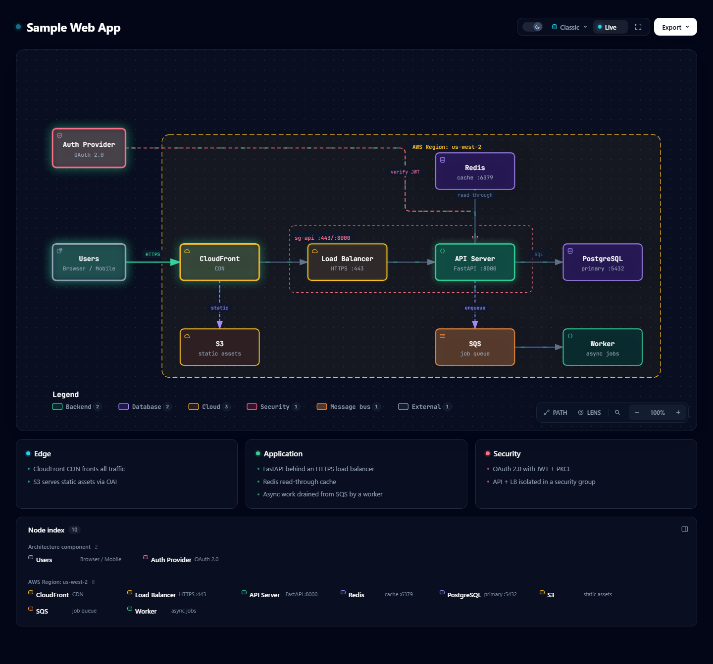
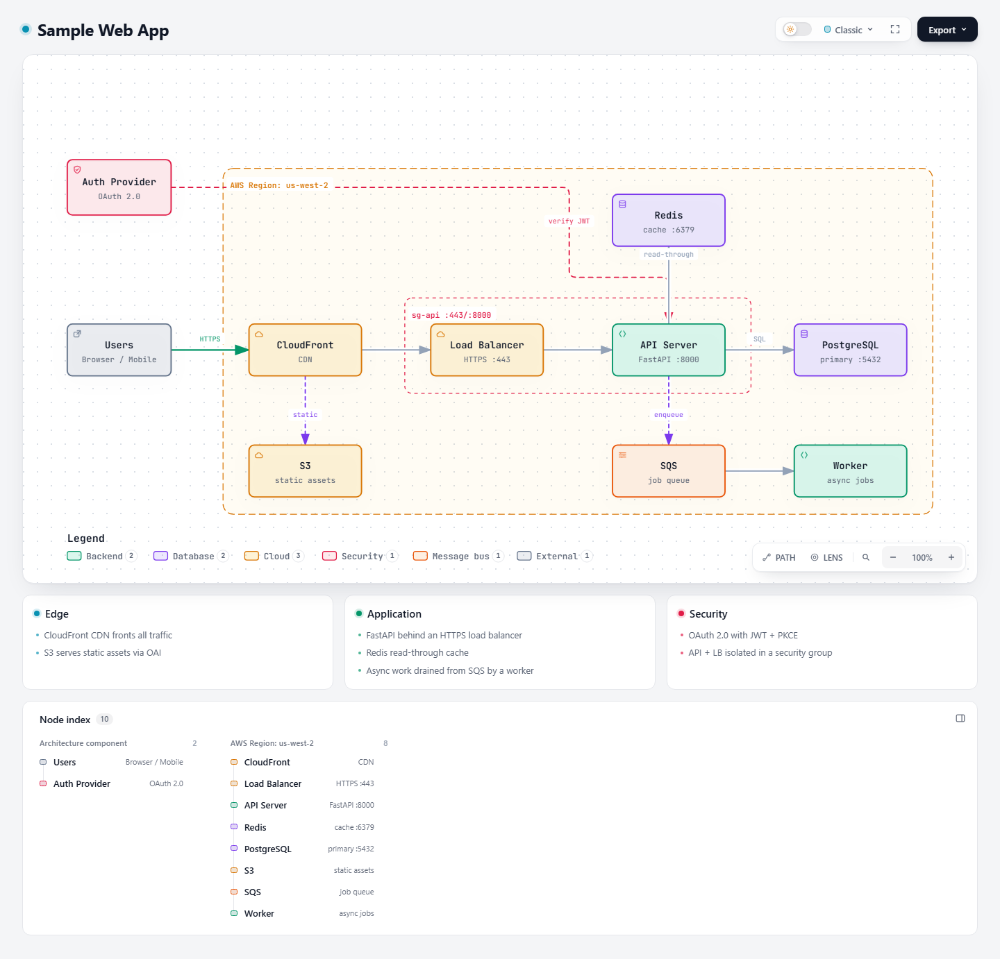
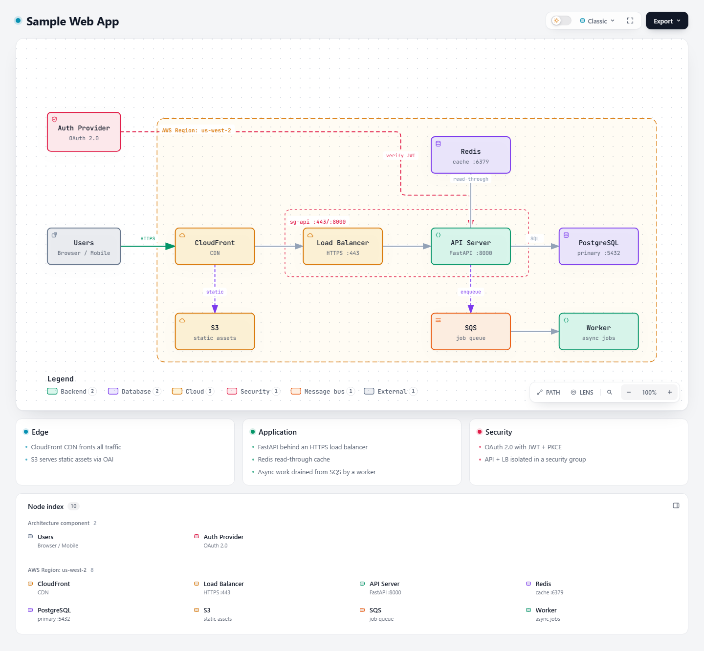
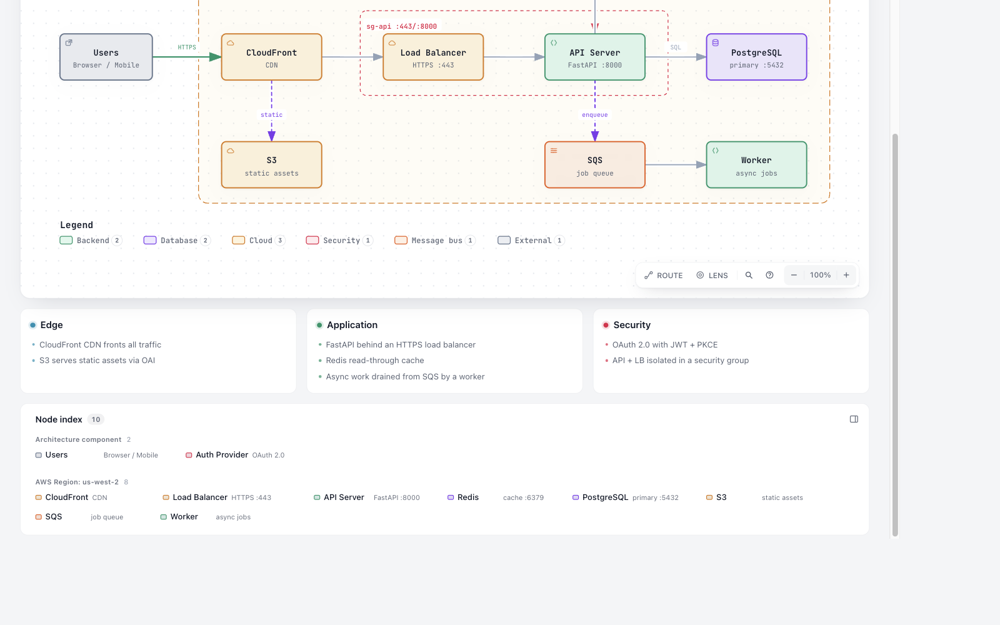

# Bottom Node index row comparison (#664)

The maintainer-selected compact-row treatment is now integrated into the default
desktop bottom Viewer index. The review variants below remain as the decision
record; production styling lives in `viewer/viewer.css` and is regenerated into
`archify/assets/template.html`.

`prototype.css` replaces bottom-index columns with full-width group sections
and a wrapping grid of items. Existing group/node order, counts, text,
category colors, buttons, and event handlers are reused. Labels and sublabels
wrap without reducing their font size. Side and overlay selectors are untouched.

Run the matched comparison with an installed Chrome and an output directory
outside the checkout:

```powershell
$env:ARCHIFY_CHROME = 'C:\Program Files\Google\Chrome\Application\chrome.exe'
node experiments/node-index-rows/compare.mjs C:\Temp\archify-node-index-review
```

The script saves HTML, PNG, and JSON observations for Sample Web App and a
26-node uneven-group fixture with long Chinese/English text. Both use
1440×900 and 390×900, light/dark, ordinary mode, and unchanged SVG contents.
It checks text/order/color identity, SVG identity, document width, text
clipping, programmatic focus, pointer-enter preview, and click selection
against the column baseline. The production browser regression additionally
uses native Tab and Enter input, native hover, and the bottom/side panel toggle:

```powershell
$env:ARCHIFY_CHROME = 'C:\Program Files\Google\Chrome\Application\chrome.exe'
npm run test:browser -- test/bottom-node-index-browser.test.mjs
```

## Results and tradeoffs

At 1440px, the compact proposal reduced Sample Web App's index height from
338.69px to 228.94px. Node labels/subtitles remain at existing font sizes.

At 390px, preserving all text increases height: Sample Web App becomes
667.38px instead of 435.25px, and the long-text fixture becomes 1726.38px
instead of 934.25px. This is an explicit tradeoff for readable wrapping
rather than single-line truncation. No horizontal page overflow was observed.

Current dev hides the reader rail below its desktop eligibility breakpoint.
For narrow comparison only, both HTML copies expose the existing bottom CSS
using a separate experiment attribute. These screenshots test the CSS proposal,
not a shipped narrow-screen reader behavior. Whether to expose that index on
mobile remains a product decision.

The saved observations report no persistent focus preview after a frame on
either baseline or candidate. The script only compares `focusPreview` for
equality between them; it does not independently verify keyboard focus-preview
behavior. Pointer-enter preview and click selection work. These results must
not be reported as a newly fixed or verified keyboard-preview feature.

Visually reviewed the unselected Sample Web App desktop comparison and the
long-text narrow candidate. Group membership is clear; desktop whitespace is
used better, and narrow labels wrap. Exact spacing remains open for review.

Related issue: https://github.com/tt-a1i/archify/issues/664

## Maintainer-requested alternatives

The follow-up compares four variants under identical fixtures, cameras, themes
and viewport sizes: existing columns, original rows, tighter content-sized rows
(`compact.css`), and vertical columns inside each full-width group
(`continuation.css`). In the continuation variant, the group heading spans the
entire group and the DOM order flows down a column then into the next column.
The Sample Web App AWS group now uses four columns of two entries instead of
one tall list. No production style or default is changed.

All 32 browser comparisons pass the same text/order/color, SVG, width, clipping,
hover and click checks. Existing font sizes are preserved. Native keyboard
preview remains outside these assertions, as documented above.

| Fixture / width | Columns | Original rows | Compact rows | Group columns |
| --- | ---: | ---: | ---: | ---: |
| Sample / 1440 | 338.69 | 289.38 | 228.94 | 291.38 |
| Long labels / 1440 | 852.69 | 610.38 | 773.38 | 559.38 |
| Sample / 390 | 435.25 | 667.38 | 663.38 | 659.38 |
| Long labels / 390 | 934.25 | 1726.38 | 1527.38 | 1686.38 |

Panel heights are CSS pixels and match across light/dark themes. Compact rows
work best for short names/descriptions; long bilingual descriptions consume
more height than original rows. Group columns use less desktop height for the
uneven long-label fixture but retain the taller, untruncated narrow presentation.
These are measurable tradeoffs for maintainer selection, not a claimed universal
winner. Desktop Sample compact/group-column screenshots were visually inspected.

| Fixture / width | Compact rows | Group columns |
| --- | --- | --- |
| Sample / 1440 | [Compact](screenshots/sample-web-app-1440-light-compact.png) | [Columns](screenshots/sample-web-app-1440-light-continuation.png) |
| Long labels / 1440 | [Compact](screenshots/stress-1440-light-compact.png) | [Columns](screenshots/stress-1440-light-continuation.png) |
| Sample / 390 | [Compact](screenshots/sample-web-app-390-light-compact.png) | [Columns](screenshots/sample-web-app-390-light-continuation.png) |
| Long labels / 390 | [Compact](screenshots/stress-390-light-compact.png) | [Columns](screenshots/stress-390-light-continuation.png) |

## Integrated evidence

The checked-in baseline was captured from the pre-integration column layout;
the integrated capture uses the same Sample Web App, 1440px desktop viewport,
dark theme and default camera. The browser check captures it before selection,
so the index is readable without transient focus state.



## Checked-in comparisons

These unselected, default-camera screenshots use light theme and ordinary
mode. Matching dark-theme captures are also in `screenshots/`.

| Fixture / width | Columns | Group rows |
| --- | --- | --- |
| Sample Web App / 1440 | [Before](screenshots/sample-web-app-1440-light-columns.png) | [After](screenshots/sample-web-app-1440-light-rows.png) |
| Sample Web App / 390 | [Before](screenshots/sample-web-app-390-light-columns.png) | [After](screenshots/sample-web-app-390-light-rows.png) |
| 26 bilingual nodes / 1440 | [Before](screenshots/stress-1440-light-columns.png) | [After](screenshots/stress-1440-light-rows.png) |
| 26 bilingual nodes / 390 | [Before](screenshots/stress-390-light-columns.png) | [After](screenshots/stress-390-light-rows.png) |

Before:



After:



## First-line alignment follow-up

The production bottom index now aligns swatches, names and descriptions on their
first text baseline. This corrects the swatches sitting about 4px above the text
center under top alignment, while keeping wrapped names attached to their first
line. The browser regression reproduces the previous offset and covers both
wrapped bilingual text and nodes without descriptions.

The capture below uses the regenerated Sample Web App in light theme at a
1440 CSS-pixel viewport. The existing comparison captures above remain the
earlier decision record.


