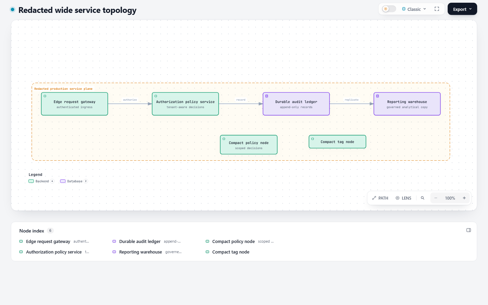
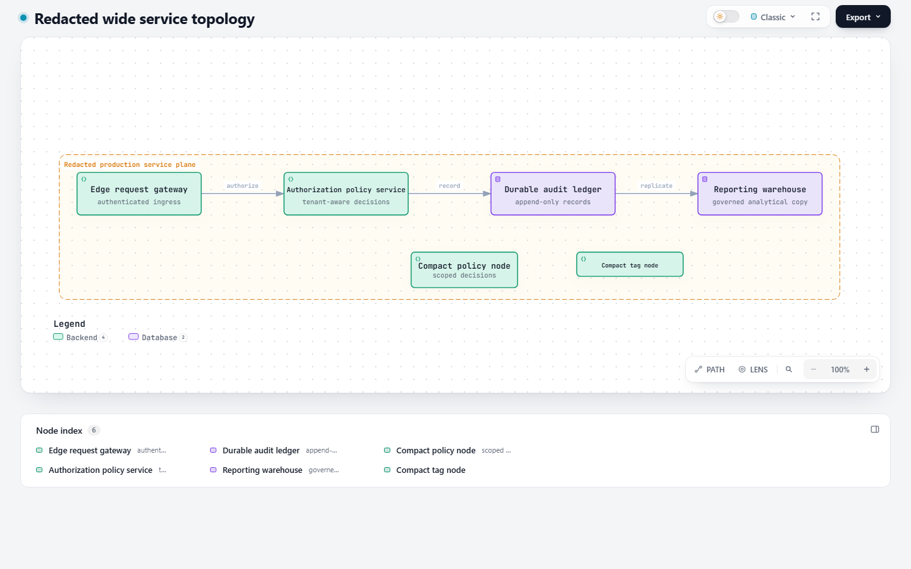

# Architecture typography scale: matched browser evidence

Related PR: https://github.com/tt-a1i/archify/pull/578

The baseline uses the architecture renderer at dev `7a3e1f3a`, with no
`typography_scale`. The candidate uses `d21d97c1` with
`typography_scale: 1.25`. Both render the redacted fixture in
`archify/test/architecture-typography-scale-browser.test.mjs`; all inputs other
than the opt-in scale are identical. The fixture includes wide service nodes,
a 60px compact node with sublabel/tag, and a 41px tag-only compact node.

All captures use real Chrome at 1440×900, device scale 1, Classic preset,
default camera, the same theme and mode, settled layout, and loaded fonts.
The test checks text containment, non-overlap, scaled primary label floors,
and document width in ordinary/presentation and light/dark modes.

| Mode | Baseline | Scale 1.25 |
| --- | --- | --- |
| Ordinary / light | [PNG](baseline-ordinary-light.png) | [PNG](scaled-ordinary-light.png) |
| Ordinary / dark | [PNG](baseline-ordinary-dark.png) | [PNG](scaled-ordinary-dark.png) |
| Presentation / light | [PNG](baseline-present-light.png) | [PNG](scaled-present-light.png) |
| Presentation / dark | [PNG](baseline-present-dark.png) | [PNG](scaled-present-dark.png) |

## Ordinary / light

Before:

After:

The opt-in increases the hierarchy at the same window size. These are bounded
fixture results, not a guarantee for every authored layout. The 1.25 ceiling
remains an initial review scope; expanding it needs its own evidence.

The screenshots are review evidence outside the skill package. They do not
change generated examples or ZIP contents. Runtime test evidence is recorded
at `d21d97c1`; adding this evidence directory changes no renderer input.
