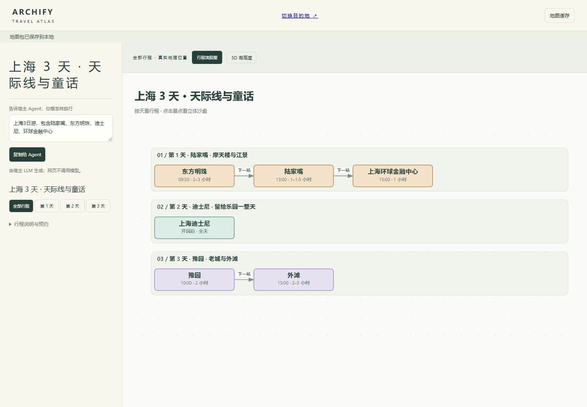
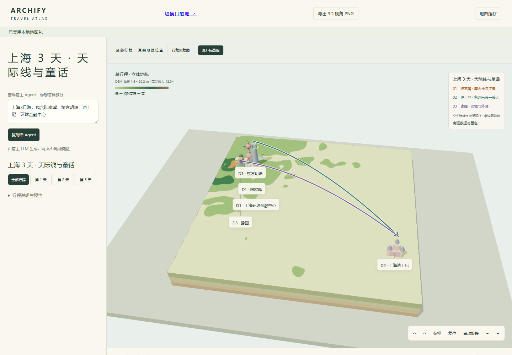
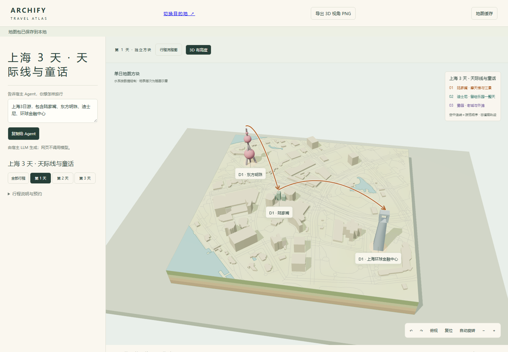
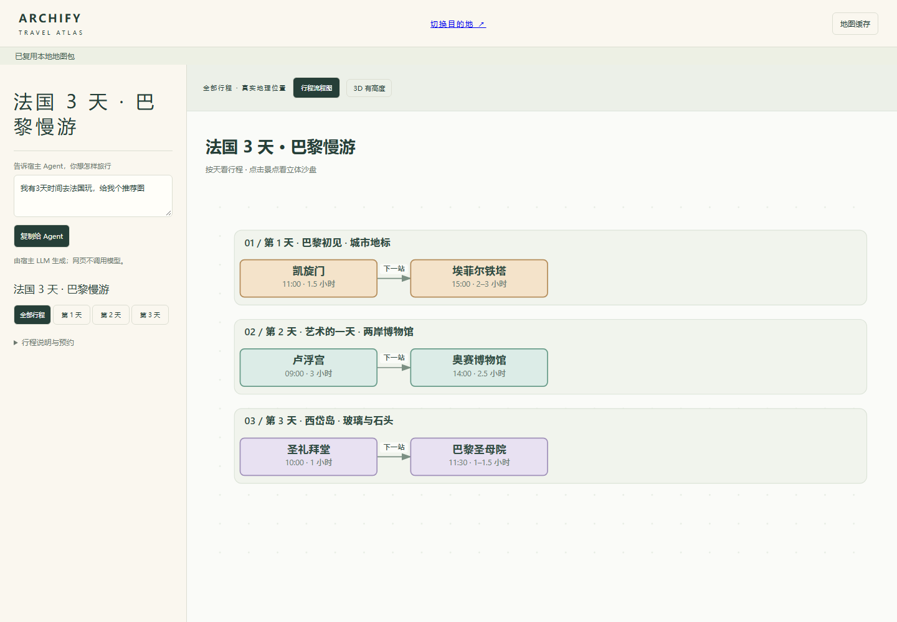
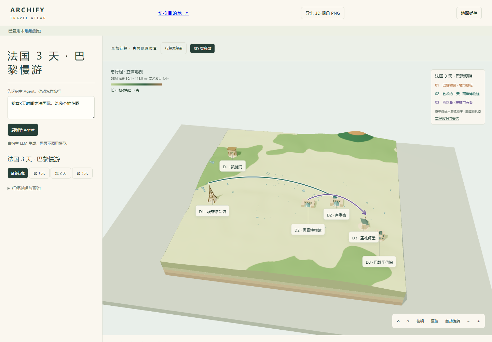
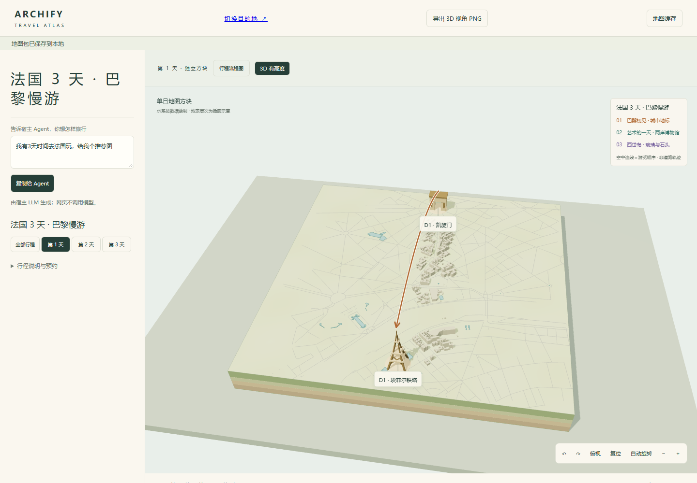

# Shanghai and Paris travel demos

These screenshots show the checked-in Travel experiment, captured at 1440×1000
with Chrome/SwiftShader and style `illustrated-diorama-v11`. They are real browser
captures, not generated mockups. Capture source: `../capture-demos.mjs`.

Run `node labs/travel/serve.mjs`, open the printed address, then use these paths:

- Shanghai workflow: `/?destination=shanghai&view=flow#scene=journey`
- Shanghai overview: `/?destination=shanghai&view=3d#scene=journey`
- Shanghai day 1: `/?destination=shanghai&view=3d#scene=day-1`
- Paris workflow: `/?destination=paris&view=flow#scene=journey`
- Paris overview: `/?destination=paris&view=3d#scene=journey`
- Paris day 1: `/?destination=paris&view=3d#scene=day-1`

Overview arrows connect days only; daily scenes show individual stop connections.
Landmark models are illustrations. DEM height exaggeration is labeled; daily
building geometry may contain estimated heights. City detail coverage is limited
to the supplied snapshots. The host LLM authors itinerary JSON; the static browser
form only copies a request for that host and does not call a model itself.

## Shanghai





## Paris





## Reproduce

Set `ARCHIFY_CHROME` to a Chrome executable, then run:

```sh
node labs/travel/capture-demos.mjs
```

Data provenance is retained in `../data/` and exposed by the interactive viewer.
